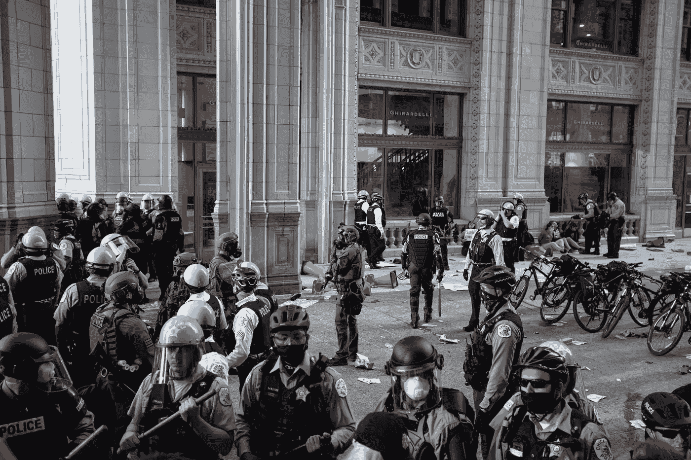
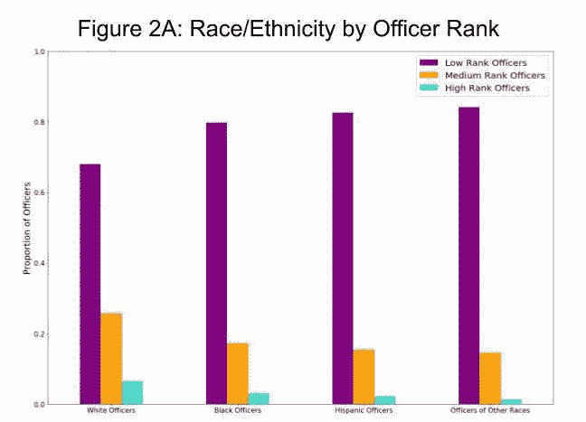
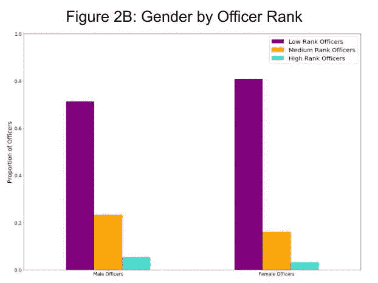
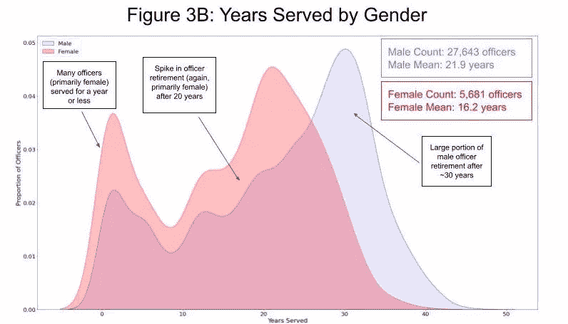
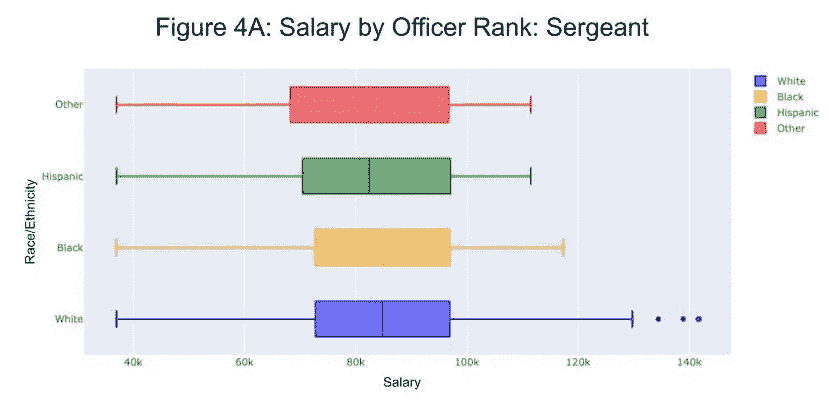
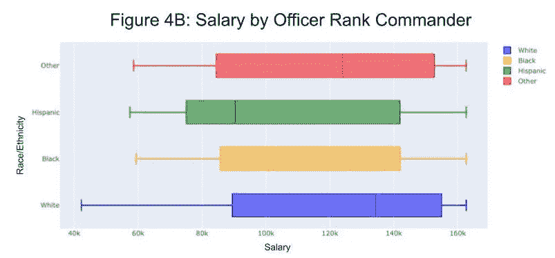
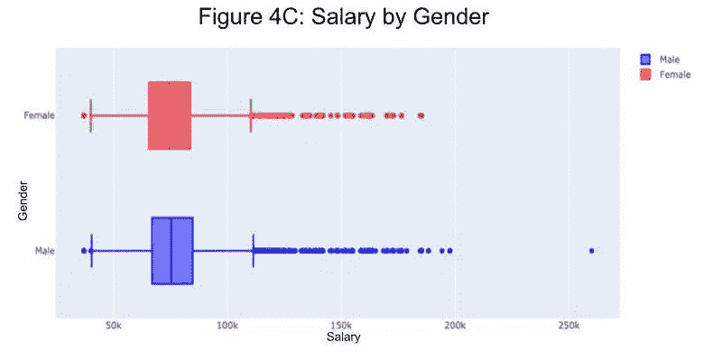
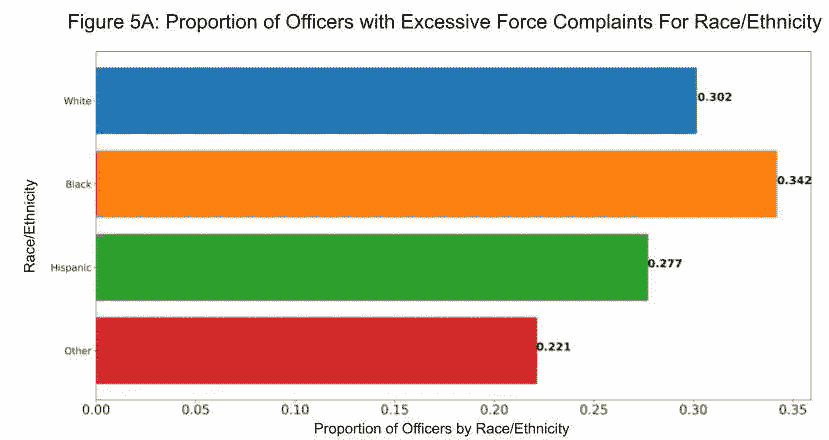
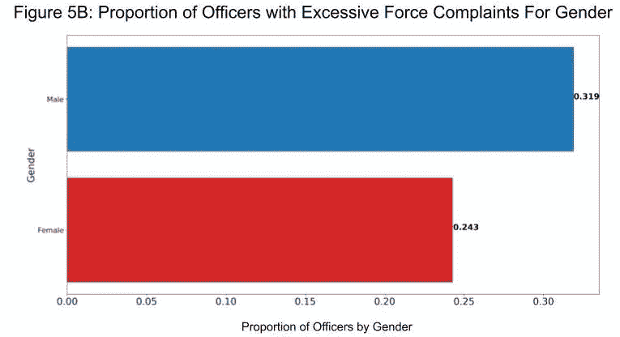

# 芝加哥警察局的公平警务分析

> 原文：<https://towardsdatascience.com/fair-policing-analysis-of-the-chicago-police-department-d251333a870c?source=collection_archive---------42----------------------->

## [变更数据](https://towardsdatascience.com/tagged/data-for-change)

## 研究这些数据能在警务中带来更大的平等和公平吗？

由[多米尼克·罗宾逊](https://unsplash.com/@domrob524?utm_source=unsplash&utm_medium=referral&utm_content=creditCopyText)在 [Unsplash](https://unsplash.com/s/photos/police-chicago%2C-il%2C-usa?utm_source=unsplash&utm_medium=referral&utm_content=creditCopyText) 上拍摄

美国各地的警察部门因为各种错误的原因出现在新闻中，尤其是最近因为过度使用武力的事件。乔治·弗洛伊德(George Floyd)和布里奥纳·泰勒(Breonna Taylor)等人的死亡引发了一场关于种族/民族在警察对待个人方面所起作用的辩论。作为加州大学圣地亚哥分校数据科学学生协会项目委员会的一部分，我们的团队([阿里亚曼·辛哈](https://a2sinha.medium.com/)、[库莎·贾德巴贝](https://kooshaj.medium.com/)和[夏嫣·加格](https://medium.com/@anikagarg02))试图收集、分析和可视化来自芝加哥警察局(CPD)的数据，以进行公平的警务分析。本分析的目的不是对芝加哥市的警务工作做出任何结论，而是简单地分析一个大型数据集，以促进进一步的数据驱动的警务研究。

我们的团队使用了来自芝加哥新闻公司无形研究所的数据集，可以在这里找到。这是美国警察部门最大的公开数据集之一，数据跨度从 1940 年到 2017 年。在我们的分析中使用的最相关的特征是芝加哥市的人口统计数据、军官级别/晋升、军官服役年限、军官工资和对军官的投诉。使用这个数据集被证明是具有挑战性的，因为一些文件命名不当；命名惯例和记录数据的方法会随着时间的推移而改变。

**人口统计分析**

我们分析的第一步是分析 CPD 的种族统计数据。在比较芝加哥市和芝加哥警察局的种族划分时，我们发现了惊人的差异。

作者图片

如图 1A 所示，白人官员约占芝加哥人口的 32%，而截至 2017 年，约 62%的芝加哥居民为白人，如图 1B 所示。黑人、西班牙人和其他种族/民族的人口统计群体在他们城市的警察队伍中明显不足。为了检验这一说法的有效性，我们进行了卡方拟合优度检验，得出了显著的 p 值< 0.0001 suggesting that these 2 sets of racial demographic counts come from differing distributions. However, the sample sizes here are essentially the entire population so the assumption of independence and randomization needed to conduct a chi-squared test is not met.

Following this analysis of demographics, our team compared the ranks of officers currently serving in Chicago by race and once again found notable differences.

Image by Author

As shown by the purple bars in Figure 2A, the proportion of White officers that served as low-rank officers is lower than all other races/ethnicities, which means that White officers were more likely to get promoted. Also, the data suggest that White officers hold higher ranks (Medium and High-Rank Positions) as the orange and teal bars appear higher for White officers in comparison to Black, Hispanic, and officers of other races.。出于对这一结果的好奇，我们检查了是否存在类似的性别差异，如图 2B 所示:

作者图片

在这里，我们可以看到，男性军官的紫条较低，再次表明男性军官往往更容易获得晋升。这表明，与女军官相比，男军官更有可能担任中级和高级职务，因为男军官的橙色和蓝绿色条纹更多。

**任职年数分析**

作为我们项目的一部分，我们的团队有兴趣了解不同种族/民族和性别的官员在任职期间是否有显著差异。使用我们的官员档案数据集，我们通过减去他们的辞职日期(或数据集最后更新的日期，意味着该官员没有辞职日期，但仍在服务)和他们的第一个任命日期来计算官员的服务年限，并在我们的数据集中创建了一个名为“years_served”的列。为了首先分析种族/民族，我们将数据分为三个主要的种族/民族群体:白人、黑人和西班牙人/其他人，并使用这一点，我们使用 Python 中的 Seaborn 包创建了 33，324 名警官服役年限的叠加直方图:

作者图片

如图 3A 所示，我们整个数据集的平均值为 20.94 年，中位数为 23.07 年。通过我们对数据的解读，我们发现了三个有趣的点。首先，许多官员，特别是西班牙裔/其他官员，工作时间不超过一年。出于这种好奇，我们查看了我们的数据，发现大部分被标记为西班牙裔/其他种族/族裔的官员都有指定的日期和合理/准确的辞职日期。我们推测，我们关于西班牙裔/其他种族/民族的数据可能会有偏差和局限性。接下来，我们看到在芝加哥警察局工作了 20 年后退休的所有种族/族裔的警官人数突然增加。我们做了进一步的研究(可在芝加哥市的[网站](https://www.chicago.gov/city/en.html)上公开获得)，我们发现芝加哥警察局的一名警察在余生中获得其最新年薪 50%的养老金计划的最低门槛是在服务 20 年后。我们还注意到，很大一部分军官在服役 30 年后退休；我们的团队假设，这种趋势是由于在服务 29 年后养老金计划达到最大值(在他们的余生中，最高可达一名官员最新年薪的 75%)。我们对按性别划分的服务年限进行了类似的分析，并在图 3B 中发现了相关结果:

作者图片

在这个柱状图中，男性官员的平均寿命为 21.9 岁，而女性官员的平均寿命为 16.2 岁。正如前面对种族/族裔的分析一样，我们注意到大量军官，特别是女军官，任职时间只有一年或不到一年。这让我们特别感兴趣，因为我们无法从提供给我们的数据中找到这个峰值的任何因果关系。此外，我们看到 20 年后辞职的女性和男性官员人数突然增加，大部分官员，特别是男性官员，在大约 30 年后辞职。这一趋势也符合我们之前提出的假设，即官员在 20-30 年范围内退休，以最大限度地提高他们的养老金福利。

**薪资分析**

在对任职年限进行卡普兰-迈耶分析后，我们的团队调查了官员的种族/民族是否会影响其薪酬。使用所有警察级别的数据，我们发现每个种族/民族的警官的平均工资大致相同。然而，当军官按级别分层时，我们发现了潜在的工资差异。从数据来看，西班牙裔或其他种族/族裔的警长平均工资比白人和黑人警长低 3.8%。这就转化为大约 2500 美元的收入差异，如图 4A 所示:

作者图片

此外，白人指挥官的年薪高于黑人、西班牙裔和其他种族/族裔的指挥官，平均高出 35.2%，收入差距约为 39，000 美元，如图 4B 所示:

作者图片

为了检验这些发现的统计显著性(图 4A 和 4B)，我们进行了四个独立的方差分析假设检验，按照警察队伍中的级别(技术员、警官、警官和指挥官)对警察的种族/民族工资进行了分层。针对不同军官种族/民族的方差分析测试。在进行 ANOVA 测试时，我们验证了满足以下假设:(1)每个种族/族群中的数据接近正态，(2)每个种族/族群中的分布大致相等，以及(3)每个种族/族群内和每个等级中的数据是独立的。具体来说，中士和指挥官的工资在种族/民族群体之间并不平等，因为这两项测试都产生了小于 0.001 的显著 p 值。我们的研究结果表明，在警察部队的较高级别中存在种族/族裔方面的收入不平等，但对于较低级别的职位，如技术员和警官，在收入方面没有统计上的显著差异。数据集中存在一些限制，会对我们得出的结论产生影响；例如，指挥官等高级官员的数据明显较少，因此，工资可能无法准确反映芝加哥警察局所有指挥官的工资。

出于对这些发现的好奇，我们做了进一步的分析，以观察性别是否也会对警官的工资产生影响，如图 4C 所示:

作者图片

我们进行了假设检验来比较男女警官之间的平均工资，发现在任何警察级别上，男女之间的工资都没有统计上的显著差异。

**过度受力分析**

在 2000 年至 2016 年间针对芝加哥警察局警官的 244，000 份投诉记录中，**有 32，500 份，或 17.2%** 这些投诉是因为过度使用武力。此外， **98.2%的过度使用武力投诉没有导致对警官的惩戒。**为了进一步分析，我们想按警官的种族/民族和性别来分析被指控过度使用武力的警官。使用我们的投诉数据集，我们过滤了过度使用武力的投诉，并删除了不止一次投诉过度使用武力的警官(这意味着我们的分析分析了不同种族/民族和性别的警官对他们过度使用武力的投诉比例)。首先，我们按种族/民族分析了投诉过度使用武力的警察比例，如图 5A 所示:

作者图片

我们的调查结果显示，黑人警官对过度使用武力的投诉最多，约为 34%。白人警官的比例为 30.2%，西班牙裔和其他种族/族裔的警官分别为 27.7%和 22.1%。我们还对性别进行了类似的分析，如图 5B 所示:

作者图片

通过这个横条图，我们发现 31.9%的男警官抱怨过对他们过度使用武力，24.3%的女警官紧随其后。从这个角度来看，几乎三分之一的男性警官抱怨对他们过度使用武力。

**重要性**

在我们的整个项目中，我们的团队强调了芝加哥警察局在种族/民族和性别方面的诸多差异，如下所列:

*   当比较芝加哥警察局和芝加哥市时，在种族/民族人口统计方面存在显著差异。
*   军官晋升的可能性存在种族和性别偏见:白人军官和男性军官更有可能获得晋升。
*   当谈到一名官员在防止歧视委员会任职的年数时，存在种族/民族和性别差异。
*   种族/族裔群体之间在警察部队的高级别可能存在收入不平等。我们发现不同性别的官员之间的工资没有显著差异。
*   大约三分之一的男警官和 24.3%的女警官被投诉对他们过度使用武力， **98.2%的过度使用武力投诉没有导致警官受到申斥。**

作为一个团队，我们集思广益，为这些主要差异和对被指控过度使用武力的官员采取的最低限度的纪律处分提出了一些可能的解决方案。首先，为了促进芝加哥警察局内部的多样性，我们认为实施强制性的多样性培训，并雇用代表芝加哥人口的警官将是有益的。此外，通过使用人体摄像机和公民审查委员会来加强对过度使用武力的问责至关重要。纳入这些措施将促进芝加哥市警务的平等和公平，为美国的公平警务开创先例。

**关于项目/作者**

该项目是作为加州大学圣地亚哥分校数据科学学生协会项目委员会的一部分创建的。你可以在我们的 GitHub [点击](https://github.com/kooshaj/Fair-Policing-Analysis)查看我们的完整分析、视频演示和代码。欢迎在下面留下您的想法，如果您有任何问题，请通过 LinkedIn 联系我们！团队成员包括:

[Aryaman Sinha](https://www.linkedin.com/in/aryaman-sinha/) (团队负责人，加州大学圣地亚哥分校二年级数据科学专业和认知科学辅修专业)

[Koosha Jadbabaei](https://www.linkedin.com/in/koosha-jadbabaei/)([数据科学实习生](https://datastandard.io/)、本科研究学者、加州大学圣地亚哥分校数据科学专业二年级学生)

夏嫣·加格(加州大学圣地亚哥分校数据科学专业一年级学生)