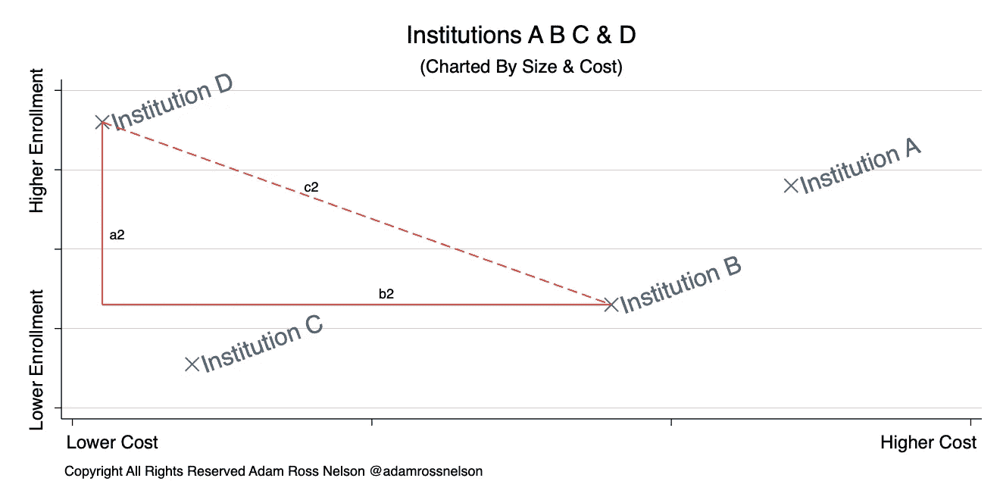
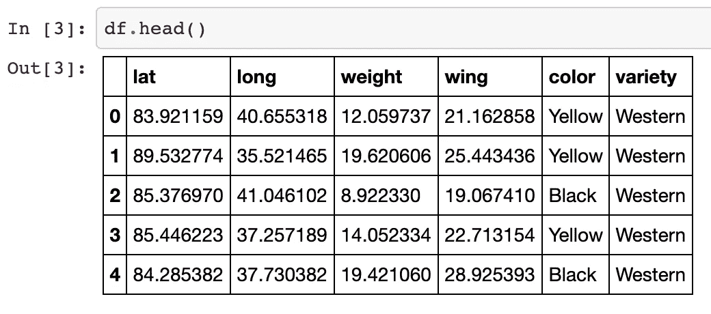
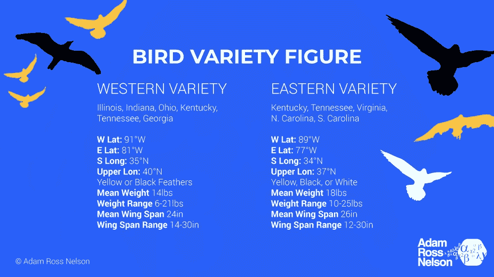
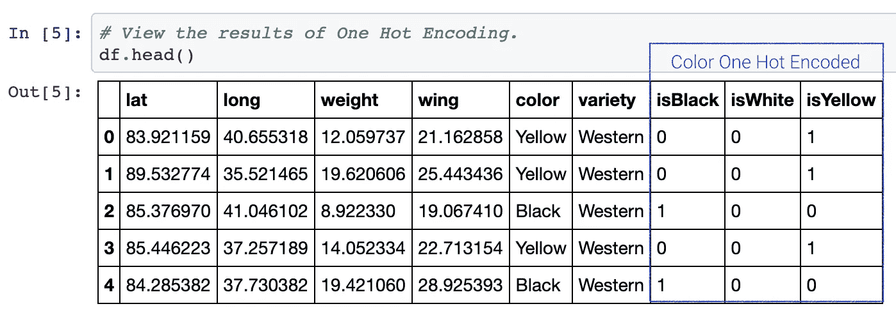
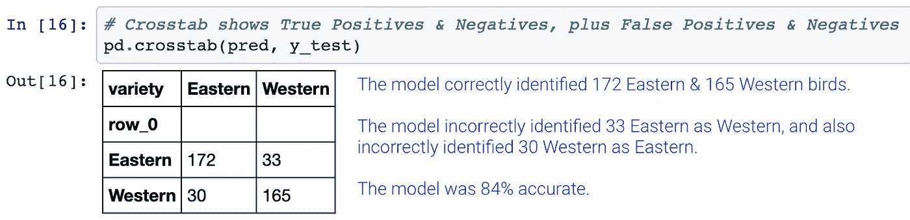
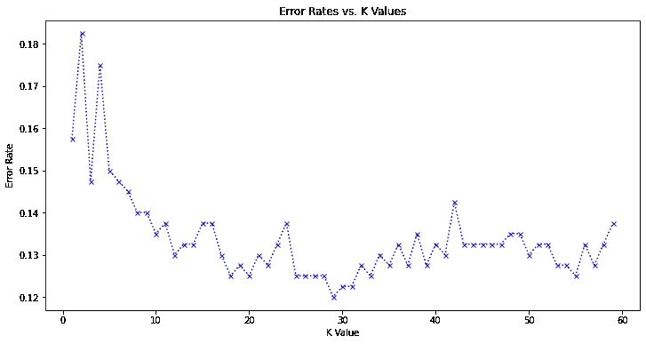

# 假鸟和机器学习

> 原文：<https://towardsdatascience.com/fake-birds-machine-learning-acc553312a8f?source=collection_archive---------27----------------------->

## 使用流行的鸟类品种数据来演示最近邻分类

# 介绍

本文使用虚构的数据[来说明 k-最近邻分类算法，这些数据是使用以前的文章](/how-to-make-fictional-data-7a79ce86a350)中的代码生成的。读者可以将本文作为使用 k-最近邻算法执行分类算法的指南。

本文附有一个 Jupyter 笔记本和一个 YouTube 教学视频。我将这些附加资源的链接放在了文章的末尾。

## 该算法

k-最近邻算法是可用于分类的最简单的监督机器学习算法之一。通常，k-最近邻算法的性能与许多其他更复杂的机器学习算法选项一样好。

这种算法的基本原理是将观察值放在多维空间中。然后使用距离测量，以便识别多维空间中“附近”的其他观察。邻近性作为相似性的度量。

该算法假设任何数据点都可能与附近的其他数据点属于同一类。同名的 *k* 是一个指定邻居数量的参数。

这里显示的前一篇文章说明了距离度量如何测量相似性。

[](/a-cookbook-using-distance-to-measure-similarity-8de97a1404dd) [## 一本食谱:用距离来衡量相似性

### 一本用距离度量相似性的编码食谱。

towardsdatascience.com](/a-cookbook-using-distance-to-measure-similarity-8de97a1404dd) 

图 1 展示了我们熟悉的毕达哥拉斯定理是如何测量距离和相似性的。



图 1:作者的插图，粗略地说明了勾股定理如何测量距离，以及相似性

## 数据

这些数据(BirdVarietyData_March2021.csv)包括两千次观测。[我在 GitHub](https://github.com/adamrossnelson/BirdsDataCreation/blob/main/BirdVarietyData_March2021.csv) 主持这个数据。这些数据是虚构的，与一种有两个变种的鸟有关。有西方品种和东方品种。有如下六个变量:

```
lat :         The latitude at which the bird was observed.
long :        The longitude at which the bird was observed.
weight :      The weight of the bird (pounds).
wing :        The wing span of the bird (inches).
color :       The color of the bird (yellow, black, or white).
variety :     The variety of the bird.
```

图 2 显示了数据的摘录。



图 2:摘自 BirdVarietyData_March2021.csv 作者插图。

图 3 显示了数据的概况。



图 3:作者对 BirdVarietyData_March2021.csv 的图解。

## 任务

本文以及这里显示的任务旨在训练一个机器学习模型，该模型可以根据鸟类的重量、长度、位置和颜色来预测物种多样性。

**获取&审核数据。熊猫可以很容易地从互联网上下载数据，而不必先在浏览器或查找器中下载本地副本。**

```
# Shown in multiple lines to conserve line width.
web_root = 'https://raw.githubusercontent.com/'
location = 'adamrossnelson/BirdsDataCreation/main/'
filename = 'BirdVarietyData_March2021.csv'df = pd.read_csv(web_root + location + filename)
```

有关数据的回顾，请参见上面的图 2。

**对分类数据进行编码。**为了处理鸟的颜色，我们需要对类别进行编码。至少有两种选择可以在一个热编码方案中对这些数据进行编码。第一种选择是使用列表理解:

```
*# One Hot Encoding with list comprehension.*
df['isBlack'] = [1 **if** x == 'Black' **else** 0 **for** x **in** df['color']]
df['isWhite'] = [1 **if** x == 'White' **else** 0 **for** x **in** df['color']]
df['isYellow'] = [1 **if** x == 'Yellow' **else** 0 **for** x **in** df['color']]
```

另一个选项，在 Jupyter 笔记本和下面链接的视频中显示，是使用`pd.get_dummies()`。任一选项都会产生相同的结果，如图 4 所示(参见最右边的三列中的一个热编码变量)。



图 4:鸟类颜色的一次热编码后的数据回顾。吹气框中最右边的三列显示了一种热编码鸟的颜色。作者插图。

**标准化&刻度数据。**缩放数据是重要的一步。该步骤确保每个预测变量在预测中的权重相等。就像执行一个热编码一样，有多种方法可以缩放数据。本文将展示如何通过`sklearn.preprocessing`用 z 分数来缩放数据。随附的 Jupyter 笔记本演示了另一种方法。

```
**from** **sklearn.preprocessing** **import** StandardScaler
scaler = StandardScaler()
scaler.fit(df.drop(['variety','color'], axis=1))

scaled_features = scaler.transform(df.drop(['variety',
                                            'color'], axis=1))
```

**训练，测试，&拆分数据。**训练，测试，&拆分技术是一种留出一部分训练数据用于测试的技术。在搁置测试数据上测试和评估模型提供了机器学习模型在其他看不见的数据上表现如何的真实视图。这种技术可以防止过度配合。

有多种方法可以有效地训练、测试和分割数据。这篇文章展示了如何在`sklearn.model_selection`的帮助下完成任务。这种技术还使用了 Python 中一种流行的技术，称为“多重赋值”,如下所示。

```
**from** **sklearn.model_selection** **import** train_test_splitX_train, X_test, y_train, y_test = train_test_split(scaled_features, 
                                                    df['variety'], 
                                                    test_size=0.2, 
                                                  random_state=1234)
```

在这个代码之后，我们有四个新的数据帧。我们将使用`X_train`和`y_train`来训练机器学习模型。然后我们将使用`X_test`和`y_test`来测试和评估模型。上面的代码留出 20%的观察值用于测试，80%的观察值用于训练。

**训练模型。这个过程的最后一步是训练模型。该步骤包括使用`sklarn.neighbors.KNeighborsClassifier`的辅助。**

```
**from** **sklearn.neighbors** **import** KNeighborsClassifier
knn = KNeighborsClassifier(n_neighbors=1)
knn.fit(X_train, y_train)
knn = KNeighborsClassifier(n_neighbors=1)
```

**做出预测&评估结果。**用`X_train`和`y_train`训练模型后，我们用`X_test`进行新的预测。将新的预测存储在`pred`中后，我们可以将这些结果与`y_test`进行比较，以评估模型的性能。

```
pred = knn.predict(X_test)
pd.crosstab(pred, y_test)
```

上面的代码生成一个交叉列表，让我们将预测的变化(`pred`)与实际的变化(`y_test`)进行比较，并生成以下输出



图 5:作者举例说明了比较预测数据和测试数据的交叉列表。

还有更复杂的工具和技术可以改进模型评估，我在附带的 Jupyter 笔记本和视频中展示了这些工具和技术。

**寻优 K.** 同名的 *k* 是邻居的数量。该算法的性能将随着邻居数量的变化而变化。如图 6 所示，当查看第一个最近邻时，模型显示的错误率在 0.15 到 0.16 之间。当查看两个最近的邻居时，错误率增加到 0.18 到 0.19 之间。之后，当查看 29 个最近的邻居时，错误率稳定地下降到大约 0.12。



图 6:作者对模型错误率的说明。

随附的 Jupyter 笔记本和视频展示了如何生成类似于图 6 中的视觉效果。使用笔记本和视频中讨论的技术进一步检查模型性能。

[](https://adamrossnelson.medium.com/membership) [## 加入我的介绍链接媒体-亚当罗斯纳尔逊

### 作为一个媒体会员，你的会员费的一部分会给你阅读的作家，你可以完全接触到每一个故事…

adamrossnelson.medium.com](https://adamrossnelson.medium.com/membership) 

# 额外资源

Jupyter 笔记本支持并进一步展示了本文中介绍的代码和技术。对于那些对更具互动性和视听效果的指南感兴趣的人，我还准备了一个 YouTube 教学视频:

# 感谢阅读

感谢阅读。把你的想法和主意发给我。你可以写信只是为了说声嗨。如果你真的需要告诉我是怎么错的，我期待着尽快和你聊天。Twitter:[@ adamrossnelson](https://twitter.com/adamrossnelson)LinkedIn:[Adam Ross Nelson 在 Twitter](https://www.linkedin.com/in/arnelson) 和脸书: [Adam Ross Nelson 在脸书](https://www.facebook.com/adamrossnelson)。