# 假工作预测器

> 原文：<https://towardsdatascience.com/fake-job-predictor-a168a315d866?source=collection_archive---------9----------------------->

## 使用文本和数字数据识别欺诈性职位发布的分类器。

在封锁期间，我花了一些时间研究一个项目——“假工作预测器”我找新工作的时候，做这样的预测器似乎是个好主意。Github 链接提供了相关代码—[https://Github . com/anshupriya 2694/Fake-Job-Posting-Prediction](https://github.com/Anshupriya2694/Fake-Job-Posting-Prediction)。

# 定义

## 介绍

就业诈骗呈上升趋势。根据美国消费者新闻与商业频道的数据，2018 年的就业诈骗数量比 2017 年翻了一番。当前的市场形势导致了高失业率。对于许多人来说，经济压力和冠状病毒的影响已经大大减少了就业机会和失业。像这样的案件给骗子提供了一个合适的机会。许多人成为这些骗子的牺牲品，他们利用前所未有的事件引起的绝望。大多数骗子这样做是为了从他们诈骗的人那里获得个人信息。个人信息可能包含地址、银行账户详情、社会保险号等。我是一名大学生，收到过几封这样的诈骗邮件。骗子为用户提供一个非常有利可图的工作机会，然后要求金钱作为回报。或者他们要求求职者投资并承诺给他们一份工作。这是一个危险的问题，可以通过机器学习技术和自然语言处理(NLP)来解决。

本项目使用 [Kaggle](https://www.kaggle.com/shivamb/real-or-fake-fake-jobposting-prediction) 提供的数据。此数据包含定义职务公告的功能。这些招聘信息被分为真假两类。虚假招聘信息只是这个数据集中的一小部分。这是意料之中的事。我们不希望看到很多虚假的招聘信息。这个项目分五个阶段。本项目采用的五个步骤是

1.  问题定义(项目概述、项目陈述和指标)
2.  数据收集
3.  数据清理、探索和预处理
4.  建模
5.  评价

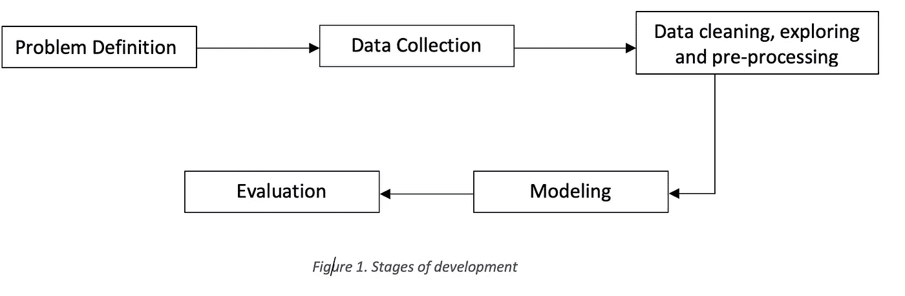

发展阶段

## 问题陈述

这个项目旨在创建一个分类器，将有能力识别假和真的工作。基于两种不同的模型来评估最终结果。由于所提供的数据具有数字和文本特征，一个模型将用于文本数据，另一个用于数字数据。最终的输出将是两者的结合。最终模型将接受任何相关的职位发布数据，并产生最终结果来确定该职位是否真实。

## 韵律学

基于两个指标对模型进行评估:

1.  **准确度**:这个公式定义了这个度量-

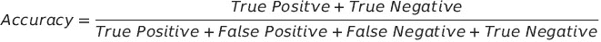

如公式所示，该指标产生所有正确分类的数据点与所有数据点的比率。这是非常有用的，因为我们试图识别真实和虚假的工作，而不是只有一个类别是必不可少的。然而，这种方法有一个缺点。机器学习算法往往倾向于优势类。由于我们的类别是高度不平衡的，高精度将代表我们的模型对负面类别(真实工作)的分类有多好。

1.  **F1-Score** : F1 分数是模型在数据集上的准确性的度量。这一指标的公式是–

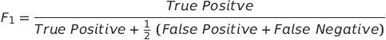

使用 F1 分数是因为，在这种情况下，假阴性和假阳性都是至关重要的。该模型需要识别具有最高可能分数的两个类别，因为这两个类别都具有高成本。

# 分析

## 数据探索

本项目数据可在 ka ggle—[https://www . ka ggle . com/shivamb/true-or-fake-fake-job posting-prediction](https://www.kaggle.com/shivamb/real-or-fake-fake-jobposting-prediction)获取。数据集由 17，880 个观测值和 18 个要素组成。

数据是整数、二进制和文本数据类型的组合。变量的简要定义如下:

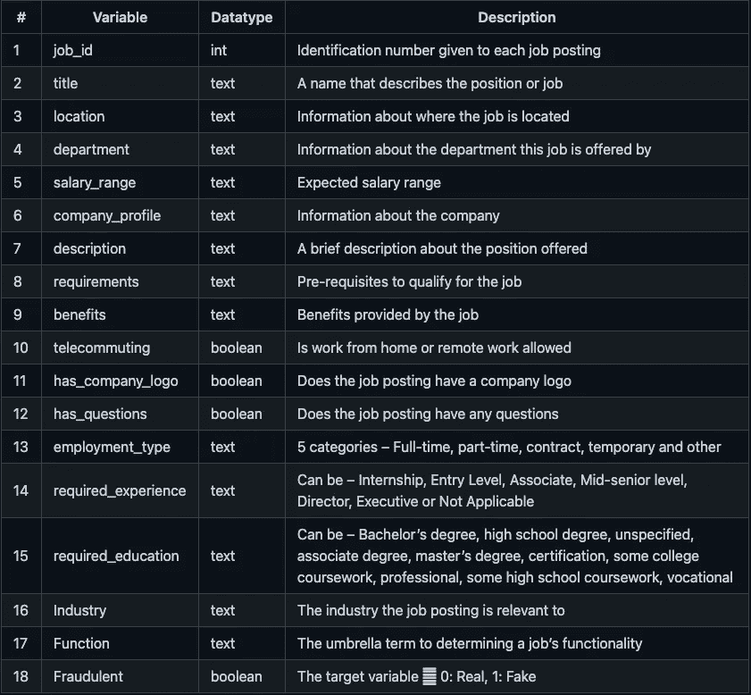

表:功能描述

因为大多数数据类型不是布尔就是文本，所以这里不需要汇总统计。唯一的整数是 job_id，它与此分析无关。进一步研究数据集以识别空值。

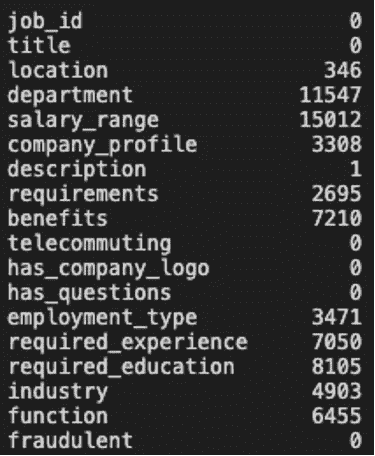

空值计数

department 和 salary_range 等变量有很多值缺失。这些列不再进一步分析。

在对数据集进行初步评估后，可以看出，由于这些招聘信息是从几个国家提取的，所以招聘信息使用了不同的语言。该项目使用了来自美国的数据，这些数据占了数据集的近 60%。来自美国各地的数据确保所有数据都是英文的，以便于理解。此外，该位置被分为州和城市，以便进一步分析。最终数据集有 10593 个观测值和 20 个要素。

该数据集非常不平衡，9868 个(93%的工作)是真实的，只有 725 个或 7%的欺诈性工作。相同的计数图可以非常清楚地显示差异。

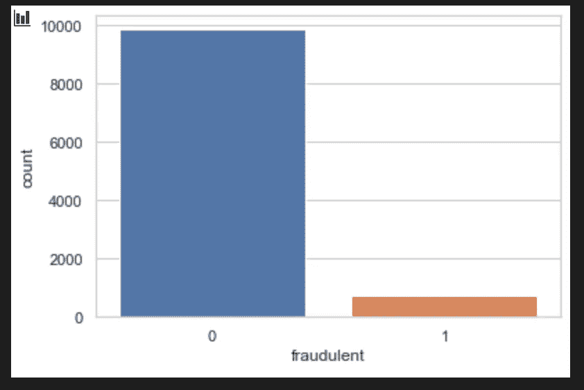

## 探索性分析

本项目中可视化数据集的第一步是创建一个相关矩阵来研究数值数据关系。相关矩阵在数字数据之间没有表现出任何强的正相关或负相关。

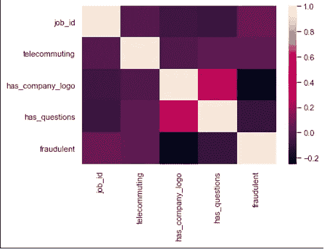

相关矩阵

然而，布尔变量远程办公有一个有趣的趋势。当这两个变量的值都等于零时，这份工作有 92%的可能是欺诈性的。在数字特征之后，探索该数据集的文本特征。我们从这个位置开始探索。

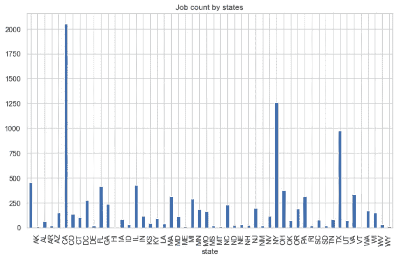

各州的工作计数

上图显示了哪些州创造了最多的工作岗位。加州、纽约和德克萨斯州的职位发布数量最多。为了进一步研究这一点，创建了另一个条形图。这个条形图显示了前 10 个州的假工作和真工作的分布情况。

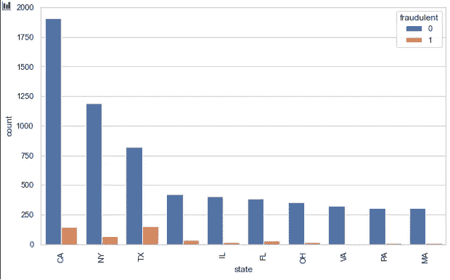

假工作和真工作按州统计

上图显示，德克萨斯州和加利福尼亚州比其他州出现假工作的可能性更高。为了更深入地挖掘并包括各州，创建了一个比率。这是一个基于州和城市的虚假的真实的工作比率。以下公式用于计算每个真实职务有多少个假职务:

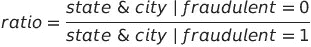

只有大于或等于 1 的比值绘制如下。

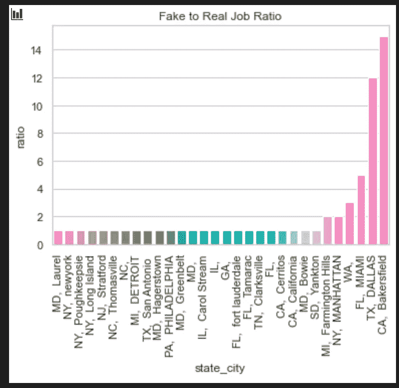

假工作与真工作的比率

在加州，贝克斯菲尔德的假工作与真工作之比为 15:1，德克萨斯州达拉斯的假工作与真工作之比为 12:1。来自这些地方的任何招聘信息都很有可能是虚假的。进一步探究其他基于文本的变量，以可视化任何关键关系的存在。

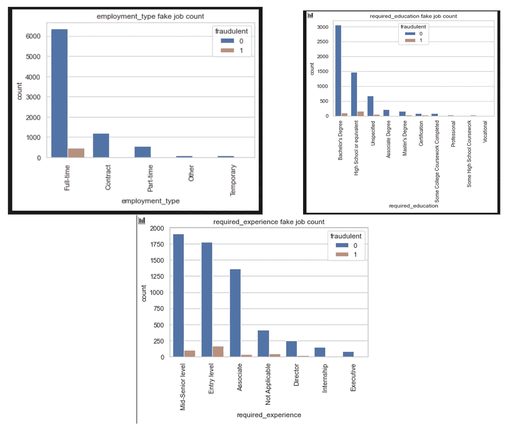

上面的图表显示，大多数欺诈性工作属于全职类别，通常是要求学士学位或高中教育的入门级职位。

基于文本的类别被合并到一个称为文本的字段中，以进一步扩展对文本相关字段的分析。组合字段包括——职位、位置、公司简介、描述、要求、福利、必需经验、必需教育、行业和职能。一个描述字符数的直方图被用来可视化真实工作和虚假工作之间的差异。可以看到的是，即使真实工作和虚假工作的字符数相对相似，但真实工作的频率更高。

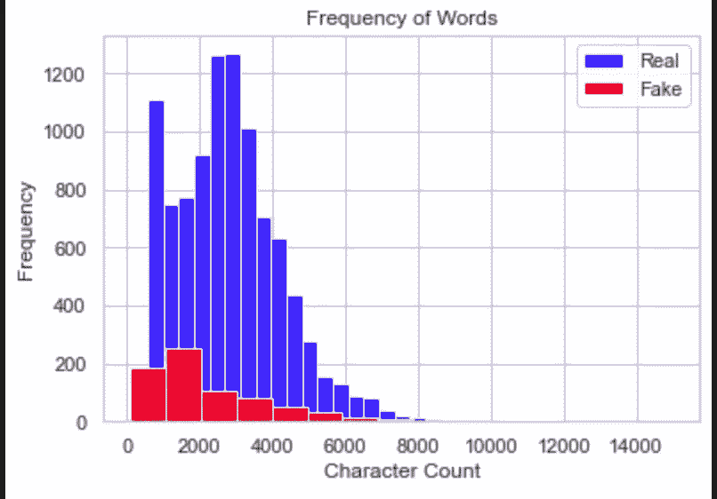

真实和虚假招聘信息中出现字符的频率

## 算法和技术

根据初步分析，很明显，文本和数字数据都将用于最终建模。在数据建模之前，确定最终数据集。该项目将使用具有以下特征的数据集进行最终分析:

1.  远程办公
2.  不诚实的
3.  比率:基于位置的虚假与真实工作比率
4.  文本:头衔、地点、公司简介、描述、要求、福利、必需的经验、必需的教育、行业和职能的组合
5.  character_count:文本数据字数统计直方图中的字数

在将文本数据用于任何数据建模之前，需要进一步的预处理。

项目中使用的算法和技术有:

1.  自然语言处理
2.  朴素贝叶斯算法
3.  SGD 分类器

比较朴素贝叶斯和 SGD 分类器的准确性和 F1 分数，并选择最终模型。朴素贝叶斯是基线模型。使用它是因为它可以根据每个事件发生的概率计算两个事件的条件概率；将这些概率编码是非常有用的。一个比较模型，SGD 分类器，实现了一个简单的随机梯度下降学习例程，支持不同的损失函数和分类惩罚。当分类不正确时，这个分类器将需要很高的惩罚。这些模型分别用于文本和数字数据，最终结果被合并。

## 基准

这个项目的基准模型是朴素贝叶斯。该模型的总体精度为 0.971，F1-得分为 0.744。使用这种模型的原因已经在上面阐述过了。任何其他模型的能力将与朴素贝叶斯的结果进行比较。

# 方法学

## 数据预处理

对文本处理采取以下步骤:

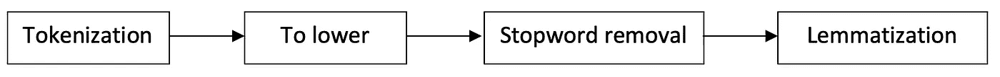

*   标记化:文本数据被分割成更小的单元。在这种情况下，数据被拆分成单词。
*   降低:拆分的单词被转换成小写
*   停用词去除:停用词是对句子没有增加多少意义的词。例如，the，a，an，he，have 等。这些词被删除。
*   词形变化:词形变化组合在一起使用的过程。

## 履行

以下是该项目的实施示意图。数据集分为文本、数字和 y 变量。文本数据集被转换成术语-频率矩阵用于进一步分析。然后使用 sci-kit learn，将数据集分为测试数据集和训练数据集。基准模型 nave Bayes 和另一个模型 SGD 使用训练集进行训练，训练集占数据集的 70%。基于两个测试集(数字和文本)的模型的最终结果被组合，使得如果两个模型都说特定数据点不仅仅是欺诈性的，那么工作发布就是欺诈性的。这样做是为了减少机器学习算法对多数类的偏向。在测试集上使用经过训练的模型来评估模型性能。我们比较了两个模型(朴素贝叶斯和 SGD)的准确性和 F1 值，并选择了最终模型进行分析。

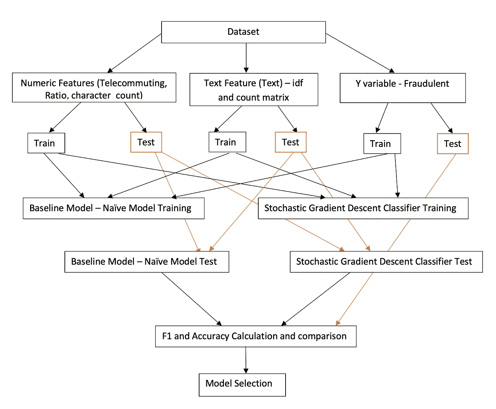

# 结果

## 模型评估和验证

用于此分析的最终模型是— SGD。这是基于与基线模型相比较的度量结果。基准模型和 SGD 的结果如下表所示:

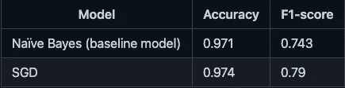

根据这些指标，SGD 的性能比基准模型稍好。这就是最终模型被选为 SGD 的方式。

## 正当理由；辩解

如上所述，最终模型的性能优于基线模型的既定基准。该模型将能够以非常高的准确度识别真实的工作。然而，它对虚假职位的识别能力仍有待提高。

## 自由形式可视化

混淆矩阵可以用来评估项目的质量。该项目旨在识别真假工作。

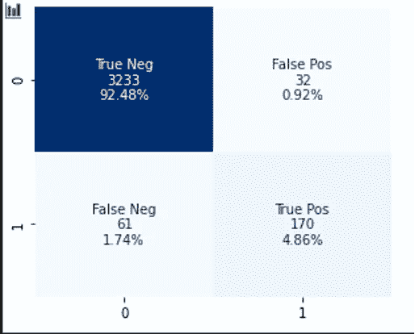

上面的混淆矩阵显示了以下值——分类标签、标签下分类的数据点数量，以及每个类别中表示的数据百分比。测试集共有 3265 个真实作业和 231 个虚假作业。根据混淆矩阵，很明显，该模型在 99.01%的情况下识别出真正的工作。然而，欺诈性的工作只有 73.5%的机会被识别出来。只有 2%的情况下模型没有正确识别类别。这个缺点已经在前面讨论过，机器学习算法倾向于选择占优势的类别。

## 反射

虚假招聘是现实世界中一个至关重要的挑战，需要积极的解决方案。这个项目旨在为这个问题提供一个潜在的解决方案。对文本数据进行预处理以生成最佳结果，并选择相关的数值字段。多个模型的输出被组合以产生最好的可能结果。这样做是为了减少机器学习模型对主导类的偏见。

这个项目最有趣的部分是特定的地点是欺诈性工作的缩影。例如，加州贝克斯菲尔德的假工作与真工作之比为 15:1。像这样的地方需要一些额外的监控。另一个有趣的部分是，大多数入门级的工作似乎是欺诈性的。看起来，骗子们倾向于瞄准那些拥有学士学位或高中文凭、正在寻找全职工作的年轻人。最具挑战性的部分是文本数据预处理。数据的格式非常复杂。清理它需要很大的努力。

## 改进

这个项目中使用的数据集非常不平衡。大部分工作是真实的，很少有欺诈的。因此，真正的工作很容易找到。某些技术，如 SMOTE，可用于生成合成少数类样本。一个平衡的数据集应该能够产生更好的结果。