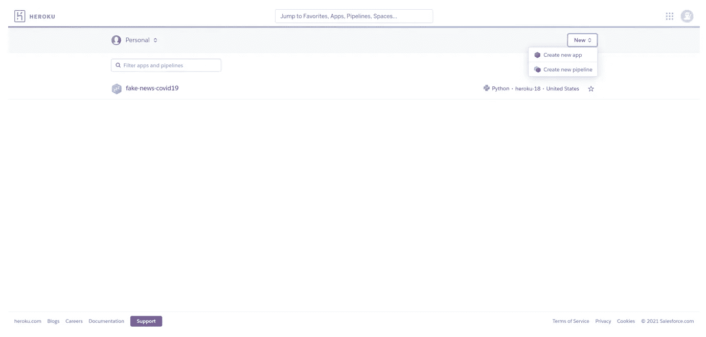
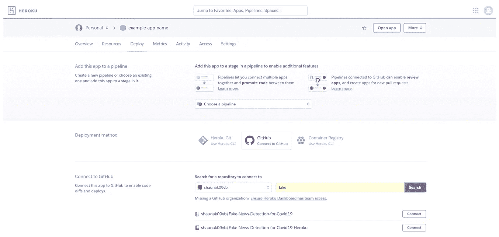
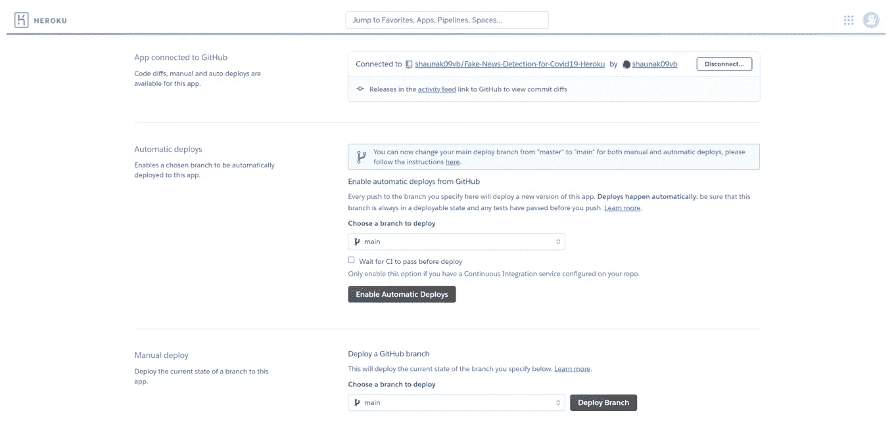
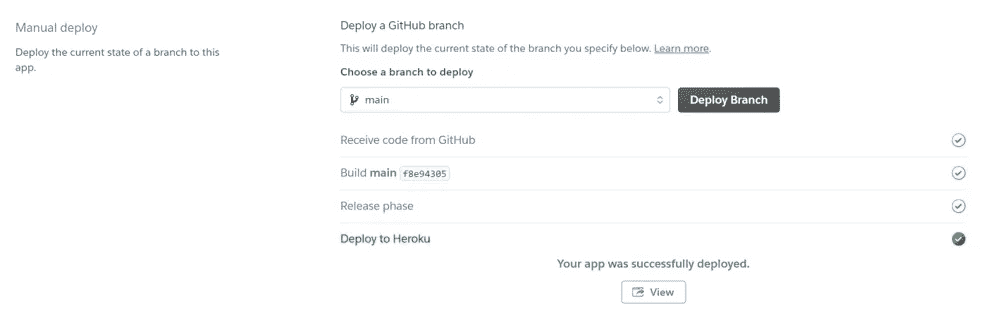

# 假新闻分类器，以解决新冠肺炎造谣-二

> 原文：<https://towardsdatascience.com/fake-news-classifier-to-tackle-covid-19-disinformation-ii-116ed2eb44e4?source=collection_archive---------35----------------------->

## 努力解决当今世界面临的最紧迫的问题之一，假新闻。


(图片由作者提供)

# 介绍

冠状病毒(新冠肺炎)是一种导致持续疫情的传染病。中国武汉首次发现该病，2019 年 12 月发现首例。截至 2021 年 5 月 21 日，180 个国家和地区报告了超过 1.6 亿例病例。这个疫情的庞大规模给当代人带来了无数的问题。我遇到的一个严重问题是虚假新闻文章的传播，在当今世界，虚假新闻文章会引起恐慌和大规模歇斯底里。我意识到这个问题的严重性，并决定将我的下一个机器学习项目建立在解决这个问题的基础上。

这是我关于假新闻分类器项目的第二篇文章，将详细阐述使用 Flask 框架在 Heroku 上将经过训练的 SVM 分类器部署为 web 应用程序所需的步骤。那些没有读过我的第一篇文章的人可以通过下面的[链接](/fake-news-classifier-to-tackle-covid-19-disinformation-7a31e4296b83) *来阅读。*

# 问题陈述

*开发一个 web 应用程序，可以准确地将一篇关于新冠肺炎的新闻文章分类为真实新闻或虚假新闻。*

# 工作流程

在我的第一篇文章《假新闻分类器解决新冠肺炎虚假信息-I》中，我在 Google Colab 中进行了数据预处理、数据工程、模型训练、模型测试和模型评估。我的结论是，SVM 机器学习算法在对新闻文章进行真伪分类时提供了最佳结果。

由于最初的分析已经在第一篇文章中完成，下面描述的步骤将集中在使用 Flask 框架在 Heroku 上将经过训练的 SVM 模型部署为 web 应用程序。

**步骤 1** :训练 SVM 机器学习模型，并将训练好的模型和 Tf-Idf 向量分别保存为 pickle 文件。

首先，我创建了一个名为 model.py 的 Python 脚本文件，并使用训练数据执行了训练 SVM 模型所需的所有必要步骤。详细的分步方法可以在本文的 [*第一部分*](/fake-news-classifier-to-tackle-covid-19-disinformation-7a31e4296b83) 中找到。后来，训练的 SVM 分类器和 Tf-Idf 向量被保存为 pickle 文件。

**第二步**:创建一个 web 应用。

现在，我们已经保存了训练好的 SVM 分类器以及 Tfi-Idf 向量，是时候将我们的注意力转移到创建 web 应用程序上了。为此，我创建了一个名为 app.py 的 Python 脚本文件。App.py 充当我们的 web 应用程序的后端，负责处理用户输入的数据，并使用经过训练的 SVM 分类器对新闻文章进行分类。

另一个最重要的文件是 Index.html 文件。Index.html 是包含我们的 web 应用程序前端代码的文件，它与 app.py(我们的后端)通信，向用户显示结果。

**步骤 3** :创建在 Heroku 上托管 web 应用程序所需的配置文件。

在我们将 web 应用程序托管到 Heroku 之前，需要一些重要的配置文件。第一个文件称为*“proc file”*。Procfile 用于指定用户访问 web 应用程序时需要首先执行的文件。procfile 包含以下配置语句。

```
web:gunicorn app:app
```

第一个参数“app”是需要首先执行的文件(app.py)，而第二个参数“app”是 Flask(__name__)。第二个需要的配置文件是*“requiremnts . txt”*文件。这个文件是必需的，因为它使 Heroku 环境能够下载我们的 web 应用程序平稳运行所需的所有库。

**步骤 4** :将整个代码提交给 GitHub 库。

下一步是在 GitHub 上创建一个新的资源库。这个库将连接到 Heroku 平台，Heroku 将从库本身访问所有需要的代码文件。我上传到 GitHub 资源库的文件有 app.py、model.pkl、tfidf.pkl、nltk.txt、requirements.txt、procfile 和 templates 文件夹。上传完成后，转到步骤 5。

**步骤 5** :在 Heroku 上创建一个新账户，并将新建的 GitHub 库链接到你的 Heroku 账户。

1 -如果您还没有 Heroku 帐户，请创建一个并登录您的 Heroku 帐户。导航到 Heroku 仪表盘的右上角，点击*“新建”*，然后选择*“创建新应用”*。



(图片由作者提供)

2 -现在，输入您想要的应用程序名称，将地区设为美国，最后点击*“创建应用程序”。*


(图片由作者提供)

3-应用程序配置完成后，您将被重定向到新创建的 Heroku 应用程序的仪表板。在这里，我们将把这个应用程序连接到我们的 GitHub 存储库。向下滚动到部署方法并点击*“连接到 GitHub”。*


(图片由作者提供)

4-这将在*“连接到 GitHub”*选项下打开一个提示，要求您输入您的 web 应用程序的存储库名称。输入您的 GitHub 库的名称，点击*“搜索”*按钮，然后点击位于您想要的库旁边的*“连接”*选项。等待几秒钟，您的 web 应用程序存储库将连接到 Heroku 应用程序。



(图片由作者提供)

**步骤 5** :使用 Heroku 部署 web 应用。

Heroku 提供了两个选项来完成 web 应用程序部署。这两个选项分别是自动部署和手动部署。对于这个项目，我决定选择手动部署。要执行手动部署，请向下滚动并导航到手动部署。确保存储库分支正确，然后点击*“部署分支”。*部署应该会自动开始，您可以在显示在*构建*部分下的日志文件中看到所有的安装。



(图片由作者提供)

如果安装成功，您将在构建日志的末尾收到一个 URL。此外，在 *Deploy to Heroku* 部分之后，您会收到一条消息，说明“应用程序已成功部署”。此 URL 可用于从世界任何地方访问 web 应用程序，您可以在您的同行之间共享它，并让他们测试部署的 web 应用程序。



(图片由作者提供)

# 结论

以下项目是我完成的第一个端到端机器学习项目，其中我成功地在 Heroku 云平台上部署了我的 SVM 分类器。端到端的机器学习项目打开了技术堆栈的几个方面，并帮助您参与应用程序的前端和后端。

在我看来，开发高度精确的机器学习模型如果停留在你的 Jupyter 或 Colab 笔记本上，是没有任何用处的。端到端项目提供了一个向广大最终用户展示您的模型的准确性的机会，从外行到有经验的 IT 专业人员。这种思想促使我强调，从今以后，我将专注于部署我承担的每一个机器学习项目。

整个项目可以在我的 [*Github*](https://github.com/shaunak09vb/Fake-News-Detection-for-Covid19-Heroku) 页面找到。我希望你喜欢看我的博客。