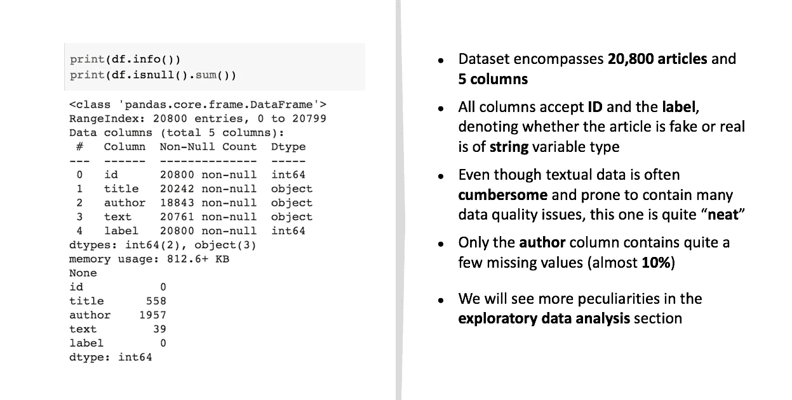
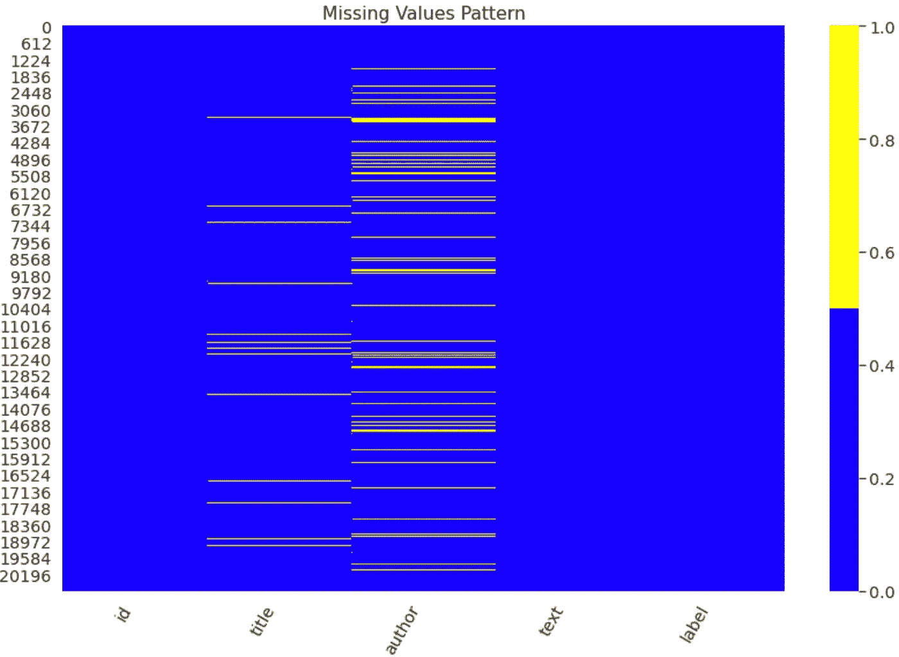
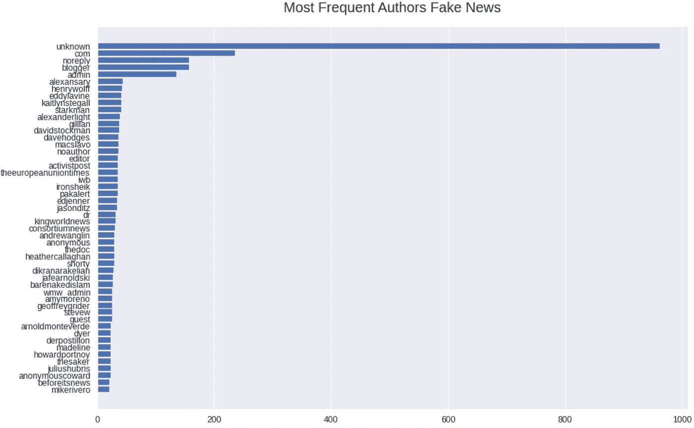
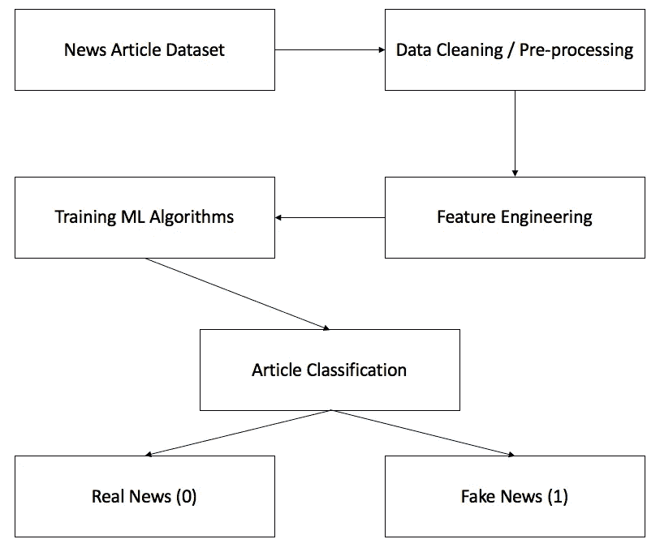
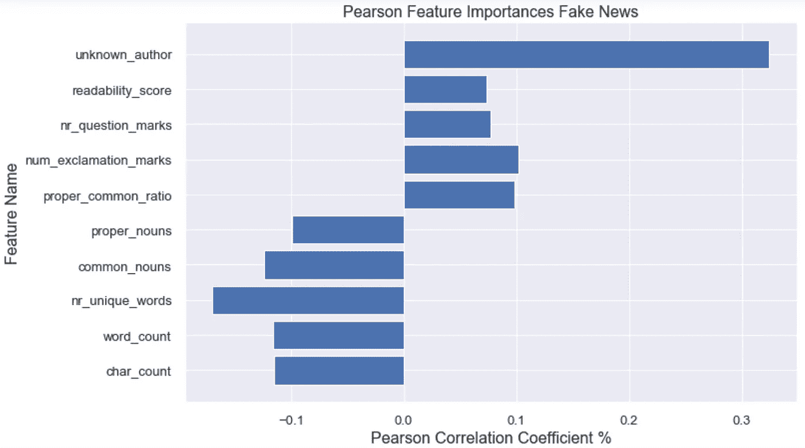
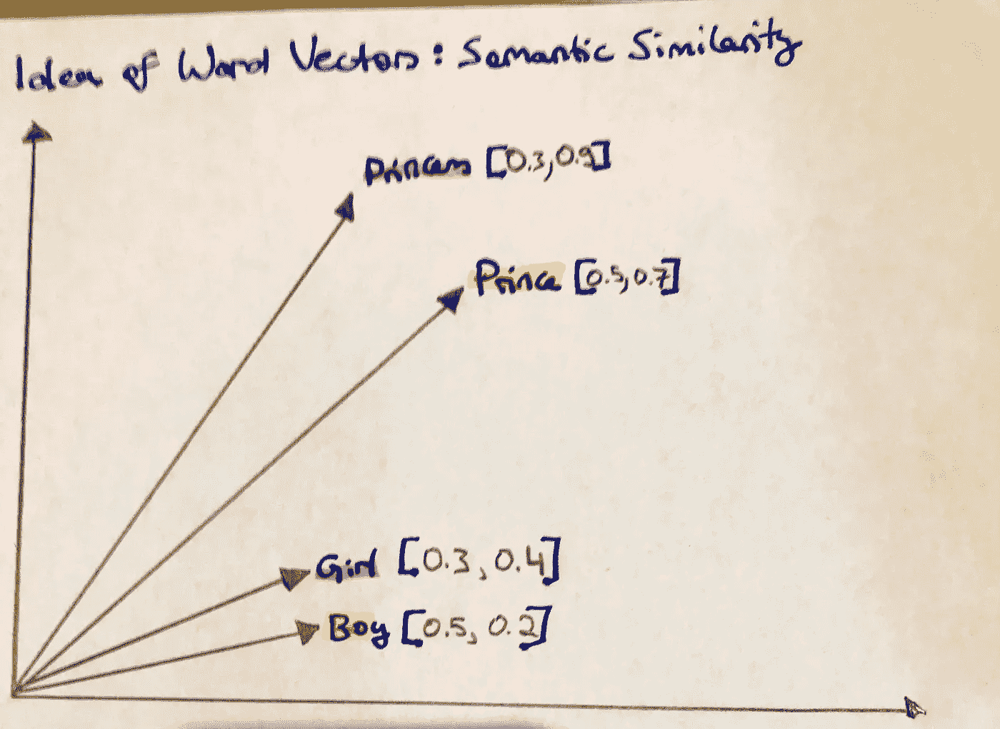
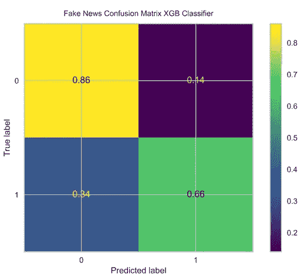

# 无处不在的假新闻:如何用 SOTA NLP 检测

> 原文：<https://towardsdatascience.com/fake-news-everywhere-how-to-detect-it-with-sota-nlp-f2dc1e07247c?source=collection_archive---------29----------------------->

## 一个初学者友好的教程，有真实的世界，网络搜集的文章数据。探索一系列 SOTA 自然语言处理技术，以准确标记新闻文本是假的还是真的。

凯拉·贝拉斯克斯在 [Unsplash](https://unsplash.com/s/photos/fake-news?utm_source=unsplash&utm_medium=referral&utm_content=creditCopyText) 上的照片。com

# 目录

1.  介绍
2.  原始输入数据
3.  探索性数据分析
4.  特征工程
5.  型号选择
6.  结论
7.  参考

# 介绍

作为互联网时代的副产品，社交媒体的崛起代表了 21 世纪最深远的趋势。当然，自从广泛采用以来，相当一部分社会生活转移到了网络空间，而几个世纪以前的人类交流涉及身体接触。其倡导者经常使用的一句话:“你的网络就是你的净值”，恰恰体现了这一点，也说明了我们赋予这一新的现代化方面多大的力量。从让用户建立社交网络、知识和新闻共享池、有组织的社区和亚文化，到释放利润丰厚的商业潜力。它永远改变了我们的生活。以至于现代劳动力别无选择，只能获得数字技能来挖掘其潜力。

然而，这还不是故事的全部。社交媒体带来的不仅仅是荣耀和魅力。今天存在的所有许多渠道，如 Instagram、脸书、Twitter、抖音和 scores more，不仅仅是连通性的绿洲。它们不只是作为虚拟贸易中心为我们的世界服务，完全有益。正如新奇事物的一贯情况一样，它也有消极的一面；而本教程旨在探讨其中之一:即假新闻传播。事实上，由技术驱动的假新闻泛滥对整个社会都有毁灭性的后果。因此，企业和政府有必要进一步发展现有的检测机制。

但是在开始研究这些数据之前，让我们先确定假新闻的定义。它经常被不恰当地用来排除不喜欢的新闻内容，事实上它并不那么容易定义。因此，我问自己为什么要堆积学术论文:是否有一个普遍接受的定义？如果是，如何处理报道的事实或数字中的非故意失误？它们也算假新闻吗？

最终，我意识到没有一个被广泛接受的定义。但是发表在数据科学的文本分类分支上的研究对此提供了一些明智的观点。例如，Rubin 等人描述了三种假新闻:

*   没有发表在任何主流新闻媒体上的严重捏造——由于其罕见性，使用网络搜集更难收集。
*   因其病毒性质而出现在多个平台上的独特创意恶作剧。
*   为娱乐目的而制造的幽默假新闻，就像讽刺作品一样。作者认为，包括这种类型会使算法更难用传统的分类方法检测前两种类型。

因此，我们可以得出结论，假新闻完全是捏造的，其传播者将党派内容作为事实呈现——主要在网络上传播，如博客、新闻网站和社交媒体平台。一般来说，有两个标准区分假新闻和真新闻:(1)首先，捏造从未以报道形式发生的事件，以及(2)第二，旨在赞扬或诋毁目标个人、组织和/或实体的党派因素。两者在传播虚假信息方面是一致的。

# 原始输入数据

数据科学竞赛网站 [Kaggle](http://www.kaggle.com) 提供了数百个丰富的数据集，研究人员可以利用这些数据集达到任何可以想到的目的。你只需要注册一个账户，然后就可以开始搜索有趣的数据集了。我选择了下面链接的这个特定数据集，它收集了川普和希拉里争夺美国最高职位期间发表的新闻文章:(【https://www.kaggle.com/saratchendra/fake-news/metadata】T2

我敢肯定，有一个更老的提交了更多的细节，包括确切的时间范围内刮文章覆盖。回想起来，我们知道假新闻现象在特朗普 2016 年竞选总统后获得了最多的关注。他的竞选陷入了俄罗斯参与的指控，显然是以社交媒体机器人军队的形式帮助他获胜。出于这个原因，可以有把握地假设我们的数据集实际上与两篇学术论文中使用的更突出的数据集相同:([https://www . ka ggle . com/clmentbisaillon/fake-and-real-news-dataset？select=True.csv](https://www.kaggle.com/clmentbisaillon/fake-and-real-news-dataset?select=True.csv)

运用熊猫的头部和信息方法给我们留下了良好的第一印象:

数据集的摘要信息。作者照片。

表 1:新闻文章数据集。作者照片。

# 探索性数据分析

这方面的第一步应该是仔细检查我们是否受到一个叫做阶级平衡的问题的影响。同样，检查数据是否在缺失值中表现出某种模式也是值得的。我们可以在下面的图中看到，新闻文章数据集是完全平衡的，因为一半的行是假新闻，另一半是真实的，这表明在其创建过程中有人干预。考虑到类别不平衡对预测算法的应用提出了巨大的挑战，这样的发现总是令人欣慰的。

图 1:阶级平衡的垂直条形图。作者照片。

现在转到我们旨在寻找丢失值的模式的努力，让我们使用下面的代码片段将丢失的行涂成黄色，将完美的行涂成蓝色。这种方法在处理时间序列数据时特别有用，因为用肉眼可以立即发现重复出现的模式。

图 2:缺失值热图。作者照片。

“作者”一栏中明显有大量的黄色，表明有很多值缺失。这是上一节已经提到的观察结果。作为一个问题更有意思的是:假新闻文章比真新闻文章更容易缺少对应的作者姓名吗？让我们对此进行研究，并进一步加深我们对数据集的理解。

看看作者一栏中出现频率最高的名字的水平条形图，我们确实可以确认假新闻文章中出现频率最高的名字是‘未知’。然而，需要注意的是，在运行可视化功能之前，我已经将丢失的值编码为“未知”。

这个特殊的可视化绘图函数是 Yellowbricks 的便捷文本可视化类的调整版本，称为令牌频率分布([https://www.scikit-yb.org/en/latest/api/text/freqdist.html](https://www.scikit-yb.org/en/latest/api/text/freqdist.html))。

无论如何，对于真正的新闻文章来说，图片看起来怎么样？

前 50 名最常见的真实新闻文章作者中没有一个是“未知”的。这已经证实了许多学术研究中提出的一个观点:匿名往往是假新闻传播者的一个激励因素。因为他们在匿名的互联网世界中茁壮成长，在那里个人可以使用隐藏的身份，发布有问题的内容而不受影响。相当直观。但是我们能从这个探索性的分析中学到什么呢？简而言之，每当你看到一个由匿名人士运营的账户时，要知道假新闻传播的可能性很高。

# 特征工程

现在转到这个项目的特征工程部分，我们将从自然语言处理(NLP)的最新进展中探索一系列方法。作为机器学习和人工智能的一个分支，它见证了最近令人难以置信的进展。事实上，大约每年数据科学界都会为一种新技术的新闻感到高兴，这种新技术为 NLP 用例提供了最先进的(SOTA)工具包。

然而，这并不意味着所有可能出现的问题都是外包的。仍然需要做出艰难的选择，并且提取文本特征仍然很困难。从精致的正则表达式到处理复杂的概念，比如单词向量，这确实需要一些细致的工作。

文本分类面临的最大挑战之一是高维问题。与数字数据集类似，人们也可以从文本数据集中提取非常多的特征:在涉及新闻文章、社会互动和产品评论分析的任务中。有大量的习语、单词和短语需要处理，这通常会导致计算量很大的操作。对于这个项目，我遵循了 Ahmed 等人 2017 年的分类流程:

图 5:假新闻分类流程。作者照片。

支撑我的特征工程方法的主要公理很简单:真实的新闻文章不同于虚假的文章，因为作者遵循新闻的语言实践。这些记者中有许多是职业作家，他们非常注意如何表达自己。因此，我认为首先提取语言特征是明智的。以下是我首先提取的基本特征列表:

*   一篇文章由多少个字符组成
*   `**word_count**`:整体字数
*   `**nr_unique_words**`:一篇文章中有多少独特的词语？
*   这篇文章是由一个不知名的作者写的吗？
*   `**common_nouns**`:一篇文章中有多少常用名词？
*   `**proper_nouns**`:一篇文章中有多少专有名词
*   `**proper_common_ratio**`:专有名词与普通名词之比
*   `**num_exclamation_marks**`:文章中感叹号的数量
*   `**nr_question_marks**`:文章中问号的数量
*   `**readability score**`:弗莱施·金凯阅读难易程度评分

之前的探索性数据分析表明，由未知作者撰写的内容是假新闻存在的强烈迹象。因此，任何由匿名人士撰写的文章都可能是在传播谎言。阅读文献还发现，假新闻文章往往在标题中包装很多，通常是个人、机构或政党的名称。因此，作为一种诱饵，专有名词比普通名词出现得更频繁。既然如此，我得出结论，检查一篇文章中普通名词和专有名词之间的比例可能是有用的。

此外，我在社交媒体领域经常遇到的是在正文中使用感叹号，这可能是暗示重要性的一种伎俩。这就是为什么我还决定收集作者使用感叹号的频率和问号的次数。除了这些简单的符号特征之外，我认为创建像 Flesch-Kincaid 阅读容易度评分这样的语言特征是很有意义的。写作无疑是一个风格问题，鉴于假新闻传播者会努力掩饰他们的谎言，他们的写作风格和语言用法可能会有所不同。初始特征数据帧由以下函数生成:

时不时地，特性工程确实会变成一种高强度低产出的活动。看一看“标签”列(其中 1 表示文章是假新闻，0 表示不是假新闻)和工程特征之间的皮尔逊相关系数，我们可以看到，只有未知作者和独特字数列似乎具有任何有意义的影响。其余的比随机噪声稍微好一点。然而有趣的是，我们仍然可以看到一些值得注意的结论。总结一下:

*   文章中感叹号用的越多，越有可能是假新闻。
*   专有名词(人名、地名、宗教名、建筑名)越多，文章越有可能是假新闻。这意味着文献中的 clickbait 假设适用于我们的数据集。
*   作者使用的独特词汇越多，他/她发布假新闻的可能性就越小。

图 6:皮尔逊特征重要性图。作者照片。

但是相关性并不像古老的统计学格言所说的那样是因果关系。我们必须超越单纯的相关分析，使用复杂的算法来建立关系模型。有鉴于此，在进入模型选择部分之前，我决定加入一个强大的 NLP 技术来弥补手工设计的特性的解释能力。这个技巧叫做*单词向量，*SpaCy 库中的一个内置功能。那么，什么是词向量呢？

在介绍这些神奇的单词向量之前，让我们先了解一下语义相似性的思想。琢磨一分钟，有些词的意思不是比其他词更接近对方吗？例如，如果你邀请一个朋友去吃一顿美味的汉堡餐(向你们当中的素食主义者和纯素食主义者道歉)，你能不能不说:“嘿，我们去快餐店好吗？”理论上这包括汉堡餐吗？看看下面的图片，这个想法会变得更加清晰。

图 7:词向量的线图。作者照片。

单词向量是由统计模型计算的文本数据的数字表示，该统计模型倾向于使用相似性度量(例如余弦相似性)来表示某些单词在意义上彼此有多接近。在上图中，我们可以看到男孩和女孩这两个词很相似，公主和王子这两个词也很相似。在 SpaCy 的 NLP 工具包中，相似性值的范围在 0(无相似性)到 1(完全相似性)之间。见下图功能:

使用 SpaCy 中名为“en_core_web_md”的海量词汇中的词向量，通过 ***访问。矢量*** 属性，我已经为我们的假新闻预测任务多生成了 300 个特征。随后，我将 word vector dataframe 与我们手工设计的功能结合起来。现在让我们看看我们的混合结构在将新闻文章分类为假新闻或真新闻的实际任务中表现如何。

# 型号选择

在学术文献中，文本分类专家采用了许多建模技术。从逻辑回归(LR)到朴素贝叶斯(NB)和神经网络(NN)模型，一切都已经在假新闻数据集上进行了尝试和测试，无论是人工构建的还是从真实世界中搜集的数据集。但在最终开始预测 Kaggle 的假新闻文章并选择一系列模型之前，我们必须将数据分为训练集和测试集。我做了一个艰难的选择，随机选择 20k 行中的 30%作为测试数据集。

与我读过的许多学术研究相比，这是一个相当大的数据集。没有任何不尊重，但只阅读方法部分，你会注意到数据集越小，准确性和结果越好。下面是我用来运行 4 种算法的代码片段:逻辑回归分类器、决策树分类器、随机森林分类器和 XGB 分类器。最后一个模型——其参数未经调整——在 30%划分的测试数据集上表现最佳，准确率为 **76%** 。

我艰难地认识到，在野外发现假新闻实际上是一件非常困难的事情。当然，我的准确性只反映了我手动提取的语言特征和来自 SpaCy 的单词向量。通过部署 n-gram 模型、TF-IDF 矢量化技术、更先进的神经网络以及对我的算法进行详尽的超参数调整，我可能会超过 **80%** 的准确度标志。但那是以后的事了，因为我的文章已经超过了推荐的 5 分钟阅读时间。

表 2:建模输出。作者照片。

图 XGB 分类器模型的混淆矩阵。作者照片。

# 结论

检查我们的获胜算法 XGB 分类器的混淆矩阵，揭示了所有测试模型的症状问题。因此，我们可以得出结论，检测真实新闻比检测假新闻容易得多。因为 86%的真实新闻被正确预测为真实新闻。相比之下，只有 14%被标记为假阳性。作为一个题外话，重要的是要注意，我们希望在混淆矩阵图中看到更多的黄色和暗紫色。

但这一画面与我们希望看到的假新闻大相径庭。不幸的是，我们的算法只正确地发现了 66%的假新闻，而它将 34%的真实新闻标记为假新闻，这说明了最大的挑战所在。许多假新闻伪装得如此之好，以至于需要更有效的模型来划清界限。

然而，另一个我不知道的可能性是，讽刺文章与 20，000 篇文章混合在一起，使大多数选定的算法偏离了更准确的检测路径。然而，不管是哪种情况，通过学术论文和真实世界的数据，我在这次旅程中学到了很多关于假新闻的知识。

事实上，随着互联网和社交媒体的使用成为全球各个角落的现实，假新闻的传播也将成为一个更具破坏性和普遍性的问题。数亿人已经通过社交媒体平台上的庞大网络联系在一起。此外，尽管这些平台对发布的内容有调节机制，但仍然有足够的空间传播有害内容:这刺激了虚假新闻的传播，以获取政治或经济利益。

在本文中，您了解了一些用于检测此类内容的技术。在随后的后续文章中，我将探索更多的方法，并将它们与这里使用的方法进行对比，可能作为更高级的扩展。希望将来我也能写更多初学者友好的帖子。

通过在[媒体](https://medium.com/@warsamewords)上关注我或者订阅我的[博客](https://www.warsamewords.com/)，让我知道你的想法。我的推特账号是 **@warsame_words** ，我欢迎反馈和建设性的批评——对于后者来说， [LinkedIn](https://www.linkedin.com/in/mohamed-warsame-428136153/) 是一个受欢迎的渠道。谢谢你陪我走完这段旅程。

# 参考

1.  利用机器学习检测假新闻:2020 年系统性文献综述 Ahmed 等人康奈尔大学计算机与社会。arXiv:2102.04458 [cs。CY]
2.  Ahmed，h .，Traore，I .，和 Saad，S. (2017 年)。使用 n-gram 分析和机器学习技术检测在线假新闻。分布式和云环境中的智能、安全和可靠系统国际会议论文集，127–138，加拿大温哥华施普林格，2017。[https://doi.org/10.1007/978-3-319-69155-8_9](https://doi.org/10.1007/978-3-319-69155-8_9)↩
3.  社会媒体上的假新闻检测:数据挖掘视角，舒，斯利瓦，王等，2017 年。[https://dl.acm.org/newsletter/sigkdd](https://dl.acm.org/newsletter/sigkdd)
4.  J.C. S. Reis，A. Correia，F. Murai，a .贝洛索和 F. Benevenuto，“假新闻检测的监督学习”，载于 IEEE 智能系统，第 34 卷，第 2 期，第 76-81 页，2019 年 3 月-4 月，doi:10.1109/mis . 2019 . 289928993
5.  Rahul Agarwal 使用并行处理使您的熊猫应用更快[https://towards data science . com/Make-Your-own-super-Pandas-using-multi proc-1c 04 f 41944 a 1](/make-your-own-super-pandas-using-multiproc-1c04f41944a1)
6.  周，扎法拉尼，舒，2019。ASONAM ' 19:2019 年 IEEE/ACM 社交网络分析和挖掘进展国际会议论文集 2019 年 8 月 436–439 页 https://doi . org/10.1145/33342436