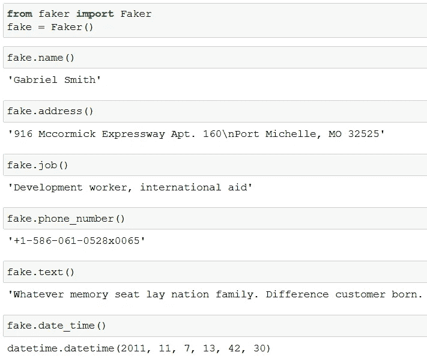
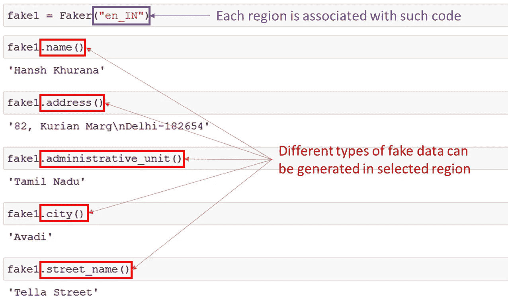
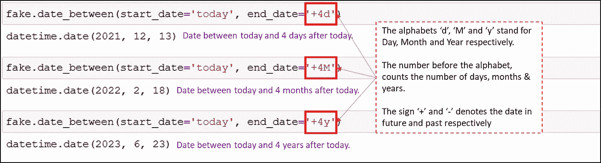

# Faker:一个惊人且非常有用的 Python 库

> 原文：<https://towardsdatascience.com/faker-an-amazing-and-insanely-useful-python-library-b313a60bdabf?source=collection_archive---------29----------------------->

## 编程；编排

## 快速为项目创建虚拟数据，与世界自由共享，等等


[格尔德·奥特曼在 Pixabay](https://pixabay.com/illustrations/street-sign-truth-lie-direction-6676760/)

**创建数据集！分析一下！并与世界分享！**

寻找数据集总是数据分析项目的第一步，除非提供了数据集。

满足我们需求的数据可能很昂贵，很难收集，或者根本就不可用。

其次，即使你收集了数据，在与他人分享数据时也会受到⚠️版权的限制。

因此，在接下来的 3 分钟里，我们将通过创建我们自己的虚拟美味数据集来解决这个问题！！💯

我们所需要的是 python 包随机，熊猫和 Faker！！

> 假装直到你成功。
> 
> ***——***[***史蒂芬·泰勒***](https://www.brainyquote.com/authors/steven-tyler-quotes)

# 骗子

Faker 是一个 Python 包，它为你生成假的或虚假的数据。

它的用法也很简单。

仅供第一次使用，安装软件包 Faker 如下所示。

```
pip install Faker
```

一旦安装成功，是时候试用了！！🚀

首先使用`faker.Faker()`创建并初始化一个生成器，它将通过访问各种属性来生成数据。



Python 包 Faker |作者图片

`fake`是上图中的生成器，它访问姓名、地址、工作、电话号码等各种属性，并生成虚拟数据。

先行一步，Faker 还支持不同的[](https://faker.readthedocs.io/en/master/locales.html)**🌎然后也可以生成区域特定的属性。一切都是假的！！**

**你需要做的就是为新的区域创建一个新的生成器。下图比文字更能说明问题。**

****

**使用 Faker |作者图片创建虚假数据**

**此外，这个包不仅限于字符串和数字数据类型，还可以生成日期时间数据！⏰**

```
**fake.date()
>>> '1998-04-02'**
```

**此外，还可以生成给定两个日期之间的日期。**

****

**使用 Python Faker | Image by Author 生成日期时间数据**

**将 Faker 包与 Python[***random***](https://www.w3schools.com/python/module_random.asp)和 Python 熊猫结合，可以创建一个完全虚拟的数据集！🎁**

**这里是如何→**

****

**如何使用 Python | Image by Author 制作假数据集**

**如果你想自己尝试，这里有代码→**

**官方文献记载这里是[](https://faker.readthedocs.io/en/master/index.html)*。***

***总结一下，***

***我希望，你们都准备好用 Faker 创建自己的数据集，并与世界分享，而不用担心版权问题！🏆***

***现在，你可以通过 [***在这里报名***](https://medium.com/@17.rsuraj/membership) 成为媒介会员，阅读我和其他作家发表的所有故事。如果你这样做，我会得到一小部分你的费用，没有额外的费用给你。欢迎加入我的[电子邮件列表](https://medium.com/subscribe/@17.rsuraj)来了解我写作的最新进展。***

**我这里有更多有用的文章→**

```
**1\. [5 Most Powerful One-Liners You Should Know in Python Programming](/5-most-powerful-one-liners-you-should-know-in-python-programming-c9d49a89b7f3?source=your_stories_page----------------------------------------)
2\. [4 Awesome Pandas Methods To Quickly Analyze Any Dataset](/4-awesome-pandas-methods-to-quickly-analyze-any-dataset-65d2252af6e8?source=your_stories_page----------------------------------------)
3\. [3 (and Half) Powerful Tricks To Effectively Read CSV Data In Python](/3-and-half-powerful-tricks-to-effectively-read-csv-data-in-python-c4699a4f9d07?source=your_stories_page----------------------------------------)
4\. [3 Time-Saving Python Tricks](/3-time-saving-python-tricks-a017f4215aeb?source=your_stories_page----------------------------------------)**
```

****感谢您的阅读和投入时间！****