# FAMD:如何将主成分分析推广到分类和数值数据

> 原文：<https://towardsdatascience.com/famd-how-to-generalize-pca-to-categorical-and-numerical-data-2ddbeb2b9210?source=collection_archive---------7----------------------->

## 让我们深入研究 FAMD 的理论和实现，这是一种非常有效(但却被误解)的技术，可以将 PCA 应用于所有类型的变量。

Mathilda Khoo 在 [Unsplash](https://unsplash.com?utm_source=medium&utm_medium=referral) 上的照片

本文介绍了混合数据的**因子分析(FAMD)** ，它将主成分分析(PCA)算法推广到包含数值和分类变量的数据集。为了让讲师准确理解这种技术，本文将深入 FAMD 背后的数学规则，并展示一些演示来证明重要的结果。如果你没有兴趣了解它为什么会起作用，可以直接上 III). 3。以了解如何在您的程序中轻松实现它。最后，你可以在[这篇文章](https://medium.com/fifty-five-data-science/how-to-delete-bias-in-your-dataset-before-applying-a-clustering-ff1dfd14d179)中看到这一理论的一个应用示例，其中 FAMD 在一个聚类用例中帮助删除数据集中的偏差。享受阅读吧！

# I]导言

主成分分析(PCA)是统计分析领域中广泛使用的技术。考虑通过 *P* 变量描述的 *N* 个数据点的初始数据集，其目标是通过寻找*K*(1≤*K*≤*P*主成分来减少表示每个数据点所需的维数。通过每次寻找**尽可能解释惯性的轴**，这些主成分被迭代计算，同时与之前的主成分正交(图 1)。最后，我们可以通过 *K* 主成分直接描述数据点。尽管它们更难解释，但它们使我们能够从原始数据集中保留尽可能多的信息，同时大大减少了变量的数量。

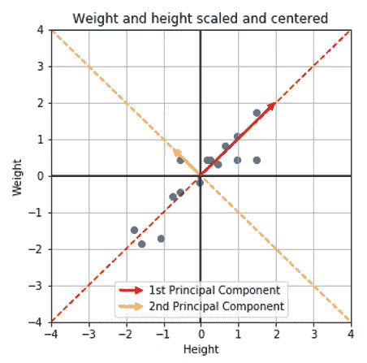

*图 1:在图上，我们表示一个人群的体重和身高(居中并缩放后)。PCA 获得的第一个分量(可以解释为“跨度”或“体积”)是在一个维度上表示这个特定数据集的最佳轴，因为当我们在这个轴上投影点时，我们丢失的信息量最少。(图片由作者提供)*

在实践中，PCA 通常用于减少存储信息所需的内存，或者有效地可视化数据，通常在平面图(二维)中。如果你对 PCA 不熟悉，并且这个快速演示感到模糊，我建议你在继续之前阅读 [*这篇文章*](https://machine-learning-tutorial-abi.readthedocs.io/en/latest/content/unsupervised/pca.html) 。

虽然这种算法对数值数据非常有效，但它不能直接考虑分类数据。在本文中，我们将介绍 FAMD，这是一种考虑到数值变量和分类变量的主成分分析的推广，同时在最终成分的产生方面给予每个变量相似的重要性。

# II]理论概念

首先也是最重要的:在本文的其余部分，我们将讨论一个在ℝ取值的数值变量(例如，年龄、工资、身高等)。)，以及当分类变量在一系列 *m* 个可能模态中取值时的分类变量，其中 *m* ≥2(例如，眼睛颜色、婚姻状况、国家、性别等。).

## 1.相关系数和相关比率

两个数值变量 *X* 和 *Y* 之间的线性相关系数(又名皮尔逊相关) *r(X，Y)* 取[-1，1]中的值。接近 1 的值(分别为。-1)意味着这两个变量是正的(分别为。负)相关，接近 0 的值意味着变量之间不是线性相关的(图 2)。

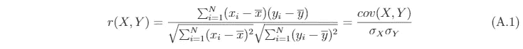

*(图片作者)*

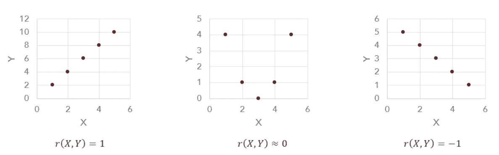

*图 2:不同变量的相关系数。(图片由作者提供)*

为了得到两个变量之间相关性的直接指示，我们使用**平方相关系数 *r (X，Y)*** 。它取[0，1]中的值，并且随着 *X* 和 *Y* 更明显地相关，它将变得越来越高。

另一方面，**分类变量 *A* 和数值变量 *Y* 之间的平方相关比𝜂 *(A，Y)*** 也取 0 到 1 之间的值。解释该度量的直观方式如下:𝜂 *(A，Y)* 越接近 1，**对 *A* 所采用的模态的了解越多，这就有力地表明了 *Y* 所采用的值。**例如，我们可以想象，在一个由身高 *H* 、性别 *S* 和发色 *C* 、𝜂 *(C，H)* 描述的大型人口数据集上，这些变量应该接近于 0(因为这些变量没有任何关联)，而𝜂 *(S，H)* 可能不可忽略(因为男性通常比女性高)。

*(图片作者)*

因此， *r (X，Y)* 和𝜂 *(A，Y)* 都表示与 *Y* 的相关性，取[0，1]中的值，并随着变量( *X* 或 *A* )与 *Y* 显著相关而变高。因此，我们可以在对数字变量或分类变量给予同等重视的同时对它们进行比较。

## 2.惯性和投影惯性

现在让我们从变量的角度来看我们的数据集。我们考虑用 *N* 维表示的 *P* 变量(或列) *(vⱼ)* (通过我们初始表的 *N* 数据点)。我们假设 *P* 变量为

*   centered (mean( *vⱼ* )=0):必要的，因为我们正在处理线性相关性
*   scaled (std( *vⱼ* )=1):技术上不是强制性的，但是我们希望以类似的方式缩放所有变量，在计算惯性时给它们相同的初始权重。

☀ *并且稍微提醒一下:对于标量积* ⟨.,.⟩ *，我们将关联的范数和距离定义如下:*

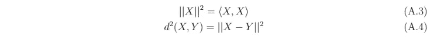

*(图片作者)*

我们将变量 *(vⱼ)* 的惯性定义为:

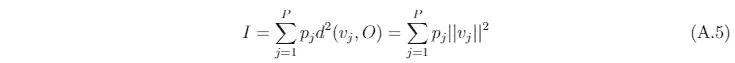

*(图片作者)*

其中 *pⱼ* 是变量的相对权重。在大多数情况下，我们可以对所有变量取 *pⱼ* = 1，给它们相同的惯性影响。我们还可以定义 *(vⱼ)* 在由矢量 *w* 支撑的轴上的投影惯性:

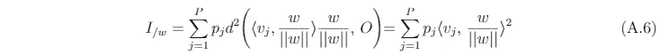

*(图片作者)*

## 3.主成分分析算法的机理

PCA 算法的工作步骤如下:

1.  我们选择了多个组件*K*(1≤*K*≤*P*)
2.  对于从 1 到 K 的 *k* :

*   我们将主成分 *Cₖ* 定义为以ℝⁿ为中心并且与前面的主成分 **正交的**单位向量，其最大化变量*【vⱼ】***(其中 *pⱼ* = 1 用于所有变量)。一个快速的演示(在论文 ***(A)*** 的末尾给出)表明，这个定义相当于说，在每一步， *Cₖ* 最大化与数据集变量的平方相关:**

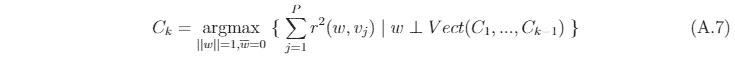

*(图片作者)*

# FAMD:理论与应用

## 1.FAMD 背后的想法

在本文的开始，你们中的一些人可能会想“为什么不在应用 PCA 算法之前简单地对分类变量进行一次性编码呢？”

☀ *一键编码将数据集中的分类数据转换为数字数据，为每个分类变量的每个模态提供一列，如果变量采用模态，则为 1，否则为 0(图 3):*

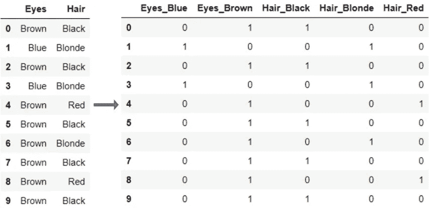

*图 3:两个分类变量的一键编码。(图片由作者提供)*

正如我们所看到的，PCA 最大化了所有柱在给定部件上的投影惯性(公平分布)。如果我们直接在包含一个热编码模态的表格上应用 PCA，给予分类变量的惯性将固有地取决于变量可用的模态的数量，以及这些模态的概率。因此，**不可能给所有初始变量一个类似的权重超过计算出的分量。**

> 相反，当搜索 K 个主成分时，FAMD 算法希望给予所有变量**完全相同的权重，无论是数字变量还是分类变量**。为此，当 vⱼ是数值时，它将迭代地寻找使 r (vⱼ,Cₖ)最大化的分量 Cₖ，当 vⱼ是分类的时，它将迭代地寻找𝜂。

事实上，正如我们之前看到的，这两个量是可比较的，并且以相同的方式翻译相似的信息。利用由 *P* 描述的初始数据集，数值变量 *(vⱼ)(1≤j≤P)* 和 *Q* 分类变量 *(vⱼ)(P+1≤j≤P+Q)* 、*、Cₖ* 将被定义如下:

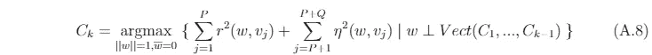

*(图片作者)*

只剩下一个问题:我们如何获得这些部件？

## 2.定理

我们来考虑一个 *P* 数值变量 *(vⱼ) (1≤j≤P)* 的表格；和 *Q* 分类变量 *(vⱼ) (P+1≤j≤P+Q)* ，它们各自呈现 *Mⱼ* 模态。有了 *M* =∑ *Mⱼ* ，我们称之为 *T* 大小为*n**(*p*+*m*的表格，包含 *P* 数值变量，紧挨着 *M* 单热编码模态。我们对 *T* 应用以下步骤:

对于 *P* 数值栏:

*   将它们缩放至 1
*   将它们居中

对于 *M* 分类模态:

*   **我们用模态**的概率 *μₘ* 来划分每一列(一列中的数除以 *N* )
*   将它们居中

最后，为了计算投影惯性，我们给数字列加权***【pₙᵤₘ】*= 1**，给分类变量的模态***【pcₐₜ*=*【μₘ***(模态的概率)。

这些在 *T* 上的编码和权重的选择产生了 FAMD 的基本方程:对于在ℝⁿ:的 *w* 中心向量

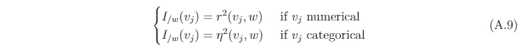

*(图片作者)*

虽然第一条线是直接获得的(与 PCA 中的推理相同)，但第二条线不是。对于比较好奇的讲师，全文演示 ***(B)*** 在本文最后呈现。

用这种方法，我们能够把一个数值(相应地。分类)变量在轴上与其平方相关系数(分别为。平方相关比)与轴的支持向量！因此，每个变量——无论是分类变量还是数字变量——都会带来一个在 0 和 1 之间变化的投影惯性，这取决于它与向量的相关性。

## 3.在实践中

FAMD 算法由两部分组成:

*   以适当的方式编码数据
*   迭代地寻找 K 个主成分

主成分的研究以与 PCA 完全相同的方式进行。因此，我们所要做的就是应用一个经典的 PCA 算法(scikit-learn 等。)在编码数据上。不幸的是，PCA 的大多数程序不允许增加对每根柱子的惯性的考虑。为了克服这个困难，我们使用下面的结果:*用 sqrt(μₘ(而不是μₘ)来划分模态的独热编码列将具有与应用适当加权相同的效果。*这一论断的证明也可以在本文末尾***【C】***找到。

总的来说，FAMD 算法是这样的:

> a)标准标度数值变量(=获得 z 值)
> 
> b)对于分类变量:
> 
> -获取一次性编码列
> 
> -将每列除以其概率的平方根**【sqrt(μₘ*)***
> 
> -将列居中
> 
> c)对获得的表格应用 PCA 算法！

备注:

1.  PCA 算法通常自动使列居中，因此这部分在步骤 a)或 b)中是可选的
2.  将模态除以其概率的平方根可以这样解释:*我们给稀有模态更多的惯性，因为当模态非常稀有时，“取此模态”的信息更丰富。*
3.  通过构造，分类变量 *vⱼ* 和 *Mⱼ* 模态可以生成最大的 *Mⱼ -1* 维度(因为所有列的总和总是给出一个 1 的向量)。因此，根据前面的符号，主成分的最大数量 *K* 是 *P+M-Q.*

# 四]结论

你有它！一种实现 FAMD 的简单方法，它将 PCA 推广到任何类型的数据集，同时对其所有变量给予相同的重视。

而且，因为我们对预编码数据应用了 PCA 算法，所以您可以使用 PCA 的所有分析工具(组件的惯性比、相关圆等)。)就像使用 PCA 一样。

我希望这有所帮助！如果您有任何问题，请告诉我:)

# V]示威

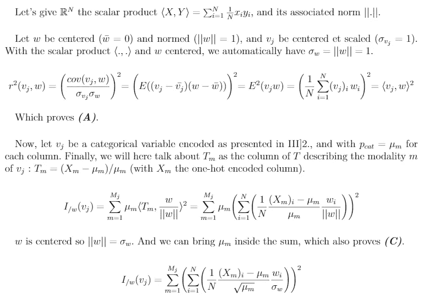

*(图片作者)*

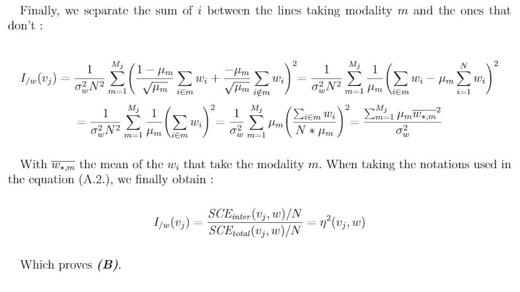

*(图片作者)*

# VI]参考资料

[1] G .萨波塔，(1990)，意大利统计学会。意大利帕多瓦科学联盟。第 62-72 页。Ffhal-02513970f。

[2] J. Pagès，[分析混合配料的因素](http://www.numdam.org/article/RSA_2004__52_4_93_0.pdf) (2004 年)，《应用统计杂志》，第 52 卷，第 4 期(2004 年)，第 93-111 页

[3] F .休松和 j .帕格斯，[分析对应的倍数](https://lms.fun-mooc.fr/c4x/agrocampusouest/40001S03/asset/AnaDo_ACM_cours_slides.pdf)，应用数学实验室，西部农业大学。