# 在野外寻找家庭

> 原文：<https://towardsdatascience.com/families-in-the-wild-track-iii-b5651999385e?source=collection_archive---------41----------------------->

## [思想与理论](https://towardsdatascience.com/tagged/thoughts-and-theory)，计算机视觉教程

## 大规模搜寻和找回失踪的家庭成员

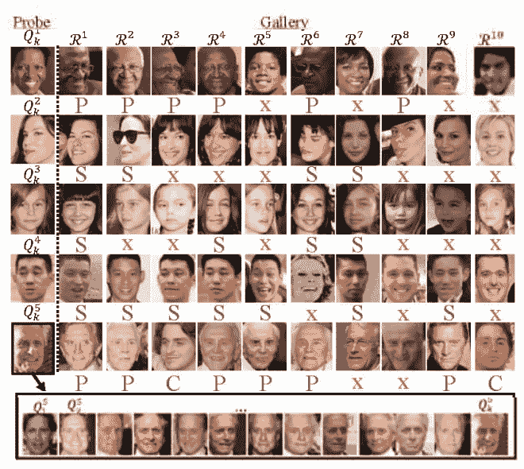

**T-3 样本结果(排名 10)。**对于每个查询(行),探针的一个或多个面返回图库的相应样本作为前 10 名。这里，x(红色)表示错误的预测，而正确的预测显示关系类型(绿色):P 表示父关系；c 为儿童；代表兄弟姐妹。作者创造了这个形象[3]。

# 目录

[目录](#359e)
[简介](#bf0a)
[背景信息](#7207)
∘ [问题陈述](#33d0)
∘ [数据](#8c99)
∘ [源代码](#726d)
[结果及分析](#8b1d)
∘ [定量结果](#2864)
∘ [2020 年结果(最后一次 RFIW)](#05fb)
∘ [排名靠前的家族:](#d932)
∘ [排名靠后的家族:](#8030)
[其他用于识别 FIW 的用例](#e470)
[总结](#0bc9)
[相关博客](#e66a)
∘ [2021 RFIW 数据挑战赛](#3356)
∘ [野外数据集中的家族](#c56e)
[引用](#6d05)

# 介绍

贩卖人口是我们在国际范围内面临的一个不幸的问题。每一个父母最可怕的噩梦往往是这种受利益驱使的残暴绑架行为所造成的影响。甚至讨论这个话题都令人作呕；然而，像大多数问题一样，坐视不理只会让事情变得更糟。因此，国土安全部(DHS)采取激励措施来解决这个问题，比如他们的[蓝色运动](https://www.dhs.gov/blue-campaign)。关于人口贩卖的更多含义，请查阅 DHS 的文章[什么是人口贩卖？](https://www.dhs.gov/blue-campaign/what-human-trafficking)

*那么，这与识别家庭有什么关系呢？如你所想，当局经常在网上发现被剥削的儿童，但却无法识别视频中的儿童。一种方法是通过排除法，由调查员人工筛选失踪儿童。考虑到仅在美国在任何给定时间都有近 50 万失踪儿童([globalmissingkids . org/awareness/missing-children-statistics/](https://globalmissingkids.org/awareness/missing-children-statistics/))，人工检查的解决方案是不切实际的。*按片段中孩子的某些属性查询怎么样？*第一个问题是相关信息被剪辑和列表中的所有孩子过滤的基本假设。第二，我们现在正在使这个过程依赖于一个严重的偏见过程，这个过程不可能让所有的记录保管者和调查者在同一页上(即，除非手册被制作、分发和阅读，那么我们永远不可能为所有的儿童组织这样一个一致的数据库)。最终，我们需要一个更好的解决方案。*

为了找到这样的解决方案，让我们首先问自己传统人脸识别方法的问题，这种方法通常可以帮助我们识别视频中的人:缺乏记录数据进行匹配。换句话说，为了简单起见，让我以自己为例:我失踪了，一个亲人向当局求助，我的名字被加入了数据库；此后，我的脸出现在一个可疑的视频剪辑中，一名调查员使用人脸识别来确定我的身份。嗯，那里有我的照片:RMV，东北大学，我现在的工作，以及(大的)各种社交媒体平台。尽管如此，儿童，尤其是在幼年时拍摄的儿童，不太可能有这样的记录(即，来自各种来源的丰富图像)。因此，归结起来，问题不在于人脸识别技术(也就是说，我们有人脸识别技术)，而在于缺乏数据来查询令人不安的被拐卖儿童视频。因此，我建议，虽然数据缺少一个孩子，我们可以很可能确定一个家庭成员。这将大大减少搜索空间到一个单一的家谱，因此，这是一个客观的，资源有限的解决一个世纪之久的问题。

# 背景资料

[Families In the Wild](https://web.northeastern.edu/smilelab/fiw/) (FIW)是一个大规模标记图像集，用于支持视觉亲属识别问题[1，5，9]。通过它，识别 FIW (RFIW)是一项每年举行的数据挑战[3，7]，当前(第五版)现已推出(参见[相关博客](#related-blogs)中的第一项)。上述跨越数年的工作，构成了我论文的一部分。感兴趣的读者应该看到博客末尾提供的链接和参考资料。

## 问题陈述

给定一个*探针，*搜索人脸的*图库*以确定成对得分，然后作为排序列表返回。换句话说，输入是感兴趣的主体的面部(即，*探头*)。输出是一个排序列表，通过配对的可能性(即*探针*与*图库*中的受试者，在信息论(IT)中称为血亲)来指示*图库*的索引。具体来说，*探测器*是由一个或多个人脸表示的感兴趣的单个对象，而图库是人脸数据库，每个人脸都有已知的身份和家庭关系。现在，如果我们能在*图库*中找到*探针*的亲属，那么我们实际上就能确定被查询对象的身份。这种范式遵循了*搜索和检索*任务的经典观点。那些可能不太熟悉机器学习(ML)和 IT 相关术语的人:将问题空间想象成一种推荐系统:对于给定的*探针*(例如，用户)，获得*图库*中的顶级项目(例如，推荐的电影或产品，分别是网飞或亚马逊)。

## 数据

我们有一个*探针*列表和一个*图库中的面孔列表。*

*探针*列表如下:

```
$ head -n 5 track-III/test/probe_list.csv  
,ref,fid,feat_path
0,F0754/MID3,F0754,F0754/MID3/avg_encoding.npy
1,F0753/MID2,F0753,F0753/MID2/avg_encoding.npy
2,F0557/MID3,F0557,F0557/MID3/avg_encoding.npy
3,F0762/MID1,F0762,F0762/MID1/avg_encoding.npy
```

*图库*人脸列表然后，

```
head -n 5 track-III/test/gallery_list.csv
,fid,mid,labels,ref
0,F0775,F0775/MID3,1,F0775/MID3/P08183_face2.jpg
1,F0146,F0146/MID8,1,F0146/MID8/P01574_face0.jpg
2,F0593,F0593/MID2,1,F0593/MID2/P11000_face0.jpg
3,F0699,F0699/MID8,1,F0699/MID8/P07292_face0.jpg
```

两者的区别:*探针*带有一个或多个面，其中每个图库元素都是一个面。因此，每个探头表面的所有特征通过在特征尺寸上平均然后 L2 归一化来融合。

该函数用于归一化特征(即早期融合)。

也可以进行后期融合(即，为*探针*获得所有面的分数，然后取每个*图库*面的平均分数)。

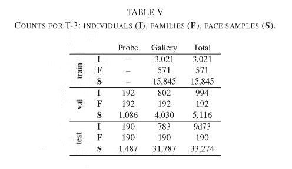

具体计数，如 2020 RFIW 白皮书[3]中所列:

## 源代码

我的 GitHub 上有所有代码:

[](https://github.com/visionjo/pykinship) [## GitHub-vision jo/py graphy:用于可视化亲属关系识别的软件组件和演示。一个重点是…

### 视觉亲属识别的软件组件和演示。重点是 FIW 数据集-数据加载器…

github.com](https://github.com/visionjo/pykinship) 

我们所指的脚本是:

[](https://github.com/visionjo/pykinship/blob/master/rfiw-tools/track-III-demo.py) [## py 亲属关系/track-III-demo . py at master vision jo/py 亲属关系

### 视觉亲属识别的软件组件和演示。重点是 FIW 数据集-数据加载器…

github.com](https://github.com/visionjo/pykinship/blob/master/rfiw-tools/track-III-demo.py) 

# 结果和分析

首先，报告定量结果，然后进行更定性的分析。

## 定量结果

对于*搜索&检索*的问题，这里使用了几个度量标准。我们将把它们作为 RFIW 数据挑战系列的一部分[3]。

先说职级和 CMC。等级是返回真正值(即，真相对值)的绝对位置。例如，rank@1 表示在相应排序列表的第一个位置具有相对的*探测器*的平均数量。同样，排名@10 是*探测器*在*画廊*的前十名中找到至少一个亲戚的平均数量。我们的基线表现如下:

*   排名@1: 0.326(或 32.6%)
*   排名@5: 0.500
*   排名@10: 0.537
*   排名@20: 0.589
*   排名@50: 0.716

现在，让我们看看累积匹配曲线(CMC)。顾名思义，曲线代表所有等级的匹配分数(如上所列)!出于视觉目的，我们以对数标度绘图。

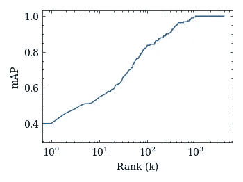

track-III 结果的 CMC 曲线。作者使用[科学绘图](https://github.com/garrettj403/SciencePlots)生成的绘图。

最后，平均精度(mAP)是用于比较的基本指标。从数学上来说，每个 *N* *探针*的分数计算如下:

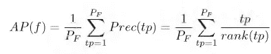

其中平均精度(AP)是 f 族的函数，总 PF 真阳性率(TPR)。

然后，我们对所有 AP 分数进行平均，以确定总体 mAP 分数，如下所示:

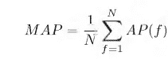

**我们的新基线获得了一个 mAP = 0.105。**

## 2020 年结果(上一次 RFIW)

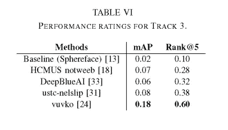

来源:https://ieeexplore.ieee.org/stamp/stamp.jsp?tp=

## 排名靠前的家族:

现在，根据 AP 分数对*探针*进行分类，我们显示了排名前两位的家族(顶部是*探针*，底部是*图库*中的真正亲戚。


探针。

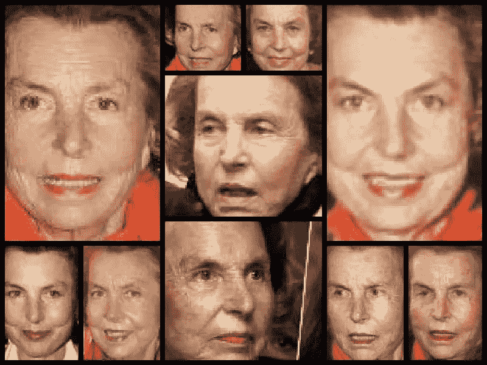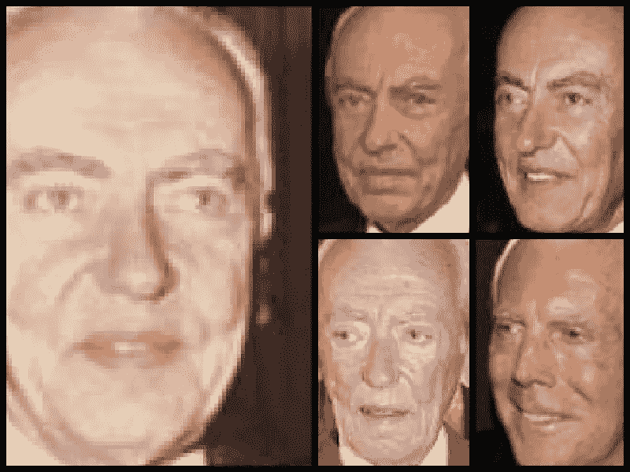

两个家庭成员的脸出现在得分最高的家庭的画廊里。

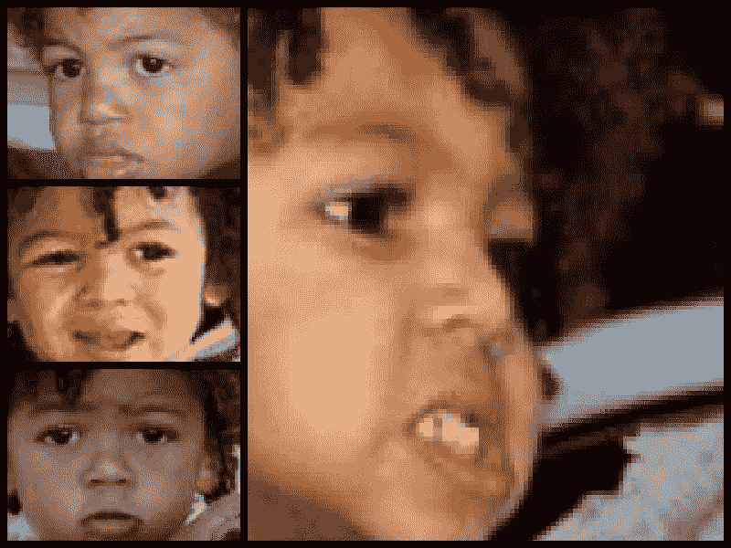

探针。

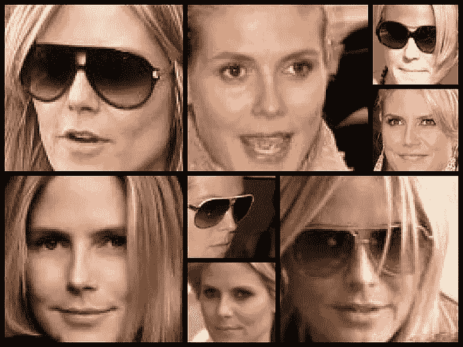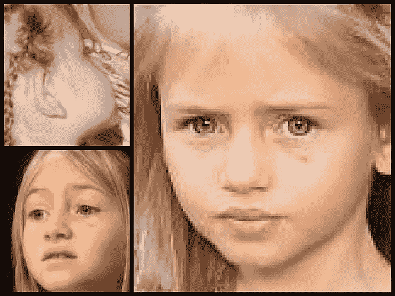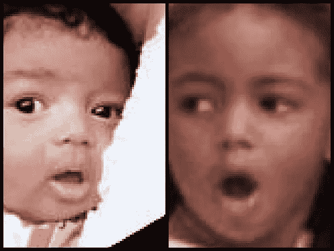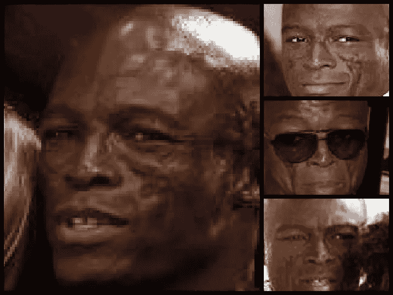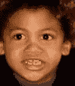

画廊中第二至最高得分家庭的五位家庭成员的面孔。

## 排名最低的家族:

同样，根据排序后的 AP 得分，我们检查得分最低的家族。

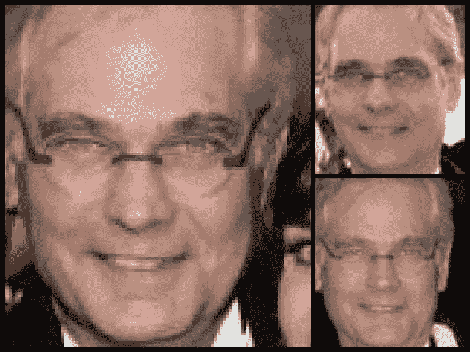

探针。

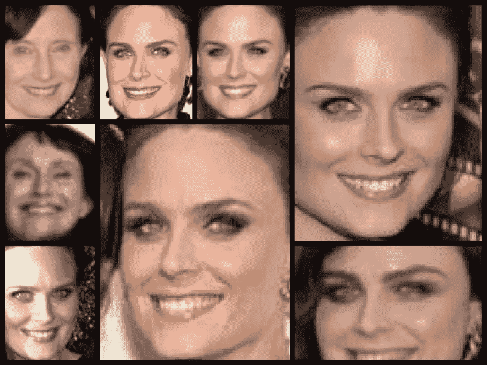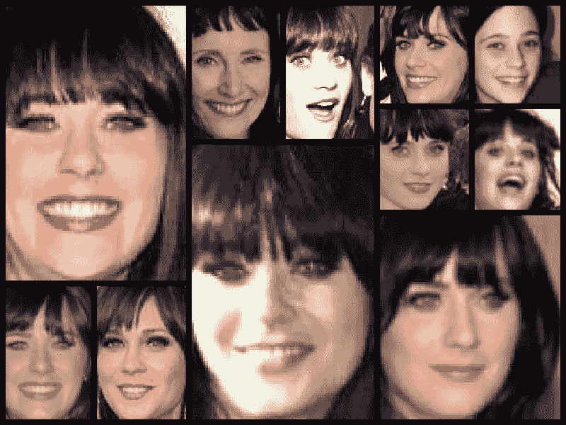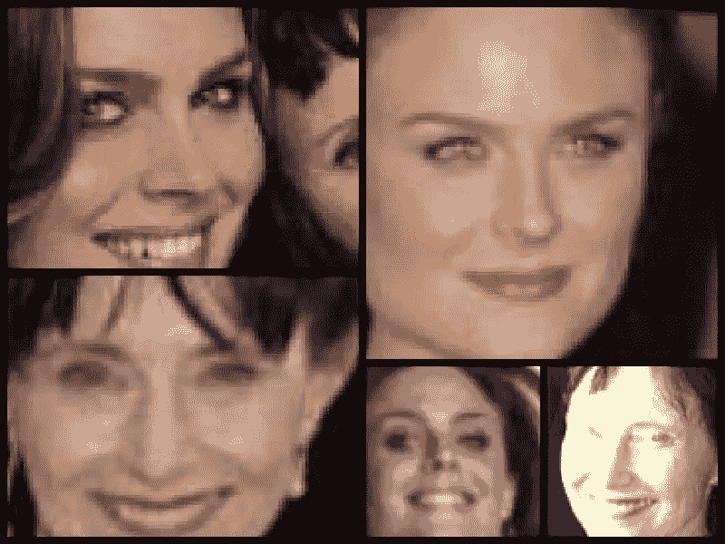

两个家庭成员的脸出现在最低分家庭的画廊里。

# 识别 FIW 的其他用例

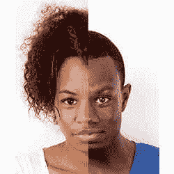

面部识别越来越擅长在图像中找出相似之处，从而将人们识别为家庭成员。信用:[psychologicalscience.org](http://psychologicalscience.org)。

正如研究界的许多人所认识到的那样，视觉亲属识别有大量的用例:从推动本博客的应用程序，到使用不同难民营的低成本相机重新连接家庭，边境控制(即，识别司机和孩子是否是亲属的原始点非常频繁)，基于祖先的研究，ancestry.com 等服务，基于社交媒体的应用程序，甚至是制作数字家庭相册的商业软件。除了基于辨别的任务，一些生成模型可以直接应用，如 DNA-Net [4]中的识别，它转换(父母的)一对脸来预测他们孩子的脸。Robinson *等人*在最近一项关于视觉亲属识别的调查中涵盖了这一点，甚至更多。另外， *ACM 新闻*的桑德琳·瑟斯特蒙特在 2020 年末([)报道了这个话题 FB clid = iwar 0 AK 4 u 3 azkd-zxh 3 ou qfvlrknd 8 neuz 2 vlj 9 kaj 32 LBO 3 endhspeov 6948](https://cacm.acm.org/news/241684-recognizing-kin/fulltext?fbclid=IwAR0aK4u3Azkd-Zxh3oUQFvLrkND8Neuz2vLJ9KaJ32Lbo3eNdHSpEov6948)。

# 概括起来

我们讨论了当代社会面临的人口贩运问题，重点是失踪儿童。我们想到了一个场景，当一名调查人员偶然发现一名在网上被剥削的儿童时:看到了孩子的脸，但缺乏使用常规面部识别来推断其身份所需的数据。可访问的面部数据可能包含未知儿童的血亲。因此，使我们能够找到亲属的解决方案可以大大减少搜索空间，从而为确定有需要的儿童铺平道路。

问题陈述是一个逐年流行的研究问题。具体来说，我们会问，我们如何利用面部图像来识别亲属关系？这个问题是我论文的一大部分，为了支持这个问题，我们建立了最大的用于亲属关系识别的标记图像集。也就是说，数据是野生动物的家庭，这是年度数据挑战识别 FIW (RFIW)的中心。

去年，作为第四届 RFIW 的一部分，新的任务 *Search & Retrieval* 作为一项附加任务被引入:它是一个开放形式的问题，本质上，它是所有 FIW 基准中最困难的。使用最先进的人脸编码器，对*探针*进行早期特征融合(即将所有特征平均为一)，并使用余弦相似度将*探针*特征与*图库*主题的特征进行比较。

给定一个大小为 *D* 的*图库*，带有 *M 个探针*，得到的矩阵(即提交给竞赛的矩阵)大小为 *M* x *D* ，其中 *M* 行代表每个*探针*，而 *D* 列是相应*图库*主题的索引。上述基线导致 mAP 得分为 0.105，这意味着我们能够确定一些探针的亲缘关系，然而，还有很大的改进空间！

查看排名最高的探针(即我们最有信心的*探针*):排名第一和倒数第二的*探针*都是儿童(相对于家庭数据)，并且都是女性，但父母出现在数据中(即排名第一的只有父母，倒数第二的有父母(不同种族)和兄弟姐妹在*图库*)。前两名之间的另一个差异是代表*探测器*的面部图像的相对年龄(即，第一名是中年人，第二名是青少年时期)。

然后，分析评分最差的*探针*(即，具有排序列表中最靠下的家庭成员的探针)，在家庭数据中属于类型*祖父*和*父亲*。此外，*探针*的实例是一名老年受试者。这与之前的研究一致，这些研究表明祖父母(即年龄)是使用人脸自动识别亲属关系的挑战之一。

接下来，列出了几个相关的博客，以及相关的视频教程。最后，我们列出了全文中使用的参考文献。

# 相关博客

## 2021 RFIW 数据挑战

了解与 2021 年 IEEE FG 会议同时举行的当前 RFIW 的更多信息。

[](https://medium.com/to-recognize-families-in-the-wild-a-machine-vision/rfiw2021-7ceb357a39a6) [## 认识野生家庭(RFIW)

### 数据挑战系列(第 5 版)

medium.com](https://medium.com/to-recognize-families-in-the-wild-a-machine-vision/rfiw2021-7ceb357a39a6) 

## 野生数据集中的家族

[参考文献](#references)部分包含几篇关于 FIW 的论文。

这里是以前的媒体博客，涵盖了概述、路线 I 和路线 II(即，此博客在路线 III 上)。

[](/demo-for-rfiw-2020-task-1-kinship-verification-8a8ed7081bcc) [## 视觉亲属关系验证:Python 熊猫教程

### 2020 年 IEEE AMFG 国际会议数据挑战研讨会

towardsdatascience.com](/demo-for-rfiw-2020-task-1-kinship-verification-8a8ed7081bcc)  [## 识别野外的家庭:机器视觉教程

### 第 1 部分—概述

medium.com](https://medium.com/that-publication/fiw-part1-d41ec8b355cb) [](https://medium.com/that-publication/the-4th-recognizing-families-in-the-wild-rfiw-bec59285fb4) [## 认识野外的家庭

### 2020 年 IEEE FG 数据挑战研讨会

medium.com](https://medium.com/that-publication/the-4th-recognizing-families-in-the-wild-rfiw-bec59285fb4) 

我录制的论文，其中包括一个关于 FIW 基准和数据集的部分。

最后，是我在之前的 CVPR 和 FG 会议上给出的指导。

# 参考

1.  约瑟夫·罗宾逊、扎伊德·汗、余音、邵明和傅云。[野生多媒体中的家庭(FIW-MM):用于识别亲属关系的多模态数据库](https://arxiv.org/pdf/2007.14509.pdf)。*2021 年 IEEE 多媒体汇刊*。( [PDF](https://arxiv.org/pdf/2007.14509.pdf) )
2.  约瑟夫·罗宾逊、邵明和傅云。视觉亲属识别:酝酿中的十年。 *IEEE 模式分析与机器智能汇刊*，2021。( [PDF](https://arxiv.org/pdf/2006.16033.pdf) )
3.  约瑟夫·鲁滨逊、、扎伊德·汗、、夏、迈克尔·斯托帕、萨姆森·蒂莫纳、马修·特克、拉马·切拉普和傅云。[野外识别家庭(RFIW):第 4 版。](https://www.computer.org/csdl/proceedings-article/fg/2020/307900a877/1kecJ3M0dZC) IEEE 自动人脸&手势识别国际会议( [PDF](https://arxiv.org/pdf/2002.06303.pdf) )
4.  高、、夏、罗宾逊、、、、、、、傅云。 [DNA-Net:具有年龄和性别意识的亲属人脸合成器。](https://arxiv.org/abs/1911.07014) 2021 年 IEEE 多媒体与博览会国际会议(ICME)。( [PDF](https://arxiv.org/pdf/1911.07014.pdf) )
5.  约瑟夫·罗宾逊，邵明，吴越，刘洪福，蒂莫西·吉利斯，傅云。[野外家庭的视觉亲属识别](https://web.northeastern.edu/smilelab/fiw/papers/tpami-final.pdf)。IEEE 模式分析与机器智能汇刊(TPAMI)，2018。( [PDF](https://web.northeastern.edu/smilelab/fiw/papers/tpami-final.pdf) | [附录](https://web.northeastern.edu/smilelab/fiw/papers/pami-appendix.pdf) | [补充 PP](https://web.northeastern.edu/smilelab/fiw/papers/Supplemental_PP.pdf) | [视频演示](https://web.northeastern.edu/smilelab/fiw/papers/Labeling_Demo.mov) | [网页](https://web.northeastern.edu/smilelab/fiw/index.html))
6.  、丁、、、傅云
    [通过潜在自适应子空间进行亲属分类](https://web.northeastern.edu/smilelab/fiw/papers/fiw_fg2018.pdf)
    IEEE 自动人脸和手势识别，2018 ( [PDF](https://web.northeastern.edu/smilelab/fiw/papers/fiw_fg2018.pdf) )
7.  约瑟夫·罗宾逊，，赵，，蒂莫西·吉利斯，傅云。[识别野外家庭(RFIW):与 ACM MM 2017](https://web.northeastern.edu/smilelab/fiw/papers/RFIW17.pdf) 联合举办的数据挑战研讨会。野外识别家庭研讨会论文集，2017 ( [PDF](https://web.northeastern.edu/smilelab/fiw/papers/RFIW17) | [竞赛页面](https://web.northeastern.edu/smilelab/RFIW2017/))
8.  王淑洋，约瑟夫·罗宾逊，傅云。[利用边缘化去噪度量学习对野外家庭进行亲属关系验证](https://web.northeastern.edu/smilelab/fiw/papers/FG2017_version_final.pdf)。2017 年第 12 届 IEEE 自动人脸和手势识别大会。( [PDF](https://web.northeastern.edu/smilelab/fiw/papers/FG2017_version_final.pdf) | [海报](https://web.northeastern.edu/smilelab/fiw/papers/FG2017poster_DAE.pdf))
9.  约瑟夫·罗宾逊，邵明，吴越，傅云。[野外家庭(FIW):大规模亲属图像数据库和基准](http://localhost:63342/fiw_webpage/fiwDB/papers/acm-mm-short-final.pdf)。2016 年美国计算机学会多媒体会议。( [PDF](https://web.northeastern.edu/smilelab/fiw/papers/acm-mm-short-final.pdf) | [海报](http://localhost:63342/fiw_webpage/fiwDB/papers/ACM_MM_poster_reduced.pdf) | [数据集](https://web.northeastern.edu/smilelab/fiw/download.html))
10.  罗宾逊，J. P. (2020)。*自动人脸理解:识别照片中的家庭*(东北大学博士论文)。( [YouTube](https://www.youtube.com/watch?v=L2X7JmDrbbk&t=5s) )

# 接触

我希望这篇文章对你有用。

要进行连接，请执行以下操作:

1.  跟我上 [**中**](https://jvision.medium.com/)
2.  在 [**LinkedIn**](https://www.linkedin.com/in/jrobby/) 上连接并联系我
3.  查看关于[学者](https://scholar.google.com/citations?user=o-XLJIgAAAAJ&hl=en)的出版物

干杯！

约瑟夫·罗宾逊博士

人工智能工程师，[替代外科](https://www.vicarioussurgical.com/)