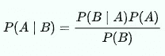

# 著名的意大利纸牌模拟和统计使用 Python

> 原文：<https://towardsdatascience.com/famous-italian-solitaire-simulation-and-statistics-using-python-b10d60b34fc6?source=collection_archive---------17----------------------->

阿曼达·琼斯在 [Unsplash](https://unsplash.com/s/photos/cards?utm_source=unsplash&utm_medium=referral&utm_content=creditCopyText) 上的照片

## 用几行(Python)代码实现一个纸牌模拟器并从中提取获胜概率

> **注**:你可以在这里 (GitHub 资源库)找到这部微小作品[的完整脚本。你也可以找到我最近在做的其他项目。❤](https://github.com/PieroPaialungaAI/SolitaireSimulator)

**首先**你需要知道的事情:

> 意大利男人喜欢打牌

因为我是意大利人，所以我也不例外。你需要知道的**第二**件事更苦。这种社会距离迫使人们保持安全，在某些情况下…孤独。当没人在你身边时，一个消磨时间的好方法是玩单人纸牌游戏。单人纸牌游戏是那种除了你自己之外不需要任何其他玩家的纸牌游戏。关于单人游戏有趣的事情是，有时赢得游戏是难以置信的困难。

**一个著名的单人纸牌游戏叫做“Uno，Due e Tre”。**

这个游戏极其简单。你开始数“Uno(一)”、“Due(二)”和“Tre(三)”，当你这样做的时候，你选择一张卡片。如果这张卡是:

*   当你说“一”的时候，一张**(那是“一”的对应卡片)**
*   **当你说“二”的时候**
*   ****三**一面说“三”**

**你输了这场比赛。**

**现在我们来设置环境。一副意大利牌由 40 张卡片组成。更确切地说，你有 10 个数字和 4 种颜色。这意味着你有 4 张 Asso，4 张 2 和 4 张 3:12 张危险的牌和 28 张无害的牌。**

> **但是要小心，这张牌中的一张足以让你输掉你的游戏，如果它是在你宣布与牌中相同的数字时被拿走的话。**

> **真希望我把游戏解释的通俗易懂，但如果不是这样，你可以看看这个[视频](https://www.youtube.com/watch?v=Sby6yv05H9Y)，会更清楚。**

**如你所见，这个游戏完全是随机的。但是赢得比赛真的很难吗？在这张牌的最后一张牌揭晓之前，你有多少机会真正“活下来”？**

> **让我们找出答案。**

# **1.游戏模拟器**

**让我们调用(**导入**)一些恶魔(**库**)。**

**这个游戏可以用下面几行代码来模拟，我已经用这些代码模拟了 10 万个游戏**

# **2.获胜的机会(概率)**

**这个“计数器”变量实际上是在计算你松动的次数。这个数字很高吗？**嗯，是的，真他妈的高:****

****你有 99.15%的概率输掉比赛。****

**嗯，我知道，这不是有前途的，这就是为什么这个游戏可以让你玩几个小时，没有好结果。**

**那我们下一步做什么？我们是数据科学家，所以我们不会放弃。**

**比如让游戏简单一点。让我们承认，犯一两个错误，你仍然可以赢得比赛。它会一直变得容易吗？**

****这就是你承认一个错误的后果:****

**这就是你承认两个错误的后果。**

**如你所见，即使你承认错误，全球情况也不乐观:**

# **3.比赛的统计数据**

**让我们暂时忘记输赢的事情。在一场比赛中，关键事件会发生多少次？我们能从中获得统计信息吗？**

**我们当然可以。**

**正如你所看到的，你通常会在一场比赛中出现 4 次错误，而零错误事件位于铃的左尾。**

**说到…我们能谈谈“钟形”分布吗？**

**好吧，如果我们进行正态测试，结果绝对不乐观:分布不是高斯分布。**

****事实上，获得一张与您之前呼叫的相同的卡可以被建模为“极端事件”。这可能是为什么** [**中心极限定理**](https://en.wikipedia.org/wiki/Central_limit_theorem) **在这种情况下可能没有用的一个原因。**我们可以使用威布尔分布、弗雷歇分布或冈贝尔分布，并参考费希尔·蒂皮特·格内登科定理来获得更多关于该分布的信息。无论如何，一旦它被声明为极端事件，就没有必要确定需要使用哪种分布。**

# **4.这都是为了生存**

****假设你选了 10 张牌，没有什么重要的事情阻止你继续游戏。赢得比赛的概率有多大？****

**一个众所周知的定理可以帮助我们，它叫做[贝叶斯定理](https://en.wikipedia.org/wiki/Bayes%27_theorem)。**

****

**定理的陈述**

**如果我们认为 A 是“赢得游戏”事件，B 是“赢得游戏的前 n 张牌”事件，则我们得到:**

> ****知道我们“幸存”了前 n 张牌，赢得游戏的概率等于知道我们赢了游戏的前 n 张牌“幸存”的概率乘以赢得游戏的概率，再除以“幸存”前 n 张牌的概率****

****但是“在知道游戏已经赢了的情况下赢得前 n 张牌的概率”是 1。所以基本上是 P(A)/P(B)。这使得事情真的更容易计算。****

**让我们计算一下赢得游戏的概率，知道我们幸存了 10 张牌。**

****现在，如果我们对 10，20，30，…，39 张牌使用相同的技巧，我们有这个概率:****

****而且存活 39 张牌后赢得游戏的概率并没有你想象的那么高(85.6%)****

# **5.终场哨声**

**这种纸牌游戏的性质允许很容易地实现一个有效且快速的代码，并给我机会在几分钟内得到一个统计数据。**

**令人兴奋的是，有时候很难意识到一个游戏有多难完成。我敢打赌，你们中没有人会说，你有 0.0085 的概率赢得这样一场比赛。**

**因此，如果你真的想知道你成功的机会，拥有一个统计心态是非常重要的，尤其是当游戏如此随机的时候。**

**如果你喜欢这篇文章，你想知道更多关于机器学习的知识，或者你只是想问我一些你可以问的问题:**

**A.在 [**Linkedin**](https://www.linkedin.com/in/pieropaialunga/) 上关注我，我在那里发布我所有的故事
B .订阅我的 [**简讯**](https://piero-paialunga.medium.com/subscribe) 。这会让你了解新的故事，并给你机会发短信给我，让我收到你所有的更正或疑问。
C .成为 [**推荐会员**](https://piero-paialunga.medium.com/membership) ，这样你就不会有任何“本月最大数量的故事”，你可以阅读我(以及成千上万其他机器学习和数据科学顶级作家)写的任何关于现有最新技术的文章。**

**再见:)**