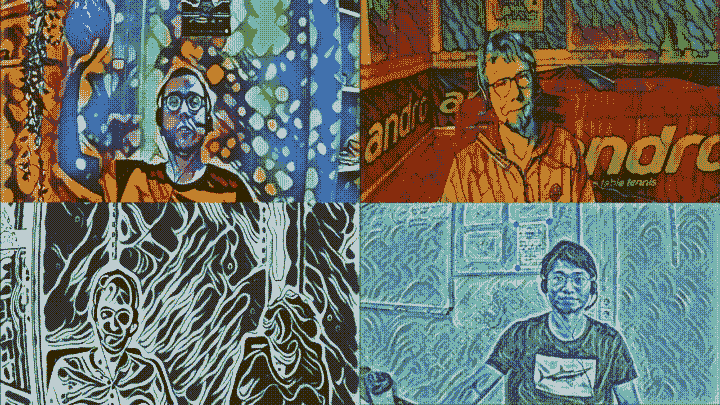
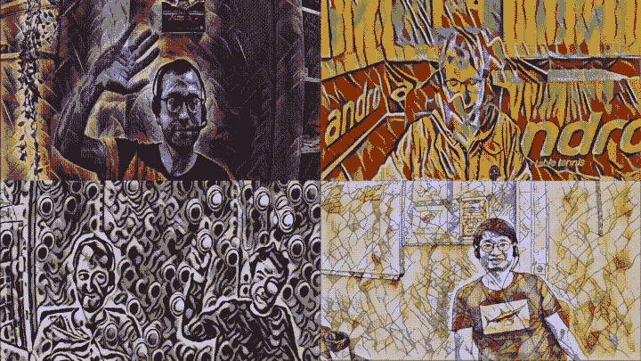
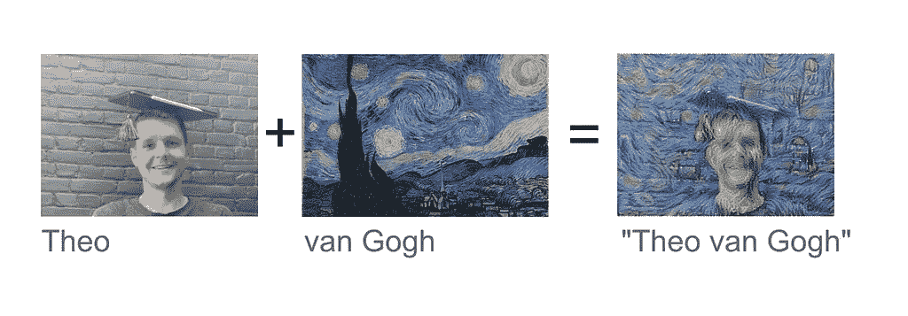

# 用于视频会议的花式和定制神经风格传输滤波器

> 原文：<https://towardsdatascience.com/fancy-and-custom-neural-style-transfer-filters-for-video-conferencing-7eba2be1b6d5?source=collection_archive---------39----------------------->

## [实践教程](https://towardsdatascience.com/tagged/hands-on-tutorials)

## 您是否一直希望为您的视频通话配备别致独特的过滤器？他们来了！

[**我的开源 GitHub 脚本**](https://github.com/MaximusMutschler/Virtual-Neural-Style-Transfer-Webcam-for-Linux) 提供了基于人工智能的过滤器，它将一种叫做[艺术神经风格转移](https://medium.com/@stanleydukor/neural-style-transfer-part-1-e82c2e774443)的新技术应用到你的物理网络摄像头设备的输入流中。与传统过滤器相比，这些基于人工智能的过滤器具有特征感知能力。根据视频中明显的特征类型，人工智能调整输出。此外，这些类型的过滤器可以从任何真实世界的图像中学习。由于提供的过滤器直接应用于网络摄像头视频流，它们可以用于所有类型的视频会议工具，如 Zoom，Skype，Discord，MS-Teams…

**显示不同风格的变焦录像。(图片由作者提供)**

具体来说，我的脚本设置了一个虚拟网络摄像头设备，它将艺术神经风格的传输应用到物理网络摄像头设备的输入流中。这种新的网络摄像头设备可以像任何视频会议应用程序中的任何物理网络摄像头一样使用。到目前为止，这个工具只适用于 Linux，但我正在开发 Windows 版本。为了使安装非常方便，您需要做的就是构建一个 Docker 容器。一个简单的分步安装指南详细解释了其工作原理。通过训练 [*PyTorch 快速神经风格转移示例模型*](https://github.com/pytorch/examples/tree/master/fast_neural_style) 提取特定图像的风格，甚至可以轻松创建您自己的定制风格。

**这些不是普通的过滤器。所使用的人工智能是特征感知的，并且适应出现的输入特征。(图片由作者提供)**

**什么是神经风格转移:**

神经风格转移:将左图像的内容特征与中心图像的风格特征相结合，生成风格转移图像 [by](https://search.creativecommons.org/photos/f887c136-33fa-4bae-a3da-9099e1e1abe1) [Theo Lagendijk](https://www.flickr.com/photos/44641697@N00) ， [src，](https://search.creativecommons.org/photos/f887c136-33fa-4bae-a3da-9099e1e1abe1) [CC BY-NC-SA 2.0](https://creativecommons.org/licenses/by-nc-sa/2.0/?ref=ccsearch&atype=rich) 。

这种深度学习方法，最初是由 [Leon Gatys 等人](https://www.cv-foundation.org/openaccess/content_cvpr_2016/papers/Gatys_Image_Style_Transfer_CVPR_2016_paper.pdf)开发的。2016 年，可以提取特定图像的样式，并将其应用于其他图像。这种方法的基本思想是生成一个图像，该图像一方面具有与内容图像相似的内容特征，另一方面试图具有与风格图像的特征之间存在的相同数量的特征相关性。这种特征相关性是图像风格的表示。

**技术障碍以及为什么没有更早创建:**

自从发明神经风格转移以来，由 [*莱昂·加蒂斯等人*](https://www.cv-foundation.org/openaccess/content_cvpr_2016/papers/Gatys_Image_Style_Transfer_CVPR_2016_paper.pdf) *。*2016 年，迄今为止还没有任何工具将这种方法集成到可以直接使用的虚拟网络摄像头设备中。一个主要的障碍是高质量风格传输图像的处理时间仍然太慢，无法实时实现高帧速率。另一个障碍是很难访问和定制网络摄像头驱动程序代码来应用神经类型转移。幸运的是，两项相对较新的技术成就让我跨越了这些障碍:首先，Nvidia 的[*tensort*](https://developer.nvidia.com/tensorrt)库导致模型推理时间大幅加速。我改编了来自 [*PyTorch 示例*](https://github.com/pytorch/examples/tree/master/fast_neural_style) 的快速神经风格转移模型，使其与 [*TensorRT*](https://developer.nvidia.com/tensorrt) 兼容，结果推理时间加速超过 75%。这使得在当前的 Nvidia 显卡上以每秒 25 帧以上的帧速率运行高清网络摄像头成为可能。其次，虚拟网络摄像头驱动程序 [*akvcam*](https://github.com/webcamoid/akvcam) 为我在 Linux 上设置虚拟网络摄像头铺平了道路，它可以像任何物理网络摄像头一样使用。

现在，我是否激发了你的兴趣，让你尝试用奇特、古怪和独特的方式进行视频会议？请按照[https://github . com/maximumtschler/Virtual-Neural-Style-Transfer-web cam-for-Linux](https://github.com/MaximusMutschler/Virtual-Neural-Style-Transfer-Webcam-for-Linux)上的安装指南立即开始。要求是 Linux 和相当新的 Nvidia GPU。