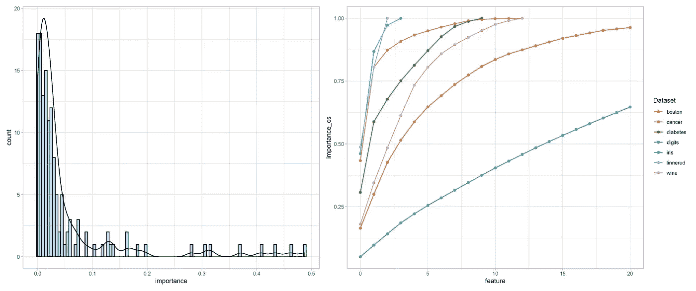
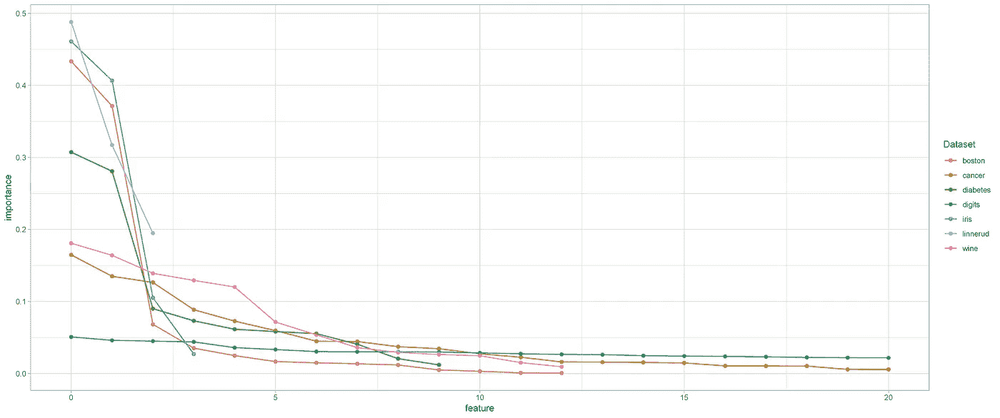

# 奇妙的功能以及在哪里可以找到它们

> 原文：<https://towardsdatascience.com/fantastic-features-and-where-to-find-them-967e79634a18?source=collection_archive---------12----------------------->

图片作者。

几年前，我为一个在线双边市场开发了一个识别欺诈交易的模型。我最初的模型是基于交易及其环境的特征。这个模型很好，但我想把它做得更好。我已经在使用梯度增强树，更多的超参数调整并没有带来任何显著的性能提升。我再次转向特征。

该模型已经在使用买家和卖家之间的文本消息，包括消息的元数据(如交换的消息数量)，但它没有考虑消息之间的时间间隔。具体来说，它没有考虑潜在买家提问和卖家回复之间的*时差。*这被证明是一个信息量很大的特征——欺诈性的卖家实际上没有东西可卖，所以他们不需要花时间为买家研究任何东西。他们还试图在买家怀疑之前迅速达成交易。由于这两个原因，他们通常比合法卖家回复得更快。

我设计了功能，重建了模型，然后**看到了精确度的显著提高**。它成为模型中最重要的特征之一。这是一个**奇妙的功能。但是，奇妙的特征并不总是容易找到的。**在这篇文章中，我想激发识别特征的重要性，并提供如何从数据中**找到**和**提取**它们的建议。

## 特征重要性

如果你花时间开发预测模型，你会发现特征重要性有一个共同的模式。典型地，**有一些非常重要的特性和一长串相对不重要的特性。**为了展示这一点，我为 scikit-learn 中包含的七个特征集训练了随机森林模型，并绘制了每个数据集的特征重要性。

图片作者。

从图中可以看出，在所有的数据集中，**前 1-3 个特征相对于其他特征**具有极大的重要性。在接下来的图中，我们可以更清楚地看到这一点。左侧是要素重要性的分布，右侧是每个数据集要素重要性的累积总和。特征重要性的分布显示大多数特征处于重要性等级的低端(例如小于 0.1)。右侧图中的累积特征重要性图显示，在大多数情况下，在几个特征之后，收益递减(取决于模型中有多少个特征)。这并不是说不太重要的特征应该被丢弃——**总的来说它们非常重要**——但是单个来说它们对模型的预测性能没有显著的贡献。

这里的要点是，一个模型的预测准确性的**大部分通常可以归因于仅仅几个选择的特征。**我发现这很有激励性，因为这意味着你有潜力从根本上改进一个模型，如果有一个高度可预测的特征，并且如果你能找到它。

图片作者。

## 发现奇妙的特征

1.  **思考问题，而不是数据*。在我在本文开头讨论的欺诈检测问题中，我从一开始就拥有所有可用的数据。问题是，我没有真正考虑欺诈用户在与买家打交道时可能会有什么行为。当我开始思考这个问题时——即使是在相当基础的层面上——很明显，通信速度可能很重要，但最初的模型无法检测到这一点。通过**思考问题和微妙的行为细微差别**可能会将一个群体与其他群体区分开来，与仅仅在笔记本上摆弄数据的不同组合和变换相比，你往往能想出更多有趣的想法。***
2.  **与人交谈:**作为数据科学家，当我们在模型构建过程中工作时，很容易将自己孤立起来。这是一个很大的错误。认为我们可以简单地获取一个数据集并在我们*可能*不熟悉的环境中建立一个预测模型，这不仅有点自大，而且也失去了对什么才是重要的以及你的注意力应该集中在哪里的宝贵见解。当启动一个新项目时——尤其是在你不熟悉的环境中——你应该尝试与领域专家合作。这并不是说你不能从探索数据中发现新颖的、非常重要的特征。你当然可以，但是在你花大量时间开发它之前，领域专家通常可以看到新的特性想法是否通过了“嗅探测试”。
3.  **站在巨人的肩膀上:**数据科学在过去几年里取得了长足的进步。有很多关于不同团队和公司如何处理各种预测建模任务的文章。我真的很喜欢阅读 Kaggle 竞赛[获胜者采访](https://medium.com/kaggle-blog)，我最喜欢的一篇关于寻找 fanastic 特征的文章是[这篇来自 Instacart 市场篮子分析获胜者的文章。](https://medium.com/kaggle-blog/instacart-market-basket-analysis-feda2700cded)关于他们如何通过思考时间相关性以及**尝试识别客户没有采取的行动的模式来解决问题，有很多有趣的信息。这篇文章和其他文章非常值得你花时间去读。就像你正在处理的任何问题一样，你很可能不是第一个解决它的人。环顾四周，看看其他人都做了什么，你可能会发现一些很棒的想法，这些想法可以解决你的问题。**

## 提取奇妙的特征

1.  **用树嵌入来绑定特征:**宁滨分类和连续输入通常是去除噪声、强调信号和揭示特征和目标之间的非线性的**好技巧。但是，以最佳的信息保存方式这样做可能很有挑战性。当然，您可以手动完成这项工作，例如，判定连续特征或将相似的分类特征合并到一个公共组中。在这两种情况下，都存在实际上从特性集中删除或减少有价值的信息的风险。有效绑定特征一个好方法是使用基于树的模型。我第一次了解到这种技术是在脸书的论文中。树形模型可用于**以信息最大化的方式有效绑定连续变量和分类变量**。虽然，只有当你想使用线性模型时，这才是真正合适的，但在很多情况下，这是非常可取的！在我关于[鲜为人知的数据科学技术](/lesser-known-data-science-techniques-you-should-add-to-your-toolkit-a96578113350)的帖子中，我讨论了这样做的一个关键实际优势。**
2.  **用神经网络进行实体嵌入:**使用神经网络将分类变量转换成实值向量已经改变了游戏规则。核心思想是**使用神经网络在训练期间学习分类数据的数字表示**。这类似于神经网络如何被用来[学习单词向量](/word-vectors-for-non-nlp-data-and-research-people-8d689c692353)。通过学习分类特征的实值表示**,相似的值在嵌入空间中被更紧密地映射，从而揭示否则将会丢失的数据的潜在特征**。这种方法的一个极好的、[有据可查的例证](https://arxiv.org/pdf/1604.06737.pdf)是它在 Kaggle 上举办的罗斯曼商店销售竞赛中的应用。尽管只做了最少的功能工程，该团队还是在比赛中获得了第三名。这在很大程度上是因为从分类特征中学到了非常有价值的表征。
3.  **去除特征中的噪声:**成为数据科学家的部分艺术是**在噪声中寻找信号**。这种普遍的思维模式应该应用到你放入模型的特性中。如果某个要素杂乱无章、缺少数据、具有随机极值或异常值或其他随机变化源，所有这些都会掩盖其真实值。我经常试图以这样的心态来处理预测建模问题:我想让我的模型尽可能容易地了解特征和目标之间的关系。虽然这是一个大话题，但有几种去噪算法可以应用于连续时间序列数据，这将有助于最小化噪声并强调信号，例如，卡尔曼滤波器和快速傅立叶变换。[这本 Kaggle 笔记本](https://www.kaggle.com/residentmario/denoising-algorithms)讨论了其中一些去噪算法，并提供了 Python 实现。

## 摘要

寻找奇妙的特征既是一门艺术也是一门科学。这也是一个真正有创意的企业，我个人觉得很有趣，也很有收获。找到一个新功能是非常激动人心的，尤其是能够显著提高模型性能的功能。这也不容易，可能会让你陷入许多陷阱。我喜欢我之前提到的 Instacart 文章中的这句话:

> “花了很多时间构建的特性到头来什么也没做，这很常见。但是如果我们什么都不做，就无法知道结果。所以最重要的是参与到你会得到一个更好的结果的错觉中去，如果你尝试的话！”

希望这篇文章能帮助你做得更好。

感谢阅读！

这个帖子的附页代码可以在这里找到[。](https://conormm.github.io/blog/2021/04/24/fantastic-features.html)