# 奇妙的功能以及在哪里使用它们

> 原文：<https://towardsdatascience.com/fantastic-functions-and-where-to-use-them-looped-and-grouped-f76ab7bb6b47?source=collection_archive---------13----------------------->

## 循环分组


由 [Rhii 摄影](https://unsplash.com/@rhii?utm_source=medium&utm_medium=referral)在 [Unsplash](https://unsplash.com?utm_source=medium&utm_medium=referral) 上拍摄的照片

数据准备过程是每项分析的支柱，因为几乎没有数据准备就绪。借助 python 和 pandas 的魔力，可以简化这个过程，并避免重复代码。

在这篇文章中，我将带您了解一些最不喜欢但非常有效的 applymap、apply、groupby 函数，以及这些函数可以节省您的编码时间并提高代码可读性的潜在用例。

出于说明和适用性的目的，我将分析一家位于许多城市的 imaginery 连锁店的盈利能力和资本支出需求。然而，代码可以在各种领域和用例中实践。

# 内容

[**导入库**](#4dfd)

[**创建用于分析的数据框**](#b4e4)

1.  [**Applymap:遍历整个数据帧**](#c6b9)
2.  [**嵌套应用:盗梦空间**](#3fed)
3.  [**分组按多个数据帧进行算术运算**](#7f80)
4.  [**分组依据与应用:自定义功能**](#b382)
5.  [**Groupby 对数据帧**](#d484) 进行切片

[**结论**](#571c)

# 导入库

我们导入以下库来创建带有随机字符串和数字类型数据字段的数据框。

```
import pandas as pd
import numpy as np
import stringpd.set_option('display.max_rows', 400)
pd.set_option('display.max_columns', 200)
pd.set_option('display.max_colwidth', 150)# ['A', 'B', ..., 'AA', 'AB', ..., 'ZY', 'ZZ']
ALPHABETICAL_LIST = (list(string.ascii_uppercase) + 
                     [letter1+letter2 for letter1 in string.ascii_uppercase 
                      for letter2 in string.ascii_uppercase])
```

# 创建用于分析的数据框

让我们创建一个 40 家商店的列表，这些商店在 1980 年至 2010 年间在 10 个不同的城市开设，有 20 年的收入和成本轨迹。

```
PERIOD_COLUMNS = [i for i in range(2021,2041)]CITIES = np.array(sorted([ALPHABETICAL_LIST[x] for x in np.random.choice(range(10), 40)]))STORES = np.array(sorted(['Street_' + 
                          ALPHABETICAL_LIST[x] for x in np.random.choice(range(100), 40, replace=False)]))STORE_OPENING_YEARS = np.array(([x for x in np.random.choice(range(1980, 2010), 40)]))STORE_REVENUS = np.random.uniform(low=500, high=1000, size=(40, 20))STORE_COSTS = np.random.uniform(low=300, high=600, size=(40, 20))df_Stores = pd.DataFrame(np.column_stack((CITIES,

STORES,STORE_OPENING_YEARS,)),columns = (['City', 'Store', 'Opened'])).astype({'Opened': np.int64})df_Stores
```

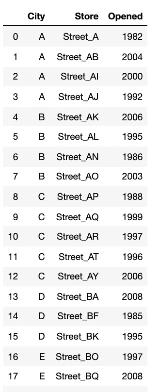

商店的虚拟数据框，作者照片

```
df_Store_Revenues = df_Stores.drop(['Opened'], axis=1).reset_index(drop=True)df_Store_Revenues[PERIOD_COLUMNS] = pd.DataFrame(STORE_REVENUS, columns=PERIOD_COLUMNS)df_Store_Costs = df_Stores.drop(['Opened'], axis=1).reset_index(drop=True)df_Store_Costs[PERIOD_COLUMNS] = pd.DataFrame(STORE_COSTS, columns=PERIOD_COLUMNS)
```

# 1- Applymap:遍历整个数据帧

使用时，applymap 通过数据帧上的每个单元格在内部循环 lambda 函数。


onder rtel 和 Tine Ivani 在 Unsplash 上的照片

尽管要处理多个数据类型字段，这个“一行程序”还是非常方便的。

例如，我们有一个商店收入轨迹，如下图所示。

```
df_Store_Revenues.head(10)
```

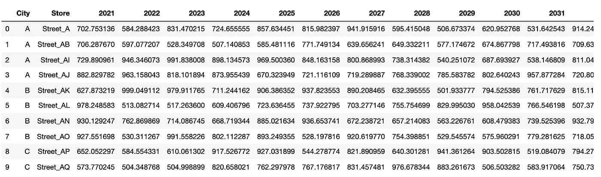

商店收入，作者照片

如果我们不想看到很多小数点，我们可以简单地对所有非对象类型的单元格执行 applymap 循环。

```
df_Store_Costs = df_Store_Costs.applymap(lambda x: np.round(x,2) if type(x)!=str else x)df_Store_Revenues = df_Store_Revenues.applymap(lambda x: np.round(x,2) if type(x)!=str else x)df_Store_Revenues.head(10)
```

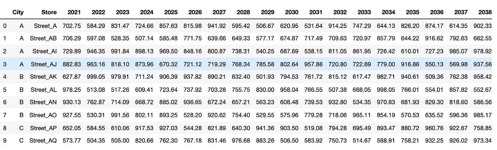

商店收入，四舍五入。作者照片

**使用案例:**当我们需要对每个单元格应用一个线性规则时(例如，用对数/乘数缩放、向上/向下舍入、用值替换等),此函数非常有用。)

# 2-嵌套应用:开始

我真的很喜欢这部电影，因为它让我想起了我最喜欢的电影之一:“盗梦空间”。通过在数据帧上双重应用 lambda 函数，我们可以获得该单元格的索引/列名信息。


由 [Christophe Hautier](https://unsplash.com/@hautier?utm_source=medium&utm_medium=referral) 在 [Unsplash](https://unsplash.com?utm_source=medium&utm_medium=referral) 上拍摄

让我们考虑这样一个场景，我们的商场在运营后的第 25 年需要经历一个主要设备的更新阶段，并在随后的 3 年中加强房地产(油漆/地板)。

```
RENEWAL_YEAR_AFTER_OPENING = 25 #yearsENHANCEMENT_DURATION_AFTER_RENEWAL = 3 #yearsdf_Store_CAPEX = df_Stores.copy().reset_index(drop=True)df_Store_CAPEX[PERIOD_COLUMNS] = pd.DataFrame(np.array([[np.nan ]* 20] * 40), columns=PERIOD_COLUMNS)df_Store_CAPEX.head(5)
```

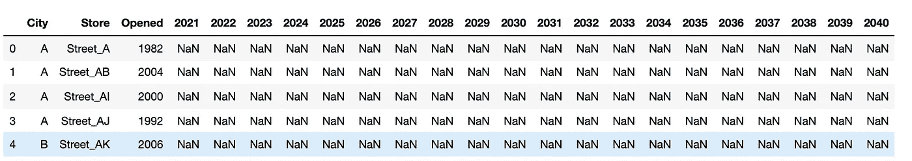

作者照片

我们可以计算出该特定年份是典型的维护、更新年还是升级年，如下所示:

```
df_Store_CAPEX[PERIOD_COLUMNS] = df_Store_CAPEX[PERIOD_COLUMNS].apply(lambda x: pd.DataFrame(x).apply(lambda y:

'Maintenance' if x.name < (RENEWAL_YEAR_AFTER_OPENING +df_Store_CAPEX.loc[y.name, 'Opened'])
else('Renewal' if (RENEWAL_YEAR_AFTER_OPENING +df_Store_CAPEX.loc[y.name, 'Opened']) == x.name 

else('Enhancement' if x.name < (RENEWAL_YEAR_AFTER_OPENING + 
                   df_Store_CAPEX.loc[y.name, 'Opened'] + 1 + ENHANCEMENT_DURATION_AFTER_RENEWAL
                   )  

else 'Maintenance'))                                                                  

, axis=1))
```

例如，Street_AR(建立于 1997 年)在 2022 年之前和 2025 年之后需要维护，2022 年需要更新(1997 + 25)，2023 年至 2025 年需要改进。

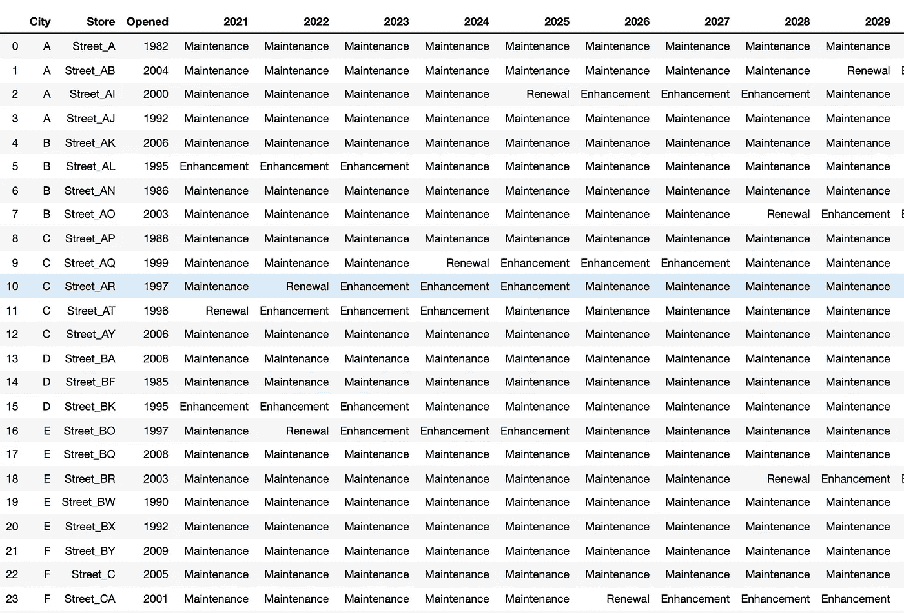

年度资本支出类型，作者照片

**用例:**这种方法非常类似于 Excel 表格的使用，在表格值内的公式中使用标题单元格。

除此之外，当数据框的索引顺序和列名几乎相同时，这种嵌套的应用方法可能更适合在多个数据框之间进行复杂的计算。

# 3-用多个数据帧分组进行算术运算

当我们知道索引顺序(某些数据字段的顺序)在数据框中是相同的时，前面的方法是有效的。然而，如果不是我们首先创建了这些表，并且我们不知道这些几乎相似的表是否有任何添加或删除，那该怎么办呢？

如果是这样，如果我们需要做 4 个基本的算术运算(加、减、乘、除)，那么有一个更安全、更好的方法。


照片由 [Recha Oktaviani](https://unsplash.com/@rechaoktaviani?utm_source=medium&utm_medium=referral) 在 [Unsplash](https://unsplash.com?utm_source=medium&utm_medium=referral) 上拍摄

关键是将对象类型字段设置为索引，这样数字列就可以彼此相加/相乘。

```
INDEX_KEYS = ['City', 'Store']# we can put as many dfs as we like inside this list
# buy multiplying with -1 and summing at the end,
# we're basically substraction negative table from the positive table.LIST_OF_DATAFRAMES_TO_SUM = [df_Store_Revenues.set_index(INDEX_KEYS),df_Store_Costs.set_index(INDEX_KEYS) * -1,

                            ]df_Store_Profit = pd.concat(LIST_OF_DATAFRAMES_TO_SUM, 

          sort=False, 

          keys=range(len(LIST_OF_DATAFRAMES_TO_SUM))

         ).groupby(

    level=[i+1 for i in range(len(INDEX_KEYS))]

                    ).apply(lambda x : (x.sum())
                                 ).reset_index()df_Store_Profit
```

Street_A 的收入和成本视图如下:

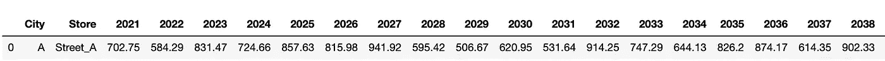

Street_A 的收入，作者照片

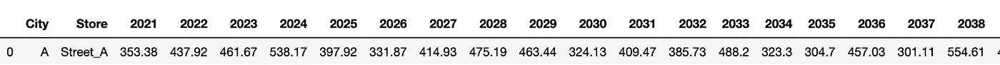

Street_A 的成本，作者照片

Street_A 的毛利观如下:

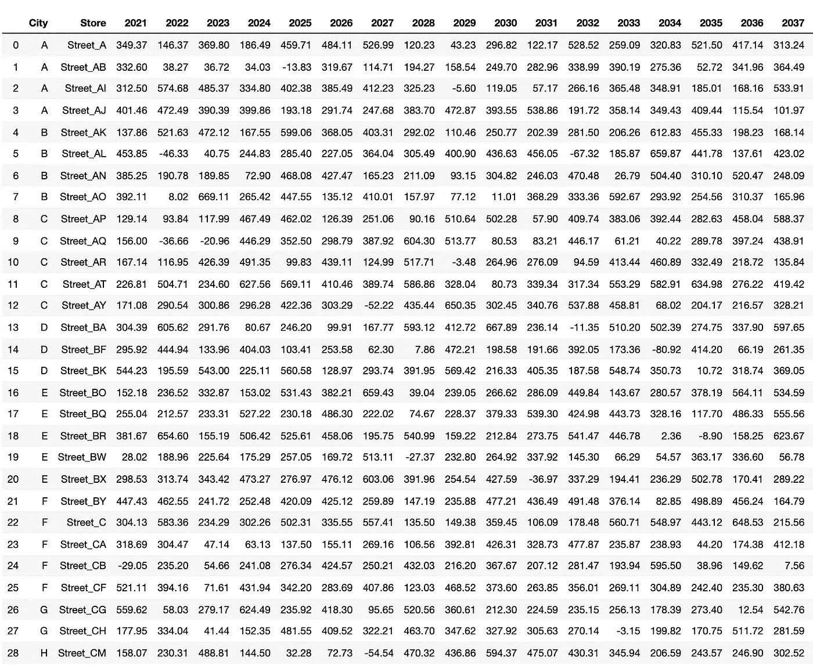

商店的毛利，作者拍摄的照片

乘法(或除法)也与前面的方法(加法/减法)非常相似，只有几处不同。

```
INDEX_KEYS = ['City', 'Store']# we can put as many dfs as we like inside this list
# buy taking the power to the -1 and multiplying at the end,
# we're basically dividing first table by the second table.LIST_OF_DATAFRAMES_TO_MULTIPLY = [df_Store_Profit.set_index(INDEX_KEYS),df_Store_Revenues.set_index(INDEX_KEYS) ** -1,

                            ]df_Store_ProfitMargin = pd.concat(LIST_OF_DATAFRAMES_TO_MULTIPLY, 

          sort=False, 

          keys=range(len(LIST_OF_DATAFRAMES_TO_MULTIPLY))

         ).groupby(

    level=[i+1 for i in range(len(INDEX_KEYS))]

                    ).apply(lambda x : (x.cumprod(skipna=False).iloc[-1])
                                 ).reset_index()df_Store_ProfitMargin
```

Street_A 的毛利率视图如下:

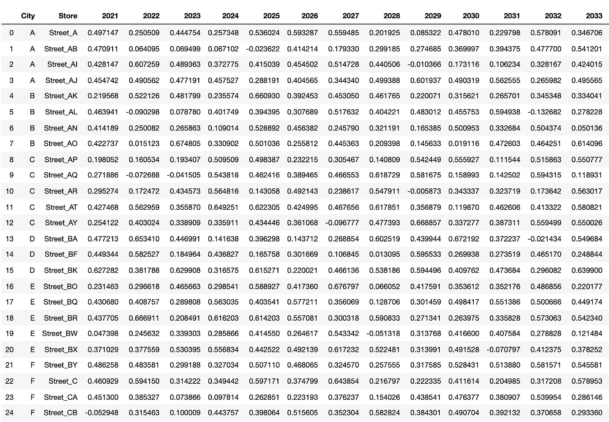

商店的毛利率，图片由作者提供

**用例:**当有许多数据帧要对多级数据进行(加/减)或(乘/除)时，这些算术运算是非常可取的。

***请注意，sum / multiply 不能混合在同一个 dataframe 列表中，必须单独运行。***

# 4-具有应用功能的分组依据:定制功能

我们可能需要只适合我们需求的定制功能。


萨尔瓦多·戈多伊在 [Unsplash](https://unsplash.com?utm_source=medium&utm_medium=referral) 上的照片

例如，如果我们想找到每年毛利率为负的商店，该怎么办？


商店的毛利率，图片由作者提供

关键点是创建一个内部有一个空字典的函数，并将其作为用字典键索引的 pandas series 返回。

```
def find_stores_that_loses_money(x):

    d={}

    for COLUMN in PERIOD_COLUMNS:

        MONEY_LOSING_STORES = x[x[COLUMN] < 0]

        if len(MONEY_LOSING_STORES) > 0:

            d['Loss_{}'.format(COLUMN)] = ' , '.join(list(

                MONEY_LOSING_STORES['Store'].values

                                                      )
                                                    )else:

            d['Loss_{}'.format(COLUMN)] = np.nan

    return pd.Series(d, index=d.keys())df_Stores_Losing_Money = df_Store_ProfitMargin.groupby(['City']).apply(find_stores_that_loses_money).reset_index()df_Stores_Losing_Money
```

对于每年的每个城市，我们都会发现毛利率为负的商店。

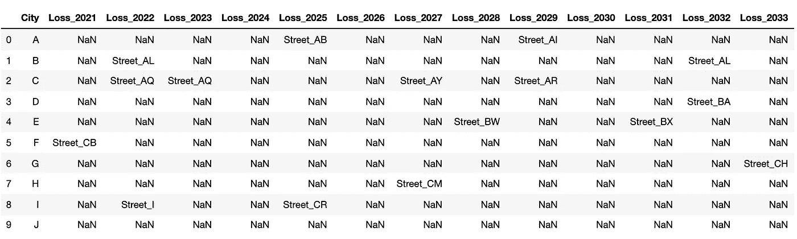

亏损商店，作者照片

**用例:**天空才是极限。只需创建一个最符合您业务需求的功能，并与 groupby magic 结合即可。

# 5- Groupby 对数据帧进行切片

我们有时需要以多层次的方式分割数据帧来处理子集。


照片由 [Kabir Kotwal](https://unsplash.com/@photo_scientist?utm_source=medium&utm_medium=referral) 在 [Unsplash](https://unsplash.com?utm_source=medium&utm_medium=referral) 上拍摄

对于每个城市，我们筛选 2021 年盈利能力最高的商店行。

```
idx_max = df_Store_ProfitMargin.groupby(['City'])[2021].transform(max)==df_Store_ProfitMargin[2021]df_Most_Profitable_Stores_2021 = df_Store_ProfitMargin[ (idx_max) ]df_Most_Profitable_Stores_2021
```

请查看索引号中的过滤效果。

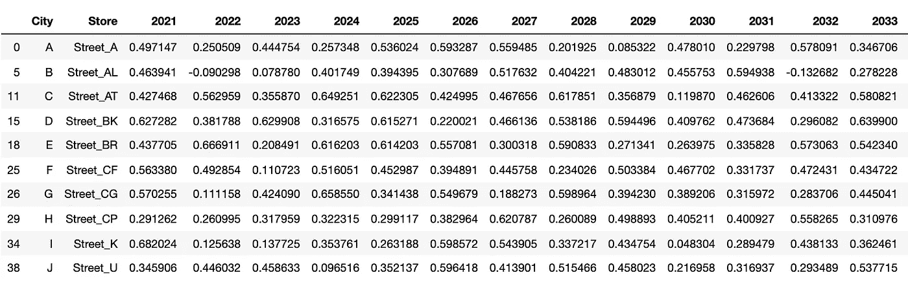

每个城市 2021 年利润最高的商店，作者照片

**用例:**当我们需要保存数据库历史中每个类别的最新行时，这种方法非常有用。(即每个用户和产品的 Updated_At 列的最大值)

# 结论

在这篇文章中，我想带你了解一些最不喜欢但有效的循环和分组函数，它们可以增加代码的可读性，并让你赢得时间和确定性。但是，请注意，在处理数百万行的数据帧时，循环并不是首选，它们需要谨慎处理。