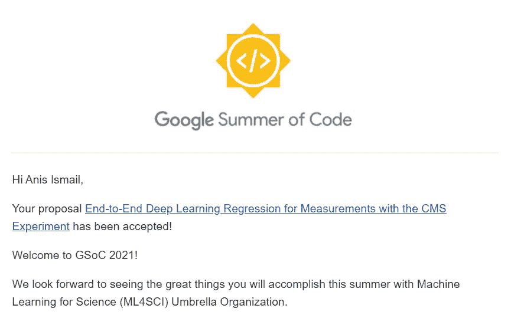
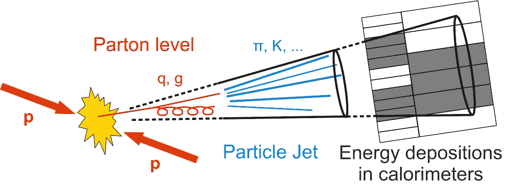
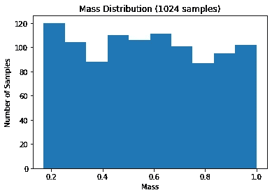
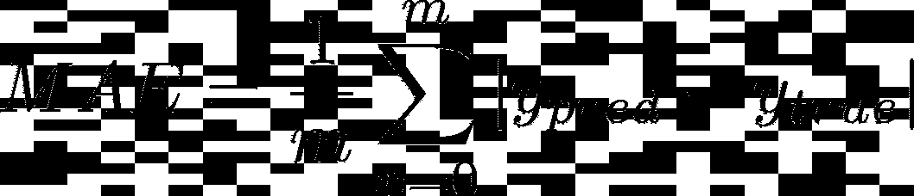
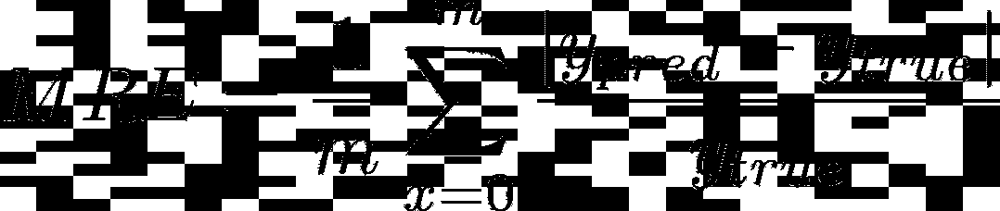
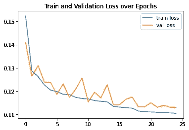
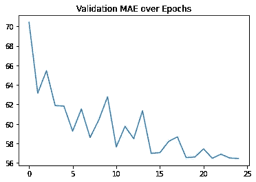
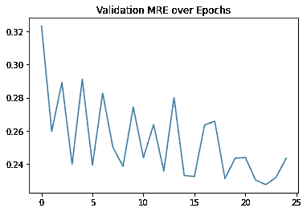

# 美妙的谷歌代码体验之夏以及我是如何发现它们的

> 原文：<https://towardsdatascience.com/fantastic-google-summer-of-code-experiences-and-how-i-found-them-dd1c5b09a364?source=collection_archive---------36----------------------->

*图 1:Unsplash*上 [Rhi 摄影](https://unsplash.com/@rhii) *的照片*

在过去的三个月里，我有机会加入了 2021 年版本的谷歌代码之夏，作为一名深度学习实习生在科学机器学习组织工作。我的项目是端到端(E2E)小组的一部分，处理的是**将深度学习应用于 CERN**CMS 实验的增强顶夸克质量回归。为了纪念这个充满学习的机会的结束，我决定写一篇文章，描述我作为代码学生的谷歌之夏的经历，所以系好安全带，让我们开始吧！

# 0.初步:什么是 GSoC？

[Google Summer of Code](https://summerofcode.withgoogle.com/) 或 GSoC(在狂热的软件开发学生中通常被称为 GSoC)是一个由 Google 组织的**十周计划，旨在让来自世界各地的学生与开源组织合作。每年夏天，学生们都会申请与不同背景的组织一起从事开源项目，从 web 开发、软件工程、机器学习到生命科学等等！**

# 1.在流程的早期开始

GSoC 项目因竞争激烈而臭名昭著。每年，成千上万的学生申请该计划，并向开源组织提交他们的建议。为了使这一过程更容易，GSoC 组织者花了很大力气为整个项目设定时间表。

不要让每一步的充足时间欺骗了你！我注意到许多学生(包括我自己)每年都会犯的一个错误是把提交提案的步骤留到最后一刻。但由于许多组织在提交提案之前有不同的申请程序，许多学生将无法按时完成他们的提案，并进入申请流程的下一步。**所以热拍是要早点开始的！给自己足够的时间研究这些组织，了解他们的选择过程，并最终写出那份强有力的提案！**

# 2.等等，ML4SCI 到底是什么？

我在 GSoC 的主要目标是**加入试图解决现实世界科学问题的机器学习项目**。领导这些项目的组织之一是[科学机器学习组织(ML4SCI)](https://ml4sci.org/) 。这是一个将机器学习应用于科学项目的伞式组织。它将来自大学和科学实验室的研究人员与积极的学生聚集在一起，为许多学科的前沿科学项目做出贡献。

ML4SCI 目前包括多个领域的项目。例如，一些项目探索了机器学习在欧洲粒子物理研究所高能物理中的粒子重建和分类、基于深度学习的天体物理学暗物质搜索、机器学习技术在行星科学任务返回数据中的应用、量子机器学习在科学中的应用等。

**它的目标是通过解决重要的科学挑战和在各学科间转移机器学习的知识和工具来发展科学机器学习的开源社区**。

# 3.ML4SCI 应用程序

*图 Bram Naus 的图片(来源:*[*Unsplash*](https://unsplash.com/photos/n8Qb1ZAkK88)*)*

在 ML4SCI 组织提供的许多令人兴奋的项目中，我决定申请 ML4SCI 端到端小组提出的使用机器学习的大规模回归(接下来将详细介绍该项目)。

ML4SCI 申请程序的第一步是评估测试，帮助您展示您的机器学习和数据分析技能。我的评估测试包含三个深度学习练习，使用 Tensorflow 和 Pytorch 成功训练和调优了一个深度学习模型。在此期间，每次我都面临困难。我发现 Gitter 上的 ML4SCI 社区是一个寻求帮助并与其他申请人和导师就提案交换意见的好地方。

# 4.哦，求婚！准备有那么难吗？

完成测评任务后，你应该为自己感到骄傲！这不是一件容易的事！现在，是时候开始准备你的提案了。正如我之前所说的，**慢慢来，花时间写提案**。相信我，只要有足够的时间，你就能起草一份经过充分研究的强有力的提案。写建议书有很多方法，我发现**GSoC 指南提供的** [**这里的**](https://google.github.io/gsocguides/student/writing-a-proposal) 相当清晰全面。请务必详细阅读，如果有任何疑问，请不要犹豫，访问 Gitter 上的社区，并联系导师了解更多问题。一旦你对你提议有了信心，深呼吸，点击提交按钮。

# 5.我加入了！

*图 3: GSOC 验收*

恭喜你！**你终于被 GSoC 项目**录取了，除此之外，你还被邀请参加 ML4SCI 社区会议！根据你的项目，你应该期待每周与你的小组开会，在会上你将有机会分享你的进展，并从你的导师和同事那里得到有价值的反馈。与此同时，你可能需要**联系你的导师，讨论你的下一步**以及你的提案中需要做出的**修改**。

# 6.酷，但是你的项目怎么办？

是时候了，你可能想知道我的项目怎么样了！系好安全带，你将在机器学习和粒子物理的世界中享受一次甜蜜的旅程！

## a.(物理)故事时间

探测顶夸克是欧洲核子研究中心 CMS 实验的一项重要任务。顶夸克预计将通过许多物理实验产生，并在 CERN 的 CMS 物理项目中进行深入研究。例如，量子力学允许希格斯玻色子粒子在非常短的时间内波动成一个顶夸克和一个顶反夸克，这两个夸克立即相互湮灭成一个光子对。因此，除了其他任务之外，对顶夸克及其测量的研究对于希格斯玻色子的研究是重要的。

*图 4:CMS 象限示意图(来源:* [*CERN 文件服务器*](https://cds.cern.ch/record/1223872/plots) *)*

在进入关于机器学习方面的更多细节之前，让我们后退一步，研究一下我们的数据。什么是碰撞？如前所述，CMS 实验通过碰撞粒子和评估产生的结果，产生了大量关于基本粒子的数据。由于每次碰撞都会产生许多粒子，它们被自己的动量和角度推开，并撞击 CMS 的不同探测器层。然后这些“点击”被记录下来，并在欧洲粒子物理研究所的许多项目中使用。

*图 5:粒子碰撞时喷射出的粒子‘射流’(来源:*[*CERN*](https://cms.cern/news/jets-cms-and-determination-their-energy-scale)*)*

如你所见，那些层层叠叠的**安打，可以当作图片**来研究。因此，使用了专门的深度学习模型，如卷积神经网络，它的优势在处理类似图像的结构时很方便。

## b.机器学习方面

因此，我的项目开始了:利用从 CMS 实验的粒子碰撞中收集的数据，使用深度学习来回归顶夸克质量。我训练了一类卷积神经网络，称为 ResNets 或残差神经网络，来预测被增强的顶夸克的质量。

现在我们已经讨论了物理部分，我们可以转到有趣的部分了。残差神经网络(简称 ResNets)是一类卷积神经网络，多年来被用作许多计算机视觉网络的主干。Resnets 已经用于非常深的模型，并能够在 2015 年赢得 ImageNet 挑战赛。

*图 6:带 Skip /快捷连接的 34 层 ResNet(上)、34 层素网(中)、19 层 VGG-19(下)(来源:* [*走向数据科学*](/review-resnet-winner-of-ilsvrc-2015-image-classification-localization-detection-e39402bfa5d8) *)*

你会问，为什么是 ResNets？在我们的实验设置中，我们使用的数据如前所述具有与图像相似的结构。**由于 ResNets 能够在不降低性能的情况下增加深度**，它们提供了强大的能力来学习复杂的模式，并在我们增加深度时灵活地提高模型的性能。

## c.训练实验

为了训练模型，我们使用了通过皮媞亚模拟软件生成的数据。我们有超过 200 万个样本，以 90–5–5 的比例分布在训练集、验证集和测试集中。

对于**预处理**，我们将每个 jet 层的像素值重新调整为 0 到 1 之间的值。我们还将低于 1e-5 的所有值转换为零，将高异常值转换为 1。我们使用这些策略来加速训练并减少由训练中的异常值引入的噪声。

对于**目标变量**，我们执行了无偏过程，将质量分布转换为均匀分布，并将这些值除以最大质量值(500 GeV)。使用这种技术，我们降低了一个质量亚组的模型偏差的风险，并减轻了过度拟合。

*图 7:单偏和重定标后的目标质量分布*

*图 8: MAE 公式*

在对数据进行预处理之后，我们对 25 个时期训练一个 ResNet-15 模型。至于我们的损失函数，我们使用**平均绝对误差(MAE)** 进行训练和评估。

F *图 9: MRE 公式*

我们还采用了**平均相对误差(MRE)** 作为评估指标，对模型性能进行基准测试，并与其他实验进行比较。

我们使用了 **Adam 优化器**和**学习率调度器**，每当验证损失不再减少时，该调度器就会降低学习率，以提高模型的收敛性。

## d.结果

经过 25 个周期的训练后，在测试集上 MAE 达到 56.43 GeV。在测试集上，MRE 也达到了 24.04%的百分比。还不错，但是还有提升的空间！

*图 10:训练和验证集在训练时期的比例损失图*

该图证明了模型在合理误差**内预测质量值的能力，而不会过度拟合**训练集。

*图 11:验证 MAE 和 MRE 在训练时期的演变图*

为了改善结果，我们计划通过添加额外的两个图层 dZ 和 pt 来重复这个实验。在顶夸克分类中的早期工作已经表明，增加这两层提高了分类器的性能。

# 7.不要忘记记录你的进步！

现在你已经完成了你的项目并通过了你的最终评估，**祝贺你**！你已经正式完成了你的(奇妙的)GSoC 体验！最后一条建议是，确保你对项目的宝贵进展和有价值的贡献被保存下来，并为将来的补充做好记录。根据您的组织，您可能希望将注释良好的代码提交到 Github 或 Gitlab 上的存储库中，并向您组织的存储库提交一个 pull 请求。

# 最后的想法

至此，我结束了这次奇妙的 GSoC 体验！在过去的三个月里，我有机会了解了很多关于在加速器物理学中应用机器学习的知识，并遇到了一个充满才华横溢、支持我的同事和导师的激励社区。尽管 GSoC 结束了，但我很高兴能继续成为 ml 4 sci e2e 小组的一员，以改进顶级夸克质量回归项目，并促进其集成到 CMS 探测器管道中。最后，**我要感谢谷歌代码之夏**创造了如此宝贵的机会，还要感谢**我的导师们** [**大卫·迪·克罗齐**](https://physics.ua.edu/people/davide-di-croce/)[**谢尔盖·格利泽**](https://physics.ua.edu/people/sergei-gleyzer/)[**达里亚·迪亚可娃**](https://www.linkedin.com/in/darya-dyachkova) 对我的持续支持。

**您可以在这里** **了解更多关于我的项目** [**。**](https://github.com/ML4SCI/E2E/tree/main/E2E_Regression_Anis_Ismail)

*原载于 2021 年 8 月 26 日 https://anisdismail.com**[*。*](https://anisdismail.com/gsoc-experience-2021.html)*