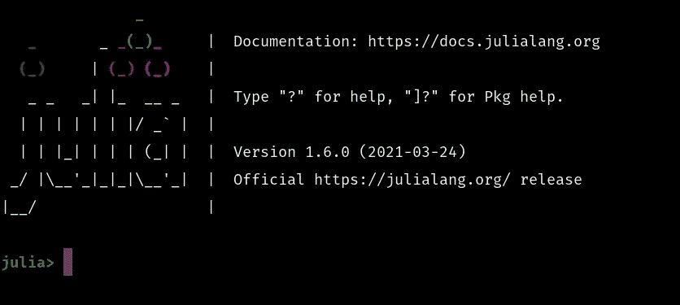

# 朱莉娅·REPL 的绝妙建议

> 原文：<https://towardsdatascience.com/fantastic-tips-for-the-julia-repl-2865ba81bd61?source=collection_archive---------16----------------------->

## 用这些很酷的建议来提升你的 REPL 体验吧！



(图片由作者提供)

# 介绍

ulia 是一种非常酷的编程语言，在过去的几年里，它将许多非常有趣的概念带入了许多开发人员和科学家的脑海。诸如即时(JIT)编译和多重调度这样的概念现在已经成为数据科学和一般编程社区中的一个大话题，这是有充分理由的，因为 Julia 确实非常好地执行了这些概念。

对于朱莉娅语言的大部分独立部分，很容易看出他们在构思中投入了大量的思想和努力。从 Julia 出色的包管理器 Pkg，到它处理模块和文档的方式，Julia 已经做了一些非常酷的开箱即用的事情，使这种语言比许多其他可用于类似任务的编程语言更容易使用和流畅。该语言及其软件包的任何一个单独的部分都可以很快带领你进入一个有趣的编程概念和计算机科学的兔子洞。如果你想研究 Julia 语言中的其他一些很酷的东西，我有几篇文章可能会让你感兴趣，这些文章详细介绍了我喜欢软件包管理器(一个叫做 documented 的软件包)的什么，以及这两者如何协同工作来创建奇妙的“JuliaHub”我认为对朱莉娅感兴趣的人绝对值得一读:

</julias-package-manager-is-awesome-23b9c02e3a0b>  </how-to-automate-julia-documentation-with-documenter-jl-21a44d4a188f>  </juliahub-the-greatest-approach-to-putting-together-packages-and-documentation-707688a472d2>  

# REPL 基础知识

正如我在介绍中提到的，Julia 语言经常采用简单的想法，然后完全颠覆它们，产生令人难以置信的结果。首先要承认的是，朱莉娅 REPL 的伟大之处在于，它能够直接从朱莉娅 REPL 访问其他回复。朱莉娅的软件包管理器 Pkg 实际上有自己的 REPL，在朱莉娅 REPL 中按]就可以快速访问。这对于添加包非常方便，我个人总是选择这种方法，而不是传统的使用 Pkg 的方法:

```
using Pkg; Pkg.add("Lathe")
```

相反，我更喜欢:

```
julia> ]pkg> add Lathe
```

这也为使用 git 通过 URL 直接添加包打开了大门:

```
pkg> add [https://github.com/ChifiSource/Lathe.jl.git](https://github.com/ChifiSource/Lathe.jl.git)
```

对于下一个令人惊叹的特性，让我们考虑一个计算机程序员可能经常会遇到的场景。你 CD 进入一个目录，打开你的 REPL，只是意识到你要么在错误的目录，或者也许你实际上不知道你应该看什么文件。当然，使用像 pwd()、cd()和 readdir()这样的方法，在 Julia 本身中导航文件系统是可能的，但是我的 Unix 用户无法忍受为了导航我的文件而编写方法调用。此外，readdir()对我个人来说是一个非常奇怪的选择，因为我太习惯于写 ls 了。幸运的是，Julia 还有一个非常方便的方法可以直接从 REPL 访问 Bash！这意味着不再需要 ctrl+C/ctrl+D 来查看您的 REPLs 文件系统！我们可以输入这个 REPL 使用:。

```
julia> ;shell> cd ..shell> ls
directory
other-directory
shell> pwd
look/its/my/working/directory
```

# 更酷的东西

朱莉娅·REPL 实际上本身就是一个模块。它里面包含了很多有用的工具，而且你可以用这个模块本身包含的函数和类型做很多很酷的事情。例如，您可以创建一个文本编辑器，它已经用 Acorn.jl 包完成了。当然，在这方面有很多内容要介绍，但它肯定值得熟悉，因为我认为它肯定会在一些项目中派上用场！

你可以用朱莉娅 REPLs 做的另一件很酷的事情是创建你自己的回复！您可以使用 REPLMaker 包来实现这一点，我正好有一个教程，您可以在这里查看:

</replmaker-jl-create-interactive-julia-packages-67be382f3eb8>  

# 结论

Julia 语言提供了大量非常有趣的编程概念和便利，提高了大多数使用该语言的人的生活质量。我认为有很多很棒的软件包和功能可以补充这一点，但一个很好的例子是在 REPL。Julia 的 REPL 体验非常流畅，甚至可以让最困难的编程和开发任务变得非常简单。在这方面，我最喜欢的一件事是快速访问 Bash REPL，我经常用它来用 nano 编辑文本和浏览文件。感谢您阅读我的文章，我希望它提供了一些改进或知识，当谈到使用朱莉娅 REPL 的全部潜力！