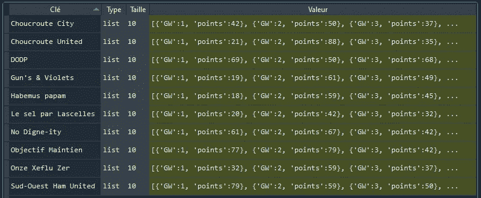
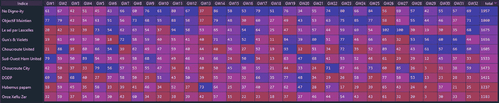
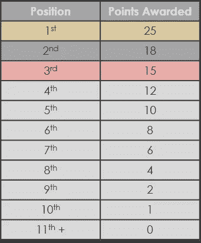
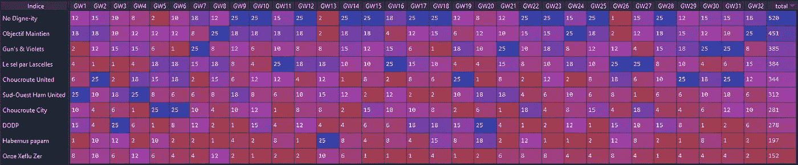
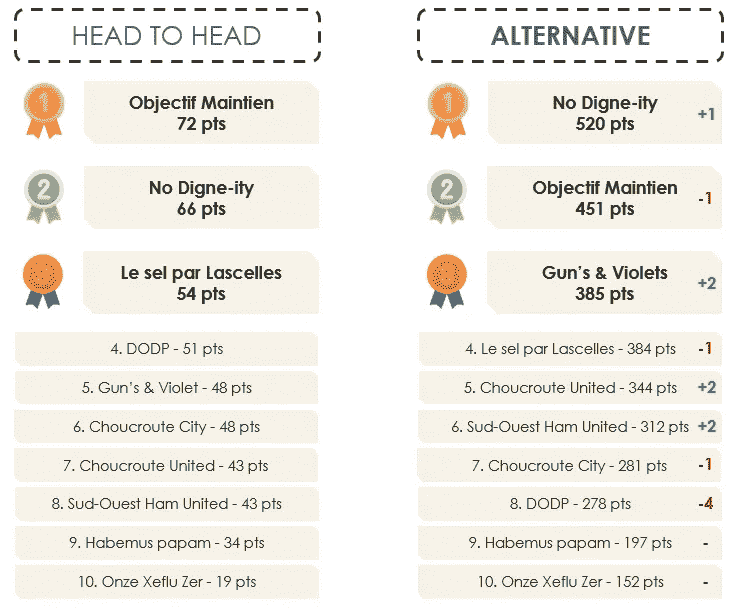

# 梦幻英超 Python 的另一种积分系统

> 原文：<https://towardsdatascience.com/fantasy-premier-league-an-alternative-points-system-with-python-b0773e2217ad?source=collection_archive---------40----------------------->

## 如果 FPL 的积分和 f1 一样，你会赢吗？

埃米利奥·加西亚在 [Unsplash](https://unsplash.com/s/photos/soccer?utm_source=unsplash&utm_medium=referral&utm_content=creditCopyText) 上拍摄的照片

# #动机

当你玩梦幻英超时，首先要做的决定是将你的联赛设为经典还是单挑。一些人认为经典联赛更公平，但面对面的比赛更有趣。我同意这一点。后一种形式会引发更多的竞争，并允许更深层的策略发挥作用。

这两种形式总的来说非常有趣。然而，如果你像我一样，两次都没有赢得联赛冠军，你可以想出第三个，当然是更好的一个。现在，我是输不起的人吗？这是可能的，但幸运的是这不是本文的重点。

相反，我们要研究的是，如果在每个比赛周，积分都以一级方程式中的相同方式分配，即比赛周的最高分为 25 分，第二名为 18 分，第三名为 15 分，以此类推，会对排名产生什么影响

# #识别和获取相关数据

我已经写了一篇关于 FPL 的文章，解释了如何使用 FPL API 获取相关数据。如果您感兴趣，可以在这里找到:

 [## 用 Python 解析你的梦幻英超球队

### 如何使用几行 Python 代码来可视化您的 FPL 团队的表现

towardsdatascience.com](/an-analysis-of-your-fantasy-premier-league-team-with-python-de4acf77e444) 

我们将首先使用这个 URL 端点和一个简单的 GET 请求从我们的头对头联盟获取数据:

**https://fantasy . premier league . com/API/league-h2h-matches/league/*h2h _ league id*/？page = 1&event =*GW number***

这一部分的代码如下所示:

请随意在你自己的 H2H 联赛中使用它！您需要更改的唯一参数是 leagueID(您可以在联盟页面的 URL 中找到)，您要考虑的开始游戏周和结束游戏周，以建立替代排名。

这就是我们从 FPL 需要的一切，我们将从这里开始建造其余的！

# #组织数据

为了更容易地处理数据，并最终创建一个包含我们正在寻找的备选排名的数据框架，我们首先将数据存储到一个字典中，该字典包含联盟中的所有球队，以及每个球队在每个比赛周的 FPL 分数。

按作者分类的图片——字典中组织的每个游戏周每个团队的分数

这就是我们如何得到这个结果的:

# #建立备选排名

该过程的第二步是用每个队获得的 FPL 分数填充包含队(行)和比赛周(列)的数据框。

这就是我们最终得到的结果:

作者图片——32 个游戏周之后的经典排名，每个游戏周都有积分

这里没有什么令人惊讶的，因为所有这些都可以在 FPL 网站上以更好的格式获得。然而，这是实现最终目标的必要步骤。

最后，剩下要做的就是根据下面的评分系统计算每支球队在每个比赛周获得的新分数:

作者图片—一级方程式积分系统

为了做到这一点，我们对比赛周和各队进行循环，比较他们的分数，并根据比较结果给他们分配新系统的分数:

最后，我们在数据框中添加一个总计列，得到如下结果:

作者图片—32 个游戏周之后的备选排名，每个游戏周都有积分

# #结论

这种替代积分系统产生的排名介于混乱的面对面联赛和平凡的经典联赛之间。这是一个高风险高回报的系统，有利于排名靠前的位置，因为位置之间的差距会随着比赛周排名的下降而减小。

将 32 个比赛周之后我的排名表与另一个排名表进行比较，显示出一些巨大的差异和一个较少依赖于运气的排名。

作者提供的图像—两种积分系统的比较

如果你想知道用这个积分系统你的头对头联盟会是什么样子，完整的代码可以在这里找到:

[https://github.com/Guigs11/fpl_alternative_ranking](https://github.com/Guigs11/fpl_alternative_ranking)