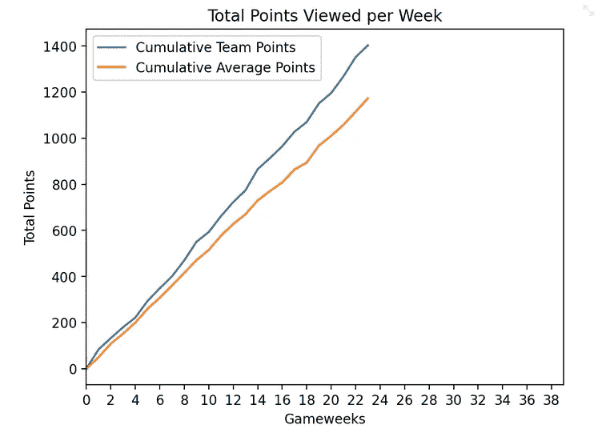

# 梦幻英超 x 数据分析:跻身前 2%

> 原文：<https://towardsdatascience.com/fantasy-premier-league-x-data-analysis-being-among-the-top-2-98a714a1d170?source=collection_archive---------10----------------------->

## 对我构建的应用程序做一个简单的概述，在这个应用程序中，我使用了数据分析来帮助我的 FPL 团队提升图表

**编辑:**App 2022-23 赛季重新上线[此处](https://kunjmehta-fpl-teammaker-heroku-app-202223-ohxmbz.streamlitapp.com)。

# 梦幻英超:一种现象

非足球迷或非体育迷会问，梦幻英超(FPL)到底是什么？好吧，让我们从什么是 FPL 开始，然后在深入数据分析代码之前，看看这个游戏是如何玩的。


由[杰克·莫纳奇](https://unsplash.com/@jaaack?utm_source=medium&utm_medium=referral)在 [Unsplash](https://unsplash.com?utm_source=medium&utm_medium=referral) 拍摄的照片

## 游戏概述

来自维基百科[、](https://en.wikipedia.org/wiki/Fantasy_football_(association))、梦幻足球(以及一般的梦幻体育运动)是一种游戏，参与者组建一个由现实生活中的足球运动员(运动员)组成的虚拟团队，并根据这些球员的实际统计表现或他们在赛场上的感知贡献得分。通常，在一个特定的幻想游戏中，玩家是从特定国家的一个特定部门中挑选出来的。

所以，FPL 是英格兰超级联赛的梦幻足球联赛。1971 年 8 月 14 日星期六，伯尼·唐纳利在英格兰创立了现在的梦幻超级联赛的最初版本。作者已经玩了当前的网络版 FPL 游戏五年了，结果喜忧参半。然而，游戏本身的“结果”却是喜忧参半:从 2014/15 赛季的约 350 万玩家到现在的 800 万，游戏每年增加约 75 万玩家。

一个很容易理解的问题是:是什么让这个游戏如此吸引人和令人上瘾？嗯，首先，这是足球固有的魅力，英超联赛和管理自己球队的幻想，所有这些加在一起。除此之外，你可以和你的朋友一起玩迷你联赛，如果你能赢得这些迷你联赛或 FPL 本身(如果你能管理好的话)，你就有吹牛的权利。最重要的是，有了围绕英格兰超级联赛的资金，他们决定邀请比赛的获胜者进行为期 3 天的英国之旅，并有幸观看他们最喜欢的球队的现场比赛。难怪每个疯狂的英国足球迷都玩它！

## 游戏规则

既然我们已经确定了游戏的意义，让我们来看看规则。当我们深入研究代码时，这些将会派上用场，因为数据分析已经完成，记住了游戏规则。

前提是:球员有 1 亿英镑的预算购买一支由 15 名球员组成的球队，其中包括 2 名守门员、5 名防守队员、5 名中场队员和 3 名前锋，此外还有一条规则，即从任何一支球队中最多只能选择 3 名球员。玩家的花费由游戏开发商根据玩家在上一个足球赛季的受欢迎程度和表现预先确定。

除此之外，在每一轮(称为游戏周)游戏后，用户可以选择将一名玩家从他的团队中转移出去，如果他愿意的话，可以免费将另一名玩家带到相同的位置。任何额外的转移都将受到 4 分的罚款。关于规则和游戏评分系统的更多细节，你可以访问[页面](https://fantasy.premierleague.com/help/rules)。

游戏的目标:在预算和其他限制条件下，每周尽可能拥有得分最高的球员，这样从长远来看，你可以在其他球员中积累最多的分数。

# 数据

游戏的制作者维护一个为他们的网站提供动力的 API。该 API 可公开访问[此处为](https://fantasy.premierleague.com/api/bootstrap-static/)。它包含了每个游戏周，每个团队的数据，以及联盟中每个玩家的统计数据。这就是为什么它是数据分析的金矿！

我们对这些数据进行了一些初步的 EDA，以检验一些假设。其中一个问题是，就 FPL 而言，一支球队在联赛中的位置是否会影响该队球员的表现。这意味着属于上半区球队的球员是否比属于下半区球队的球员有更多的 FPL 积分。如果是这种情况，我们将需要来自 API 的团队数据。然而，这个假设被证明是错误的。尽管在很高的层面上是正确的，但也有一些异常值得分过高，不容忽视。

所以，在确定了球队位置或多或少与 FPL 的球员表现没有关系后，我们决定提取整个球员名单的球员统计数据。这包括以下信息:

```
['id', 'code', 'first_name', 'second_name', 'web_name', 'team_code', 'player_type', 'status', 'form', 'total_points', 'points_per_game', 'minutes_played', 'goals_scored', 'assists', 'clean_sheets', 'goals_conceded', 'own_goals', 'penalties_saved', 'penalties_missed', 'yellow_cards','red_cards', 'saves', 'bonus', 'now_cost']
```

上面的大多数属性都是不言自明的。`web_name`是网站上使用的玩家名称。`player_type`是指球员是前锋、中场、后卫还是守门员。`status`指球员的受伤状态。`form`表示玩家形态的整数，越高越好。

这里有个旁注:因为在赛季开始的时候，没有那个赛季的球员表现数据(很明显！)，我们已经使用前一个赛季的最后一周数据来决定球员，并为转会截止日之前发生的 Gameweeks 建立一支球队。一旦队伍确定下来，并且有了适当数量的当前赛季数据，我们就开始利用这些数据来决定谁该加入队伍。

# FPL 团队制造商:应用

这里可以找到的[应用有两种模式:组队**模式和转会**模式**模式。团队建设模式允许用户建立一个 15 名球员的团队，每个团队的球员人数和重要性的定制形式和总积分留给用户。转移模式允许用户将指定数量的球员转移到他已经存在的球队中，这是他输入的。下面我们来深入了解一下细节。**](http://fpl-teammaker.herokuapp.com/)

## 熊猫和纸浆:分析后台

> 分析背后的直觉很简单:最好是拥有得分排行榜上的顶级球员(通常是昂贵的)，但在特定时间拥有最佳状态的价值球员来抵消顶级得分球员的一些糟糕表现也是好的。

根据直觉，数据操作的两个最重要的属性变成了`total_points`和`form`。首先，在进行分析并使用它来准备一个 15 人的球队之前，我们从球员名单中删除受伤的球员。

```
injured_players_df = player_df[player_df['status'] != 'a']
```

接下来，基于拥有最佳得分球员的直觉，我们首先强制性地尝试为每个位置安排最佳得分球员。然后我们去填补其余的 11 名球员。

```
top_players_positions_to_be_filled = {'GKP':1, 'DEF':1, 'MID': 1, 'FWD': 1}
top_players_positions_filled = {'GKP':0, 'DEF':0, 'MID': 0, 'FWD': 0}
 i = 0
while top_players_positions_filled != top_players_positions_to_be_filled and i < len(top_players_point_sort):
        if teams_filled[top_players_point_sort.iloc[i]['team_code']] > 0 and top_players_positions_filled[top_players_point_sort.iloc[i]['player_type']] < 1:
    team_cost += top_players_point_sort.iloc[i]['now_cost']
    team_points += top_players_point_sort.iloc[i]['total_points']
    positions_filled[top_players_point_sort.iloc[i]['player_type']] -= 1
    top_players_positions_filled[top_players_point_sort.iloc[i]['player_type']] += 1
    teams_filled[top_players_point_sort.iloc[i]['team_code']] -= 1 players_in_team.append(top_players_point_sort.iloc[i] ['second_name'])
    i += 1
```

我们利用 Python 库`PuLP`使用线性编程填充剩余的 11 个玩家。要解决的 LP 问题是最大化一个度量(基于过去的数据)，同时保持对预算、每个位置要填充的最大玩家数量以及一个团队允许的最大玩家数量(最后一项是用户可定制的输入)的约束。为每个玩家计算的度量是玩家状态和总点数的组合，并且每个的重要性再次由用户决定。

```
def add_players_using_lp(metric, costs, player_type, team, budget, team_counts,positions_filled):

    num_players = len(metric)
    model = pulp.LpProblem("Constrained value maximisation", pulp.LpMaximize)
    decisions = [
        pulp.LpVariable("x{}".format(i), lowBound=0, upBound=1, cat='Integer')
        for i in range(num_players)
    ]

    # objective function:
    model += sum(decisions[i] * metric[i] for i in range(num_players)), "Objective" # cost constraint
    model += sum(decisions[i] * costs[i] for i in range(num_players)) <= budget # position constraints
    model += sum(decisions[i] for i in range(num_players) if player_type[i] == 'GKP') == positions_filled['GKP']
    model += sum(decisions[i] for i in range(num_players) if player_type[i] == 'DEF') == positions_filled['DEF']
    model += sum(decisions[i] for i in range(num_players) if player_type[i] == 'MID') == positions_filled['MID']
    model += sum(decisions[i] for i in range(num_players) if player_type[i] == 'FWD') == positions_filled['FWD'] # club constraint
    for team_code in np.unique(team):
        model += sum(decisions[i] for i in range(num_players) if team[i] == team_code) <= \
        team_counts[team_code] model += sum(decisions) == 11  # total team size try:
        model.solve()
    except:
     st.info('Player roster has not been updated yet. Please be patient')return decisions
```

对于 FPL 团队制造商的**转移**模式，我们遵循类似的逻辑。这里唯一的不同是，我们加入了现有的用户团队。我们优先转移受伤的球员。如果在现有的队伍中没有受伤的球员，我们计算前面提到的度量，并转移出返回上述度量的最小值的球员。为了取代被淘汰的球员，我们尝试引进那个位置的最佳得分手，如果由于预算限制而不可能，我们使用 LP 来寻找最有价值的球员；后一部分与**组队**模式相同。

## 流线:前端

我们使用了`streamlit`，它是一个 Python 库，提供了使用纯 Python 创建小型前端应用程序的功能。这使得构建一个概念验证网站变得非常简单快速，可以通过 GitHub 托管在 Heroku 上。


应用程序主页(图片由作者提供)

当你访问这个页面的时候，你会看到，第一个问题是比赛周需要更换队伍。这是为了考虑到前面提到的两个不同的数据集。然后，用户将被要求选择模式，输入剩余的预算，给予形式的重要性和总积分，以及每个团队的最大玩家数**组队**；或**传输**模式的传输次数。

# 结果呢

FPL-TeamMaker 是在 2020/21 赛季开始之前建造的，此后作者每周都用它来组建球队或转移球员。结果的好坏由读者来判断。



每周团队得分与平均得分的对比进度(图片由作者提供)


团队积分与每周平均积分。只有 3 周团队分数低于平均分数(图片由作者提供)


过去几周我的团队的总排名和游戏周排名(图片由作者提供)

正如你从上面的图片中所看到的，(1)使用 FPL 团队制造工具的团队从一开始就一直超越平均水平；㈡只有三个比赛周该队的分数低于平均分数；(iii)在经历了灾难性的上周之后，球队已经成功地保持了前 2%的球员 10 周左右；以及(iv)目前队中有 5 / 15 的球员入选了整个梦之队。

# 结论

你可以利用 FPL 团队制造者来为你自己的团队谋福利。作者将通过页面上的图表定期更新他的团队的进度

关于 FPL 团队制造者的额外提示:当你使用通配符时，使用**团队建设**模式。

你可以在这里找到 FPL 团队的代码，在这里查看 FPL 团队在 FPL [的积分。在我写这篇文章的时候，这个团队的排名是 134956。](https://fantasy.premierleague.com/entry/2912524/event/24/)

我很乐意在 [Linkedin](https://www.linkedin.com/in/kunjmehta) 上与你联系！