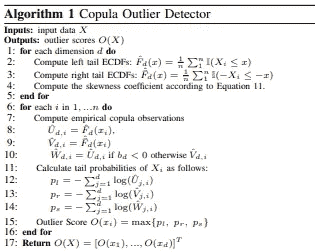
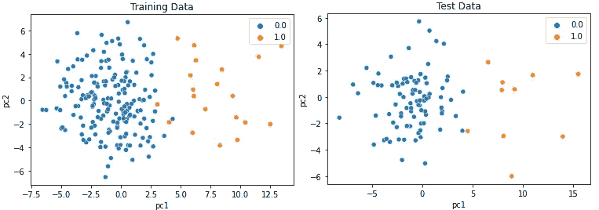
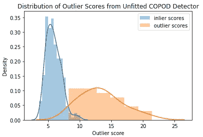
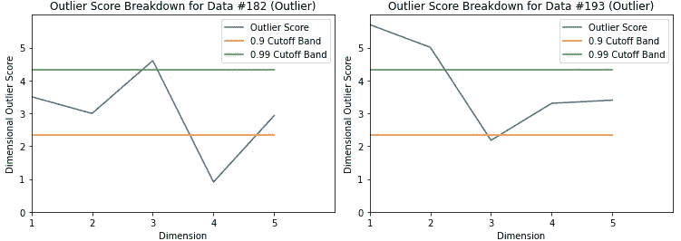

# 基于 COPOD 的快速准确异常检测

> 原文：<https://towardsdatascience.com/fast-accurate-anomaly-detection-based-on-copulas-copod-3133ce9041fa?source=collection_archive---------11----------------------->

## 一种基于 python 的快速、无参数、高度可解释的无监督异常检测方法

[图片](https://www.flickr.com/photos/30478819@N08/46513136054)由 [Marco Verch 专业摄影师](https://www.flickr.com/photos/30478819@N08/)

离群值或异常值是偏离数据集标准的数据点。它们使人怀疑它们是由不同的机制产生的。

> 异常检测(通常)是一项无监督的学习任务，目标是识别数据中的可疑观察。该任务受限于错误地将正常点标记为异常点以及未能标记实际异常点的成本。

异常检测的应用包括网络入侵检测、数据质量监控和金融市场中的价格套利。

基于 opula 的异常检测算法 COPOD 是一种新的异常检测算法。已经在`PyOD` python 包中实现了。

它有几个关键特性使其从竞争算法中脱颖而出:

*   确定性的
*   没有超参数！*(这很重要，因为很难调整异常值检测任务的超参数，因为真实标签很少、未知或难以获得)*
*   基准异常检测数据集上的最高性能
*   可解释且易于可视化的异常
*   快速且计算高效
*   扩展到高维数据集

COPOD 最大的挑战是算法背后复杂的数学。本文包含两个部分:

1.  copulas 关键概念的总结和 COPOD 算法的描述。
2.  python 中 COPOD 的教程，展示了如何使用这种方法轻松检测数据中的异常。

# 异常检测的 Copula 模型

## 定义的连接函数

什么是系词？

简单来说， **copula 描述了随机变量之间的依赖结构。**

具体来说，“一个 **copula** 是一个多元[累积分布函数](https://en.wikipedia.org/wiki/Cumulative_distribution_function)，对于它，每个变量的[边际概率](https://en.wikipedia.org/wiki/Marginal_probability)分布在区间[0，1]上是[均匀](https://en.wikipedia.org/wiki/Uniform_distribution_(continuous))”([维基百科](https://en.wikipedia.org/wiki/Copula_(probability_theory)))。

换句话说，您可以通过从 copula 中分离出每个变量的边际概率分布来描述高维数据集中的概率分布，copula 是描述变量之间相关性的多元概率分布。

> “连接函数是使我们能够从给定多元分布的依赖结构中分离出边际分布的函数。”

## COPOD 算法

COPOD 算法进行一些数学估计和转换来计算每行的异常值。

算法总结。下面详细描述。

**第一步:**对于数据集中的每个维度(即列)

1.  拟合左尾经验累积分布函数
2.  拟合右尾经验累积分布函数
3.  计算偏斜系数

**第二步:**使用**第一步**中的函数，计算

1.  左尾经验 copula
2.  右尾经验 copula
3.  每行的偏斜度校正的经验 copula 值

基本上，这将导致数据框中每个标量值(行+列)有 3 个新值。

> **copula 值**可以分别解释为左尾、右尾和偏斜校正概率。

**步骤 3:** 根据在**步骤 2** 中计算的值，计算数据集每一行的异常分数。这一步依赖于这样一个事实，即较小的尾部概率(又名耦合概率)会导致较大的负对数值。

对于每一行，

*   对左尾经验 copula 的负对数求和
*   对右尾经验 copula 的负对数求和
*   对偏斜度校正的经验 copula 的负对数求和

一行的异常分数是这些总和的最大值。

## 异常分数

解释:较高的异常分数表明数据实例的概率较低，因为它位于数据分布的尾部。

异常值分数位于(0，∞)之间，并且**可直接比较**。它们**并不**直接指示异常值概率。相反，它们**测量一行相对于数据集中其他点的可能性。**

要从 COPOD 获得异常值预测，有两个选项:

1.  对异常值分数设置阈值；任何得分超过阈值的行都是异常的
2.  选择 top- *k* 或 top-*k*百分点异常值分数。

*(在* `*PyOD*` *中，根据给定的* `*contamination*` *或训练数据中预期的异常部分自动设置阈值。稍后将详细介绍。)*

# Python 教程

COPOD 是用`[PyOD](https://github.com/yzhao062/pyod)` python 实现的，非常容易使用。

首先，加载或生成异常值检测数据。

这里，我使用 PyOD 中的`generate_data`函数来生成一个包含 200 个训练样本和 100 个测试样本的合成数据集。正态样本由多元高斯分布生成；异常样本是使用均匀分布生成的。

训练和测试数据集都有 5 个特征，10%的行被标记为异常。我在数据中加入了一点随机噪声，使得完美区分正常点和异常点变得稍微困难一些。

下面，我绘制了训练和测试数据集，使用 [PCA](https://scikit-learn.org/stable/modules/decomposition.html#pca) 投影到二维空间。

合成的训练和测试数据集，通过 PCA 降低到 2 维。

## 训练和检测

接下来，我根据训练数据拟合 COPOD，并根据测试数据进行评估。

运行`fit`和`decision_function`方法的时间不到 1 秒。

在 PyOD 中,(拟合的)异常值检测器有两个关键功能:`decision_function`和`predict`。

*   `decision_function`返回每一行的异常值。
*   `predict`返回一个由 0 和 1 组成的数组，指示每一行被预测为正常(0)还是异常值(1)。`predict`函数只是对`decision_function`返回的异常分数应用一个阈值。在初始化检测器时，根据指定的`contamination`速率参数设置自动校准阈值(例如`clf=COPOD(contamination=0.1`)。`contamination`表示训练数据中异常值的预期百分比。

## COPOD 不需要训练数据！

在现实世界中，您可能没有标记训练数据，这没关系！您仍然可以使用 COPOD 来检测异常值。

正如你在上面的例子中看到的，我初始化了 COPOD 算法，并简单地通过`decision_function`传递数据而没有拟合。异常值点的异常值分数通常远大于内点或正常数据点的异常值分数。

在应用中，为 COPOD 异常分数选择阈值通常是有用的，以便识别哪些数据作为异常来研究。

## 酷功能:异常解释

COPOD 可以解释哪个(些)特征对异常值的贡献最大。当数据集中有许多要素时，或者当您想要告诉人类审阅者算法为什么选择特定行作为异常值时，这尤其有用。

第 182 行和第 193 行的维度离群图。

上面的两个**维异常值图**用蓝线标出了被 COPOD 检测为异常值的两个真实异常值(行)的特征级异常值分数。x 轴表示特征，y 轴表示该特征单独的异常值分数。还绘制了第 90 和第 99 百分位异常值分数。

在左图中(第 182 行)，维度 3 的异常值分数超过了第 99 个百分点，这意味着这是该行异常值的主要原因。

在右图中(第 193 行)，维度 1 和维度 2 的异常值分数都超过了第 99 个百分点，这也是该行异常的原因。

# 感谢您的阅读！

COPOD 是一种快速、强大且易于使用的异常检测算法。我希望它能在您的异常检测工具箱中找到一席之地。

要了解关于 PyOD 和异常检测的更多信息，请查看其他文章。

 [## 为什么异常值检测很难

### 异常检测机器学习任务的考虑因素

pub.towardsai.net](https://pub.towardsai.net/why-outlier-detection-is-hard-94386578be6c)  [## PyOD:用于异常检测的统一 Python 库

towardsdatascience.com](/pyod-a-unified-python-library-for-anomaly-detection-3608ec1fe321)  [## 用 ECOD 简单统计取代异常值检测

### 一种新的基于 python 的、简单的、无参数的、可解释的无监督异常检测方法

medium.com](https://medium.com/geekculture/replace-outlier-detection-by-simple-statistics-with-ecod-f95a7d982f79)  [## Python 中离群点检测的局部离群点因子(LOF)深度指南

### 理论直觉、数学定义和实际代码示例

pub.towardsai.net](https://pub.towardsai.net/an-in-depth-guide-to-local-outlier-factor-lof-for-outlier-detection-in-python-5a6f128e5871) 

## 不是中等会员？今天就加入！

 [## 阅读亚历山德拉·阿米登(以及媒体上成千上万的其他作家)的每一个故事

### 作为一个媒体会员，你的会员费的一部分会给你阅读的作家，你可以完全接触到每一个故事…

alexandra-amidon.medium.com](https://alexandra-amidon.medium.com/membership) 

# 参考

【arxiv.org 【2009.09463】COPOD:基于 Copula 的离群点检测

[pyod/copod _ example . py at master yzhao 062/pyod GitHub](https://github.com/yzhao062/pyod/blob/master/examples/copod_example.py)