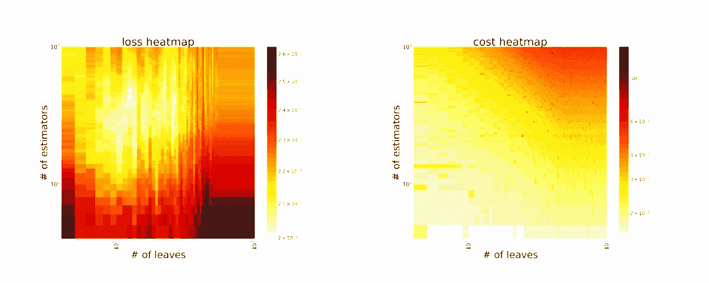
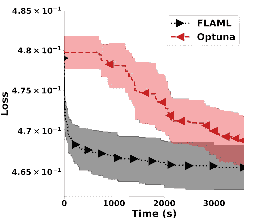
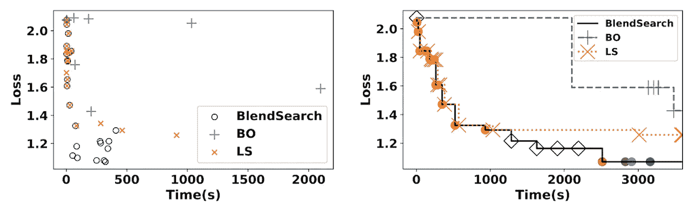
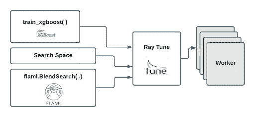
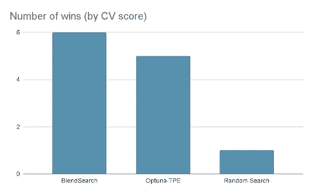

# 具有火焰+光线调节的快速自动控制

> 原文：<https://towardsdatascience.com/fast-automl-with-flaml-ray-tune-64ff4a604d1c?source=collection_archive---------9----------------------->

## [思想和理论](https://towardsdatascience.com/tagged/thoughts-and-theory)

## 微软研究人员已经开发了 [FLAML(快速轻量级 AutoML)](https://github.com/microsoft/FLAML) ，它现在可以利用[射线调整](https://docs.ray.io/en/master/tune/tutorials/overview.html)进行分布式超参数调整，以在集群上扩展 FLAML 的资源高效&易于并行化的算法



FLAML 的算法之一 CFO 调整 XGBoost 的叶子数和树数。这两个热图显示了所有配置的损失和成本分布。黑点是在 CFO 中评估的点。由线连接的黑点是在评估时产生更好损耗性能的点(图片由作者提供)。

**作者** : [吴青云](https://twitter.com/qingyun_wu)，[王驰](https://www.linkedin.com/in/chi-wang-49b15b16/)，[安东尼·鲍姆](https://www.linkedin.com/in/yard1/)，[理查德·廖](https://twitter.com/richliaw)和[迈克尔·加拉内克](https://twitter.com/GalarnykMichael)

[FLAML](https://github.com/microsoft/FLAML) 是微软研究院的一个轻量级 Python 库，它使用[尖端](https://arxiv.org/abs/2005.01571)算法，以一种高效且经济的方式找到精确的机器学习模型，该算法旨在节省资源并易于并行化。FLAML 还可以利用[光线调整](https://docs.ray.io/en/master/tune/index.html)进行分布式超参数调整，以在集群中扩展这些 AutoML 方法。

这篇博客强调了:

*   对经济的自动化方法的需求
*   带火焰的经济型汽车
*   如何使用光线调节来扩展 FLAML 的优化算法

# 经济型自动化方法的需求

众所周知，AutoML 是一项耗费资源和时间的操作，因为它需要反复试验才能找到性能良好的超参数配置。由于可能的配置值的空间通常非常大，因此需要一种经济的 AutoML 方法来更有效地搜索它们。

AutoML 中超参数搜索的高资源和时间消耗归结于以下两个因素:

1.  需要大量候选超参数配置(试验)来寻找性能良好的配置
2.  每个超参数的高“评估”成本，因为评估涉及用给定的训练数据训练和验证机器学习模型。

为了解决这两个因素，微软的研究人员开发了 [FLAML](https://github.com/microsoft/FLAML) (快速轻量级 AutoML)。

**什么是 FLAML？**

FLAML 是一个新发布的库，包含最先进的超参数优化算法。FLAML 利用搜索空间的结构来同时优化成本和模型性能。它包含由微软研究院开发的两种新方法:

*   成本节约优化(CFO)
*   混合搜索

成本节约优化(CFO)是一种以成本感知方式进行搜索过程的方法。该搜索方法从低成本的初始点开始，并逐渐向更高成本的区域移动，同时优化给定的目标(如模型损失或精度)。

Blendsearch 是 CFO 的扩展，结合了 CFO 的节俭和贝叶斯优化的探索能力。像 CFO 一样，BlendSearch 需要一个低成本的初始点作为输入(如果这样的点存在)，并从那里开始搜索。然而，与 CFO 不同，BlendSearch 不会等待本地搜索完全收敛后再尝试新的起点。

FLAML 中的经济 HPO 方法受到两个关键见解的启发:

1.  许多机器学习算法具有超参数，这些超参数会导致训练成本的巨大变化。例如，有 10 棵树的 XGBoost 模型比有 1000 棵树的模型训练起来要快得多。
2.  参数的“成本”通常是“连续和一致的”——评估树=10 比评估树=100 更便宜，树= 100 本身比评估树=500 更便宜。

总之，这些见解提供了关于成本空间中超参数的有用的*结构信息*。这些方法，即 CFO 和 BlendSearch，能够有效地利用这些见解来降低沿途发生的成本，而不影响收敛到最优解。

【FLAML 管用吗？

在最新的 [AutoML 基准测试](https://openml.github.io/automlbenchmark/)中， [FLAML](https://arxiv.org/pdf/1911.04706.pdf) 能够在超过 62%的任务上仅使用 10%的计算资源实现与最先进的 AutoML 解决方案相同或更好的性能。

FLAML 的性能归功于其经济的优化方法。新的 HPO 方法(CFO，BlendSearch)利用搜索空间的结构来选择搜索顺序，以获得良好的性能和低成本。在预算有限的情况下，这可以大大提高搜索效率。

图 1 显示了从 FLAML 和最先进的超参数调节库 [Optuna](https://github.com/optuna/optuna) 获得的典型结果，用于调节具有 9 维超参数的 LightGBM。你可以看到 FLAML 能够在更短的时间内实现更好的解决方案。



图一。在[分类数据集](https://www.openml.org/d/23517)上调整 LightGBM 的验证损失(1-auc)曲线。线条和阴影区域显示了 10 次运行的验证损失的平均值和标准偏差。该图中的结果是在没有并行化的情况下从 1 个 cpu 的实验中获得的(图片由作者提供)。

下面的代码示例展示了如何用几行代码开始使用 FLAML(假设提供了训练数据集并保存为`X_train`、`y_train`)。任务是用 60 秒的时间预算调整 LightGBM 模型的超参数。

```
**from** flaml **import** AutoML
automl = AutoML()
automl.fit(X_train=X_train, y_train=y_train, time_budget=60, estimator_list=['lgbm'])

''' retrieve best model and best configuration found'''
print('Best ML model:', automl.model)
print('Best hyperparameter config:', automl.best_config)
```

在这个例子中，我们在默认的搜索空间中搜索 LightGBM，FLAML 中已经提供了这个搜索空间。FLAML 提供了丰富的定制选项，如学习者类别、搜索空间、评估标准等。

# 演练示例

现在我们用一个玩具例子来展示 CFO 在用两个超参数调优 XGBoost 时的成本节约行为:树的数量和叶的数量。

```
'''create an XGBoost learner class with a customized search space'''
**from** flaml.model **import** XGBoostSklearnEstimator
**from** flaml **import** tune

**class** **MyXGB**(XGBoostSklearnEstimator):
​​    '''XGBoostSklearnEstimator with a customized search space'''
    @classmethod
    **def** **search_space**(cls, data_size, **params):
        upper = min(2**15, int(data_size))
        **return** {
            'n_estimators': {
                'domain': tune.lograndint(lower=4, upper=upper),
                'low_cost_init_value': 4,
            },
            'max_leaves': {
                'domain': tune.lograndint(lower=4, upper=upper),
                'low_cost_init_value': 4,
            },
        }

'''Use CFO in FLAML to tune XGBoost'''
**from** flaml **import** AutoML
automl = AutoML()
automl.add_learner(learner_name='my_xgboost', learner_class=MyXGB)
automl.fit(X_train=X_train, y_train=y_train, time_budget=15, estimator_list=['my_xgboost'], hpo_method='cfo')
```

# CFO 和 BlendSearch 如何工作

下面两张 gif 分别演示了 CFO 在损失和评估成本(即评估时间)空间的搜索轨迹。CFO 从一个低成本的初始点(通过搜索空间中的`low_cost_init_value`指定)开始，并按照其随机化的局部搜索策略执行局部更新。采用这样的策略，CFO 可以快速向低损耗区移动，表现出良好的收敛特性。此外，CFO 倾向于避免探索高成本区域，直到必要时。该搜索策略进一步基于[可证明的收敛速度和期望的有界成本](https://arxiv.org/abs/2005.01571)。


图二。CFO 在为 XGBoost 调整树叶的数量和树的数量。这两个热图显示了所有配置的损失和成本分布。黑点是在 CFO 中评估的点。由线连接的黑点是在评估时产生更好损耗性能的点(图片由作者提供)。

BlendSearch 进一步将 CFO 中使用的这种局部搜索策略与全局搜索相结合。它利用了 CFO 的节俭和贝叶斯优化等全局搜索方法的空间探索能力。具体来说，BlendSearch 维护一个全局搜索模型，并根据全局模型提出的超参数配置，随着时间的推移逐渐创建局部搜索线程。它进一步根据实时性能和成本来区分全局搜索线程和多个局部搜索线程的优先级。它可以进一步提高 CFO 在具有复杂搜索空间(例如，包含多个不相交、不连续子空间的搜索空间)的任务中的效率。

# FLAML 与贝叶斯优化性能

图 3 显示了 FLAML 中经济的 HPO 方法的典型行为(CFO 在该图中标记为“LS ”),对比了使用 11 个超参数调整 XGBoost 的贝叶斯优化(BO)方法。

从图 3(a)中，我们观察到 BO 中建议配置的评估时间可能非常长。当总资源有限时，例如 1 个 cpu 小时(或更少)，BO 不能给出令人满意的结果(图 3(b))。

FLAML 的 CFO(标记为 LS)和 BlendSearch 在快速找到好的配置方面具有明显的优势:它们能够专注于具有低评估时间的配置，同时导航具有良好性能(即低损失)的配置。



图 3。(a)是由不同方法提出的超参数配置的散点图，x 轴和 y 轴是评估时间和损失。超参数配置的评估时间是在训练数据上使用超参数配置训练机器学习模型并在验证数据集上验证其性能所花费的时间。这种损失就是验证损失。(b)显示了在挂钟时间内通过不同方法获得的最佳损耗。([图像来源](https://openreview.net/pdf?id=VbLH04pRA3)

# 如何利用 Ray Tune 的分布式调优来扩展 CFO 和 BlendSearch

为了加速超参数优化，您可能想要并行化您的超参数搜索。例如，BlendSearch 能够在并行设置中很好地工作:它利用多个搜索线程，这些线程可以独立执行，而不会明显降低性能。对于诸如贝叶斯优化的现有优化算法来说，这种期望的特性并不总是真实的。

为了实现并行化，FLAML 与 Ray Tune 进行了集成。Ray Tune 是一个 Python 库，通过允许您大规模利用尖端优化算法来加速超参数调整。Ray Tune 还允许您将超参数搜索从笔记本电脑扩展到集群，而无需更改代码。您可以在 FLAML 中使用光线调节，或者在光线调节中运行 FLAML 的超参数搜索方法，以并行化您的搜索。下面的代码示例展示了前一种用法，只需在 FLAML 中配置`n_concurrent_trials`参数即可实现。

```
'''Use BlendSearch for hyperparameter search, and Ray Tune for parallelizing concurrent trials (when n_concurrent_trials > 1) in FLAML to tune XGBoost'''
**from** flaml **import** AutoML
automl = AutoML()
automl.add_learner(learner_name='my_xgboost', learner_class=MyXGB)
automl.fit(X_train=X_train, y_train=y_train, time_budget=15, estimator_list=['my_xgboost'], hpo_method='bs', n_concurrent_trials=8)
```



Logo 来源( [XGBoost](https://github.com/dmlc/xgboost) 、 [FLAML](https://github.com/microsoft/FLAML) 、 [Ray Tune](https://github.com/ray-project/ray) )

下面的代码显示了后一种用法，这是一个如何将 BlendSearch 与 Ray Tune 结合使用的端到端示例。

```
**from** ray **import** tune 
**from** flaml **import** CFO, BlendSearch
**import** time

**def** **training_func**(config):
    '''evaluate a hyperparameter configuration'''
    # we use a toy example with 2 hyperparameters
    metric = (round(config['x'])-85000)**2 - config['x']/config['y']

    # usually the evaluation takes a non-neglible cost
    # and the cost could be related to certain hyperparameters
    # in this example, we assume it's proportional to x
    time.sleep(config['x']/100000)
    # use tune.report to report the metric to optimize    
    tune.report(metric=metric) 

# provide the search space
search_space = {
        'x': tune.lograndint(lower=1, upper=100000),
        'y': tune.randint(lower=1, upper=100000)
    }

# provide the low cost partial config
low_cost_partial_config={'x':1}

# set up BlendSearch
blendsearch = BlendSearch(
    metric="metric", mode="min",
    space=search_space,
    low_cost_partial_config=low_cost_partial_config)

blendsearch.set_search_properties(config={"time_budget_s": 60})

analysis = tune.run(
    training_func,    # the function to evaluate a config
    config=search_space,
    metric='metric',    # the name of the metric used for optimization
    mode='min',         # the optimization mode, 'min' or 'max'
    num_samples=-1,    # the maximal number of configs to try, -1 means infinite
    time_budget_s=60,   # the time budget in seconds
    local_dir='logs/',  # the local directory to store logs
    search_alg=blendsearch  # or cfo
    )

print(analysis.best_trial.last_result)  # the best trial's result
print(analysis.best_config)  # the best config
```

其他关键光线调节功能包括:

*   与 Tensorboard 和重量/偏差等实验跟踪工具自动集成
*   对 GPU 的支持
*   提前停止
*   一个 scikit-learn API，可以轻松地与 [XGBoost](https://www.anyscale.com/blog/distributed-xgboost-training-with-ray) 、 [LightGBM](https://www.anyscale.com/blog/introducing-distributed-lightgbm-training-with-ray) 、 [Scikit-Learn](https://github.com/ray-project/tune-sklearn) 等集成。

# 基准测试结果

我们进行了一项实验，以检查 BlendSearch 在高度并行化的设置中与 Optuna(使用多变量 TPE 采样器)和随机搜索相比表现如何。我们使用了来自 [AutoML 基准](https://www.openml.org/s/218)的 12 个数据集的子集。使用 ROC-AUC(多类数据集的加权一对一对比)使用三重交叉验证，平行进行 16 次试验，每次优化运行 20 分钟。用不同的随机种子重复运行三次。复制代码可以在这里找到[。](https://github.com/Yard1/Blendsearch-on-Ray-benchmark)



作者图片

BlendSearch 在 12 个数据集的 6 个中获得了最佳交叉验证分数。此外，BlendSearch 比随机搜索平均提高了 2.52%，而 Optuna 的平均提高为 1.96%。值得注意的是，BlendSearch 使用单变量 Optuna-TPE 作为其全局搜索器——使用多变量 TPE 最有可能进一步提高分数。


作者图片

此外，由于其成本节约的方法，BlendSearch 在相同的时间限制内，平均评估的试验次数是其他搜索者的两倍。这表明 BlendSearch 和其他算法之间的差距将随着时间预算的增加而增加。

# 结论

FLAML 是一个新发布的库，包含[最先进的](https://arxiv.org/abs/2005.01571)超参数优化算法，该算法利用搜索空间的结构来同时优化成本和模型性能。FLAML 还可以利用[射线调优](https://docs.ray.io/en/latest/tune/index.html)进行分布式超参数调优，从而在集群中扩展这些经济的 AutoML 方法。

有关 FLAML 的更多信息，请参见 [GitHub 资源库](https://github.com/microsoft/FLAML)和[项目页面](http://aka.ms/flaml)。如果你想了解雷的最新消息，可以考虑[关注 twitter 上的@ Ray distributed](https://twitter.com/raydistributed)和[注册时事通讯](https://anyscale.us5.list-manage.com/subscribe?u=524b25758d03ad7ec4f64105f&id=d94e960a03)。

*原载于*[*https://www.anyscale.com*](https://www.anyscale.com/blog/fast-automl-with-flaml-ray-tune)*。*