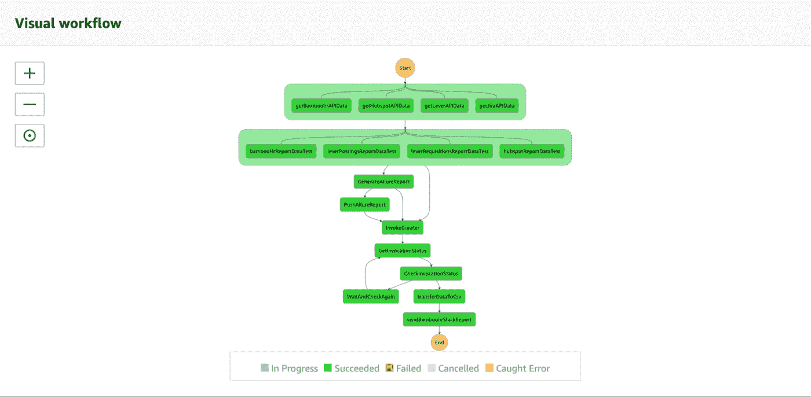
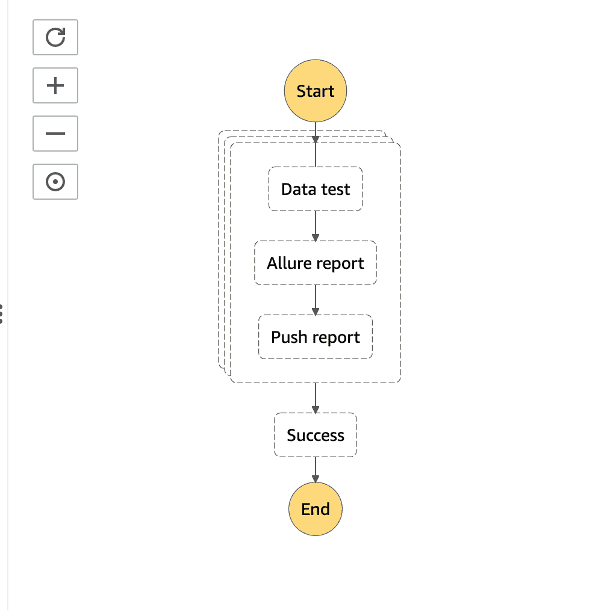
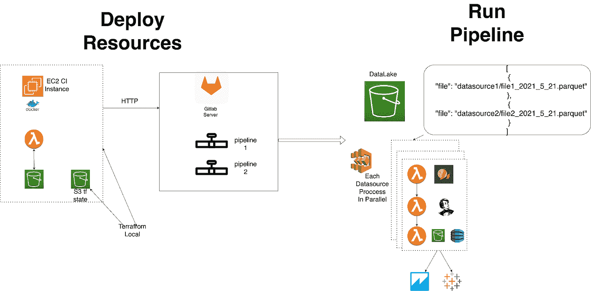

# 基于远大期望的快速数据质量框架

> 原文：<https://towardsdatascience.com/fast-data-quality-framework-on-great-expectations-8921331a08c2?source=collection_archive---------19----------------------->

图片由 [your_photo](https://www.freepik.com/yourphoto) 来自 [freepik](https://www.freepik.com)

在我之前的[文章](/monitoring-data-quality-in-a-data-lake-using-great-expectations-and-allure-built-serverless-47fa1791af6a)中，我解释了如何使用 Great Expectations (GE)和 Allure Serverless 在数据湖中构建和实现数据质量监控。虽然我描述的过程非常简单明了，但是手动实现需要大量的时间和资源，这就是为什么我提供了一种更快的方法来提高新环境中的数据质量。在本文中，我将讨论前一种方法的限制，并提供规避它们的方法。

# 这部作品的要点

在整理这个简短的指南时，我的目标是让您能够减少重复的手工工作，并加速和简化诸如创建 AWS 资源、生成和上传必要的配置文件以及编写[数据 QA](https://provectus.com/data-quality-assurance/) 测试等任务。

为了实现这一点，我们将选择不使用无服务器框架。相反，我们将应用 Terraform 脚本，并使用 Pandas Profiling 来基于分析报告生成数据测试。您所需要做的就是在 config 中设置变量并运行脚本。部署后，使用要检查数据质量的文件运行 Step 函数管道。

请记住，您的输入数据很重要。我们在亚马逊 S3 使用一个数据湖，每周安排和运行数据检查。我们不使用历史数据和筛选数据，只使用当前 DAG 中正在处理的数据。

# 分析和生成测试

在我们之前的实现中，我们使用 Pandas Profiling 进行分析，并对测试寄予厚望，如下所示:

> *并行运行 AWS Lambda，对每个数据集使用 Pandas Profiling 和 GE 测试套件，并将每个数据集存储/服务为静态 S3 网站。*

阶跃函数是这样工作的:

作者图片

现在，我们将把概要分析和测试分解成单独的步骤。首先，让我们检查配置文件数据集。

接下来，我们需要基于分析结果生成一个测试套件。因为 Pandas Profiling 默认情况下保存没有失败预期的套件，所以我们将无法配置。让我们通过添加以下内容来覆盖期望类:

之后，您将能够为飞行测试生成器配置您自己的预期:

确保使用新的期望处理器，这样套件就可以保存在亚马逊 S3 上:

# 运行数据质量保证测试

接下来，让我们弄清楚如何用 GE 引擎开始运行测试。

接下来的两步类似于我在[之前的解决方案](/monitoring-data-quality-in-a-data-lake-using-great-expectations-and-allure-built-serverless-47fa1791af6a)中描述的步骤:在 Allure Report 中创建一个报表，并将一个数据透视表推送到 Amazon DynamoDB。如果省略这些步骤，为每个数据源创建并行迭代的 StepFunctions 管道将如下所示:

作者图片

要运行管道，需要使用这个模板: *file_path* 和*new _ expectation*bool value，默认为“true”——它会为每次运行创建一个新的期望套件。您也可以运行它一次，并将其设置为“false”来开始使用这个测试套件。

这只是一个大概的概念。现在，让我们谈谈使用 Terraform 和部署我们的解决方案。为了解释这一部分，我将火炬传递给普罗维特斯的开发人员[叶戈尔·格罗多夫](https://www.linkedin.com/in/yegor-gorodov-33556368/)。

# DevOps 支持

## 部署

我们选择使用 AWS 作为平台来运行我们的快速数据质量保证解决方案。它为我们提供了构建可扩展基础设施和以不同方式管理基础设施的所有必要服务。这里我们有两个选择:

1.  云的形成
2.  将（行星）地球化（以适合人类居住）

目前，我们使用 Terraform 作为主要工具来构建和管理可再生的基础设施。当然，使用它有好处也有坏处，但它非常适合快速数据 QA。

## 第 1 步—又名“手持”

至此，我们在 AWS 的教育账号中已经有了一个运行快速的数据 QA MVP。我们应该能够在我们的主账户/独立账户中复制它。为此，我们将检查基础设施的哪些部分需要使用 Terraform 来描述。在我们的案例中，它们是:

*   S3 配置的桶
*   DynamoDB 表
*   ECR(三个回购，每个 lambda 一个)
*   Lambdas(每步一个，总共三个)
*   阶跃函数
*   SSM 参数存储

一旦我们理解了我们需要描述哪些资源，就该创建一个新的 Terraform 项目了。在常规的“terraform init”之前，我们需要添加一个 AWS 提供者。​

在 AWS 中，每个资源都有自己的标识符。它可以是“名称”、“id”、“arn”或任何类似的标识符。我们有标识符的键和标识符本身；此外，我们需要在 Terraform 脚本中正确命名“resource ”,以便我们可以命令:“Terraform，请将名为‘my resource’的资源导入到‘terra form _ resource’。my resource’。”之后，我们可以简单地将导入的状态复制到 Terraform 脚本中，瞧！这一资源现在由 Terraform 管理。

## 步骤 2 —参数化

一旦我们导入了 AWS 资源并且它们由 Terraform 管理，我们需要在运行之前配置 GreatExpectation 库。GE 的常规方法是将配置和插件文件存储在特定的 S3 键下。所以，让我们参数化和模板化它们。

​

首先是“great _ expecations.yml”文件。这里我们只需要模板化一个参数—“bucket _ name”，如下所示:

此外，我们有一组 GreatExpectation 文件，如“插件”和“自定义样式”。我们应该照原样复制它们，但把它们存放在一个结构僵硬的 S3 桶里。最好的方法是在 Terraform 目录中复制一个所需的文件结构，然后使用带有模板化密钥路径的“aws_s3_bucket_object”。

## 第 3 步— CI

我们使用 Git 作为版本控制系统。我们将代码库存储在我们自己的 GitLab 服务器上。

因为我们有三个 lambdas，每个都需要自己的 docker 映像，所以我们需要一个地方来创建这些 docker 并将其推送到 ECR。为此，我们将使用 Gitlab CI Runner。有几个基于 Terraform 的开源解决方案，但它们都提供了我们不需要的功能。相反，我们决定建立一个简单的“项目内”地形模块，包括:

*   VPC 和网络详细信息
*   带有“launch_template”的 AWS 自动缩放组
*   仅允许 ECR 操作的 CI 用户和 IAM 角色

**VPC**

我们只需要一个基本的 VPC，带有“aws_internet_gateway”，公共的“aws_subnet”，“aws_route_table”，“aws_route”，“aws_route_table_association”，以及带有 egress 的安全组。

**带“launch_template”的 AWS 自动缩放组**

由于我们不打算使用 Ansible 这样的供应工具，我们决定将“aws_launch_template”与“aws_autoscaling_group”和一个简单的 *sh 模板*一起使用，该模板由 Terraform 模板化并在启动时运行。这个脚本安装 docker、docker-machine、gitlab-runner 二进制文件，并运行这个 bin 在 gitlab 服务器上注册 runner。

# GitLab Runner

*   安装转轮

*   登记赛跑者

在应用了一个 GitLab-CI 模块后，我们可以在 GitLab UI 中看到一个注册的 runner，我们准备创建一个“gitlab_ci.yml”文件，该文件带有构建 docker 映像并将其推送到 ECR 的指令。此外，我们需要向 CI 管道传递额外的 env 变量，以参数化管道的每个阶段。为此，使用以下 Terraform 代码:

**仅允许 ECR 操作的 CI 用户和 IAM 角色**

我们不想给那些只使用管道 CI 部分的用户太多的访问权限。为了限制访问，我们只需要创建一个具有 ECR 策略的 AWS 用户:

## 第四步——总结

现在，我们有:

*   Gitlab CI 模块
*   带有 lambdas 等的主模块。
*   根模块具有上述两个模块，一个管理远程状态，以及模块和提供者的变量

以上所有内容都允许我们执行以下用例:

1.  向 GreatExpectation 测试套件添加元素或对其进行更改
2.  合并对特定 Git 分支的更改
3.  Gitlab CI 运行一个管道，打包一个新的 Docker 映像并将其推送到 AWS ECR
4.  更改 Terraform 中的 docker_image 变量
5.  应用地形

# 结论

作者图片

最终的结果是，我们得到了一个点击式的 Terraform 脚本，可以很容易地为新项目进行配置。一旦我们运行它，我们将有一个基于 Lambda/Step 函数的现成的数据质量管道，可以与任何 BI 仪表板工具一起使用。

## 要了解更多关于 Provectus 数据质量保证实践的信息，请访问[网页](https://provectus.com/data-quality-assurance/)