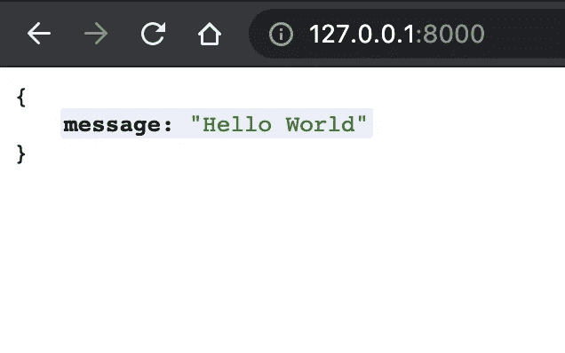
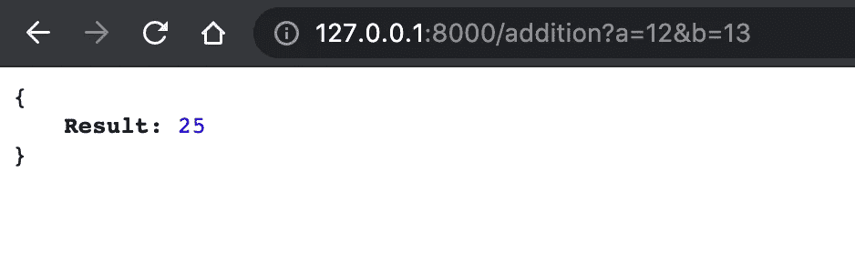
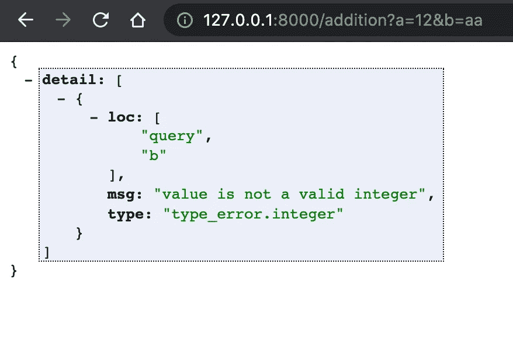
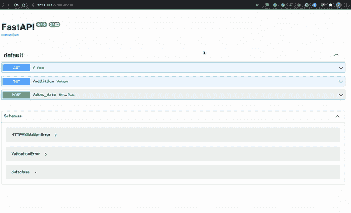

# 使用 FastAPI 的快速简单的 Python APIs

> 原文：<https://towardsdatascience.com/fast-easy-python-apis-using-fastapi-83c3115d1045?source=collection_archive---------15----------------------->

## 最好的 python 框架之一！


Solaiman Hossen 在 [Unsplash](https://unsplash.com/s/photos/fast?utm_source=unsplash&utm_medium=referral&utm_content=creditCopyText) 上拍摄的照片

[FastAPI](https://fastapi.tiangolo.com/) 是一个现代的、基于 python 的高性能 web 框架，用于创建 Rest APIs。它的主要特点是速度快，编码速度提高了 300%，bug 少，易于使用，对生产友好。

关于 Fast API 的唯一缺点是它相对较新，它的社区不像其他框架如 [Flask](https://predictivehacks.com/python-rest-api-example/) 那么大，但我认为它会快速增长，因为许多公司如微软、网飞和优步已经在使用它。

在这篇文章中，我将向您展示如何使用 Fast API 创建一些简单的 GET 和 POST APIs。

# 装置

```
pip install fastapi
```

我们还需要一个 ASGI 服务器，用于像[uvicon](https://www.uvicorn.org/)这样的产品。

```
pip install uvicorn
```

# 你好世界

让我们从创建最简单的 API 开始。它将返回一个 JSON 消息“Hello World”。

用下面的代码创建一个“main.py”文件。

```
#import FastAPI
from fastapi import FastAPI

#create a FastAPI instance
app = FastAPI()

#create a path operation
@app.get(“/”)
#define the path operation function
def root():
 return {“message”: “Hello World”}
```

如您所见，使用 FastAPI 创建 API 有 4 个主要步骤。第一步是导入它，然后创建一个 FastAPI 实例(在我们的例子中称为 app)。

之后，我们必须创建一个路径操作。这意味着我们必须设置 URL 路径(在我们的例子中是'/'，但我们可以设置任何类似'/helloworld ')及其操作。我们所说的操作是指 HTTP 方法，如 GET、POST、PUT 和 DELETE(在我们的例子中，操作是 **get** )。

最后，我们必须定义路径操作函数。换句话说，一个函数返回我们想从我们的 API 中得到的东西(在我们的例子中是一个带有 Hello World 消息的 JSON。

现在，通过终端导航到 main.py 文件夹，并运行以下命令:

```
uvicorn main:app --reload
```

您应该会看到以下输出。


这意味着我们的 API 运行在 [http://127.0.0.1:8000。让我们看看我们得到了什么。](http://127.0.0.1:8000.)



# 路径参数

假设我们想要创建一个 GET API，它接受两个数字作为输入，并返回它们的和。要添加参数你只需要把它们作为路径操作函数的参数。

```
from fastapi import FastAPI

app = FastAPI()

[@app](http://twitter.com/app).get("/addition")
def sum(a, b):
    return {"Result": a+b}
```

可以通过添加符号“**”向 URL 传递参数？**"然后参数之间用符号“&”隔开。让我们试试下面的方法:

```
[http://127.0.0.1:8000/addition?a=12&b=13](http://127.0.0.1:8000/addition?a=12&b=13)
```



就这么简单。您还可以设置参数的类型，如整数或字符串，这样，如果用户输入不同的类型，它将返回一个警告。

```
@app.get("/addition")**def** sum(a:int, b:int):
    **return** {"Result": a**+**b}
```

让我们抽出一根绳子，看看我们会得到什么。

```
[http://127.0.0.1:8000/addition?a=12&b=aa](http://127.0.0.1:8000/addition?a=12&b=aa)
```



# 发布 API

我将向您展示如何创建一个 POST API，它将 JSON 文件作为输入。让我们看一个简单的例子。

```
from fastapi import FastAPI
from pydantic import BaseModel

app = FastAPI()

class inputs(BaseModel):
    a:int
    b:int
    c:int
    d:int

[@app](http://twitter.com/app).post('/show_data')
def show_data(data: inputs):
    return({"data":[data.a,data.b,data.c,data.d]})
```

我们必须导入 **BaseModel** 并创建一个 BaseModel 类，它包含 JSON 文件的变量(在我们的例子中是 a，b，c，d)。然后，我们必须将该类设置为操作函数中的一个变量(在我们的例子中，**数据:输入**)。现在，我们可以使用类变量的名称和它的变量名称(如 data.a)来访问函数内部的变量，以访问变量 a、data.b 等。

FastAPI 自动为我们提供了 [**SwaggerUI**](https://swagger.io/tools/swagger-ui/) ，这是一个天才且非常有用的 UI，允许我们可视化 API 的资源并与之交互。它还可以用于测试，甚至是像上面这样的 POST APIs。您可以通过在 APIs URL 中添加 **/docs** 来访问它。

```
[http://127.0.0.1:8000/docs](http://127.0.0.1:8000/docs)
```



正如你在上面的视频中看到的，我们已经测试了我们的 API，它运行得很完美。

# 案例研究:通过 REST API 服务于机器学习模型

对于这个例子，我们将使用著名的虹膜数据集训练一个简单的 ML 模型来预测虹膜的类型(Setosa、Versicolour 和 Virginica)。然后，我们将使用 FastAPI 创建一个 POST API，它将输入特性并返回预测。

首先，让我们训练我们的模型并将其保存到 pickle 文件中。

```
from sklearn import datasets
from sklearn.linear_model import LogisticRegression
import pandas as pd
iris = datasets.load_iris()
features=pd.DataFrame(iris['data'])
target=iris['target']
model=LogisticRegression(max_iter=1000)
model.fit(features,target)

import pickle
pickle.dump(model, open('model_iris', 'wb'))
```

现在，我们准备创建我们的 API。

```
from fastapi import FastAPI
from pydantic import BaseModel

app = FastAPI()

class iris(BaseModel):
    a:float
    b:float
    c:float
    d:float

from sklearn.linear_model import LogisticRegression
import pandas as pd
import pickle
#we are loading the model using pickle
model = pickle.load(open('model_iris', 'rb'))

[@app](http://twitter.com/app).post('/make_predictions')
async def make_predictions(features: iris):
    return({"prediction":str(model.predict([[features.a,features.b,features.c,features.d]])[0])})
```

现在，如果你用下面的 JSON 输入上面的 API，你会得到一个预测。

```
{
  "a": 1.1,
  "b": 3.3,
  "c": 5,
  "d": 1
}{
  "prediction": "2"
}
```

# 总结一下

FastAPI 是 Rest APIs 的最佳 Python 框架之一，因为它快速、简单且对生产友好。它的社区将会快速发展，因为像网飞、优步和微软这样的公司已经在使用它了。你不需要任何比我们在这篇文章中提到的更多的东西，所以开始尝试吧！

*最初发表于 https://predictivehacks.com*[。](https://predictivehacks.com/fast-easy-python-apis-using-fastapi/)