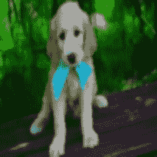
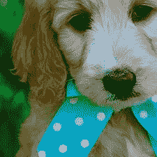
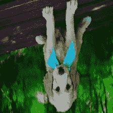
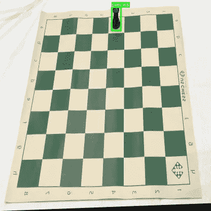
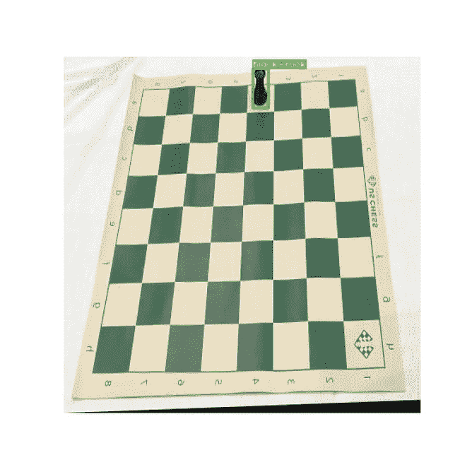
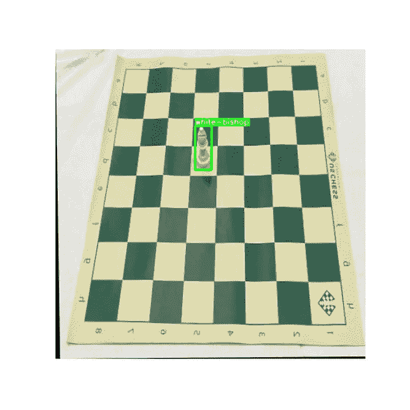
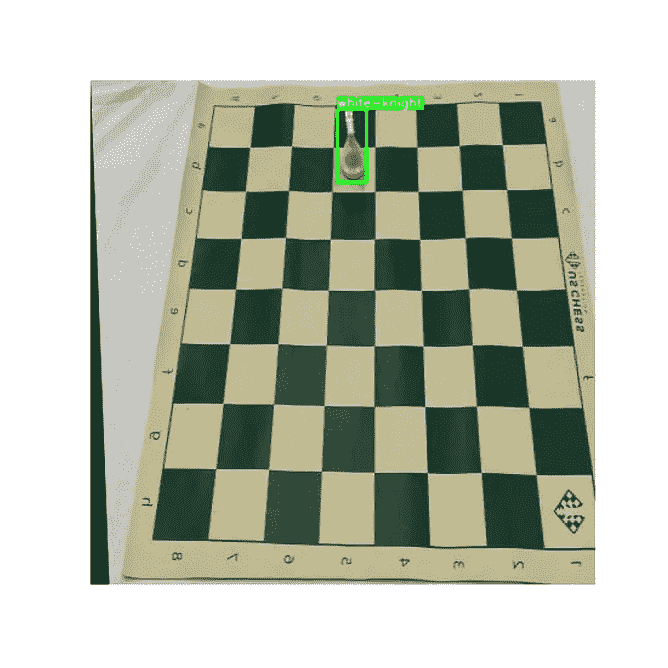
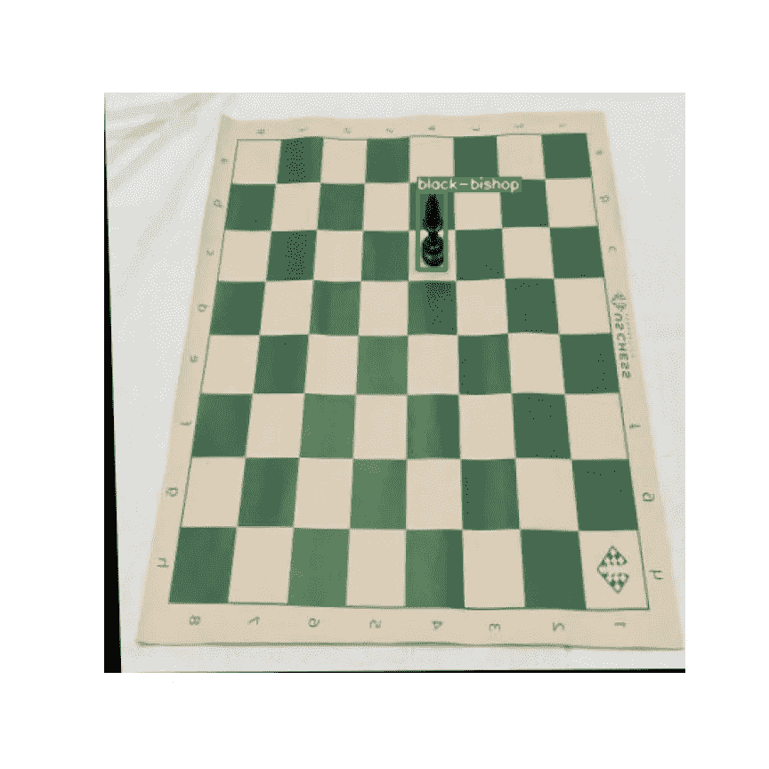
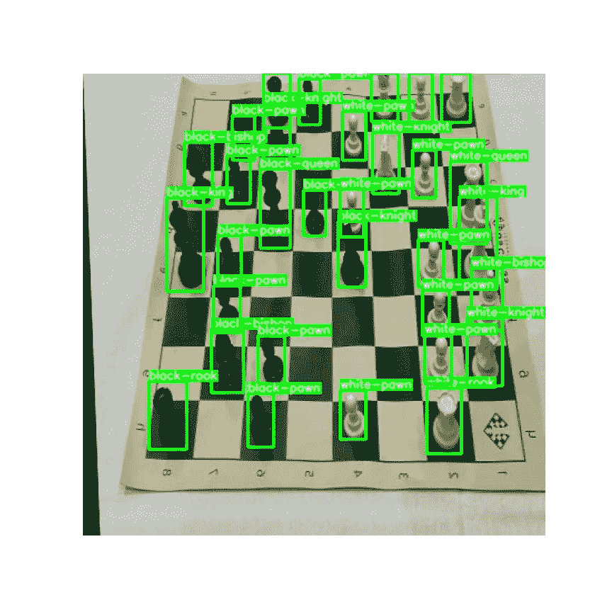
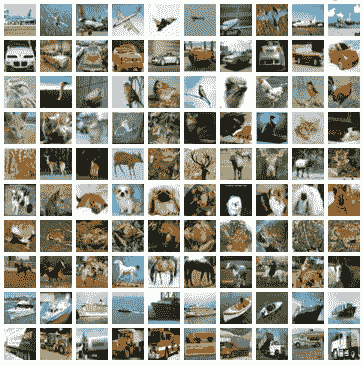

# Python 中的快速要素工程:影像数据

> 原文：<https://towardsdatascience.com/fast-feature-engineering-in-python-image-data-5d3a8a7bf616?source=collection_archive---------11----------------------->

## 使您的图像更适合输入 ML 系统


乔纳森·博尔巴在 [Unsplash](https://unsplash.com?utm_source=medium&utm_medium=referral) 上的照片

> “在任何一种数据丰富的环境中，寻找模式都很容易；平庸的赌徒就是这样。关键在于确定这些图案代表的是噪音还是信号。”
> ― **内特·西尔弗**

本文是我的“快速特征工程”系列的第 2 部分。如果您还没有读过我的第一篇关于表格数据的文章，那么我请求您在这里查看一下:

</fast-feature-engineering-in-python-tabular-data-d050b68bb178>  

本文将研究在执行图像处理作为我们机器学习工作流程的一部分时要遵循的一些最佳实践。

# 图书馆

```
import random
from PIL import Image
import cv2
import numpy as np
from matplotlib import pyplot as plt
import json
import albumentations as A
import torch
import torchvision.models as models
import torchvision.transforms as transforms
import torch.nn as nn
from tqdm import tqdm_notebook
from torch.utils.data import DataLoader
from torchvision.datasets import CIFAR10
```

# 调整图像大小/缩放图像

调整大小是该领域深度学习实践者所做的最基本的转换。这样做的主要原因是为了确保我们的深度学习系统接收到的输入是**一致的**。

调整大小的另一个原因是**减少模型中参数**的数量。较小的维度意味着较小的神经网络，因此节省了我们训练模型所需的时间和计算能力。

## ***信息丢失怎么办？***

当你从大图中缩小尺寸时，一些信息确实会丢失。然而，根据您的任务，您可以选择愿意为训练时间和计算资源牺牲多少信息。

例如， [**对象检测任务**](https://en.wikipedia.org/wiki/Object_detection) 将要求您保持图像的纵横比，因为目标是检测对象的准确位置。

相比之下，图像分类任务可能需要您将所有图像调整到指定的大小(224 x 224 是一个很好的经验法则)。


([来源](https://pixabay.com/photos/goldendoodle-puppy-two-months-1234760/))

调整大小后，我们的图像看起来像这样:


([来源](https://pixabay.com/photos/goldendoodle-puppy-two-months-1234760/))

## *为什么要进行图像缩放？*

与表格数据类似，为分类任务缩放图像可以帮助我们的深度学习模型的学习速率更好地收敛到最小值。

缩放可确保某个特定维度不会支配其他维度。关于这一点，我在 StackExchange 上找到了一个很棒的答案。你可以在这里 读到 [**。**](https://stats.stackexchange.com/questions/185853/why-do-we-need-to-normalize-the-images-before-we-put-them-into-cnn)

一种特征缩放是**标准化**我们的像素值的过程。我们通过从每个通道的像素值中减去每个通道的平均值，然后通过标准偏差对其进行划分。

当训练用于分类任务的模型时，这是特征工程的流行选择。

***注意:与调整大小一样，在执行对象检测和图像生成任务时，可能不希望进行图像缩放。***

上面的示例代码演示了通过标准化来缩放图像的过程。还有其他形式的缩放，如**居中**和**正常化**。

# 扩充(分类)

增强图像背后的主要动机是由于计算机视觉任务需要可观的数据。通常，由于多种原因，获得足够的图像用于训练可能被证明是具有挑战性的。

图像增强使我们能够通过稍微修改原始样本来创建新的训练样本。

在这个例子中，我们将看看如何为分类任务应用普通增强。我们可以使用**albuminations**库的现成实现来做到这一点:



高斯模糊、随机裁剪、翻转([来源](https://pixabay.com/photos/goldendoodle-puppy-two-months-1234760/))

通过应用图像增强，我们的深度学习模型可以更好地概括任务(避免过度拟合)，从而提高其对未知数据的预测能力。

# 增强(物体检测)

Albumentations 库也可用于为其他任务(如对象检测)创建增强功能。对象检测要求我们在感兴趣的对象周围创建边界框。

当试图用边界框的坐标来注释图像时，处理原始数据可能被证明是具有挑战性的。

幸运的是，有许多公开和免费可用的数据集，我们可以使用它们来创建对象检测的增强管道。一个这样的数据集是 [**象棋数据集**](https://public.roboflow.com/object-detection/chess-full) 。

该数据集包含棋盘上 606 个棋子的图像。

除了图像之外，还提供了一个 JSON 文件，其中包含与单个图像中每个棋子的边界框相关的所有信息。

通过编写一个简单的函数，我们可以在应用增强后可视化数据:



作者图片

现在，让我们尝试使用白蛋白创建一个增强管道。

包含注释信息的 JSON 文件有以下键:

```
dict_keys([‘info’, ‘licenses’, ‘categories’, ‘images’, ‘annotations’])
```

`images`包含关于图像文件的信息，而`annotations`包含关于图像中每个对象的边界框的信息。

最后，`categories`包含映射到图像中棋子类型的键。

```
image_list = json_file.get('images')
anno_list = json_file.get('annotations')
cat_list = json_file.get('categories')
```

`image_list`:

```
[{'id': 0,
  'license': 1,
  'file_name': 'IMG_0317_JPG.rf.00207d2fe8c0a0f20715333d49d22b4f.jpg',
  'height': 416,
  'width': 416,
  'date_captured': '2021-02-23T17:32:58+00:00'},
 {'id': 1,
  'license': 1,
  'file_name': '5a8433ec79c881f84ef19a07dc73665d_jpg.rf.00544a8110f323e0d7721b3acf2a9e1e.jpg',
  'height': 416,
  'width': 416,
  'date_captured': '2021-02-23T17:32:58+00:00'},
 {'id': 2,
  'license': 1,
  'file_name': '675619f2c8078824cfd182cec2eeba95_jpg.rf.0130e3c26b1bf275bf240894ba73ed7c.jpg',
  'height': 416,
  'width': 416,
  'date_captured': '2021-02-23T17:32:58+00:00'},
.
.
.
.
```

`anno_list`:

```
[{'id': 0,
  'image_id': 0,
  'category_id': 7,
  'bbox': [220, 14, 18, 46.023746508293286],
  'area': 828.4274371492792,
  'segmentation': [],
  'iscrowd': 0},
 {'id': 1,
  'image_id': 1,
  'category_id': 8,
  'bbox': [187, 103, 22.686527154676014, 59.127992255841036],
  'area': 1341.4088019136107,
  'segmentation': [],
  'iscrowd': 0},
 {'id': 2,
  'image_id': 2,
  'category_id': 10,
  'bbox': [203, 24, 24.26037020843023, 60.5],
  'area': 1467.752397610029,
  'segmentation': [],
  'iscrowd': 0},
.
.
.
.
```

`cat_list`:

```
[{'id': 0, 'name': 'pieces', 'supercategory': 'none'},
 {'id': 1, 'name': 'bishop', 'supercategory': 'pieces'},
 {'id': 2, 'name': 'black-bishop', 'supercategory': 'pieces'},
 {'id': 3, 'name': 'black-king', 'supercategory': 'pieces'},
 {'id': 4, 'name': 'black-knight', 'supercategory': 'pieces'},
 {'id': 5, 'name': 'black-pawn', 'supercategory': 'pieces'},
 {'id': 6, 'name': 'black-queen', 'supercategory': 'pieces'},
 {'id': 7, 'name': 'black-rook', 'supercategory': 'pieces'},
 {'id': 8, 'name': 'white-bishop', 'supercategory': 'pieces'},
 {'id': 9, 'name': 'white-king', 'supercategory': 'pieces'},
 {'id': 10, 'name': 'white-knight', 'supercategory': 'pieces'},
 {'id': 11, 'name': 'white-pawn', 'supercategory': 'pieces'},
 {'id': 12, 'name': 'white-queen', 'supercategory': 'pieces'},
 {'id': 13, 'name': 'white-rook', 'supercategory': 'pieces'}]
```

我们必须改变这些列表的结构，以创建一个高效的管道:

现在，让我们创建一个简单的增强管道，水平翻转我们的图像，并为边界框添加一个参数:

最后，我们将创建一个类似于 Pytorch 提供的 [**数据集类**](https://pytorch.org/docs/stable/_modules/torch/utils/data/dataset.html#Dataset) 的数据集。为此，我们需要定义一个实现方法`__len__`和`__getitem__`的类。

以下是对自定义数据集进行迭代时的一些结果:



作者图片



作者图片

因此，我们现在可以轻松地将这个自定义数据集传递给数据加载器来训练我们的模型。

# 特征抽出

您可能听说过预训练模型用于训练图像分类器和其他监督学习任务。

但是，您知道吗，您还可以使用预先训练的模型来提取图像的特征。

简而言之，特征提取是一种降维形式，其中大量像素被简化为更有效的表示。

这主要用于无监督的机器学习任务，如反向图像搜索。

让我们尝试使用 Pytorch 的预训练模型从图像中提取特征。为此，我们必须首先定义我们的特征提取器类:

请注意，在第 4 行中，创建了一个新模型，原始模型的所有层都保存为最后一层。您会记得，神经网络中的最后一层是用于预测输出的密集层。

然而，由于我们只对提取特征感兴趣，所以我们不需要这最后一层。因此，它被排除在外。

然后，我们通过将 torchvision 的预训练`resnet34`模型传递给`ResnetFeatureExtractor`构造器来利用它。

让我们使用著名的 [**CIFAR10 数据集**](https://paperswithcode.com/dataset/cifar-10) (50000 张图像)，并对其进行循环以提取特征。



CIFAR10 数据集([来源](https://www.kaggle.com/c/cifar-10))

我们现在有 50000 个图像特征向量的列表，每个特征向量的大小为 512(原始 resnet 模型的倒数第二层的输出大小)。

```
print(f"Number of feature vectors: {len(feature_list)}") #50000
print(f"Number of feature vectors: {len(feature_list[0])}") #512
```

因此，这个特征向量列表现在可以被诸如 KNN 的统计学习模型用来搜索相似的图像。

如果你已经走到这一步，那么非常感谢你阅读这篇文章！我希望你有美好的一天！😄

**👉** [**文章中使用的代码**](https://github.com/Sayar1106/TowardsDataSciencecodefiles/tree/master/fast_feature_engineering)

下次见！✋

# 参考资料:

*   [https://www.cs.toronto.edu/~kriz/cifar.html](https://www.cs.toronto.edu/~kriz/cifar.html)
*   [https://www.practicaldeeplearning.ai/](https://www.practicaldeeplearning.ai/)