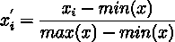
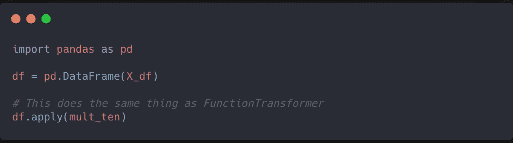
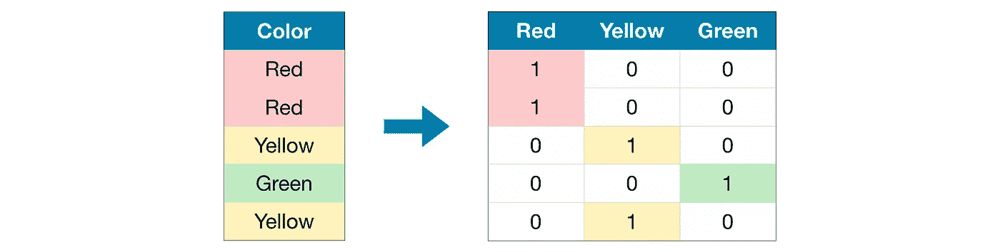

# Python 中的快速要素工程:表格数据

> 原文：<https://towardsdatascience.com/fast-feature-engineering-in-python-tabular-data-d050b68bb178?source=collection_archive---------12----------------------->

## 特征工程

## 使您的表格数据更适合输入 ML 系统


亚历山大·辛恩在 [Unsplash](https://unsplash.com?utm_source=medium&utm_medium=referral) 上的照片

> 作为数据科学家，我们的工作是从噪音中提取信号。”
> 
> *―* [*丹尼尔·唐克朗*](https://www.linkedin.com/in/dtunkelang/) *，顾问/顾问*

通常被称为数据科学中的秘方，特征工程可能是数据清理工作流程中最重要的一步。

您的特征越好，模型的预测能力就越强。

在本文中，我们将探讨使用 Python 中流行的数据科学库从数据中有效地设计和提取要素的许多方法。

表格数据是数据科学从业者使用的最常见的数据类型。在这种格式中，数据以行和列的形式排列。

我们来看看表格数据面临的一些常见问题，以及如何解决。

# 🔢处理数字数据

让我们使用`sklearn.datasets`模块创建一个具有 10000 行和 25 个特征的合成数据集。


X_df 的内容

## **缩放、标准化和规范化**

训练线性模型(如线性/逻辑回归和 SVM)时，缩放数据集会对模型性能产生巨大影响。

因为这些模型是使用距离度量来优化的，缩放确保具有**较大值的特征不会支配**模型拟合的结果。

在我们的第一种缩放方法中，我们将使用由`sklearn`提供的`MinMaxScaler`来将每个特征缩放到值 *-1* 和 *1* 之间。


X_df 的内容

`MinMaxScaler`接受一个名为`feature_range`的参数，用户可以在其中指定所需的范围。根据您的特征是否具有正值，保持范围为 *-1* 到 *1* 或 *0* 到 *1* 被认为是最佳实践。

在引擎盖下，这是正在计算的:



其中特征中的元素与特征的最小值的差除以特征的范围*。*

*另一种形式的缩放被称为**标准化**，其中每个特征被转换为具有平均值 *0* 和标准偏差 *1。*这对于**正常发布**我们的功能非常有用。*

*`StandardScaler`模块可用于标准化我们的功能:*

****

*X _ df _ 标准化的内容*

*标准化工作如下:*

**

*其中特征的每个单独元素减去特征集的*均值*并除以*标准差*。*

*到目前为止，我们已经研究了在特征级操作的缩放方法。像**单位长度** **归一化**这样的方法也支持跨观测值的缩放。*

*当数据具有大量等效特征时，如**文本数据**，这种类型的标准化非常有用，因为每个单词都被视为一个特征。*

*`Normalizer`缩放每个观察值，使其单位范数长度为 1。*

****

*X_df_normalized 内容*

*以下是归一化的公式:*

****

*分母是观察值的 *l2* [*范数*](https://en.wikipedia.org/wiki/Norm_(mathematics)) ，它是每个特征中观察值的**平方和**的平方根。*

## ***创建多项式特征***

*两种情况下可能需要多项式要素:*

1.  *当您怀疑特征与目标变量有**非线性关系**时*
2.  *当您怀疑特性相互依赖时(交互)。*

**

```
*(10000, 350)*
```

*我们可以清楚地看到，我们最初只有 25 个特征的数据现在有 350 个了！😮*

> *注意:构建多项式特征将导致**特征爆炸**，因此请确保使用良好的特征选择实践。*

## ***变换特征***

*Scikit Learn 还使创建自定义变形器以应用于一个或多个功能变得非常容易。你所要做的就是定义一个函数，并将它传递给`FunctionTransformer`的一个实例。*

**

*如果您正在使用 Pandas 数据框，您可以使用数据框可用的`.apply`方法来转换您的数据，而不是使用`FunctionTransformer`。*

**

## *扔掉*

*宁滨是一种像处理分类变量一样处理数值变量的方法。宁滨涉及到将我们的数字数据分解成**个离散的单元**。*

*Numpy 有一个名为`.digitize`的方法，可以帮助轻松创建媒体夹:*

**

*如果您正在处理数据帧，您也可以使用 Pandas 提供的`.cut`方法来创建 bin:*

**

> *注意:Pandas 输出与 Numpy 输出略有不同。在 Pandas 中，我们必须指定数值数据的下限**和上限**，以避免生成未知值。Pandas 输出还以间隔的形式输出数据，这与 Numpy 输出相反，后者将每个值分配给一个 bin 号。*

# *👫处理分类数据*

*到目前为止，我们只研究了数字数据的处理。分类数据可以大致分为:*

*   *名义变量——有两个或两个以上类别，但缺乏任何排序的变量。例如，*男孩，女孩*可以称为一个名义变量*
*   *序数—具有特定关联顺序的变量。例如，一个与温度相关的特征具有类别:*非常冷、冷、暖、热、非常热*。*

*由于机器学习算法只理解数字，而不理解其他任何东西，因此我们必须应用适当的转换，以便我们的算法吸收数据。*

*让我们使用另一个来自著名的 UCI 机器学习库的关于汽车的数据集。这里可以找到[。](https://archive.ics.uci.edu/ml/machine-learning-databases/autos/imports-85.data)*

****

## ***标签编码***

*标签编码是一种编码形式，我们**将每个类别编码为一个数字**。这种编码在基于**树的算法**中特别有用。*

*让我们看看如何将标注编码应用于数据集的一个要素:*

**

*我们看到特性`engine_type`有 7 个不同的类别。*

**

*在创建了一个将每个类别映射到一个数字的字典之后，我们可以使用 Pandas 提供的`.map`方法轻松地转换这个特性。*

*对于中级 Python 开发人员，您可能会发现使用**字典理解**以编程方式创建映射字典更加直观:*

**

*标签编码的另一种方式是`sklearn`提供的开箱即用解决方案:*

**

*当我们对顺序变量进行编码时，标签编码是我们选择的编码方式。*

> *注意:确保编码与类别的顺序相称。*

## *一个热编码*

*一种热编码技术是我们将每个类别编码为一个二进制值**的向量**，向量的长度是我们特征中唯一类别的数量。*

**

*一个热点编码示例*

*尽管一键编码可以**增加我们数据中的特征数量**，但是大多数列将会**稀疏**。*

*当我们使用基于**回归的**模型时，这种类型的编码特别有用。*

*就像这里的大多数例子一样，`sklearn`也有一个现成的热编码实现:*

**

> *注:`OneHotEncoder`模块有一个名为`sparse`的参数，允许用户校准编码器的输出。*
> 
> *默认情况下,`sparse`被设置为`true`,因此输出数组是一个消耗较少内存的稀疏数组。*

## ***将分类变量转换为数值变量***

*一个非常简单的方法是简单地获得每个类别的计数，然后用它替换类别。*

*我们可以结合熊猫提供的`groupby`和`transform`方法来实现这一点:*

**

*您可能还想按多列分组并使用计数。：*

**

## *创建新的分类特征*

*这是一个我不知道的技巧，直到我最近读了 Kaggle 特级大师 Abhishek Thakur 写的一本名为“*接近(几乎)任何机器学习问题*”的书。*

*通过 Pandas，从现有的分类特征创建新的分类特征非常容易。*

*例如，我们可以从两个现有特征`fuel_type`和`engine_type`中创建一个名为`fuel_type_engine_type`的新特征，如下所示:*

**

*我们看到，通过将特征转换为类型*字符串*，我们可以利用**运算符重载**和**矢量化运算**来优雅地创建新特征。*

*此技巧可用于使用多列分类数据创建多个要素。*

> *注意:在决定组合哪些功能时，了解一些关于您正在处理的数据的领域知识可能会有所帮助。这将帮助您构建有意义的功能，而不是构建多余的功能。*

## *📈处理时间序列数据*

*我知道时间序列数据也许应该归入数字数据的范畴。然而，由于处理这类数据的技术与数字数据相比略有不同，我认为应该有一个单独的部分。*

*让我们使用约翰·霍普金斯大学 CSSE 提供的新冠肺炎数据来演示如何轻松地在时间序列数据上构建要素:*

**

> *注意:这里我们看到“Date”列有字符串格式的日期。为了将这些转换成日期时间特性，我们将`pd.to_datetime`应用于每个观察值*

## *提取特征*

*从日期时间对象中提取特征非常容易。我们可以使用`.dt`属性来访问序列中的日期时间值，并返回多个新特性:*

**

## *汇总统计数据*

*我从 Abhishek Thakur 的书中学到的另一个技巧是如何将提取的时间序列特征与目标变量的聚合特征结合起来。*

*在这种方法中，我们使用从时间序列数据中提取的特征和目标变量特征(“已确认”)来创建每个国家的综合特征:*

**

*然后，我们可以使用`Country/Region`特性作为键，将这个表与我们的原始表合并。*

## *滞后特征和移动平均线*

*如果您想在当前观察中添加**过去的信息**，滞后特性尤其有用。*

*熊猫图书馆提供了一个名为`.shift`的方法来开箱即用:*

**

*移动平均线是不同数据子集的一系列平均线。通过从短期波动(如股票市场价格)中“去噪”时间序列数据，它们在平滑趋势方面特别有用。*

*类似于创建滞后特征，为了创建移动平均线，我们可以在 Pandas 中使用`.rolling`方法。`.rolling`方法采用一个名为`window`的参数，在这里您可以指定由数字组成的窗口的大小来计算平均值。*

*然后我们可以在这个窗口上应用`.mean`函数来计算移动平均值。*

**

*通过一个名为 tsfresh 的库，可以为时间序列数据创建更多的特性。这里我就不深究了。你可以在这里阅读 tsfresh [的文档。](https://tsfresh.readthedocs.io/en/latest/index.html)*

*因此，我们已经看到了许多设计、提取和转换我们现有特征的方法，以创建新的有意义的特征。我希望你们都喜欢这篇文章😄*

*我知道我还没有介绍如何处理图像和文本数据。请放心，将来也会有关于如何处理这些问题的文章！✊*

*如果您想了解如何处理数据集中的缺失值，请点击此处查看本文:*

*[](/data-cleaning-series-with-python-part-1-24bb603c82c8) [## Python 数据清理系列

### 回到基础——处理缺失值

towardsdatascience.com](/data-cleaning-series-with-python-part-1-24bb603c82c8) 

最后，我强烈建议您阅读这两本书，我发现它们在学习特征工程时非常有用:

[](https://www.amazon.in/Approaching-Almost-Machine-Learning-Problem-ebook/dp/B089P13QHT) [## 接近(几乎)任何机器学习问题

### 拿到这本书已经 11 天了。我刷新了这么多话题(带代码)，学到了很多新的。我希望…

www .亚马逊. in](https://www.amazon.in/Approaching-Almost-Machine-Learning-Problem-ebook/dp/B089P13QHT) [](https://www.amazon.in/Machine-Learning-Python-Cookbook-Preprocessing-ebook/dp/B07BC3LFKT) [## Python 机器学习指南:从预处理到深度学习的实用解决方案

### Python 机器学习指南:从预处理到深度学习的实用解决方案

www .亚马逊. in](https://www.amazon.in/Machine-Learning-Python-Cookbook-Preprocessing-ebook/dp/B07BC3LFKT) 

下次见，再见！✋*