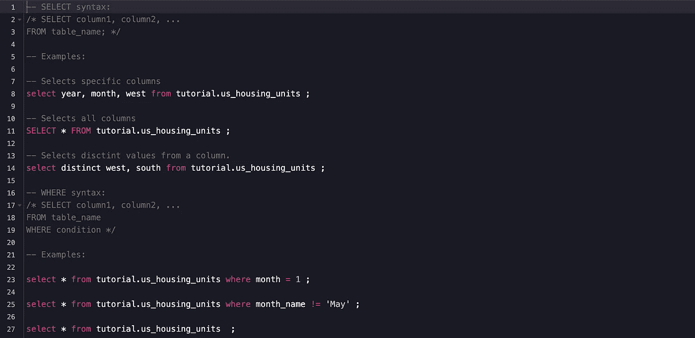
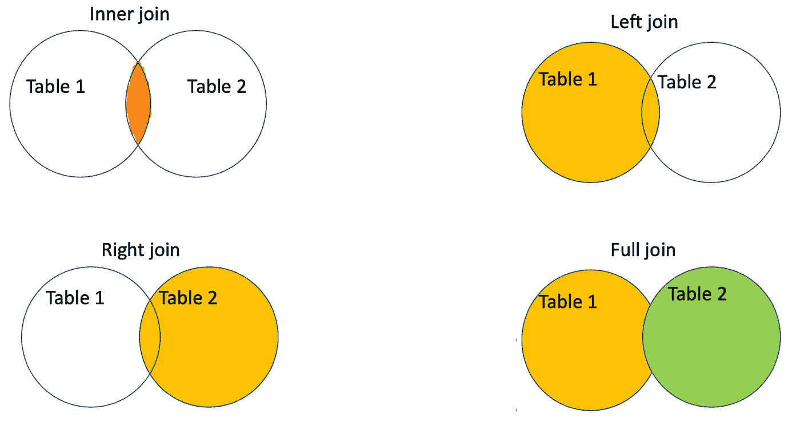

# 快速 SQL 学习技巧

> 原文：<https://towardsdatascience.com/fast-sql-learning-tips-that-are-easy-to-memorise-e0f43051ed2?source=collection_archive---------14----------------------->



图 1。典型的 SQL 查询。作者使用[模式](https://mode.com) SQL 编辑器创建的图像

SQL 代表**结构化查询语言**是一种非常重要的领域特定语言，用于关系数据库管理系统(RDBMS)的编程和数据管理。SQL 在许多方面都非常重要，尤其是在结构化数据中，用户编写特定的命令来查找不同变量和数量之间的关系。

SQL 最初是由 IBM 研究人员**唐纳德·钱伯林**和 **Raymond F. Boyce** 在 20 世纪 70 年代早期开发的，其目的是检索和处理 IBM 准关系数据库系统 r 中存储的数据。从那时起，SQL 成为最常用的数据库语言，并在 1986 年成为 asi 和 1987 年成为 ISO 的标准。

SQL 的主要目的之一是查询关系数据库中的数据。SQL 具有由 ISO/IEC SC 32 定义和维护的标准语言语法，但也存在其他修改。这使得 SQL 在不进行调整的情况下不能完全移植到不同的数据库系统中。SQL 的其他扩展包括通过与其他语言(如 Java、Python、Perl 等)的 DBMS 集成来适应过程和面向对象的编程。

在本文中，我将讨论一些有用的 SQL 学习技巧，这些技巧将帮助您加快 SQL 学习。这些技巧是主观的，并不详尽，因为 SQL 是一种非常扩展的语言。本文面向那些计划学习 SQL 的人，也面向那些正在学习 SQL 的人。在这里，我假设读者有一个 SQL 编辑器或编辑器平台，可以编写 SQL 命令和语句来执行查询。

# 1.SQL 的语言元素

SQL 有几种语言元素，可以分为不同的类别。其中一些类别包括:

1.  ***查询*** *:* 用于 SQL 中，根据特定的条件检索数据库中的数据。
2.  ***子句*** :是查询和语句的重要 SQL 组成部分。
3.  ***表达式*** :是用于生成标量值或由列和行组成的表的 SQL 的重要组成部分。
4.  ***关键词*** :是 SQL 语句、查询、表达式的组成部分。它们被定义为保留或非保留的单词。
5.  ***谓词*** :是评估为真/假/未知的语句和查询的 SQL 组成部分。它们用于更改 SQL 控制流或限制语句和查询的效果。

# 2.**选择** →从 → **WHERE 条件语句**

假设您有一个数据库，并想在其上执行操作。SQL 中的每个数据库都是由列和行组成的表。在使用 SQL 时，人们经常需要查看数据库并查看其列和行，以便对数据库的组成部分有一个大致的了解。这个操作是 SQL 的基础之一。

为此，SQL 具有以下易于记忆的语法:

```
*Syntax 1***SELECT** column1, column2, column3, ....columnN
**FROM** table name
**WHERE** condition1 **AND/OR/NOT** condition2 ... **AND/OR/NOT** conditionM ;
```

在上面的 SQL 语法 1 中， **SELECT** 语句用于 *only* 选择用户想要显示的列。来自关键字的**用于指定包含 **SELECT** 语句的 N 列的表/数据库的名称。**

**WHERE** 子句用于过滤表/数据库的一些记录。该子句由用户希望检查是否满意的语句组成。 **WHERE** 子句可以由任意数量的条件组成。但是，如果使用了多个条件，则需要使用 ***运算符*** **和/或、非、**或它们的组合来过滤列中的数据。

所以关于 select 语句要记住的关键点是上面的语法 1。所以尽量记住以下连续的语句:**从** → **WHERE 中选择** → **。**接下来，记住 **SELECT** 语句指的是列名，来自关键字的**指的是使用的表/数据库，而 **WHERE** 子句指的是用户调查的特定条件。**中的条件，其中**子句是指表格列上的条件。**

需要记住的重要一点是， **WHERE** 子句是可选的，可以省略，而 **SELECT** 和 **FROM** 是必需的，不能省略。如果需要从给定的表中选择所有的列，那么在 **SELECT** 语句后面的符号(*)就可以完成这项工作。

另一个要点是 SQL 关键字不区分大小写。如**选择**或**选择**或**选择**或**选择**等没有区别。，如本文顶部的图所示。

# 3.聚合函数

SQL 有**五个**基本聚合函数，它们是在语句、查询和表达式中使用的特定关键字。这些聚合函数是: **MAX()、MIN()、COUNT()、AVG()** 和 **SUM()** 。

SQL 聚合函数通常用于包含数字数据的列，即标量。所有这些函数都可以包含在以下 SQL 语法中:

```
Syntax 2**SELECT** **aggregate_function**(column name)
**FROM** table name
**WHERE** condition ;
```

语法 2 中的“**aggregate _ function**=**MAX()**或 **MIN()** 或 **AVG()** 或 **COUNT()** 或 **SUM()** ”。语法 2 可以扩展，以在 **SELECT** 语句和 **WHERE** 子句中包含更多选项。

**COUNT()** 函数统计给定列表中非空的行数， **COUNT** (列名)或整个表中非空的行数 **COUNT** (*)。它可以用于数字和非数字列数据。

**MAX()** 和 **MIN()** 函数返回给定列中的最高值和最低值。这些函数可用于数值和非数值数据。如果给定列有数值数据，则 **MIN** (列名)返回该列中的最小数值。另一方面， **MAX** (列名)返回最大数值。如果数据为非数字数据， **MIN** (列名)返回以字母“A”开头的列条目，而 **MAX** (列名)返回以字母“Z”开头的列条目。

**SUM** (列名)函数返回给定列中所有数值的总和。该函数只能用于包含数字数据的列。它忽略具有空条目的行。

**AVG** (列名)返回给定列中数值数据的平均值。它只能用于包含数字数据的列。它忽略具有空值的行。

为了容易地记住集合函数的用法，只要试着记住语法 2 并重复它。这个简单的语法允许您记住如何在 SQL 查询中使用所有五个 SQL 聚合函数。

# 4.连接函数



图二。作者创造的形象

在 SQL 联接中，子句用于根据表中的相关列组合不同表中的行。

在查询中基本上使用了四个 SQL 基本连接关键字。这些关键字被称为:**内连接**、**左连接**、**右连接**和**全连接**。所有这些 SQL 连接关键字都可以很容易地记忆下来，并与以下 SQL 语法一起使用:

```
Syntax 3**SELECT** Table(1 or 2).column_name, Table(1 or 2).column_name,...,Table(1 or 2).column_name
**FROM** Table1
**join_keyword** Table2
**ON** Table1.Matching_column_name = Table2.Matching_column_name
```

语法 3 中， **join_keyword** = **内连接**或**左连接**或**右连接**或**全连接**。你可能会注意到在关键字**之后，join_keyword** 跟在关键字**之后。**使用 SQL 连接时要记住的一件重要事情是语法 3 的形式，这并不难记忆。一旦你记住了，那么连接就很简单了。

语法 3 中的 **SELECT** 语句选择用户想要显示的列。这些列可以是表 1 和表 2 中的列的组合。*表 1 和表 2 都必须有一个相关的列来执行连接功能。*

**INNER JOIN** 关键字选择表 1 和表 2 中具有匹配值的所有记录。这在图 2 的左上侧象征性地显示为两个相交的集合。

**LEFT JOIN** 关键字返回表 1(左表)中的所有记录和表 2(右表)中的匹配记录，如图 2 右上角所示。

**右连接**关键字返回表 2(右表)中的所有记录和表 2(左表)中的匹配记录，如图 2 左下方所示。

**FULL JOIN** (或 **FULL OUTER JOIN** )关键字返回在左表(Table1)或右表(Table2)中匹配的所有记录。

如果有两个以上的表要连接，那么情况会稍微复杂一些。在这种情况下，通常需要执行 SQL 嵌套联接。我在这篇文章中没有涉及这个主题。

# 结论

从我上面展示的 SQL 中可以看出，一次性记住不同的 SQL 函数和关键字是可能的，因为它们共享相同的正式语法。事实上，您可以在语法 2 中看到，所有四个基本的 SQL 聚合函数共享相同的正式语法。这一事实使得在 SQL 语句和查询中记住它们的功能成为可能。

同样的事情也发生在连接子句和关键字上。这些连接关键字共享相同的 SQL 语法，这使得用户更容易记住它们。

要记住的关键点是，一旦你记住并理解了语法 2 和语法 3 是如何工作的，那么在更复杂的 SQL 查询(比如嵌套查询)中应用这些语法就更容易了。

## 如果你喜欢我的文章，请与你可能对这个话题感兴趣的朋友分享，并在你的研究中引用/参考我的文章。不要忘记订阅将来会发布的其他相关主题。