# 使用 Zip“固定”Python 对象

> 原文：<https://towardsdatascience.com/fasten-python-objects-using-zip-88a1e7a68c7?source=collection_archive---------40----------------------->


图片由 [Alexas_Fotos](https://pixabay.com/users/alexas_fotos-686414/) 在 [Pixabay](https://pixabay.com/photos/zip-jeans-open-1557727/) 上拍摄

## Python 的一个技巧使得多个**可重复项**的使用变得更加容易

像大多数其他编程语言一样，Python 有许多常见的可迭代对象，如 list(在其他语言中通常称为 array)、set 和 dictionary。但是，有这样一个“Pythonic 式”的 iterable 并不太常见，它就是“zip”。

这个“zip”不是用来压缩的，应该理解为它的浅层含义:把对象固定在两个或多个 iterables 中(比如 lists)。在这篇文章中，我将介绍

*   Python zip 的基本用法
*   如何在解包时使用 zip)
*   如何解决“水桶效应”

# 基本用法


照片由 [Myriams-Fotos](https://pixabay.com/users/myriams-fotos-1627417/) 在 [Pixabay](https://pixabay.com/photos/zip-wallet-krampen-small-teeth-4802469/) 上拍摄

首先，让我们用一些对象创建两个列表。请注意，任何 iterables 都可以与`zip`一起工作，列表也是如此。

```
keys = ['name', 'age', 'message']
values = ['Chris', 33, 'Thank you for reading my articles!']
```

这里是`zip`最基本的用法，就是把两个列表扣在一起。

```
for item in zip(keys, values):
    print(item)
```

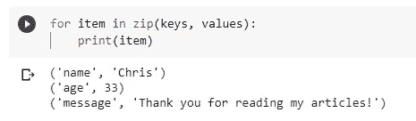

假设这两个列表是拉链的两个金属条，那么其中的每个对象将是“拉链齿”。当我们一起“拉动”滑块后，“牙齿”就会相应地锁在一起。然后，每个“行”将拥有两个列表中的两个对象。

**注意:在** `**values**` **列表中，数字“33”是一个整数，其他元素是字符串。所以 Python zip 不关心 iterables 中元素的类型，非常灵活！**

我们可以轻松地将结果放入一个列表中，而不是循环并打印这些值，如下所示。

```
list(zip(keys, values))
```

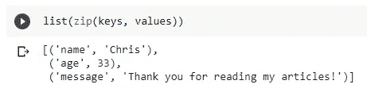

事实上，最方便的用法是在压缩列表上生成一个字典。

```
dict(zip(keys, values))
```

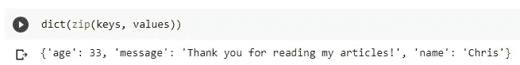

## 获取不带元组的两个元素

有时，没有必要将结果放入另一个 iterables 中。如果我们想使用压缩后的结果而不使用烦人的元组，我们可以简单地从 zip 中获取两个值，如下所示。

```
for key, value in zip(keys, values):
    print(f'{key}: {value}')
```

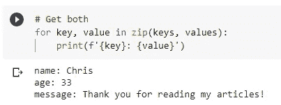

## 超过两个

如果我们把一个 Python 字典放入一个 zip 中会怎么样？字典中的值将被忽略，只有按键会被视为“金属条”。

让我们建立一个字典，以及一个额外的实验清单。

```
rows = [1, 2, 3]
my_dict = dict(zip(keys, values))print(my_dict)
```

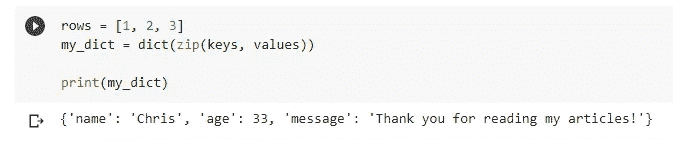

那么，我们来试一试。

```
for item in zip(rows, my_dict):
    print(item)
```

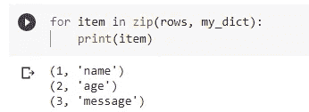

和我提到的完全一样，只取键，忽略值。要解决这个问题，只需将字典的键和值分别传递到 zip 中。

```
for item in zip(rows, my_dict.keys(), my_dict.values()):
    print(item)
```

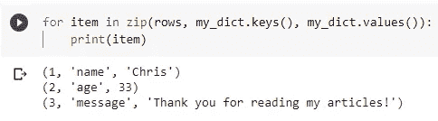

还可以看出，zip 支持两个以上的可迭代对象。

# 带拆包的拉链


照片由 [Alexas_Fotos](https://pixabay.com/users/alexas_fotos-686414/) 在 [Pixabay](https://pixabay.com/photos/frog-bag-zip-open-funny-cute-1558602/) 上拍摄

解包是 Python 中另一个独特的概念。如果您不太熟悉它，您可能还会在一些 Python 代码中看到星号*。这就是“拆包”。

让我用一个例子来解释一下。假设我们有这样一个二维列表，它在概念上也可能被当作一个矩阵。

```
matrix = [
    [1,2,3],
    [1,2,3],
    [1,2,3]
]
```

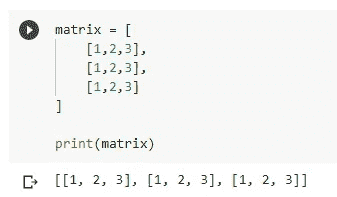

我们都知道矩阵是一个 3 元素的列表，每个元素也是一个 3 位数的列表。现在，假设我们要压缩 3 个“子列表”并使用相应位置的数字，带解包的压缩是最佳解决方案。

```
for item in zip(*matrix):
    print(item)
```

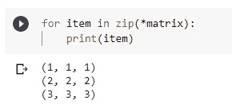

其实不难被理解。解包只是将 3 个子列表从它们的父列表中取出。我有一个想法，保证你能理解。参见下面的代码，它产生完全相同的结果。

```
for item in zip(matrix[0], matrix[1], matrix[2]):
    print(item)
```

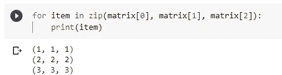

# 拉链最长，克服水桶效应


[5598375](https://pixabay.com/users/5598375-5598375/) 在 [Pixabay](https://pixabay.com/photos/wooden-bucket-water-wood-bucket-3373505/) 上拍摄的照片

还有一个`zip`的限制。也就是说，压缩结果的长度取决于所有可重复项中最短的一个。这和经典的“水桶效应”很像。一般是指一个水桶能装多少水，取决于最短的木板。

让我们再举一个例子来重现这个问题。

```
keys = ['name', 'age', 'message']
values = ['Chris', 33]for key, value in zip(keys, values):
    print(f'{key}: {value}')
```

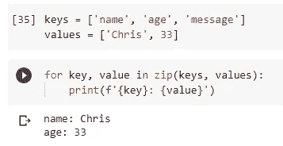

在上面的例子中，我们的`keys`列表有 3 个元素，但是`values`列表只有两个。在压缩的结果中，我们丢失了第三个键`message`，因为在`values`列表中没有更多的元素可以提取出来与之匹配。

为了解决这个问题，我们可以使用`itertools`库中的另一个方法，这是一个内置的 Python 库，因此它默认情况下与 Python 一起提供。

```
from itertools import zip_longestfor key, value in zip_longest(keys, values):
    print(f'{key}: {value}')
```

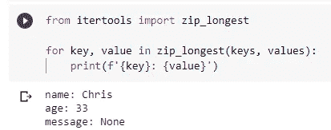

酷！现在我们有了钥匙`message`。由于另一个列表中没有对应的值，所以只是用`None`填充。

## Python 3.10 中的新特性

值得一提的是，Python 3.10 中发布了一些新特性(参见 PEP-618)

[](https://www.python.org/dev/peps/pep-0618/) [## PEP 618 -为 zip 添加可选的长度检查

### 这个 PEP 建议在内置 zip 中添加一个可选的严格布尔关键字参数。启用时，值错误…

www.python.org](https://www.python.org/dev/peps/pep-0618/) 

在 PEP-618 中提出并接受了一个名为`strict`的新的`zip`标志，它将强制检查`zip`中可重复项的长度。如果长度不同，会升起一个`ValueError`。

```
list(zip(range(3), ['fee', 'fi', 'fo', 'fum'], strict=True))Traceback (most recent call last):
  ...
ValueError: zip() argument 2 is longer than argument 1
```

 [## 内置函数- Python 3.9.1 文档

### Python 解释器内置了许多始终可用的函数和类型。它们被列出…

docs.python.org](https://docs.python.org/3.10/library/functions.html#zip) 

# 摘要


[Pixabay](https://pixabay.com/photos/pier-jetty-ocean-sea-water-way-569314/) 上[免费照片](https://pixabay.com/users/free-photos-242387/)拍摄的照片

在本文中，我介绍了“zip ”,它是 Python 中最具 Python 风格和最有用的工具之一。它的基本用法非常有用，我们可以看到它在许多 Python 项目中被广泛使用。此外，拆包技术也经常和`zip`一起使用。最后，我展示了 Python zip 的一个约束，可以称之为“桶效应”，但它可以在 Python 内置库中解决。

[](https://medium.com/@qiuyujx/membership) [## 通过我的推荐链接加入灵媒-陶

### 作为一个媒体会员，你的会员费的一部分会给你阅读的作家，你可以完全接触到每一个故事…

medium.com](https://medium.com/@qiuyujx/membership) 

如果你觉得我的文章有帮助，请考虑加入 Medium 会员来支持我和成千上万的其他作者！(点击上面的链接)