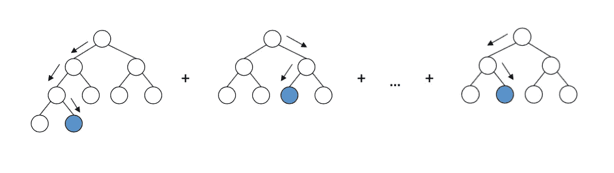

# 利用机器学习和粒子群优化加快钻井速度

> 原文：<https://towardsdatascience.com/faster-drilling-with-machine-learning-and-particle-swarm-optimization-335bb28d687?source=collection_archive---------12----------------------->

## 如何找到钻井中优化机械钻速的最佳点

钻头(来源:迈克·博勒加德

O 优化是每一项工程设计的核心——波音公司利用优化来设计飞机机翼的最佳拓扑结构，以提高飞行效率，通用电气公司利用优化来设计最佳的风力涡轮机叶片，使其旋转更快以产生更多的电力，还有更多其他很酷的例子。在石油和天然气行业，优化用于许多方面，如钻井。我们在这篇文章中的任务是强调在这个领域的应用。

首先，我们需要了解钻井的组成部分。钻柱是一个整体或组件，由下图所示的部件组成。钻铤(由钢筋制成的厚壁管件)提供的重量与钻头直接接触。这个重量被称为**钻压或 WOB** ，定义为破碎岩石所需的施加到钻头上的向下的力。由于钻头正在旋转，测量每分钟的**转数或 RPM** 。

钻柱组成及钻压(来源:[宋等，2019](https://www.researchgate.net/publication/336059580_A_dynamic_model_of_the_drilling_action_of_percussive_tools) )

**钻速或 ROP** 定义为单位时间内所钻深度距离的单位。钻速由随钻测量(MWD)仪器实时测量。如果在 1 分钟内可以达到 1 英尺的距离，我们可以计算 ROP 如下:

ROP 越高，可以达到的距离越快。公司总是想尽可能快地钻探以节省时间，因为时间就是金钱。因此，他们雇佣钻井工程师对钻井作业进行良好的设计，包括优化机械钻速。

司钻能从地面控制的唯一变量是 WOB 和每分钟转数。其他变量(PHIF、VSH、SW 和 KLOGH)是常量变量，因为它们代表地层。因此，为了最有效地钻凿地层，WOB 和每分钟转数应该调节得足够充分。

不幸的是，ROP 并不总是随着 WOB 和 RPM 的增加而成比例地增加。在许多情况下，随着 WOB 和每分钟转数的不断增加，转速增加，直到开始下降。这个点通常被称为**方正点**。在这一点上，钻头没有有效地切割岩石。如果在建立点之后施加额外的 WOB，钻头的效率会变得更低。这就是为什么我们需要找到 ROP 最佳的“最佳点”。

在本文中，我们将讨论机器学习在钻井机械钻速优化中的另一个重要应用。这篇教程文章附有 Jupyter Notebook 中的源代码，可以在这里访问。

## 资料组

我们将要使用的数据集是由两个原始数据排列而成的；北海 Volve 油田 15/9-F-15 号井的实时钻井数据和计算岩石物理产量(CPO)测井数据。数据集在 GitHub [这里](https://raw.githubusercontent.com/yohanesnuwara/volve-machine-learning/main/Data_for_ROP_optimization.csv)。请记住，在之前的文章中我们已经多次使用过 Volve 数据集，因为它是[开源的](https://www.equinor.com/en/what-we-do/digitalisation-in-our-dna/volve-field-data-village-download.html)。

数据集的前 10 行

数据集由 8 列组成；深度(测量深度)、WOB(钻压)、SURF_RPM(地面每分钟转数)、ROP_AVG(平均钻速)、PHIF(地层孔隙度)、VSH(页岩体积)、SW(含水饱和度)和 KLOGH(对数渗透率)。WOB、SURF_RPM 和 ROP_AVG 是钻井参数，而其余的是岩石物理参数。

## 问题陈述

数据集被可视化为测井显示，我们可以观察钻井参数和储层的岩石物理性质如何随深度变化。

钻井和地球物理测井数据的可视化——yo hanes nu wara

让我们注意一下 3480-3500 米井段，在该井段，机械钻速下降到 0.002 米/秒。这种突然中断可能是由两个因素造成的；预期或意外的原因。预期的原因可能是高地层压力，以便司钻避免事故。意外原因是 WOB 和转速不足。

因为我们没有地层压力的详细资料，我们假设这种突然的破裂是意料之外的。当我们在 3480 米深度观察时，当机械钻速下降到 0.002 米/秒时，WOB 约为 31000 牛顿，每分钟转数为 2。我们假设 WOB 和每分钟转数不足以保持机械钻速高于此值。

因此，通过这篇文章我们将回答两个问题；

*   **是什么原因导致机械钻速在 3480 米处突然下降？**
*   优化机械钻速需要多大的 WOB 和每分钟转数？

在进入 ML 和优化之前，我们做探索性的数据分析。下面是数据集中一些独立变量的配对图。我们可以突出一些有趣的关系。**机械钻速似乎与 VSH** (页岩体积)相关。这似乎与直觉相反，因为我们通常认为，在 VSH 高的页岩地层中，机械钻速会变低。机械钻速似乎与 PHIF(地层孔隙度)没有相关性。此外，数据集中的点往往聚集在**低 VSH、低 PHIF 和低 WOB** 。

独立变量对图—约哈内斯·努瓦拉

接下来，我们继续使用梯度推进机器模型来制作 ROP 的预测模型。

## 用于钻速预测的梯度推进机

开始机器学习部分，ROP_AVG 作为预测目标从剩余的列中分离出来。然后，数据集被分成具有 20%测试大小的训练集和测试集。我们制作了一个管道，由一个标准的定标器和我们使用的模型梯度推进组成。为我们的模型设置了两个超参数；`min_samples_leaf=6`和`max_depth=20`。管道适合列车组，并对模型进行了评估。训练的 R 平方分数是 95%，测试的 R 平方分数是 79%。

**梯度推进机**或 GBM 是一种集成方法，通过创建各种更简单的估计器的集成来工作。它被称为 boosting，因为集合模型比单个估计器表现得好得多。它的工作原理是对树逐一求和；第二棵树作为一个系综添加到第一棵树上(称之为***【D1】***)。我们有一个目标函数，叫它 ***f*** 。 ***f*** 和 ***D1*** 之间的差(或残差)是将被下一个第三棵树最小化的残差。它创造了一个新的合奏*。然后在 ***f*** 和 ***D2*** 之间计算这个残差，一个新的系综诞生了，重复这个过程。*

**

*梯度推进方法图解([来源](https://arogozhnikov.github.io/2016/06/24/gradient_boosting_explained.html))*

*我们编译了模型，根据新的输入进行预测。例如，我们希望预测给定输入的机械钻速，如以下代码所示(储层孔隙度为 20%，页岩体积为 50%，含水饱和度为 100%，渗透率为 500 毫达西，深度为 4000 米，钻压为 50000 牛顿，转速为 2 转/分)。该模型预测的机械钻速为 0.008 米/秒*

## *粒子群优化*

*最后，我们试图优化 3480 米深度处的机械钻速，在该深度处机械钻速会突然中断。我们使用该模型来生成作为 WOB 和 RPM 的函数的 ROP 的“预测空间”。为此，我们设定了一系列 WOB 和 RPM 值，并保持其他输入变量不变。恒定输入变量是从我们在 3480 米的数据中获得的*

*   *深度:3480 米*
*   *PHIF: 0.09*
*   *VSH: 0.1*
*   *软件:1*
*   *KLOGH: 0.01 毫英寸*
*   *WOB:范围(17，000–90，000)北部*
*   *转速:范围(1.5–2.5)*

*下面是生成预测空间的代码。*

*这导致了以下预测空间；*

**

*ROP-yo hanes nu wara 的预测空间*

*从该图中，我们看到，在 3480 米深度，WOB 在 42000N 以上达到了最高机械钻速，每分钟转数范围为 1.8-2。*

*我们可以清楚的找到 ROP 下降的原因！在数据中，我们知道 WOB 只有 31，000 N，低于 WOB 优化钻速的可接受窗口。*

*更进一步，我们将使用粒子群优化或 PSO 找到在该深度做出最佳 ROP 的 WOB 和 RPM 的值。*

***粒子群优化(PSO)** 是一种受动物群体(候鸟和蜜蜂)行为启发的优化算法。在任何优化问题中，都有一个称为目标函数的函数，它是作为优化目标的定义明确的函数。全局解位于搜索空间的某个地方。粒子群优化算法首先在搜索空间的随机位置上安排一些粒子(或群体)。这些粒子具有初始速度和方向，将通过多次迭代加速，直到它们找到全局解。*

**

*粒子群优化(个人)*

*我们使用了 [PySwarm](https://github.com/tisimst/pyswarm) 包来使用 PSO 来解决我们的优化问题。首先，我们定义目标函数。我们的目标函数是由名为`pipe`的管道构成的，包括我们已经建立的梯度推进模型。该函数检索数组`X`中的所有输入变量。接下来，我们定义搜索的上限和下限。在这个优化问题中，我们想要搜索 WOB 和 RPM 的值。因此，只有这些变量在上面给出的范围内具有下限和上限。*

*最后，我们运行粒子群算法。我们如代码所示设置超参数，如`swarmsize`(群体粒子数)200、`omega`(粒子速度比例因子)0.3、`phip`(搜索远离粒子最佳位置的比例因子)0.5、`phig`(搜索远离群体最佳位置的比例因子)0.7、`maxiter`(最大迭代次数)1000、`minstep`(搜索终止前群体最佳位置的最小步长)*

*上述 PSO 实现输出优化 ROP 的 WOB 和 RPM 的值，以及实现的最佳 ROP。*

*初始结果与优化结果*

*从上表可以得出结论，在 3480 米深度，司钻应该增加 WOB 并保持转速，以增加机械钻速至最佳点。*

## *结论*

*我们已经展示了如何使用梯度推进机和粒子群优化来优化钻井中的钻速。以下是我们在本文中提出的两个问题的答案；*

*   *由于 WOB 不足 31000 牛顿，机械钻速在 3480 米深度下降到 0.002 米/秒*
*   *在 3480 米深度的最佳机械钻速为 0.0055 米。WOB 大约为 74000 牛顿，转速为 2 转/分钟时，可以达到最佳机械钻速。*

*在未来，像钻孔突然中断这样的问题可以通过在生产线上进行优化来避免。我们不只是拯救**🕒**，也是这个💰！*

***请关注我即将发布的关于我在我们惊人的能源行业中的更多人工智能实验的文章！💡***

*</prediction-of-p-sonic-log-in-the-volve-oil-field-using-machine-learning-9a4afdb92fe8>  </oilfield-lithology-prediction-from-drilling-data-with-machine-learning-520ee9ff6e7c>  <https://medium.com/analytics-vidhya/machine-learning-for-prediction-in-hydraulic-fracturing-43de92b0e10a> *