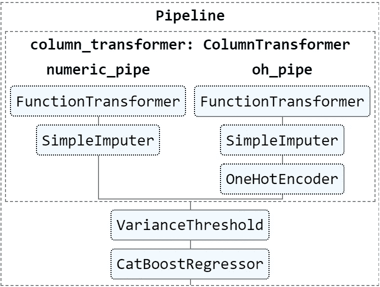
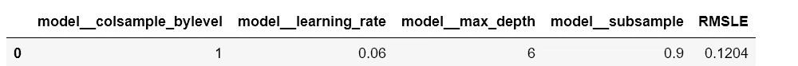
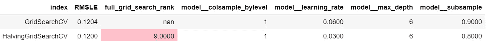
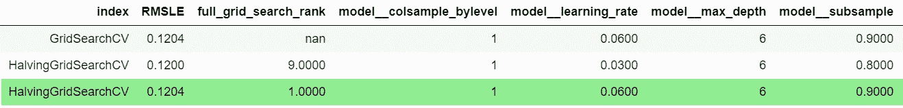

# 使用 Scikit-Learn 的 HalvingGridSearchCV 实现更快的超参数调谐

> 原文：<https://towardsdatascience.com/faster-hyperparameter-tuning-with-scikit-learn-71aa76d06f12?source=collection_archive---------7----------------------->

## 对半网格搜索与穷举网格搜索的比较


罗伯塔·索奇在 [Unsplash](https://unsplash.com/?utm_source=unsplash&utm_medium=referral&utm_content=creditCopyText) 上拍摄的照片

如果你是 Scikit-Learn 的粉丝，随着 0.24.0 版本的[发布，2020 年的圣诞节提前了几天。](https://scikit-learn.org/dev/auto_examples/release_highlights/plot_release_highlights_0_24_0.html#sphx-glr-auto-examples-release-highlights-plot-release-highlights-0-24-0-py) [model_selection](https://scikit-learn.org/stable/modules/classes.html#module-sklearn.model_selection) 模块中的两个[实验性](https://scikit-learn.org/dev/glossary.html#term-experimental)超参数优化器类属于新特性:[halvinggridsearccv](https://scikit-learn.org/dev/modules/generated/sklearn.model_selection.HalvingGridSearchCV.html)和 [HalvingRandomSearchCV](https://scikit-learn.org/stable/modules/generated/sklearn.model_selection.HalvingRandomSearchCV.html#sklearn.model_selection.HalvingRandomSearchCV) 。

像他们的近亲 [GridSearchCV](https://scikit-learn.org/stable/modules/generated/sklearn.model_selection.GridSearchCV.html) 和 [RandomizedSearchCV](https://scikit-learn.org/stable/modules/generated/sklearn.model_selection.RandomizedSearchCV.html#sklearn.model_selection.RandomizedSearchCV) 一样，他们使用交叉验证来寻找最优超参数。然而，他们的[连续减半](https://scikit-learn.org/dev/modules/generated/sklearn.model_selection.HalvingGridSearchCV.html)搜索策略“使用少量资源开始评估所有候选，并使用越来越多的资源迭代选择最佳候选”，而不是独立搜索超参数集候选默认资源是样本数，但用户可以将其设置为任何正整数模型参数，如梯度增强舍入。因此，减半方法有可能在更短的时间内找到好的超参数。

## 我的实验

我通读了 Scikit-Learn 的“网格搜索和连续减半之间的[比较”示例，但是因为总共需要 11 秒来运行，所以我仍然不清楚使用减半和穷举方法的真实影响。所以我决定设立一个实验来回答以下问题:](https://scikit-learn.org/dev/auto_examples/model_selection/plot_successive_halving_heatmap.html#sphx-glr-auto-examples-model-selection-plot-successive-halving-heatmap-py)

1.  HalvingGridSearchCV 比 GridSearchCV 快多少？
2.  HalvingGridSearchCV 是否仍然选择与 GridSearchCV 相同的超参数集？

我将运行并比较 3 个搜索:

1.  GridSearchCV
2.  HalvingGridSearchCV 使用默认的" n_samples" `resource`
3.  HalvingGridSearchCV 使用 CatBoost 的“n_estimators”作为`resource`

## 升级 Scikit-Learn

第一步是将您的 Scikit 版本升级到 0.24.0，并确保您可以导入正确的版本。

```
# !! pip install scikit-learn --upgrade
import sklearn
print(sklearn.__version__)**0.24.0**
```

## 加载数据集

我使用 [Kaggle 的](https://www.kaggle.com/c/house-prices-advanced-regression-techniques/data) Ames，IA 房价数据集进行了测试。它有 1，460 个观察值和 79 个特征。因变量是家庭的`SalePrice`。如果您对数据集上的一些探索性数据分析感兴趣，我推荐您阅读本笔记本。

```
import numpy as np  
import pandas as pd  

DEP_VAR = 'SalePrice'
train_df = pd.read_csv('../kaggle/input/house-prices-advanced-regression-techniques/train.csv')\
           .set_index('Id')

y_train = train_df.pop(DEP_VAR)
```

## 创建管道和模型

我还写了一个脚本叫做 [pipeline_ames.py](https://github.com/kylegilde/Kaggle-Notebooks/blob/master/Faster-Hyperparameter-Tuning-with-Scikit-Learns-HalvingGridSearchCV/pipeline_ames.py) 。它实例化了一个包含一些特性转换的[管道](https://scikit-learn.org/stable/modules/generated/sklearn.pipeline.Pipeline.html)和 [CatBoostRegressor](https://catboost.ai/docs/concepts/python-reference_catboostregressor.html) 。我在下面画出了它的视觉表现。(你可以在我的[上一篇文章](/building-columntransformers-dynamically-1-6354bd08aa54)中读到更多关于我的特征工程方法的信息。)

```
from sklearn import set_config        
from sklearn.utils import estimator_html_repr   
from IPython.core.display import display, HTML     

from pipeline_ames import pipe
set_config(display='diagram')
display(HTML(estimator_html_repr(pipe)))
```



## 实验控制

`grid_search_params`字典包含 3 次搜索中使用的控制参数。我对`param_grid`进行了三重交叉验证，它包含 4 个 CatBoost 超参数，每个参数有 3 个值。结果以均方根对数误差(RMSLE)测量。

```
from sklearn.metrics import mean_squared_log_error, make_scorer

np.random.seed(123) # set a global seed
pd.set_option("display.precision", 4)

rmsle = lambda y_true, y_pred:\     
    np.sqrt(mean_squared_log_error(y_true, y_pred))
scorer = make_scorer(rmsle, greater_is_better=False)

param_grid = {"model__max_depth": [5, 6, 7],
              'model__learning_rate': [.01, 0.03, .06],
              'model__subsample': [.7, .8, .9],
              'model__colsample_bylevel': [.8, .9, 1]}

grid_search_params = dict(estimator=pipe,
                          param_grid=param_grid,
                          scoring=scorer,
                          cv=3,
                          n_jobs=-1,
                          verbose=2)
```

## 试验

## 1.GridSearchCV

基线彻底的网格搜索花了将近 33 分钟对我们的 81 个候选人进行 3 重交叉验证。我们将会看到 HalvingGridSearchCV 过程是否可以在更短的时间内找到相同的超参数。

```
%%time
from sklearn.model_selection import GridSearchCVfull_results = GridSearchCV(**grid_search_params)\
               .fit(train_df, y_train)pd.DataFrame(full_results.best_params_, index=[0])\
    .assign(RMSLE=-full_results.best_score_)**Fitting 3 folds for each of 81 candidates, totalling 243 fits
Wall time: 32min 53s**
```



## 2.具有 n 个样本的 HalvingGridSearchCV

在第一次对半网格搜索中，我对`resource`使用默认的‘n _ samples ’,并将`min_resources`设置为使用总资源的 1/4，即 365 个样本。我没有使用 22 个样本的默认`min_resources`计算，因为它产生了可怕的结果。

对于两个减半搜索，我使用了 2 的`factor`。该参数确定连续迭代中使用的`n_candidates`和`n_resources`，并间接确定搜索中使用的迭代总数。

1.  `factor`的倒数决定了`n_candidates`保留的比例——在这种情况下，是一半。所有其他候选都被丢弃。因此，正如您在下面的日志中看到的，我的搜索中的 3 次迭代分别有 81、41 和 21 个候选项。
2.  `factor`和前一次迭代的`n_resources`的乘积决定了`n_resources`。我的 3 次迭代搜索使用了 365、730 和 1460 个样本。
3.  总迭代次数由`factor`增加`n_resources`多少次而不超过`max_resources`决定。如果您希望最终的迭代使用所有的资源，您需要将`min_resources`和`factor`设置为`max_resources`的因子。

```
%%time

from sklearn.experimental import enable_halving_search_cv  
from sklearn.model_selection import HalvingGridSearchCVFACTOR = 2
MAX_RESOURCE_DIVISOR = 4

n_samples = len(train_df)
halving_results_n_samples =\
    HalvingGridSearchCV(resource='n_samples',
                        min_resources=n_samples//\
                        MAX_RESOURCE_DIVISOR,
                        factor=FACTOR,
                        **grid_search_params
                        )\
                        .fit(train_df, y_train)**n_iterations: 3
n_required_iterations: 7
n_possible_iterations: 3
min_resources_: 365
max_resources_: 1460
aggressive_elimination: False
factor: 2
----------
iter: 0
n_candidates: 81
n_resources: 365
Fitting 3 folds for each of 81 candidates, totalling 243 fits
----------
iter: 1
n_candidates: 41
n_resources: 730
Fitting 3 folds for each of 41 candidates, totalling 123 fits
----------
iter: 2
n_candidates: 21
n_resources: 1460
Fitting 3 folds for each of 21 candidates, totalling 63 fits
Wall time: 34min 46s**
```

第一次减半搜索没有产生好的结果。它实际上比彻底搜索花费的时间要长一点。使用我的 [compare_cv_best_params](https://github.com/kylegilde/Kaggle-Notebooks/blob/master/Faster-Hyperparameter-Tuning-with-Scikit-Learns-HalvingGridSearchCV/compare_functions.py) 函数，我们看到它只找到了第九个最佳超参数集。

```
from compare_functions import *compare_cv_best_params(full_results, *[halving_results_n_samples])\
 .style.applymap(lambda cell: ‘background: pink’ if cell == 9 else)
```



## 3.具有 n 个估计量的 HalvingGridSearchCV

在第二次减半搜索中，我使用 CatBoost 的`n_estimators`作为资源，并将第一次迭代的`min_resources`设置为使用这些估计量的四分之一，同时将`factor`设置为 2。

```
%%time
halving_results_n_estimators =\
    HalvingGridSearchCV(resource='model__n_estimators',                         
                         max_resources=1000,
                         min_resources=1000 // MAX_RESOURCE_DIVISOR,
                         factor=FACTOR,
                        **grid_search_params
                        )\
                        .fit(train_df, y_train)**n_iterations: 3
n_required_iterations: 7
n_possible_iterations: 3
min_resources_: 250
max_resources_: 1000
aggressive_elimination: False
factor: 2
----------
iter: 0
n_candidates: 81
n_resources: 250
Fitting 3 folds for each of 81 candidates, totalling 243 fits
----------
iter: 1
n_candidates: 41
n_resources: 500
Fitting 3 folds for each of 41 candidates, totalling 123 fits
----------
iter: 2
n_candidates: 21
n_resources: 1000
Fitting 3 folds for each of 21 candidates, totalling 63 fits
Wall time: 22min 59s**
```

这种减半搜索产生了我们希望看到的结果。它提前 10 分钟完成，因此比穷举网格搜索快了大约 30%。重要的是，它还找到了最佳的超参数集。

```
compare_cv_best_params(full_results, *[halving_results_n_samples, 
                                       halving_results_n_estimators])\
    .style.apply(lambda row: \
     row.apply(lambda col: \
     'background: lightgreen' if row.name == 2 else ''), \
     axis=1)
```



# 结论

我的 HalvingGridSearchCV 实验结果喜忧参半。使用默认的“n_samples”资源产生了缓慢且次优的结果。如果您没有使用大量的样本，限制它们可能不会节省您的时间。

然而，使用 CatBoost 的`n_estimators`作为资源在更短的时间内产生了最佳结果。这与我自己手动调整梯度增强超参数的经验相符。我通常可以从验证日志中很快判断出超参数集是否值得进行更多轮次的提升。

如果你觉得这篇文章有帮助，请告诉我。这篇博文的原始笔记本可以在[这里](https://github.com/kylegilde/Kaggle-Notebooks/blob/master/Faster-Hyperparameter-Tuning-with-Scikit-Learns-HalvingGridSearchCV/faster-hyperparameter-tuning-with-scikit-learn-s-h.ipynb)找到。

[关注我](https://medium.com/@kylegilde)并关注 Scikit-Learn 关于培训模型的更多帖子。谢谢！