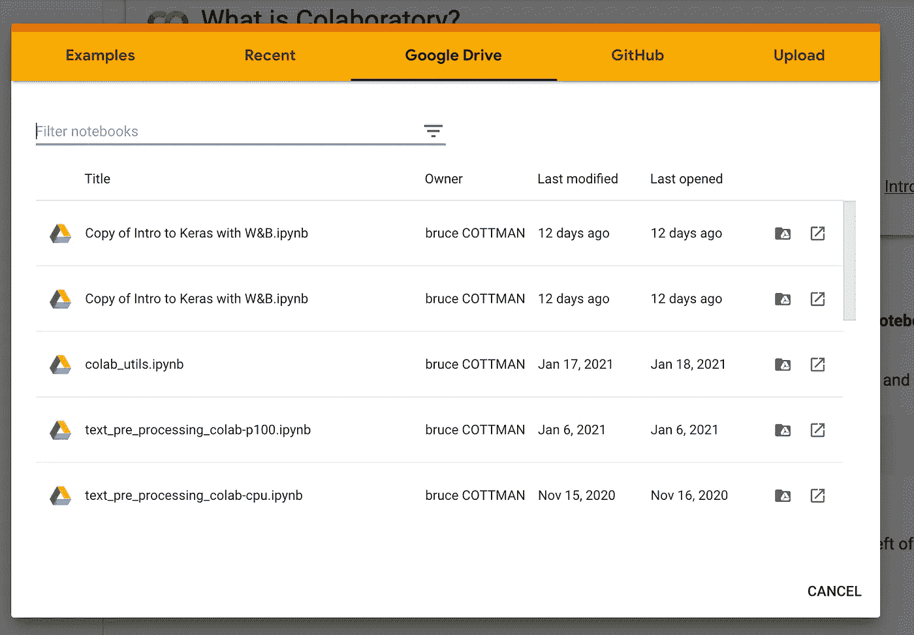
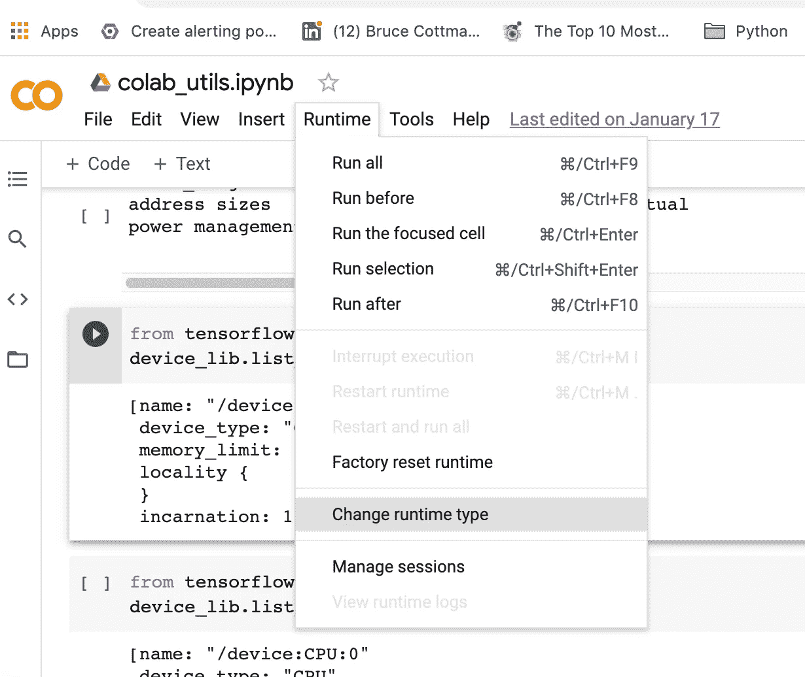

# 使用 GPU 或 TPU 进行更快的机器学习训练

> 原文：<https://towardsdatascience.com/faster-machine-learning-training-with-a-gpu-or-tpu-24023501104f?source=collection_archive---------28----------------------->

## Google Colab 可以从 GitHub 或 Drive 访问任何公开的 Jupyter 笔记本


机器学习 Jupyter 笔记本在 Colab 上免费运行。照片由 [Nana Dua](https://unsplash.com/@nanadua11?utm_source=unsplash&utm_medium=referral&utm_content=creditCopyText) 在 [Unsplash](https://unsplash.com/s/photos/gpu?utm_source=unsplash&utm_medium=referral&utm_content=creditCopyText) 上拍摄

# 为什么要用 Google Colab？

您可以在本地计算机上使用 Jupyter 笔记本。Google Colab 在许多方面改进了 Jupyter 笔记本。以下是使用 Google Colab 的七个最有力的理由:

1.  你可以从 GitHub 库中获得任何一个公开的 Jupyter 笔记本。
2.  您可以将任何`.ipynb`文件加载、编辑并保存到与 Colab 登录相关的 Google Drive 中。每个项目都有一个独立的谷歌账户和不同的谷歌驱动是很有帮助的。

*注意:你可以在 Google Drive 上为任何项目文件夹创建 Git 账户。每个团队成员都在各种不同的本地计算机上运行。他们只需要一个浏览器和互联网连接。您的团队可以通过云在地理上完全分散。*

3.您可以配置多代 NVIDIA GPU 中的一款。

4.您可以提供多代谷歌 TPU 中的一个。

5.您可以配置多核 CPU。

6.谷歌 Colab 免费。此外，你可以升级到每个账户每月 9.99 美元的高级版本。

7.Colab 笔记本有许多 Jupyter 笔记本的有用扩展。

# 从 GitHub Repo 加载文件到 Colab

在浏览器中，前往`[https://colab.research.google.com](https://colab.research.google.com)`。一个指向 Google Colab 的新标签打开:


图 Google Colab 的入口。

如果你是 Colab 的新手，在`Recent`中唯一的文件是`Welcome to Collaboratory`。由于我不是新来的，你可以在`Recent`里数五个文件。

# 从 GitHub 加载文件

点击 GitHub，观察:


图 2:点击 GitHub。

输入您想要浏览的 GitHub 帐户。我进入了`bcottman`，我的 GitHub 顶级库。


图 3:选择 bcottman/paso 回购

从回购`bcottman/paso`中，我选择了文件`bcottman/paso/integration_test_pre_all.ipynb`。


图 4:选择文件`bcottman/paso/integration_test_pre_all.ipynb.`

这导致文件`bcottman/paso/integration_test_pre_all.ipynb`被加载到 GCP(谷歌云平台)的 Colab 浏览器中。


图 5:文件`bcottman/paso/integration_test_pre_all.ipynb loaded into Google Colab.`

# 从 Google Drive 加载文件

您可以创建一个 Google Drive，然后为任何项目文件夹创建一个 Git 帐户。你要去`[https://colab.research.google.com](https://colab.research.google.com.Going)`。安装谷歌账户的谷歌硬盘。当您点击`File|Open notebook`时，Google Drive 中的所有文件都会出现:


图 6:点击`File|Open notebook.`

选择`colab_itils.ipynb`文件:



图 Google Drive 中的顶层文件。

## 供应多代 NVIDIA GPU 中的一款

点击`Runtime|Change runtime type:`配置 Nvidia GPU:



图 8:点击`Runtime|Change runtime type`:配置 Nvidia GPU


图 9:选择 GPU。

通过以下方式检查 Nvidia GPU 的配置状态:

```
The from tensorflow.python.client import device_lib
device_lib.list_local_devices()
```

输出:

```
[name: "/device:CPU:0"  
device_type: "CPU"  
memory_limit: 268435456  
locality {  }  
incarnation: 17311008600223054265, 
name: "/device:GPU:0"  
device_type: "GPU"  
memory_limit: 14674281152  
locality {
    bus_id: 1    
    links {    }  }  
incarnation: 7680686309919727928  
physical_device_desc: "device: 0, 
name: Tesla T4, pci bus id: 0000:00:04.0, compute capability: 7.5"]
```

提供了 14.67 GB 快速内存的 Nvidia Telsa T4。

# 提供谷歌 TPU

要设置谷歌 TPU，请在“笔记本设置”中选择 TPU:


图 10:选择 TPU。

# 结论

在这篇短文中，我展示了如何:

1.  您可以从 GitHub 存储库中获取任何公共文件。
2.  您可以加载、编辑和保存任何`.ipynb`文件到与 Colab 登录相关的 Google Drive。

3.您可以配置多代 NVIDIA GPU 中的一款。

4.您可以提供多代谷歌 TPU 中的一个。

Google Colab 的一个关键功能是团队成员可以使用 GitHub 上的共享文件在项目上进行协作。此外，每个团队成员都可以在自己的 Google Drive 上创建自己的开发沙盒。

云支持远程工作。编码快乐！