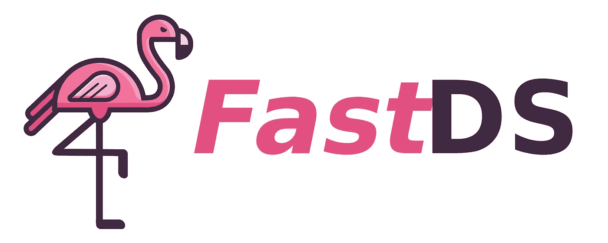
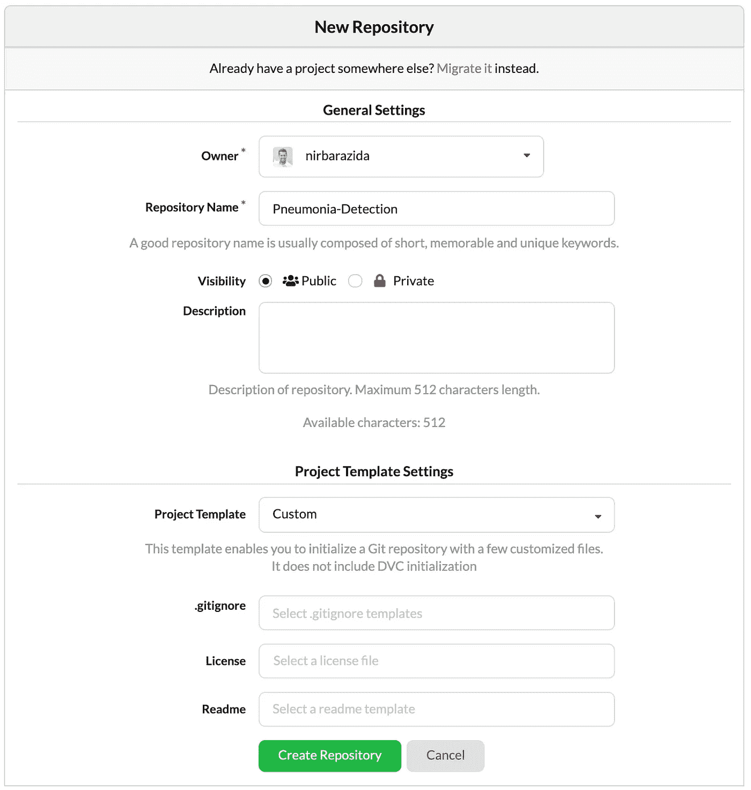
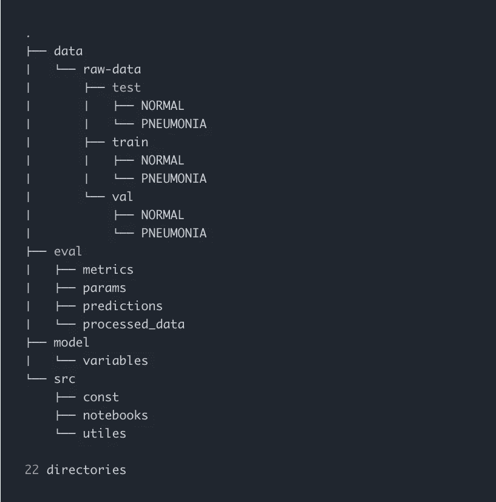
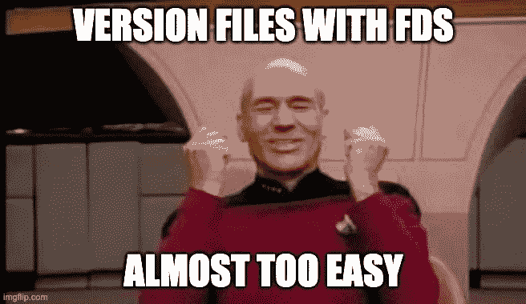
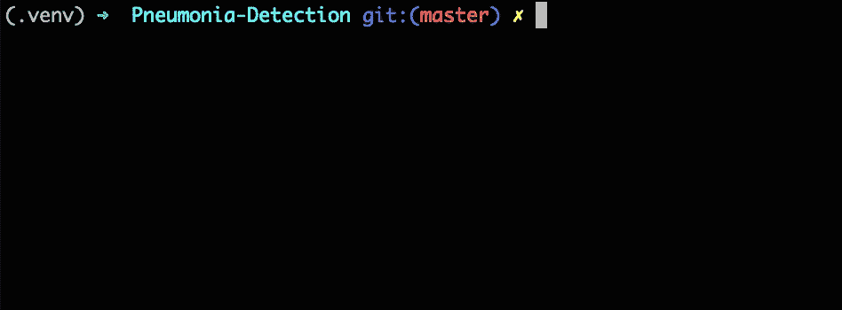
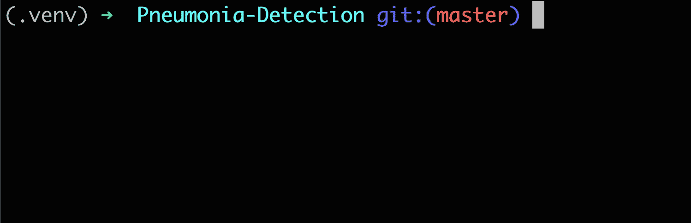
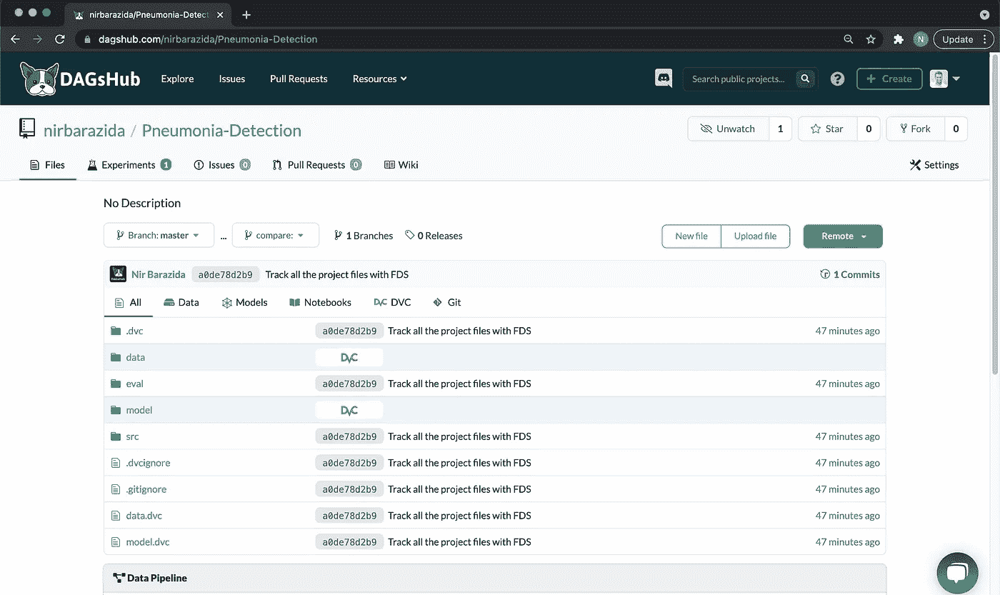

# 更快的机器学习版本和跟踪:使用 FDS 的例子

> 原文：<https://towardsdatascience.com/faster-machine-learning-versioning-and-tracking-example-using-fds-33fa7183aac8?source=collection_archive---------37----------------------->

## 使用 FDS，一个开源工具，快速简单地对你的机器学习项目进行版本控制

[FDS，快速数据科学](http://fastds.io/)，是一个[开源工具](https://github.com/DAGsHub/fds)，使机器学习快速&的版本控制变得容易。它将 Git 和 DVC 结合在一起，负责代码、数据和模型版本控制。

FDS 会帮助你:

*   使用智能版本控制向导🧙‍♂️.，通过推荐每个文件应该被跟踪的位置来避免错误
*   通过统一命令(如`git status` + `dvc status` = `fds status`)自动化重复性任务
*   通过提供以人为中心的 UX，使版本控制更快、更容易使用、更友好——想要保存新版本并将其推送到您的共享遥控器，只需`fds save`就可以了。



快速数据科学，作者图片

这个博客是如何使用 FDS 来版本化你的机器学习项目的分步指南。我们将跟踪“肺炎检测”项目，在该项目中，我们训练一个 TensorFlow 模型来对患病和健康的胸部 x 光图像进行分类。本项目中使用的数据集取自“[胸部 X 射线图像(肺炎)](https://www.kaggle.com/paultimothymooney/chest-xray-pneumonia)”ka ggle 竞赛。通过以下详细步骤，您将获得使用 FDS 的实践经验。


肺炎检测数据示例，图片由作者提供

在这篇博客中，我们将介绍如何使用 FDS 执行以下操作:

*   在本地机器上初始化和配置 Git 和 DVC。
*   使用 Git 和 DVC 通过一个命令跟踪项目文件。
*   将文件推送到 Git 和 DVC 远程。
*   只需一个命令，即可自动对所有项目文件进行版本控制、跟踪、提交和推送

# 项目设置

我们将首先从名为“Pneumonia-Detection”的终端创建一个新目录，并移动到该目录中。然后，我们将创建一个[虚拟环境](https://docs.python.org/3/tutorial/venv.html)，将其添加到。gitignore 文件，激活它，通过运行`pip install fastds`安装 FDS。

***注:*** *因为 DVC 也可以用 brew 安装，所以我们没有把它作为依赖包添加到 FDS。但是，如果 FDS 发现 DVC 没有安装在虚拟环境中，它会建议您安装 DVC。*

# Mac 和 Linux

```
$ mkdir Pneumonia-Detection && cd Pneumonia-Detection
$ python -m .venv venv
$ echo .venv/ >> .gitignore
$ source .venv/bin/activate

$ pip install fastds
```

# Windows 操作系统

```
$ mkdir Pneumonia-Detection && cd Pneumonia-Detection 
$ py -m venv .venv 
$ echo .venv/ >> .gitignore 
$ .venv/Scripts/activate.bat $ pip install fastds
```

接下来，我们将初始化 Git 和 DVC。我们可以使用`fds init`命令来初始化这两个工具，而不是使用这两个工具。


FDS init，Gif 作者

让我们[在 DAGsHub](https://dagshub.com/docs/getting-started/create-a-dagshub-project/#create-a-dagshub-repository) 上打开一个存储库，并将其命名为“肺炎检测”。



新存储库设置，按作者分类的图像

接下来，我们将[通过运行以下命令，用我们的本地目录配置存储库的 Git 和 DVC 远程设备](https://dagshub.com/docs/getting-started/create-a-dagshub-project/#configure-dagshub-as-dvc-remote-storage):

```
$ git remote add origin https://dagshub.com/<DAGsHub user-    name>/Pneumonia-Detection.git
$ dvc remote add origin https://dagshub.com/<DAGsHub user-name>/Pneumonia-Detection.dvc
$ dvc remote modify origin --local auth basic
$ dvc remote modify origin --local user <DAGsHub user-name>
$ dvc remote modify origin --local password <your token>
```

# 添加项目文件

我们准备将文件添加到本地目录中。对于这个任务，我们将使用`dvc get`命令从 DAGsHub 下载文件。请注意，该命令仅在本教程中是必需的。我选择使用它，这样你就可以按照教程访问这些文件。

***注意:*** *原始数据集很大。我们将使用较小版本的数据集来减少下载、版本控制和上传时间。如果要使用完整的数据集，跳过第一个命令，直接从* [*Kaggle 竞赛*](https://www.kaggle.com/paultimothymooney/chest-xray-pneumonia) *下载，解压到* `*Pneumonia-Detection/data/raw-data*` *下。*

```
$ dvc get https://dagshub.com/nirbarazida/Pneumonia-Detection-FDS-Demo data/raw-data -o data/raw-data
$ dvc get https://dagshub.com/nirbarazida/Pneumonia-Detection-FDS-Demo eval 
$ dvc get https://dagshub.com/nirbarazida/Pneumonia-Detection-FDS-Demo model/ -o model/ 
$ dvc get https://dagshub.com/nirbarazida/Pneumonia-Detection-FDS-Demo src
```

现在，该项目包含以下目录:

*   `data/` -保存分成三个子目录的原始数据图像:train、val(验证)和 test。
*   `eval/` -保存关于型号及其性能的信息。
*   `model/` -拥有最佳性能的预处理模型。
*   `src/` -保存项目的代码文件，包括 Python 模块和 Jupiter 笔记本。



项目的树，作者的图像

# 用 Git + DVC = FDS 跟踪文件

此时，我们想用 Git 和 DVC 跟踪项目中的文件。该任务需要以下步骤:

*   选择和跟踪 DVC 的大文件/目录。
*   使用 Git 跟踪指针/管道文件。
*   用 Git 跟踪项目的其余文件。

当使用 Git 和 DVC 来版本化项目时，我们经常执行这些动作。这种重复的工作可能会很麻烦，并且对于一些用户来说，不直观。这正是我们创建`fds add`向导的原因！



与 imgflip.com 一起创建的图像

因为我们想要对所有的项目文件进行版本化，所以我们将运行`fds add .`。



FDS 添加，Gif 作者

项目的所有文件都被版本化，并准备好被推送！但是等等，在我们运行 push 命令之前，我们需要先提交文件。`fds commit`命令将`dvc commit`和`git commit`封装成一个。它首先提交对 DVC 的更改，将带有更新哈希的指针文件添加到 git，然后立即将这些更改(加上任何其他阶段的更改)提交到新的 Git 提交。在我们的例子中，FDS 将认识到在 DVC 跟踪的文件中没有任何改变；因此，它将有效地只提交 Git 跟踪的文件，这正是我们所期望的。

```
$ fds commit “Track all the project files with FDS”
```

此时，我们希望确保所有文件都已提交。为此，我们将运行`fds status`命令，检查 Git 和 DVC 跟踪的文件的状态。



FDS 状态，作者 Gif

女士们先生们，请系好安全带……正式推送时间到了！

为了推送我们的文件，我们将使用`fds push`命令...你猜对了——推送由 Git 和 DVC 跟踪的文件！让我们在 DAGsHub 上检查存储库的新[状态。](https://dagshub.com/nirbarazida/Pneumonia-Detection/src/a0de78d2b99cd958f5c96e3160c5e40898c20e6f)



存储库的新状态，按作者分类的图像

正如我们所见，Git 和 DVC 跟踪的所有文件都被推到了远程。不仅如此，我们可以在一个地方看到项目的所有组件，包括代码、数据、模型和管道。

# 将流程缩短为一个命令


一条捷径。斯蒂芬·斯坦鲍尔 / [Unsplash](https://unsplash.com/?utm_source=ghost&utm_medium=referral&utm_campaign=api-credit) 摄影

如果您不熟悉 Git、DVC 或 FDS，并且不习惯使用这些命令，或者只是想让您的生活更简单，那么`fds save`命令就是为您准备的！通过运行这个命令，FDS 将使用 Git 和 DVC 对所有项目文件进行版本控制、跟踪、提交和推送。为了展示这个命令的用法，我们将下载一个处理过的数据目录并运行`fds save`命令。

```
$ dvc get [https://dagshub.com/nirbarazida/](https://dagshub.com/nirbarazida/Pneumonia-Classification)[Pneumonia-Detection-FDS-Demo](https://dagshub.com/nirbarazida/Pneumonia-Detection-FDS-Demo) data/processed -o data/processed
$ fds save “Add processed data directory”
```

让我们在 DAGsHub 上检查[存储库的新状态。正如我们所看到的，DVC 跟踪了处理过的数据目录，Git 跟踪了更新过的 data.dvc 指针文件，两者都被成功地推送到 DAGsHub。](https://dagshub.com/nirbarazida/Pneumonia-Detection/src/88e4e94a2d3677b2bec18e179150ad6dca3ad6c5)

# 摘要

我们已经到了本教程的结尾，但是我们共同的旅程才刚刚开始。


与 makememe.org 一起创建的图像

FDS 是完全开源的！

虽然我们的开发人员不断提高 FDS 的能力，但我们欢迎您为 FDS 做出贡献，并获得永恒的荣耀。您可以通过以下方式参与:

*   创建一个带有错误修复或新增强的[拉请求](https://github.com/DAGsHub/fds/pulls),
*   使用 FDS，让我们知道我们可以做出的任何问题或改进——通过创建一个[问题](https://github.com/DAGsHub/fds/issues)或在我们的[不和谐频道](https://discord.gg/pk22NradY4)上分享
*   [主演](https://github.com/DAGsHub/fds/stargazers)回购并与你的同事和朋友分享。