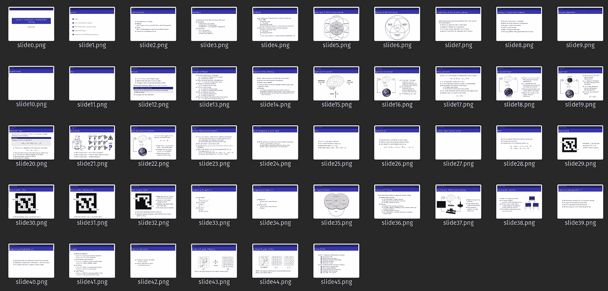
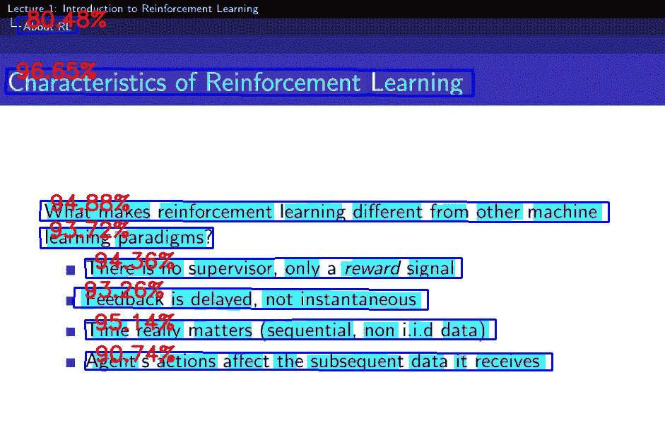

# 使用 Python 和深度学习加快笔记速度

> 原文：<https://towardsdatascience.com/faster-notes-with-python-and-deep-learning-b713bbb3c186?source=collection_archive---------9----------------------->


格伦·卡斯滕斯-彼得斯在 [Unsplash](https://unsplash.com?utm_source=medium&utm_medium=referral) 拍摄的照片

## 使用基于深度学习的 OCR 转录 pdf 幻灯片

## 做笔记的管道

传统的讲座通常附带一套 pdf 幻灯片。传统上，记录这类讲座的过程包括从 pdf 中复制或转录大量内容。

最近，我一直在尝试通过使用 OCR(对象字符识别)来自动转录 pdf 幻灯片，以在 markdown 文件中直接操作它们的内容，从而避免手动复制和粘贴 pdf 的内容，从而实现这一过程的自动化。

***在本文中，我将向您展示如何使用基于深度学习的 OCR 自动将 pdf 幻灯片转换为文本。***

## 为什么不使用传统的 pdf 转文本工具？

我之所以不选择使用传统的 pdf 文本工具，是因为我发现它们往往会带来更多的问题，而不是解决它们。我尝试使用传统的 python 包，但是它们带来了一些问题，比如必须用复杂的正则表达式模式解析最终输出，所以我决定尝试一下对象检测和 OCR，看看是否可以做得更好。

## 步伐

接下来的步骤是:

1.  **将 pdf 转换成图像**
2.  **检测并识别图像中的文字**
3.  **展示示例输出**

在这种情况下，我主要修改了这个[库](https://github.com/courao/ocr.pytorch)中的代码，它使用了对 [CTPN 模型](https://arxiv.org/abs/1609.03605)的 pytorch 修改，以及来自 [pytorch_ctpn](https://github.com/opconty/pytorch_ctpn) 的代码用于文本检测，以及来自 [CRNN 模型](https://arxiv.org/abs/1507.05717)的代码用于文本识别。

现在，让我们来看一下每一步。

## 1.**将 pdf 转换成图像**

我将使用 David Silver 的《强化学习导论》中的 pdf 幻灯片。让我们首先编写一些代码，使用`pdf2image`包将每张幻灯片转换成 png 格式。

现在我有了所有的图像，



图片作者。pdf 中的所有幻灯片。

让我们在每张幻灯片上运行文本检测和识别。

## 2.检测和识别图像中的文本

为此，我们将使用来自 [ocr.pytorch](https://github.com/courao/ocr.pytorch) 资源库的文本检测器。按照那里的说明下载模型，并将它们保存在`checkpoints`文件夹中。

在这里，我们设置输入和输出文件夹，然后对所有输入图像(转换后的 pdf 幻灯片)运行一个循环，然后通过运行位于`ocr`模块中的检测和识别模型的`single_pic_proc()`函数。然后，我们将输出保存到输出文件夹。

检测继承自 Pytorch 的 [CTPN 模型](https://github.com/opconty/pytorch_ctpn)，识别模型继承自 [Pytorch 的 CRNN](https://github.com/meijieru/crnn.pytorch) 模型，两者都存在于`ocr`模块中。

## 3.展示示例输出

检测输出示例:



图片作者。文本检测输出的示例。

文本识别输出:

```
- AboutRL
Characteristics of Reinforcement Learning
What makes reinforcement learningdifferent from other machine
learning paradigms?
There isnosupervisor,only areward signal
Feedback is delavyed,not instantaneous
Time really matters(sequential,non ii.d data)
Agent sactions affectthe subseauent datait receives
```

# 不再复制和粘贴

我喜欢这种方法的原因是，你最终可以拥有一个真正强大的工具来转录各种类型的文档，从检测和识别手写笔记到检测和识别照片中的随机文本。

拥有自己的 OCR 工具来处理您经常交互的内容，比依赖外部软件来处理您想要转录的每个文档要好。

对我来说，这是一个有趣的机会，可以探索 OCR，并建立一个管道来快速转录 pdf 幻灯片附带的讲座。

你可以在这里查看源代码。

如果你喜欢这篇文章，请在 [Twitter](https://twitter.com/LucasEnkrateia) 、 [LinkedIn](https://www.linkedin.com/in/lucas-soares-969044167/) 上联系我，并在 [Medium](https://lucas-soares.medium.com) 上关注我。谢谢，下次再见！:)

# 参考

*   [ocr.pytorch 知识库](https://github.com/courao/ocr.pytorch)
*   pytorch.ctpn
*   [CRNN](https://arxiv.org/abs/1507.05717)
*   [CTPN](https://arxiv.org/abs/1609.03605)
*   [大卫·西尔弗关于强化学习的讲座](https://www.davidsilver.uk/wp-content/uploads/2020/03/intro_RL.pdf)