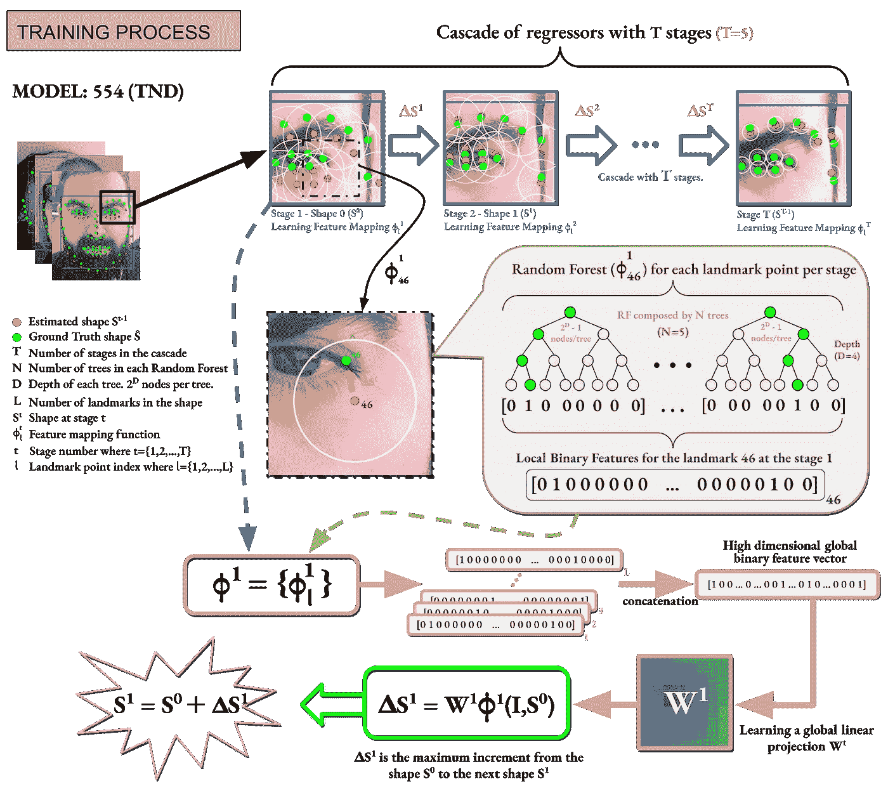

# CPU 上更快、更平滑、更小、更准确和更鲁棒的人脸对齐模型

> 原文：<https://towardsdatascience.com/faster-smoother-smaller-more-accurate-and-more-robust-face-alignment-models-d8cc867efc5?source=collection_archive---------7----------------------->

## [思想和理论](https://towardsdatascience.com/tagged/thoughts-and-theory)

## 人脸标志检测器的训练策略、实现优化和新的评价方法。

使用和不使用 GTX 训练的正面人脸图像的 DAN、ERT 和 LBF 方法的推论(图片由作者提供)。

在你的人脸分析项目或应用中，是否使用人脸地标检测作为核心组件？你是否使用流行的计算机视觉库中的人脸对齐方法，如**OpenCV**【1】或**Dlib**【2】？如果你想改进你的人脸对齐模型，在这篇文章中，我将解释如何使它们更快、更平滑、更小、更准确、更健壮，特别是对于人脸跟踪应用。此外，我在我的 [Gitlab 知识库](https://gitlab.com/visualhealth/vhpapers/real-time-facealignment)中提供了一组已经为 *OpenCV* 和 *Dlib* 改进的模型，该知识库是为我们在**实时图像处理杂志** (Springer)上发表的文章而创建的:

> Alvarez Casado，c .，Bordallo Lopez，M.
> 实时人脸对齐:评估方法、训练策略和实现优化。
> 施普林格实时图像处理杂志，2021 年

ace 对齐在大多数人脸分析系统中是一个至关重要的组件。它着重于识别图像或视频中人脸的几个关键点的位置。尽管在流行的计算机视觉库中，如 *OpenCV* 或 *Dlib* 中，有几种方法和模型可供开发人员使用，但他们仍然面临着照明不足、极端头部姿势或遮挡等挑战，特别是当他们受到实时应用需求的限制时。

如前所述，我们最近发表了一篇期刊文章，其中我们提出了一套基于数据增强和软件优化技术的最佳训练策略和实施规则，这些规则有助于改进属于几个用于人脸对齐的**实时算法**的各种模型。我们将它们命名为**一般培训扩展** ( **GTX** )策略。此外，我们还提出了一组扩展的评估指标，允许新的评估来缓解在实时跟踪上下文和真实场景中发现的典型问题。实验结果表明，使用我们提出的技术生成的模型更快、更小、更准确，在特定的挑战性条件下更鲁棒，在跟踪系统中更平滑，如下一个视频所示。

这种训练策略显示出适用于不同类型的设备和算法，使它们在学术和工业应用中通用。

为了评估我们的方法，我们专注于三种被认为是不同应用的最先进的人脸对齐方法， **LBF** (局部二进制特征)[3]用于 *OpenCV* ， **ERT** (回归树的集合)[4]用于 *Dlib* 和 **DAN** (深度对齐网络)[5]，可在 pip (Python)中获得。LBF 和 ERT 方法，也称为快速人脸对齐方法，基于级联回归器，而 DAN 算法基于深度学习方法。我们使用由多饼地标方案定义的 68 个地标位置。

**评估度量和基准** 面部对齐的标准度量通常包括那些与基础事实注释相比时与预测质量相关的度量。这主要包括**准确度**和**误差**，在某些情况下还有**失败率**。此外，通常计算**计算效率**，通常以每个面的毫秒数表示，以及每秒处理的帧数(fps)。

问题在于，这些度量没有测量在大多数面部对齐模型中观察到的若干现象，例如:

*   **抖动**:恼人的帧间噪声和微小变化。这种影响可能是由缺乏训练样本、具有高方差的不精确注释、不干净的数据集或者在例如初始化阶段使用某种(伪)随机信息的非确定性推理方法产生的。
*   **人脸对齐灵敏度**:大部分人脸对齐算法依赖人脸检测包围盒进行形状初始化。面部检测器在连续的帧中并不总是一致的。此外，大多数人脸对齐模型是用一个人脸检测器的人脸矩形来训练的。

基于这些现象，我们定义了**三个新颖的度量**，并使用它们来评估一个模型在跟踪应用期间有多好的性能。我们建议计算两个连续帧估计形状之间的帧间误差:

*   **地标均方位移**度量(laMSD)，计算地标在静态人脸下如何沿视频移动。
*   **归一化抖动灵敏度均方误差** (NJS-MSE_σ )是通过使用基于水平和垂直轴上的小中心偏移的面部矩形的随机变化来推断一组参考图像上的面部标志而计算的度量。误差测量产生评估度量，以比较面部对准模型的 ***抖动鲁棒性*** 。
*   **归一化人脸检测灵敏度均方误差** (NFDS-MSE_σ )。对于此度量，随机变化基于水平和垂直轴上的面部矩形中心偏移以及面部边界框的大小(宽度和高度)的随机变化。这产生了一个评估度量，用于比较我们的面部对准模型与 ***不同面部检测器*** 的鲁棒性。

为了评估我们的模型，我们在文献中先前提出的完善的标准基准和我们精心设计的一组基准的组合中测试它们。大多数相关工作主要关注两个性能指标，**准确度**和**效率**，但我们认为它们不是评价人脸对齐模型的唯一关键指标。我们相信这种基准组合有助于描述在无约束环境下运行的实时应用程序中更加**客观**和**现实的行为。这些基准描述如下:**

*   **野外常见的** **基准**(300-W)【6】，用以测试一般精度和误差作为与其他机型比较的参考。
*   **抖动基准**，重点测量模型的抖动效果
*   **特定领域基准**，侧重于测试特定领域的模型，如弱光条件、极端倾斜的头部、强背光场景等

**训练策略**
主要思想是实现“更好”的人脸对齐模型。传统上，这是指更精确的模型。但如前所述，我们通过评估实时应用和真实场景中的其他关键方面，特别是在跟踪地标时，扩展了这一概念。

为了实现这一目标，我们建议在培训过程中执行几条规则，例如:

*   **基于图像处理的数据扩充**:几何和颜色变换。
*   **基于统计操作的数据扩充**:图像归一化、噪声注入、初始化变化、异常值去除。
*   **添加领域特定数据**:我们研究属于已证明在基本模型中失败的特定条件的图像集合。这些图像用一个缓慢而精确的模型和一个教师
    学生建筑来注释。在我们之前的[出版物](https://www.semanticscholar.org/paper/Face-alignment%3A-improving-the-accuracy-of-fast-data-Casado-L%C3%B3pez/717f526e371992cc439244ff229d5fc0f880c747)中可以看到关于这项技术的更多细节。

**实现和并行化**
我们已经描述了从串行优化到并行化策略的一系列实现技术。从性能及其可能的精度折衷的角度分析了这些解决方案。

为了测试这些建议的优化，我们实现了自己的 C++版本的 LBF 方法。因此，我们可以将我们自己的实现与 *OpenCV* 实现进行比较，例如相同的算法，并在 *OpenCV* 和 *Dlib* 的实现版本中执行一些其他优化。

在文章中，我们解释了如何加快训练和推理过程。在训练中，我们通常使用*OpenMP*【7】来加速算法拓扑允许的循环。更准确地说，我们在 LBF 算法中加速了局部特征映射函数的学习，因为如图 1 所示，每个界标都是独立于其余的。

图。1(图片由作者提供):LBF 方法中的训练过程。学习过程遵循级联式拓扑。局部特征的线性回归最小化当前形状和目标地面真实形状之间的距离。

在训练我们的面部对齐模型之后，我们通过主要应用三种策略来加速推断:

*   **每个地标计算的并行化**(局部特征映射功能)。
*   **加速在上述过程中提取的高维特征**和全局线性回归或转移矩阵 w 的相乘。我们应用三种不同的优化技术，如图 2 所示。
*   **对生成的模型进行量化。**我们将模型的数据从浮点数转换成短整数。这提高了推断的速度，尤其是在具有缓存和内存限制的设备上，例如移动设备。

图 2(图片由作者提供):稀疏线性投影 W t 的乘法，在面部对齐
过程的每个阶段使用 3 种不同的技术计算。

**对比评估**
为了更好地理解之前的规则集以改进我们的人脸对齐模型，我们从误差、模型大小、计算时间以及跟踪模式和挑战场景中的性能等方面，对最终模型中的训练策略和实现优化技术的影响进行了实证评估和分析。作为 GTX 训练策略的结果，我们获得了一组被标记为 LBF_gtx 模型的增强模型，这些模型将与 LBF_base 模型和其他互补模型进行比较。

**精度与尺寸和速度对比:**

300 瓦全套测试的平均误差(%)和失败图像(%)。在中间一栏中，每个型号的大小以兆字节(MB)为单位。在上一栏中，基准测试中的平均计算时间是以每张脸毫秒数为单位的。在评估的 LBF 模型中，“q”表示量化模型，“float”是原始模型，它们都已经集成到我们的 C++管道中。DAN 模型是原始论文中提供的原始模型。并且通过 Dlib 库使用 ERT 模型，比较库提供的模型和我们自己训练的 ERT 模型。OpenCV LBF 模型通过 OpenCV 库使用。索引 1、2、3 和 4 表示 OpenCV 默认模型与不同的人脸检测器一起使用，包括板载的哈尔卡斯卡德人脸检测器和 DNN 人脸检测器。该推断是使用配备 2.6 GHz 英特尔酷睿 i7 处理器的笔记本电脑做出的(图片由作者提供)。

**我们的抖动基准测试中的抖动评估:**

在我们自行设计的抖动基准测试中，总抖动量和每帧抖动量按每帧 laMSD 增长排序。该推断是使用配备 2.6 GHz 英特尔酷睿 i7 处理器的笔记本电脑得出的。我们的 LBF 模型是浮动版本，以便与 OpenCV one(图片由作者提供)进行公平的比较。

**特定于领域的性能指标评测:**

在使用领域特定的未标记数据和师生方案训练基础模型**之后，在 300W 全套和领域特定的测试子集上的平均误差(%)和失败图像(%)(图片由作者提供)。**

**模型量化的影响:**

对于不同的
硬件设备，量化在准确性(300 w-公共数据集)、速度和大小方面的影响(图片由作者提供)。

# **定性结果**

为了查看建议的培训策略和实施优化的影响，我创建了一些视频来观察它们的效果。

# **结论**

本文的结果显示了一组优化和训练策略在人脸对齐系统环境中的影响，该人脸对齐系统旨在集成到在台式计算机和移动设备中实时运行的解决方案中。在没有任何算法开发的情况下，我们展示了训练、实施和系统设计的巧妙策略如何在准确性、速度、模型大小或挑战性条件下的失败率方面对模型的性能产生巨大影响。

感谢阅读。我希望你从阅读这篇文章中学到的和我写这篇文章时学到的一样多。干杯！

这项工作与 [**米盖尔·博尔达洛**](https://medium.com/u/f20d4f60ca7e?source=post_page-----d8cc867efc5--------------------------------) **合作完成。**

*   奥卢大学助理教授兼讲师 Miguel Bordallo López 博士。[https://sites.google.com/view/miguelbordallo](https://sites.google.com/view/miguelbordallo)

**更多详情请见:**

> Alvarez Casado，c .，Bordallo Lopez，M.
> 实时人脸对齐:评估方法、训练策略和实现优化。
> 施普林格实时图像处理杂志，2021

**从以下位置下载模型:** 从文章的 [GitLab 资源库](https://www.google.com/url?q=https%3A%2F%2Fgitlab.com%2Fvisualhealth%2Fvhpapers%2Freal-time-facealignment&sa=D&sntz=1&usg=AFQjCNFSpOaKHL10u4WecuzO6SytAeMGOg)中下载代码、模型、基准数据集和示例视频，文章中生成的模型现在是 [Dlib 库模型库](https://www.google.com/url?q=https%3A%2F%2Fgithub.com%2Fdavisking%2Fdlib-models&sa=D&sntz=1&usg=AFQjCNEe9SzwKWueU1Zk6cbjq4RjbRlBEA)中的标准模型。

*   我们的 LBF_gtx 和 ERT_gtx 车型:[我们的车型](https://drive.google.com/drive/folders/1t1fRQfTaL1-XgGA1JSzuvLSXsitZ6Scj)
*   原始和默认 OpenCV LBF 模型: [OpenCV LBF 模型](https://raw.githubusercontent.com/kurnianggoro/GSOC2017/master/data/lbfmodel.yaml)
*   原丹型号:[丹型号](https://drive.google.com/drive/folders/168tC2OxS5DjyaiuDy_JhIV3eje8K_PLJ)
*   原始和默认 Dlib ERT 模型: [Dlib ERT 模型](https://github.com/davisking/dlib-models)

## **参考文献**

[1] OpenCV 库:
【2】Dlib 库:
【3】s . Ren，X. Cao，Y. Wei，J. Sun，“通过回归局部二值特征实现 3000 FPS 的人脸对齐”， *2014 年 IEEE 计算机视觉和模式识别会议*，美国俄亥俄州哥伦布市，2014 年，第 1685–1692 页，doi: 10.1109/CVPR.2014 “使用回归树集合的一毫秒人脸对齐”， *2014 年 IEEE 计算机视觉和模式识别会议*，美国俄亥俄州哥伦布，2014 年，第 1867-1874 页，doi:10.1109/cvpr . 2014.241 .
[5]m . Kowalski，J. Naruniec 和 T. Trzcinski，“深度对齐网络:用于鲁棒人脸对齐的卷积神经网络”， *2017 年 “野外 300 人面临的挑战:数据库和结果”。图像和视觉计算(IMAVIS)，面部标志定位“野外”特刊。2016.
【7】OpenMP 库:[https://www.openmp.org/](https://www.openmp.org/)*