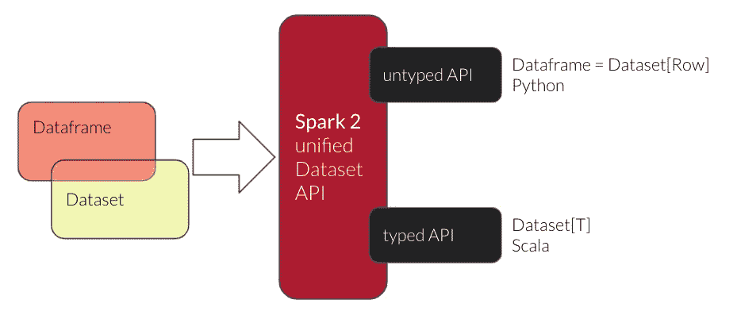
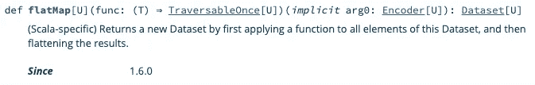

# 更快的 Spark 查询，两者兼得:Python 和 Scala

> 原文：<https://towardsdatascience.com/faster-spark-queries-with-the-best-of-both-worlds-python-and-scala-7cd0d49b7561?source=collection_archive---------34----------------------->

## 当 Spark SQL 和 Python UDFs 太慢时，如何使用 Scala 和 PySpark 实现高级 Spark 用例


由[Unsplash](https://unsplash.com/photos/aQYgUYwnCsM)【CC0】拍摄的图像

S park 是大数据时代的黄金标准和主力。几乎所有数据科学家和数据工程师都依赖 Spark 来处理日常数据工作负载。但是这两个用户群之间有一个典型的分界线:

*   许多数据工程师使用 Scala 和类型化数据集 API 编写 Spark 作业，而
*   大多数数据科学家使用 PySpark 和无类型 Spark 数据帧。

Python 是迄今为止数据社区中最受欢迎的语言，Spark 自早期以来取得了长足的进步，统一数据集 API、Arrow、Spark SQL 和矢量化 Pandas UDFs 使 PySpark 用户在使用 Spark 时成为一等公民。



[OC]

您可能正在阅读这篇博文，因为您有一些高级用例，其中实现是 Scala，类型化数据集 API 将是有益的。

*   共享代码库，例如，数据科学家想要重用来自数据工程管道的一些复杂的业务逻辑
*   您需要实现复杂的业务逻辑，并希望使用 Scala 强大的集合和方法
*   您希望使用复杂的自定义类型，因为您的数据不太适合表格数据模型
*   你必须处理组合问题、嵌套循环和大数组，你的 Spark 工人会因为 OOM 错误而死

这只是我多年来在使用 Scala 和类型化数据集 API 时遇到的几个例子，至少是在 PySpark 管道的一部分中。好消息是，您不必用 Scala 培训所有的数据科学家，也不必重写他们所有的 PySpark 工作流。PySpark 只是一个 API，所有的 PySpark 工作流最终都在 JVM 上的 Spark 中运行。这使得我们可以在同一个 Spark 管道中轻松混合和匹配 Python 和 Scala。

下面的例子演示了如何使用一些业务逻辑为每个输入行创建大量的输出行。当然，您可以在 PySpark 中解决这个问题:

```
def getBigList() -> List[int]:
  return [random.randint(1, 999999) for x in range(10000)]bigListUdf = udf(
  getBigList, 
  ArrayType(IntegerType())
).asNondeterministic()spark.createDataFrame([
  Row(cid='cid1'),
  Row(cid='cid2'),
  Row(cid='cid3')
]).select(
  'cid', explode(bigListUdf()).alias('sku')
).join(
  productDf, ['sku']
)
```

但是传递一个大的列表并将其分解成大量的新行需要您的节点为这一阶段的这一步留有足够的内存余量。这是一个简单的例子，但是您甚至可能再次过滤掉许多新行，因为它们与您的整个管道不相关。在您的真实世界用例中，您甚至可能有列表列表等。我们如何通过使用类型化数据集来改进这一点呢？



[合理使用]

`flatMap`类型化数据集转换相当于 Dataframes 的`explode()`方法，重要的是可以使用**迭代器。**这消除了在内存中实现列表的需要。你可能还记得 Python 2 的【https://www.geeksforgeeks.org/range-vs-xrange-python/】，你可以阅读这篇关于生成器优势的文章:

数据工程师可能会将您的 PySpark 代码翻译成某种 Scala 版本，生成带有`Iterator`和`flatMap`的新行

```
package business_logiccase class InputData(cid: String)
case class OutputData(cid: String, sku: String)object BusinessLogic {

  private def generateSkus(cid: String): Iterator[OutputData] = ??? def getCidSku(df: DataFrame): DataFrame = {
    import spark.implicits._
    val ds = df.as[InputData]
    ds
    .flatMap( x => generateSkus(x.cid) )
    .toDF
  }}
```

scala 代码被数据工程师编译打包成一个`jar`文件。

数据科学家只需将罐子添加到他们的 Spark 会话中

```
spark = (
  SparkSession.builder
  .config("spark.jars.packages", "business-logic_2.12-1.0.0.jar")
  .getOrCreate()
)
```

我们希望在使用非类型化数据帧的 PySpark 管道中使用类型化数据集来使用这部分业务逻辑。

```
from pyspark.sql import SparkSession, DataFramespark = SparkSession.builder.getOrCreate()
sc = spark._sc
sqlContext = spark._wrappedcid_df = spark.createDataFrame([
  Row(cid='cid1'),
  Row(cid='cid2'),
  Row(cid='cid3')
])cid_sku_df = DataFrame(
  sc._jvm.business_logic.BusinessLogic.getCidSku(cid_df._jdf),
  sqlContext
)cid_sku_df.join(
  productDf, ['sku']
)
```

这不是最令人难忘的语法，但这是您如何从 PySpark 调用任何 Java/Scala 代码来完成 Spark 工作负载，并打破使用 Spark 和 PySpark 的团队之间的语言障碍。

Spark 数据集的 Scala API 文档:[https://Spark . Apache . org/Docs/latest/API/Scala/org/Apache/Spark/SQL/Dataset . html](https://spark.apache.org/docs/latest/api/scala/org/apache/spark/sql/Dataset.html)

为什么不阅读下一篇文章，了解如何使用 PEX 打包 PySpark 应用程序用于生产—相当于 Python 的 Spark 和 assembly JARs:

[](/pex-the-secret-sauce-for-the-perfect-pyspark-deployment-of-aws-emr-workloads-9aef0d8fa3a5) [## PEX——AWS EMR 工作负载完美 PySpark 部署的秘方

### 如何使用 PEX 加速 PySpark 应用程序在临时 AWS EMR 集群上的部署

towardsdatascience.com](/pex-the-secret-sauce-for-the-perfect-pyspark-deployment-of-aws-emr-workloads-9aef0d8fa3a5) 

Jan 是公司数据转型方面的成功思想领袖和顾问，拥有将数据科学大规模应用于商业生产的记录。他最近被 dataIQ 评为英国 100 位最具影响力的数据和分析从业者之一。

**在 LinkedIn 上连接:**[**https://www.linkedin.com/in/janteichmann/**](https://www.linkedin.com/in/janteichmann/)

**阅读其他文章:**[【https://medium.com/@jan.teichmann】T21](https://medium.com/@jan.teichmann)