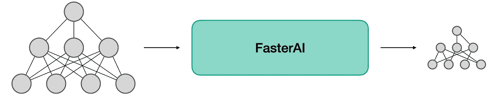
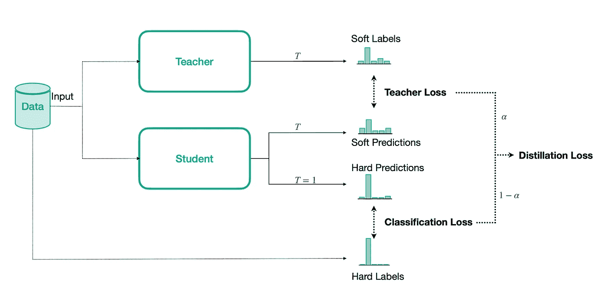
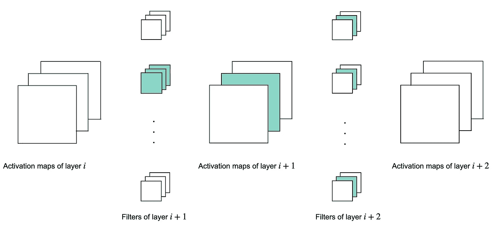
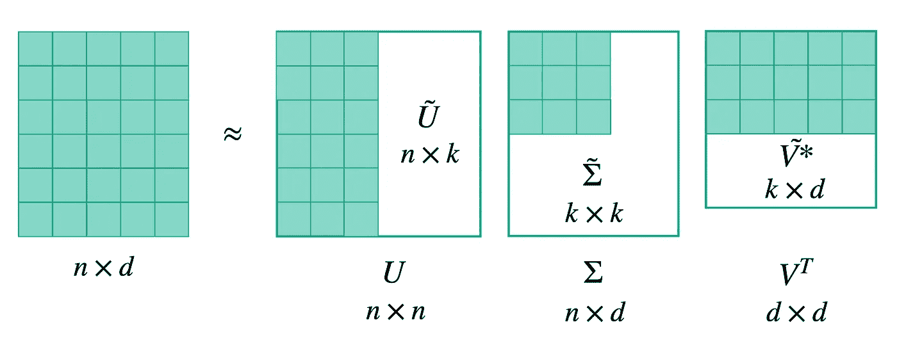

# FasterAI:制作更小更快的神经网络的库

> 原文：<https://towardsdatascience.com/fasterai-a-library-to-make-smaller-and-faster-neural-networks-70c3ff2e2ba3?source=collection_archive---------16----------------------->

## [理解大数据](https://towardsdatascience.com/tagged/making-sense-of-big-data)

## FasterAI 包括一组用于神经网络的压缩技术，构建于 Fastai 和 Pytorch 之上



作者图片

# FasterAI 简介

*→图书馆可以在这里找到*[](https://github.com/nathanhubens/fasterai)

*FasterAI 是一个项目，它通过使用 [fastai](https://github.com/fastai/fastai) 库来使神经网络变得更小更快。这里实现的技术可以很容易地与普通 Pytorch 一起使用，但是我们的想法是以一种抽象和易于使用的方式来表达它们( *à la* fastai)。*

*在本文中，我们将通过一个用例来解释如何使用 FasterAI。*

## **准备好了吗？那我们开始吧！**

*为了演示的目的，让我们先了解一些背景知识。假设我们想要在存储容量有限的移动设备上部署一个 VGG16 模型，并且我们的任务要求我们的模型运行足够快。众所周知，参数和速度效率不是 VGG16 的强项，但让我们看看我们能做些什么。*

*我们先来检查一下 VGG16 的参数个数和推断时间。*

```
*learn = Learner(dls, vgg16_bn(num_classes=10), metrics=accuracy)*
```

*因此，VGG16 有 1.34 亿个参数*

```
*Total parameters : 134,309,962*
```

*并花费 4.03 ms 对单幅图像进行推断。*

```
*4.03 ms ± 18.5 µs per loop (mean ± std. dev. of 7 runs, 100 loops each)*
```

*啪！这超出了我们的部署能力，理想情况下，我们希望我们的模型只需要一半的容量…但是我们应该放弃吗？不，实际上有很多技术可以帮助我们减小模型的尺寸并提高速度！让我们看看如何用 FasterAI 应用它们。*

*我们将首先训练我们的 VGG16 模型，以便对它的性能有一个基准。*

```
*learn.fit_one_cycle(10, 1e-4)epoch | train_loss | valid_loss | accuracy | time
0     | 2.016354   | 1.778865   | 0.3689170| 1:31
1     | 1.777570   | 1.508860   | 0.5235670| 1:31 
2     | 1.436139   | 1.421571   | 0.5691720| 1:32
3     | 1.275864   | 1.118840   | 0.6300640| 1:31
4     | 1.136620   | 0.994999   | 0.6878980| 1:31
5     | 0.970474   | 0.824344   | 0.7396180| 1:31
6     | 0.878756   | 0.764273   | 0.7656050| 1:32
7     | 0.817084   | 0.710727   | 0.7819110| 1:31
8     | 0.716041   | 0.625853   | 0.8048410| 1:31
9     | 0.668815   | 0.605727   | 0.8109550| 1:31*
```

*因此，我们希望我们的网络具有相当的精度，但参数更少，运行速度更快……我们将展示如何使用的第一项技术叫做**知识蒸馏***

# *知识蒸馏*

*知识提炼是一种简单但非常有效的训练模型的方法。卡鲁阿纳等人于 2006 年推出了这一技术。背后的主要思想是用一个小模型(称为**学生**)来近似一个更大的高性能模型(称为**老师**)所学的函数。这可以通过使用大模型来伪标记数据来实现。这个想法最近已经被用来打破 ImageNet 上最先进的精确度。*

*当我们训练模型进行分类时，我们通常使用 softmax 作为最后一层。这个 softmax 的特点是将低值逻辑值挤向 0，将最高值逻辑值挤向 1。这实际上完全丢失了所有的类间信息，或者有时被称为*黑暗知识*。这是有价值的信息，我们希望从老师那里传递给学生。*

*为此，我们仍然使用常规分类损失，但同时，我们将使用另一个损失，在老师的*软化*逻辑(我们的*软标签*)和学生的*软化*逻辑(我们的*软预测*)之间计算。这些软值是在使用 soft-softmax 时获得的，这样可以避免在其输出端挤压这些值。我们的实施遵循[本文](http://cs230.stanford.edu/files_winter_2018/projects/6940224.pdf)，培训的基本原则如下图所示:*

**

*作者图片*

*要在 FasterAI 中使用知识蒸馏，您只需在训练学生模型时使用此回调函数:*

```
**KnowledgeDistillation(student, teacher)**
```

> **你只需要给回调函数你的学生学习者和你的教师学习者。在幕后，FasterAI 将使用知识精华来制作您的火车模型。**

*首先要做的是找到一个老师，可以是任何模型，最好表现良好。我们将选择 VGG19 进行演示。为了确保它比我们的 VGG16 模型性能更好，让我们从预训练版本开始。*

```
*teacher = cnn_learner(dls, vgg19_bn, metrics=accuracy)
teacher.fit_one_cycle(3, 1e-4)epoch | train_loss | valid_loss | accuracy | time
0     | 0.249884   | 0.088749   | 0.9727390| 1:02
1     | 0.201829   | 0.087495   | 0.9742680| 1:02
2     | 0.261882   | 0.082631   | 0.9740130| 1:02*
```

*我们的老师有 97.4%的准确率，这已经很不错了，它已经准备好保护学生了。因此，让我们创建我们的学生模型，并通过知识蒸馏回拨对其进行培训:*

```
*student = Learner(dls, vgg16_bn(num_classes=10), metrics=accuracy)
student.fit_one_cycle(10, 1e-4, cbs=KnowledgeDistillation(student, teacher))epoch | train_loss | valid_loss | accuracy | time
0     | 2.323744   | 2.102873   | 0.4109550| 2:16
1     | 2.099557   | 2.441147   | 0.5714650| 2:16 
2     | 1.829197   | 2.215419   | 0.6076430| 2:16
3     | 1.617705   | 1.683477   | 0.6670060| 2:16
4     | 1.364808   | 1.366435   | 0.7133760| 2:16
5     | 1.257906   | 0.985063   | 0.7880250| 2:16
6     | 1.087404   | 0.877424   | 0.8010190| 2:16
7     | 0.949960   | 0.777630   | 0.8221660| 2:16
8     | 0.868683   | 0.733206   | 0.8377070| 2:16
9     | 0.756630   | 0.707806   | 0.8430570| 2:16*
```

*我们可以看到，老师的知识确实对学生有用，因为它明显超出了基线 VGG16。*

*好了，现在我们能够从一个给定的模型中得到更多，这有点酷！通过一些实验，我们可以设计出比 VGG16 更小的模型，但能够达到与我们的基线相同的性能！您可以稍后尝试自己找到它，但现在让我们继续下一项技术！*

# *稀疏化*

*现在我们有了一个比基线表现更好的学生模型，我们有一些空间来压缩它。我们将从稀疏网络开始。*

****注*** *:通常情况下，使网络稀疏的过程称为剪枝。当参数实际上从网络中移除时，我们更喜欢使用术语修剪，这将在下一节中进行。**

*在 FasterAI 中，稀疏化过程也是通过使用回调来管理的，回调将在训练期间用零替换模型中最不重要的参数。回调函数有各种各样的参数来调整您的稀疏化操作，让我们来看看它们:*

```
**SparsifyCallback(sparsity, granularity, method, criteria, sched_func)**
```

*   ***稀疏度**:你想要的网络稀疏度的百分比*
*   ***粒度**:你希望在什么粒度上进行稀疏化操作(`weight`、`kernel`、`filter`、…)*
*   ***方法**:无论是`local`还是`global`，都会影响参数的选择，是在每一层单独选择(`local`)还是在整个网络上选择(`global`)。*
*   ***标准**:用于选择移除哪些参数的标准(`large_final`、`movement`、…)*
*   ***sched_func** :你希望按照哪个调度进行稀疏化(目前支持:[fastai](https://docs.fast.ai/callback.html#Annealing-functions)的任意调度函数，即`annealing_linear`，`annealing_cos`，...而且还有经典的时间表如`one_shot`、`iterative`、`annealing_gradual`、朱[古普塔&提出的时间表](https://openreview.net/pdf?id=Sy1iIDkPM)*

*但是让我们回到我们的例子上来！*

*这里，我们将使我们的网络 40%稀疏，并删除整个过滤器，本地选择并基于 *L1* 规范。我们将以稍小的学习率进行训练，以温和地对待我们的网络，因为它已经被训练过了。所选择的调度是一个退火余弦，所以修剪开始和结束都很温和。*

```
*student.fit(10, 1e-5, callbacks=[SparsifyCallback(40, granularity='filter', method='local', criteria=large_final, sched_func=annealing_cos)])Pruning of filter until a sparsity of 40%epoch | train_loss | valid_loss | accuracy | time
0     | 0.584072   | 0.532074   | 0.8384710| 1:31
1     | 0.583805   | 0.499353   | 0.8445860| 1:31 
2     | 0.599410   | 0.527805   | 0.8364330| 1:32
3     | 0.610081   | 0.544566   | 0.8280250| 1:31
4     | 0.625637   | 0.543279   | 0.8298090| 1:31
5     | 0.628777   | 0.563051   | 0.8196180| 1:31
6     | 0.688617   | 0.617627   | 0.8000000| 1:32
7     | 0.691044   | 0.629927   | 0.8010190| 1:31
8     | 0.669935   | 0.576220   | 0.8140130| 1:31
9     | 0.682428   | 0.562718   | 0.8239490| 1:31Sparsity at epoch 0: 0.98%
Sparsity at epoch 1: 3.83%
Sparsity at epoch 2: 8.25%
Sparsity at epoch 3: 13.83%
Sparsity at epoch 4: 20.01%
Sparsity at epoch 5: 26.19%
Sparsity at epoch 6: 31.76%
Sparsity at epoch 7: 36.19%
Sparsity at epoch 8: 39.02%
Sparsity at epoch 9: 40.00%
Final Sparsity: 40.00*
```

*我们的网络现在有 40%的滤波器完全由零组成，代价是 2%的精度。显然，选择较高的稀疏度会使网络更难保持类似的精度。其他参数也可以广泛地改变我们的稀疏化过程的行为。例如，选择更细粒度的稀疏性通常会导致更好的结果，但在速度方面更难利用。*

*我们可以仔细检查我们的模型确实被修剪了 40%的参数。*

```
*Sparsity in Conv2d 2: 39.06%
Sparsity in Conv2d 5: 39.06%
Sparsity in Conv2d 9: 39.84%
Sparsity in Conv2d 12: 39.84%
Sparsity in Conv2d 16: 39.84%
Sparsity in Conv2d 19: 39.84%
Sparsity in Conv2d 22: 39.84%
Sparsity in Conv2d 26: 39.84%
Sparsity in Conv2d 29: 39.84%
Sparsity in Conv2d 32: 39.84%
Sparsity in Conv2d 36: 39.84%
Sparsity in Conv2d 39: 39.84%
Sparsity in Conv2d 42: 39.84%*
```

*我们没有确切的 40%,因为当我们去掉完整的过滤器时，我们不一定有一个整数。*

*现在让我们看看我们在速度方面获得了多少。因为我们删除了 40%的卷积滤波器，我们应该期待疯狂的加速，对不对？*

```
*4.02 ms ± 5.77 µs per loop (mean ± std. dev. of 7 runs, 100 loops each)*
```

*实际上，没有。我们没有删除任何参数，我们只是用零代替了一些，记得吗？参数的数量仍然相同:*

```
*Total parameters : 134,309,962*
```

*这将引导我们进入下一部分。*

# *修剪*

> ***重要提示**:这目前仅支持全前馈模型，如 VGG 模型，因为更复杂的架构需要越来越困难且通常依赖于模型的实现。*

*为什么我们没有看到任何加速度，即使我们去掉了一半的参数？这是因为我们的 GPU 本身不知道我们的矩阵是稀疏的，因此无法加速计算。最简单的办法，就是用**物理地**移除我们归零的参数。但是这种操作需要改变网络的架构。当移除层 *i+1，*中的过滤器时，它也影响层 *i+2，*中的内核，因为它们现在变得无用并且可以被移除。*

**

*作者图片*

*这种修剪只有在我们事先将整个滤波器归零的情况下才有效，因为这是唯一可以相应地改变架构的情况。希望稀疏计算很快能在普通深度学习图书馆中可用，所以这一部分在未来将变得无用，但目前，这是我们能想到的最好的解决方案🤷*

*这是 fasterai 的样子:*

```
*pruner = Pruner()
pruned_model = pruner.prune_model(learn.model)*
```

> **您只需传递其过滤器已被稀疏化的模型，FasterAI 将负责移除它们。**

****注意*** *:该操作应该是无损的，因为它只移除已经不再参与网络的过滤器。**

*在我们的例子中，它给出了:*

```
*pruner = Pruner()
pruned_model = pruner.prune_model(student.model)*
```

*现在，让我们看看我们的模型能够做些什么:*

```
*Total parameters : 83,975,344*
```

*就速度而言:*

```
*2.44 ms ± 3.51 µs per loop (mean ± std. dev. of 7 runs, 100 loops each)*
```

*耶！现在我们可以说话了！让我们再次检查我们的准确性没有改变，我们没有在某个地方出错:*

```
*Loss: 0.5641388, Accuracy: 0.8229*
```

*实际上我们还能做更多的事情！让我们继续前进！*

# *批量标准化折叠*

*批量规范化折叠是一个非常容易实现和简单的想法。要点是批量标准化只不过是对每一层的输入数据进行标准化。此外，在推断时，用于这种标准化的批次统计是固定的。因此，我们可以通过改变卷积的权重将归一化过程直接合并到卷积中，并完全移除批量归一化层，这在参数和计算方面都是一个增益。更深入的解释，请看我的[上一篇](https://medium.com/towards-data-science/speed-up-inference-with-batch-normalization-folding-8a45a83a89d8)帖子。*

*这是如何与 FasterAI 一起使用:*

```
*bn_folder = BN_Folder() 
bn_folder.fold(learn.model))*
```

****注意*** *:该操作也应该是无损的，因为它重新定义了卷积以考虑批量范数，因此是等价的。**

*让我们用我们的模型来做吧！*

```
*folded_model = bn_folder.fold(pruned_learner.model)*
```

*参数下降通常不太明显，尤其是在 VGG 这样的网络中，几乎所有参数都包含在 FC 层中，但是，任何增益都是值得的。*

```
*Total parameters : 83,970,260*
```

*既然我们删除了批处理规范化层，我们应该再次看到加速。*

```
*2.27 ms ± 1.22 µs per loop (mean ± std. dev. of 7 runs, 100 loops each)*
```

*再一次，让我们仔细检查我们没有在某个地方搞砸:*

```
*Loss: 0.5641388, Accuracy: 0.8229*
```

*我们还没完成呢！正如我们所知，对于 VGG16，大部分参数都包含在全连接层中，因此我们应该对此有所作为，对吗？*

# *FC 层因子分解*

*事实上，我们可以分解我们的大的全连接层，并用两个更小的近似层来代替它们。其思路是对权重矩阵进行 SVD 分解，将原矩阵表示为 3 个矩阵的乘积:*uσVT*。其中*σ*是沿其对角线具有非负值的对角矩阵(奇异值)。然后，我们定义奇异值的值 *k* 来保持和修改矩阵 *U* 和 *VT* 。结果将是初始矩阵的近似值。*

**

*作者图片*

*在 FasterAI 中，要分解模型的全连接层，您需要执行以下操作:*

```
*FCD = FCDecomposer() 
decomposed_model = FCD.decompose(model, percent_removed)*
```

> **`*percent_removed*`*对应去除奇异值的百分比(* k *值)。***

*****注*** *:这次分解不确切，所以我们预计之后业绩会下降，需要进一步的再培训。***

**在我们的示例中，如果我们只想保留其中的一半:**

```
**fc_dec = FCDecomposer()
dec_model = fc_dec.decompose(folded_model, percent_removed=0.5)**
```

**我们现在有多少参数？**

```
**Total parameters : 61,430,022**
```

**我们赢得了多少时间？**

```
**2.11 ms ± 462 ns per loop (mean ± std. dev. of 7 runs, 100 loops each)**
```

**然而，这种技术是近似的，所以它不是无损的，所以我们应该重新训练我们的网络来恢复它的性能。**

```
**final_learner = Learner(data, dec_model, metrics=[accuracy])
final_learner.fit_one_cycle(5, 1e-5)epoch | train_loss | valid_loss | accuracy | time
0     | 0.795416   | 0.759886   | 0.7729940| 0:51
1     | 0.752566   | 0.701141   | 0.7943950| 0:51 
2     | 0.700373   | 0.650178   | 0.8048410| 0:52
3     | 0.604264   | 0.606801   | 0.8216560| 0:51
4     | 0.545705   | 0.592318   | 0.8231850| 0:51**
```

**这种操作通常对较新的架构用处不大，因为它们的全连接层中通常没有那么多参数。**

**概括地说，我们在本文中看到了如何使用 FasterAI 来:**

1.  **让学生模型向教师模型学习(**知识蒸馏**)**
2.  **使我们的网络稀疏化(**稀疏化**)**
3.  **可选地，物理移除零滤波器(**修剪**)**
4.  **移除批量定额层(**批量规格化折叠**)**
5.  **用较小的层来近似我们的大的全连接层(**全连接层因式分解**)**

**我们看到，通过应用这些，我们可以将 VGG16 模型的参数从 **134** 百万减少到 **61** 百万，并且还可以将推断从 **4.03** 毫秒加速到 **2.11** 毫秒，与基线相比，准确性没有任何下降(甚至实际上略有增加)。**

**当然，这些技术可以与[量化](https://pytorch.org/docs/stable/quantization.html)或[混合精度训练](https://pytorch.org/docs/stable/notes/amp_examples.html)结合使用，Pytorch 中已经提供了这些技术，可以进行更多的压缩和加速。**

*****注意*** *:请记住，上面介绍的技术不是神奇的🧙‍♂️，所以不要期望每次都能看到 200%的加速和压缩。您能实现什么在很大程度上取决于您正在使用的架构(有些已经通过设计实现了速度/参数效率)或它正在执行的任务(有些数据集非常简单，您可以删除几乎所有网络而不会看到性能下降)***

**仅此而已！感谢您的阅读，我希望您会喜欢 FasterAI。我不认为它是完美的，你可能会发现很多错误。如果你有，请告诉我，我可以试着解决它们😌**