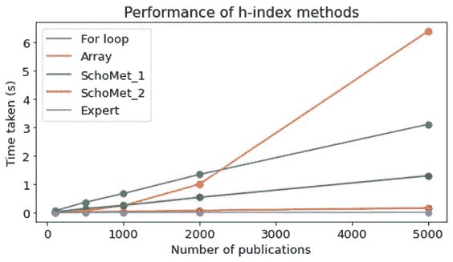

# 计算出版物 h 指数的最快方法

> 原文：<https://towardsdatascience.com/fastest-way-to-calculate-h-index-of-publications-6fd52e381fee?source=collection_archive---------21----------------------->

## 一个简单而优雅的算法胜过许多导出 h-index 的普通方法

摄影: [Jonathan Chng](https://unsplash.com/@jon_chng) 在 [Unsplash](https://unsplash.com/photos/HgoKvtKpyHA)

最初[由 J.E .赫希提出](https://www.pnas.org/content/102/46/16569)，作者的 h 指数被认为是他们学术成就的可靠指标。在一个普通的学术术语中，h-index 指的是最高的数字“h ”,这样作者就有 h 篇论文被至少 h 次引用。媒体社区的成员可以这样解释:这是一个最大的数字“h ”,一个作者写了至少 h 篇博客，收到了至少 h 个掌声。

让我们用一个例子来理解这个概念。一个作者发表了五篇博客(或研究文章)，收到了以下掌声(引用):【10，1，5，3，15】。h 指数是 3，因为至少有三个博客至少有 3 次鼓掌。另一位作家可能收到了[100，2，1，1，1]个掌声，h 指数只有 2。虽然它不是衡量一个人写作和学术能力的完美标准，但据称它在大多数情况下都能很好地反映一个作者的整体写作质量。

# **h 指数的假设应用**

假设有许多多产的作家，他们每个人都发表了数百篇关于 Medium.com 的各种主题的博客文章，包括其所有的姐妹出版物。自然，对于每个作家来说，有些文章比其他文章更受欢迎(以获得的掌声来衡量)。现在，编辑希望根据他们的 h 指数来衡量他们的表现，并相应地奖励最具生产力和质量的作家——作家的 h 指数值越高，奖励越大。

现在，编辑要求我们编写最快的程序来计算 h 指数。在集思广益会议和快速互联网搜索后，我们确定了四种不同的方法来得出 h 指数，如下所述:

1.  For-loop(我们的想法)
2.  数字广播(我们的想法)
3.  Python 包(别人的想法)
4.  好的算法(别人的想法)

接下来的部分将更详细地解释这四种方法，并计算它们在我们的测试用例中的性能。

# For 循环

在许多情况下，涉及一个或多个 for 循环的计算在计算上是低效的，然而它们仍然是最直观和最容易的做事方式。在理解 for 循环计算之前，让我们引入一个新的术语 k-index，它指的是任何 k，使得 k 篇文章有 k 次引用。k 的最大值是 h-index，这意味着一个作者可以有多个 k-index，但只有一个 h-index。h-index 的默认值为零，并且不能大于文章数。

基于 for 循环的 h 索引代码如下所示。for 循环技术通过在一个范围内从 1 到文章总数依次迭代来寻找所有可能的 k 索引。k 的最高值被认为是给定引用数组的 h 指数。

在代码中，我已经确保通过“中断”两个循环，只执行必要的计算。在第一个循环中，一旦发现 h 篇文章有 h 个引用，循环就停止迭代其余的值。第二个循环只持续到下一个 h 小于前一个值的点，这表明我们找到了最大 h。

**注意**:我尝试了非优化(无中断)的循环，效率极低，所以我将其从结果中排除。

# 数组运算

意识到 for 循环固有的缓慢，我们决定执行数组操作。我们可以用 Numpy 广播操作替换内部和外部 for 循环以及相关的 if 语句。数组允许我们同时确定所有的 k，而不是逐个计算 k 指数。下面分享代码块。

# Scholarmetrics 软件包

我们已经在网上搜索了是否存在计算 h 指数的标准 Python 包，正如我们所知，总是有 Python 库可用。Michael Rose 写的【Scholarmetrics 软件包[及其代码分享如下。请注意，稍微修改过的代码版本(方法 2)使用了 Numpy sum，而不是 Python 的内置 sum 函数。](https://scholarmetrics.readthedocs.io/en/latest/index.html)

资料来源:基于迈克尔·E·罗斯编写的学校计量学软件包 GitHub 代码

# 专家算法

我们还在其他地方寻找[，发现一些](https://en.wikipedia.org/wiki/H-index)[专家](https://www.pnas.org/content/102/46/16569)已经提出了一个简单的算法来推导 h 指数。该算法按逆序(降序)对引文进行排序，并按升序将其与相应的整数序列进行比较。两条曲线交点处的整数值就是我们的答案，编码如下:

# 确认

在我们比较这四种解决方案之前，我们需要确保它们能产生相同的结果。因此，我们可以随机生成一个样本并验证这三种方法:

上面的代码产生以下结果。所有技术都给出相同的输出，我们知道这是正确的，这验证了我们的代码。因此，我们现在可以继续进行比较测试了。

# 比较

所有实验运行重复三次，每次重复运行 100 次，并以秒为单位记录时间。正如 Python 文档推荐的那样，我们只使用了最短的运行时间。结果如下所示:

作者图片

正如所料，专家算法表现出最佳性能，其次是 Python 包代码。有趣的是，我们在 Scholarmetrics 包中使用 np.sum()而不是 sum()提高了速度，表现几乎与最佳技术相同。

令人惊讶的是，随着大小的增加，for-loop 比数组操作做得更好。这是因为即使我们消除了 for 循环，我们还是进行了计算。没有 if 语句来减少冗余步骤，代码必须处理整个输入数组。

# 最后的想法

在这篇博客中，我们研究了计算 h 指数的不同方法的计算效率。有三点要记住。首先，高效的算法是无可替代的。其次，精心编写的 for 循环也能以可接受的速度执行。第三，在 Numpy 数组上使用 Numpy 函数比使用内置 Python 函数更快。