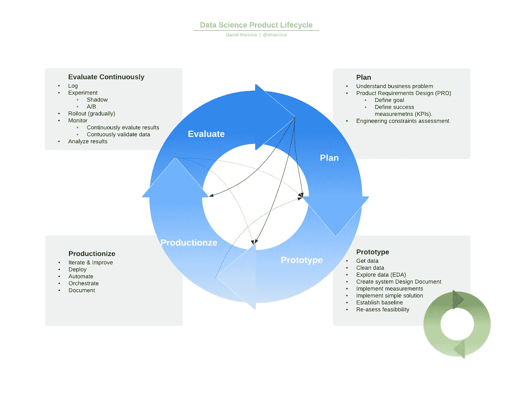

# 全周期数据科学(FCDS)

> 原文：<https://towardsdatascience.com/fcds-b2d2e6b08d34?source=collection_archive---------9----------------------->

## [行业笔记](https://towardsdatascience.com/tagged/notes-from-industry)

## 扩展数据驱动型组织的关键

在当今世界，没有数据的行动仅仅是一种观点，一个运行良好的数据科学部门不仅仅是“有就好”，而是业务繁荣的一个强烈要求。
然而，如何让一个数据科学部门取得成功并没有单一的秘诀。
虽然许多不同的公式可能适用于小型/直觉驱动/发展中的组织，但随着组织的成长和成熟，真正的问题(以及对解决方案的需求)开始显现。
如今，找到一个可扩展的解决方案是几乎所有值得尊敬的科技公司都面临的难题。
鉴于这一组织问题的本质以及某种程度上的哲学问题，我鼓励读者在他们的组织和需求发生变化时，重新审视这一问题及其首选解决方案。

在我的职业生涯中，我遇到过很多解决数据驱动的规模问题的方法。见鬼，我亲自尝试了至少一半…我很高兴地宣布，我确实找到了一个我爱上了的食谱，我觉得它足够有效，值得分享。我写这篇文章是想告诉你关于它的事情，我的经历，为什么我认为它很棒，以及给那些想在他们的组织中认真评估/实施它的读者一些建议。
为了使这个配方可重复，它需要被很好地记录和命名(这篇文章和[所说的](https://www.youtube.com/watch?v=nMghwFiquc8))。

为了描述它，我创造了一个术语**全周期数据科学** (FCDS)，我认为这是对它所包含的内容的恰当描述(下文将详细介绍)。

> **简而言之，FCDS 是一种生活方式，使单个数据从业者能够结束整个产品生命周期，独立交付端到端产品，只关注它们带来附加值的地方。**

达成这个解决方案，包括实现它的理念和技术，是许多同事@Waze & @Google 的团队努力。我很幸运能和这些专业的、以成功为导向的人一起工作，这促进了实验，直到找到这个解决方案。

> 在本文中，我将宣称这不仅仅是扩展数据驱动型业务的一种功能性方法，而且是迄今为止最有效的方法。

这篇文章代表我自己(丹尼尔·马科斯)的个人信念，与某个特定的组织无关。因此，它非常固执己见。我对自己热衷的事情非常有主见，这是其中之一:)

希望这个食谱和它的想法能引起一些读者的共鸣。如果你最终采纳了其中的一些，那么绝对值得花时间写下来！请不要客气，这样我们就可以交流从难以捉摸的道路到规模的战斗故事。

# 问题是

## 定义成功

我是一名数据科学家。作为其中一员，我无法在没有明确定义 KPI 的情况下解决问题。我在这里要展示的东西是否真的可以测量还有待商榷，但我会尽力而为。

那么，我们实际上如何定义一个成功的数据科学单位呢？为了想出一个扩展的方法，我们首先需要定义成功是什么样子。

领导期望通常有些模糊(非常令人惊讶……)，但听起来常常像这样—

> **一个成功的数据[科学]部门应该为决策提供信息，并转变我们经营业务的方式。**

这些可以是微观的(例如交易层面)或宏观的(例如我们应该把增长集中在哪里？)级别的决策，这里唯一重要的是它们是数据驱动的，或者像有些人喜欢说的那样是“智能的”。

让我们试着将它分解成业务 KPI(或者对我们的数据组织来说是 [OKR](https://en.wikipedia.org/wiki/OKR) )。
一个成功且可扩展的数据科学部门应该针对以下方面进行优化:

*   **业务影响** —我们生产的工件(无论是模型、分析、洞察力、报告、仪表板、演示)转化为影响我们业务的可衡量的结果。
    这些结果可以表现为战略和决策制定指导(通常称为“数据科学洞察”)，也可以表现为直接优化 KPI，如给定改进模型的收入(例如欺诈检测、CTR 预测)。
*   **速度** —洞察时间(无论是决策、新业务洞察还是生产就绪型 ML 模型)应尽可能缩短。这里没有经验法则，这在很大程度上取决于项目的性质，但底线是——不要因为效率低下而行动迟缓，从而阻碍产品的决策。
*   质量——通知和指导决策是一项重大责任。基于仔细审查的干净数据的准确、可理解的见解对于质量决策至关重要。没有比产生见解、让企业根据这些见解采取行动、然后才意识到自己的见解是错误的更好的摧毁数据单位可信度的方法了。有点常识的读者会理直气壮地认为“这是不可避免的”。的确如此，尽管这里的目标是尽量减少这种情况。
    你可能已经明白质量&速度是你需要管理的一个权衡。既然你意识到了这一点，你就可以和你的利益相关者讨论这些选项，并做出明智的决定，在这两者之间划一条线(每个项目/产品都不一样)。
    衡量这一属性是很棘手的，通常是定量(例如，未解决问题的数量，给定时间范围内产品迭代的数量)和定性(例如，利益相关者调查)的结合
*   **可持续发展** —一个成熟的数据驱动型组织会重新评估其成长过程中做出的决策。因此，考虑到新的数据、更新的假设，并且尽可能与之前的决策点相比较，重新考虑这些决策是至关重要的。为了允许这样的工作方式，代码(产生洞察/训练 ML 模型)必须是完全可复制的、自动化的(点击一个按钮就可以重新运行)，并且写得很好。可持续产品通常有工件，比如详细的文档，足以让新员工(甚至未来的你)回去，理解它，信任它，调整它，并产生新的结果。

值得注意的是，KPI 的这种构成非常适合数据驱动的业务(“行业”)。对于纯研究和学术数据科学工作来说，情况肯定不是这样(例如，速度-质量权衡优先于质量)。许多成熟的数据组织确实雇用了研究科学家，他们不太受业务驱动，但他们的研究确实与业务目标一致，并最终会对生产产生影响。这些研究人员可能在同一个数据科学部门工作，也可能在不同的部门工作，尽管企业的高层次目标总是优秀的产品、增长和利润。这些目标推动了上述数据科学部门的成功定义。

## 数据科学生命周期

为了讨论解决方案，我们首先需要稍微了解一下数据科学项目的生命周期。
生命周期是指管理数据科学项目需要采取的步骤及其顺序。
这通常是指主要的项目阶段，如启动/定义、开发/原型、部署&实验和测量。
它有很多种风格，使用不同的命名、序列、ML 规范等等。
在这里讨论一个具体的生命周期是没有意义的，因此我们将只提及一些高级生命周期的重要注意事项:

*   **循环** —数据科学的生命周期总是循环的。当处理数据、创建见解/模型，并与利益相关者/实验验证它们时，随着您对数据越来越熟悉，您往往会发现新的问题。这些可能需要更多的数据清理，重复假设、目标、度量等的定义。因此，这个生命周期被视为循环的，您可以随时返回到上一步，从该点继续循环
*   研究 VS 生产 —这个周期通常包括两者。您首先从了解领域开始，尝试不同的方法和原型。有时你甚至不知道在这个阶段你正在尝试做的事情是否可行。当你有一个满意的工件时，你将尝试并“生产化”它——调整并使它可用于你组织的生产基础设施，关注部署、资源、规模、延迟、成本、监控、协调等。
    周期中的这两个不同步骤彼此非常不同，在传统组织中需要不同的职能(例如科学家与工程师)和实施。这是我们在这里试图解决的问题的很大一部分。
*   **操作** —周期的最后一步，此时您已经有了生产部署的实施，例如生产 ML 模型/实时仪表板/发送给管理层的报告。在这一点上，您需要确保您的工作持续运行——进行测量、监控，并在出现问题时发出警报(例如，数据偏差、概念漂移、异常、性能不佳等)。).忽略这一部分实际上会让你的工作变成“一次性的”。虽然对某些项目有好处，但在生产中/决策中使用一些您无法重现和/或调整和修复的东西是非常危险的，以防以后发现问题(在您的工作中或甚至在您所依赖的数据中，因为显然您很棒，您不会犯错误)。

我个人在某种程度上与这种(面向 ML 的)数据科学生命周期有关。它描述了原型制作本身就是一个循环，我发现这非常正确。

数据科学产品生命周期(图片作者:[丹尼尔·马科斯](https://medium.com/u/a8a7aeec9586?source=post_page-----b2d2e6b08d34--------------------------------)

## 数据科学挑战

上面提到的多功能循环很难产生有效的、有组织规模的数据工作。
谷歌的[论文](https://papers.nips.cc/paper/5656-hidden-technical-debt-in-machine-learning-systems.pdf)——机器学习系统中隐藏的技术债务(NIPS 2015)中提出了对这一挑战的补充观点。
用一张图来概括——

机器学习系统中隐藏的技术债务— *NIPS 2015 (* 作者图片，[丹尼尔·马科斯](https://medium.com/u/a8a7aeec9586?source=post_page-----b2d2e6b08d34--------------------------------))

现在来解释一下这幅图:)
这意味着当数据科学家(在这种情况下实施 ML 模型——红框，但让我们稍微概括一下)进行研究时，她只关注产生洞察力的核心——例如模型训练/ KPI 测量(有趣的部分！).问题是，当她想要生产那段代码时，有许多其他“隐藏”的盒子，她现在必须实现并注意将它集成到生产就绪系统中。

> TL；DR — **让数据科学家不把大部分时间花在他们带来附加值的地方，是扩展数据驱动型组织的最大敌人**。

这样做的挑战在于:

*   **速度**退化——最佳状态意味着她的研究代码是“立即产生可电离的”,所有其他部分(灰色方框)都是现成的(没有方框双关语)。不幸的是，这种情况并不常见。
    * **数据科学家的时间** —上述许多挑战让我们意识到，实际上，一名现实生活中的数据科学家并没有把大部分时间花在她能带来附加值的地方。相反，她经常被拉去做运营和“生产调整”(例如扩展)工作，受到移交的阻碍，最终成为一个效率较低的自己。**让数据科学家不把大部分时间花在他们带来附加值的地方，是扩展数据驱动型组织的最大敌人**。
*   **质量**因缺乏重点和极度复杂而受损。
    ***技能集** —传统的数据科学技能集不包括扩展(软件工程)、自动化和监控(软件可靠性工程师/“devo PS”)，有时甚至不包括数据收集(卸载给其他工程师——有史以来最严重的错误……我们稍后会谈到这一点)。
    一个极端的情况是，数据科学家的研究代码实际上必须由 SWE(软件工程师)在不同的语言/技术堆栈中实现，以便与生产堆栈一起工作。除了速度，它在很多方面都是危险的！试探法，不同的包做不同的事情，训练服务偏差，等等。
*   可持续发展很难实现，传统上也不被视为一个重要因素。这反过来又通过跳过“非数据”部分，如自动化、再现性、监控、完整文档等，推动了缩短项目时间的愿望。
    ***维护** —可扩展的数据驱动型产品是为长期发展而构建的，而不是一次性的。这意味着在你“完成”一个项目后，所有这些可怕的灰色方框不会停止向你袭来。记得 cyclic 吗？当警报触发、模型性能下降、数据更改或技术堆栈升级时，数据科学家被召回维护岗位。灰色方框越多，预计维护就越多。
*   **业务影响** —获得可行见解(=生产)的时间大大高于进行纯研究的时间。在成熟的组织中，这可能意味着需要不成比例的大量劳动力来支持数据驱动的产品。然而，对于一般的组织来说，基于数据驱动(主要是 ML)的产品通常会失败，花费的时间比预期的要长，或者产生“半生不熟”/“某种智能”的结果。
    ***移交**——几乎是生产力的对立面。不要误解我的意思，我并不是说我或者任何其他人应该承担一切，在没有同事的情况下工作。我想说的是，个人贡献者拥有的越多，生产力就提高得越多，其中最佳的解决方案是拥有整个产品生命周期。将研究工作移交给 SWEs，将自动化工作移交给 SREs，将监控工作移交给 Ops 是对速度和质量的重大打击。
    ***所有权** —当很多人参与到一个项目的不同阶段时，一种非常微妙的所有权平衡就出现了。我的部分在哪里结束，你的部分在哪里开始？谁拥有整个过程？最终产品？藏物呢。正在做的决定？警报？当数据或假设改变时，再现性和更新？

所有上述问题都受到组织结构([康威定律](https://en.wikipedia.org/wiki/Conway%27s_law))等)的显著影响。)但我不打算在本文中深入探讨这一点(我也不打算声称我已经搞清楚了这一部分)。

# 解决方案

现在，如果我告诉你所有这些挑战都是可以解决的，会怎么样？(或者至少是可优化的)。我在这里提倡的全周期数据科学生活方式就是建议的解决方案。我有意把它称为一种生活方式，因为它由哲学、文化和技术组成。

你为什么要相信我？(你不应该，不要盲目相信你看的任何东西，而是想一想，觉得有意思就试试)。
它经过了战斗的考验。目前为止。)对我和我的同事有效。
这种方法实际上对数据科学家来说很有吸引力，所以说服人们尝试它并不困难——我基本上是在向你承诺更少的繁重工作和更多有趣的东西。
它是通过实验设计出来的。我(个人)犯了书中几乎所有的错误。这些错误确实有助于找出问题并试图提出解决方案。
这些错误表现为:

*   从未进入生产的数据科学/ ML 项目
*   数据科学/ ML 项目在进入生产阶段时遭遇了可怕的失败
*   无效(至少可以这么说)DS:SWE 协作和移交
*   需要为生产“重新编码”——例如，将 python ML 代码翻译成 Java，因为这是后端团队使用的代码。
*   不成比例的维护负荷

如果你认识到以上的一些(或全部)，也许这将会引起你的共鸣。

> **全周期工程是指一个工程师拥有整个产品生命周期**。

虽然这个概念对于阅读本文的数据人员来说可能是新的，但听众中的工程师可能已经熟悉了[全周期开发人员](https://netflixtechblog.com/full-cycle-developers-at-netflix-a08c31f83249)的概念。这是一个很有趣的想法。
借用数据科学领域的信息技术，创建我们所谓的**全周期数据科学** (FCDS)是我们扩展数据科学组织的解决方案。

## 高效的数据科学家

我们已经定义了成功并认识到挑战。下一步是在我们想要设置的解决方案(FCDS)的背景下，创建我们的高效数据科学家档案。
大概是这样的:

*   **专注于你最擅长的事情** —在一个包含多个职能部门(如工程师、科学家、分析师)的大型组织中，当人们将时间集中在能带来最大附加值的地方时，效率会最大化。在软件领域，这意味着关注业务逻辑，而不是样板文件和操作。**对于数据科学家来说，“逻辑”部分主要是特征工程和数据操作。利用自己的创造力和领域知识**获得正确的数据，思考对要解决的问题有最大影响的特性，并确保它们(或创造性的代理)可供使用。此外，重要的是提出正确的指标、优化方法和实验设计来衡量它们。任何 DS 都会同意，关注数据(质量和丰富性)和度量(例如，优化正确的度量)虽然不那么迷人，但对成功来说比模型本身重要得多。运营不应该是数据科学家的重点，也不应该占用他们大量的时间(请参见下面的“不运营”部分)。
    公平地说，通过调用`. fit` / `.transform `来“训练”模型，甚至使用一个花哨的包来进行 hp 调整，都是非常机械的，与一个刚毕业的学生相比，你并没有增加多少价值。这些是最容易被 AutoML 取代 DS 工作(我是一个大粉丝)的部分，也是最容易根据帕累托原则减少你的努力的部分。在大多数商业(利润驱动)组织中，几乎总是帕累托规则适用的情况，并且 80%的预期交付物和 20%的花费时间足够好，能够做出决策，快速试验并继续下一个项目。这一事实在当今超级数据驱动的世界中更加明显，在这个世界中，数据科学几乎驱动着每一个决策——积压的项目如此之多，以至于很少值得为一个单独的项目超过 80%。
*   **独立性** —在一个完美的世界里，**单个 DS 个人贡献者(IC)可以独立完成完整的数据科学产品生命周期**(参见该名称的来源？).同一 IC 开发并拥有从研究到生产级服务的所有步骤。不仅如此，同样的 IC 只需要关注逻辑而不是 ops！听起来很理想，但很疯狂，对吗？实际上，2021 年并没有那么疯狂。我想提醒的是，产品生命周期并没有在生产中结束，它包括操作、持续监控和验证、定期再培训/重新验证假设等等。你仍然应该拥有所有这些，关键是使它们足够简单，以适应一个标准的 DS 的技能集，并且在努力方面几乎是免费的。
*   不行动:我们说过 DS 不应该碰行动，但是必须有人碰。对吗？监控、编排、部署、扩展、延迟和数据质量管理对于一个健壮的生产系统来说都是至关重要的。然而，对于绝大多数数据科学产品来说，它们看起来非常相似。如今，模型性能监视器、持续培训编排、持续模型部署和数据验证框架都很容易集成(并且几乎是“可复制粘贴的”)。这意味着为您的产品设置它们应该是一个简单的配置问题，或者最好的情况是复制/继承一个现有的配置。这将使一切“免费”设置，但维护呢？这部分等式的关键是**连续**。持续的培训、数据验证、部署(模型&数据——又名特性存储)对于确保系统健康至关重要。一个持续健康的系统和使用**连续操作(CI/CD/CT)快速检测问题是一个成熟的数据系统消除维护负载的方式**。

> **回顾我们使用数据实现业务转型的目标，全周期数据科学理念表明，这可以通过授权、独立、专注的数据科学家来实现。**

# 全周期数据科学

## 哲学

E
数据科学家通常从定义/界定问题开始，考虑正确的测量和优化功能。这需要很强的业务理解、领域知识和沟通技巧。然后，她开始研究、查阅文献、实验，并尝试不同的方法。这需要以研究为导向的心态、创造力、有条理的方式和扎实的黑客技术(一点点运气不会有坏处)。
开发/生产化包括编码、测试、与生产系统的集成以及对资源的关注。这需要编码技能(显然，其他的也是，但是我们在这里谈论的是产品级)、强大的数据操作和理解以及架构/设计经验。
最后是衡量和运营，需要深入研究、解释和向利益相关者提供服务的能力。
你可以看到**拥有完整的周期需要拥有广泛技能的全面数据科学家**。

大多数数据从业者都知道，清理数据是 80%的工作。这是周期中非常重要的一部分，如果不是最重要的话，在我们的理念中，这一部分应该永远由数据科学家完全拥有。我怎么强调这有多重要都不为过。
不管你喜欢与否，清理数据是你带来最大附加值的地方。凭借您的领域知识、创造力和商业敏锐度，这对于高性能模型和准确的洞察力来说是最重要的。
作为一名数据科学家，这无疑是你工作时间最长、最重要的一部分。

> **不，你肯定不太会清理自己的数据**。

你是说有一个人比你更合适，就是那个建立模型并负责其性能的人，来决定哪些数据适合过滤/清理以及如何过滤/清理？如果是这样，你可以就此打住，和质量说再见。

值得一提的是，为了让您能够独立地结束循环，不得存在任何类型的重新实现—例如，由 SWE 为生产重新实现的 DS 研究代码。它不仅容易出错，是不好的做法，还增加了依赖性。这意味着你需要从一开始就使用正确的工具。这并不难，只是意味着要留意你使用的技术。如果你不能生产它，它就没用了。

C
它不仅减少了移交，还为数据科学家开启了一个全新的业务影响世界。此外，我发现**对于我的同事来说，产品所有权意识**是必不可少的。当你按下部署按钮，看到流量增加到你的模型，你会尽一切努力来确保它的质量和健壮性。

在大多数组织中，将代码推向生产是 SWE 的任务，如果你做错了，你可能会造成伤害。此外，它可能需要各种各样的软件/SRE 技术，如 CI/CD，而数据科学家对此一无所知。认为这真的会让你失败。使用正确的工具、托管服务、测试和标准程序来推送代码，可以让一个 5 岁的孩子将代码推向生产，而造成(严重)伤害的风险极小。
生产问题呢？作为一名数据科学家，我现在需要支持调用我的模型的生产服务吗？我需要带着呼机(不是真的)在午夜回复生产问题吗？
是的，你有。
**你拥有产品**。(不是实际的服务器/网络，只是输出预测的服务)。**你是支持它的最佳人选**。当你的模型开始输出垃圾时，你是唯一一个知道如何修复它的人(这是会发生的)。
老实说，人们倾向于认为这很可怕，但如果你做得对(像其他事情一样)，这很容易。也不一定总是你…这就是为什么[随叫随到](https://sre.google/sre-book/being-on-call/)轮换是一件事。

用一张图来总结哲学([来源](https://www.youtube.com/watch?v=nMghwFiquc8)):

FCDS 哲学(作者图片，[丹尼尔·马科斯](https://medium.com/u/a8a7aeec9586?source=post_page-----b2d2e6b08d34--------------------------------))

当前的行业标准要求 X (~3)人将数据产品(例如 ML 模型)投入生产。
**FCDS 承诺让一名独立的(全周期)数据科学家独自完成这项工作，更快、更高质量地专注于他们带来附加值的领域。** 还有，你看业界 DS 被气的对不对？这是因为他将大部分时间花在了更接近运营的事情上(如扩展和监控)，而不是调用 fit_transform(这是他真正喜欢做的事情)。

如果我在这一点上说服了你，但你在想“这在理论上很酷，但没有任何工具可以做到这一点，我不是谷歌/脸书，所以我不能只是去建立一些东西……”那么我有一个惊喜给你。

> 我们有技术。

## 技术

我们希望这项技术能够让普通的数据科学家结束产品周期，专注于逻辑，并让其他一切开箱即用。
这种技术的特点是:

*   **简单**——理解、使用、操作
*   **托管** —没有服务器，没有硬件，只有代码
*   可定制的——免费获得简单的东西，但足够灵活，可以为 5%的人疯狂，这需要到外面去
*   **可扩展的** —自动可扩展的数据处理、训练、推理
*   **Pythonic**——不要尝试其他东西……我们需要一种生产就绪的东西，它可以与当今大多数工具和代码一起工作，并且适合标准的数据科学家。如今几乎没有其他选择(我已经说过这是固执己见了吗？).

是否存在包含整个数据科学周期的工具？我希望。
但是有许多很棒的工具可以满足上述所有要求，当它们粘在一起时，可以很容易地结束这个循环。
将它们粘合在一起并自动化管道以适应您的组织可能需要一点时间……但这一次的努力是值得的。此外，工具变得越来越好，越来越丰富，正如我们所说的那样，占用了越来越大的周期，所以当你读到这篇文章时，它可能比我必须经历的要容易得多。

在本文的这一点上，值得花一分钟来确保您理解了"**全周期"**(产品生命周期)**！= "全栈"**(技术栈——例如后端和前端)
**其实完全相反！**与全堆栈不同，在全周期中，我们的目标是用单个堆栈结束整个产品生命周期！数据科学家堆栈！
Python(和令人敬畏的托管服务)就是你所需要的一切。

工具的选择完全取决于您，我并不试图说服任何读者选择其中一种。这不仅仅是一个纯技术的问题，而是你的组织喜欢什么，云提供商，个人偏好，对黑暗模式的支持(超级重要)等等。
为了充分披露，我在@Google，Waze 工作，使用 GCP 托管服务(我真的很喜欢)。为了让读者对这样的堆栈有一个大概的了解，我将非常粗略地列出我的 FCDS 堆栈中的几个工具(都是可扩展和可管理的):

*   BigQuery:结构化数据存储和 SQL 处理
*   tfX
    *[tensor flow](https://medium.com/u/b1d410cb9700?source=post_page-----b2d2e6b08d34--------------------------------)2 . x
    * TF . transform over data flow:批处理&流处理，特性工程嵌入到 TF 模型中，因此您只需编写一次代码
    *开箱即用的组件，用于数据验证、模型分析、模型祝福(与以前的模型版本相比)和部署
*   云 AI 平台(CAIP) ->现在叫顶点 AI
    * CAIP 笔记本:研究&探索
    * CAIP 工作:培训
    * CAIP 机型:高负载&低延迟推断
    * CAIP 管道:TFX 即服务
*   更多的小补充超出了本文的范围。举几个例子:Git、Gerrit、Jenkins、通过 Cloud Composer 的气流

帮助数据科学家开始使用新 FCDS 技术的一个常用方法是提供生产就绪、可分叉、经过测试的完整管道模板(从数据探索到持续培训和部署)。我发现它极大地缩短了开发时间并简化了采用。

## 文化

“走向 FCDS”是数据驱动型组织文化中的一项重大变革。数据科学家不仅只能依靠他们自己(可能有些夸张)，他们现在还直接为生产做出贡献！
这几乎总是意味着需要以工程为导向提升数据科学家的技能。
新的数据科学文化现在从坚实的工程文化中借用概念。
它现在发现了升值的价值:

*   **代码质量** —我们不构建一次性的，我们构建持久的生产系统
    *代码评审
    *单元测试
    *没有生产代码的笔记本(只是为了原型开发)——关于这个主题已经写了无数的文章。TL；DR 是一个成熟的项目代码，包含。py 文件与。ipynb 文件。它易于重用(可导入)、可测试、可审查、通用、可参数化、可与其他组件集成、不依赖数据等。基本上，它让你走上了可持续发展的正确道路。是的，我知道笔记本领域有几种工具可以尝试解决这些问题。我只想说，你可以给猪涂口红，但它还是一头猪。
*   **系统质量** *研究文档&评审
    *设计[文档](https://www.industrialempathy.com/posts/design-docs-at-google/) &评审
    *成功定义
    * KPI /测量设计
    *实验设计

# 实施说明

## 全周期数据科学家简介

数据科学有多种口味。FCDS 方法足够通用，可以应用于其中的许多领域，可能是机器学习，取代试探法和算法，产品分析或传统统计。通常情况下，数据科学家需要平衡这些不同类型的项目。此外，每一个这样的领域(例如 ML)可能包括非常不同的子领域(例如推荐系统、计算机视觉、NLP)。

这就是为什么我们的方法**更喜欢数据科学** [**通才**](https://hbr.org/2019/03/why-data-science-teams-need-generalists-not-specialists) (缝针修复)——全面发展的个人，他们可以深入新的领域和工作类型，并应用他们的数据导向、技术技能集和领域知识来创造成功的产品。这些人确实存在，我正在和他们中的一群人一起工作！(作为经理，我的职责是让他们意识到他们有能力做到这一点，并提供一些小的指导)。对于专家来说，您的组织足够大吗？(多面手的反义词)请便，但你可能希望专家成为研究科学家，而不是数据科学家。
我很少见过在生产影响导向的岗位上比多面手做得更好的专家。老实说，对于任何多面手来说，使用现成的 keras 架构/领域 SOTA 模型只需几个小时。

> FCDS 以影响力为导向。这意味着像每一个值得尊敬的软件开发哲学一样，我们以敏捷的方式工作。

我们从小处着手，我们制作原型，我们建立一个可靠的生产管道(分叉模板，在几分钟内准备好)并实现一个简单的基线(甚至不一定是一个模型！).我们建立测量，然后我们开始迭代和改进。

现在我将进入真正有争议的部分:)
我们可以将世界分为两种类型的数据科学家——行业驱动型和学术驱动型。
FCDS 非常重视产品影响和代码质量，它倾向于前者。
显然两者兼而有之很好，但是为了说明一点，我要声明**比起没有生产经验/糟糕的编码技能的博士，我更喜欢雇佣一个优秀的、思维敏捷的、对数据有兴趣和良好感觉的工程师**。

我们之前提到过，独立性对于高效的数据科学家至关重要。然而，重要的是不要把独立和隐居混为一谈。不善于与他人合作的“独狼”类型不是数据科学家的良好形象。独立意味着你可以快速行动，但是集思广益、相互审查以及与利益相关者的密切沟通对于深入研究和数据解释这种工作来说是非常重要的，而这种工作是数据科学家的谋生之道。

> 总而言之，一个伟大的**全周期数据科学家是一个独立、全面的通才，他喜欢什么都做一点，拥有扎实的编码技能，重视敏捷，喜欢生产影响胜过研究**。

## 有效性危险信号

拥抱像 FCDS 这样的新生活方式及其哲学、技术和文化是一个过程。与其指出一大堆要遵循的规则，不如指出清晰的危险信号来表明效率的降低和道路的偏离。

危险信号包括:

*   角色(非常固执己见)
    ***数据工程师做的是构建工具以外的事情。这是我怎么强调其重要性都不为过的头号错误**。数据工程师是软件工程师，他们构建恰好在数据领域的软件系统。还记得我们说过，我们需要把一堆不同的工具粘在一起，让每样东西都能为普通的 DS 工作吗？适应我们的组织需求，建立稳固的 CI/CD 渠道等。这都是数据工程。
    **构建数据管道**和仪表板(ETL / BI)是数据科学家的角色。它**是周期**的重要组成部分！把它交给别人意味着我们没有完成整个周期。如果你认为有些 ETL 对于 DS 来说太复杂了，你没有使用正确的工具或者没有雇佣正确的数据科学家。
    工程师不应该写 ETL (缝合修复)
    ***你有一个 ETL / BI 工程师角色**。同上，这意味着您的 DSs 没有完成整个周期。
    ***你有一个 ML 工程师的角色**。如果你需要一个工程师把你的 ML 代码投入生产，那么你的 DSs 就没有做完整的循环。
    *您需要 SREs/Devops 协助将 DS 代码推向生产
*   处理问题
    *由用户发现的数据/模型问题，而不是由警报发现的问题
    *无法回滚到先前的模型版本
    *不容易复制当前的生产模型
    *重新训练模型是手动的
*   重新实施
    * DS 需要在研究和生产之间重新实施他们自己的工作
    * DS 移交研究代码(模型/特征工程等。)供 SWE 重新编码到生产堆栈中
*   错位
    *用于分析/训练(离线)的数据与用于生产/推理(在线)的数据不完全相同
    *特征工程代码使用试探法/代理来补偿未记录的数据

## 时机

你可能会问自己，这是否是你的组织尝试采用 FCDS 的正确时机。

答案是肯定的。

*   小型创业公司构建数据组织？以这种方式开始——无论如何你都必须这样做，因为雇佣专家而不是能做所有事情的多面手对你来说是非常昂贵的。你只需要投资合适的工具，让他们的生活更轻松。
*   大公司？这是最难的，因为文化已经存在，人们对自己的所作所为感到满意。但是，这是您将看到对速度、质量和整体业务影响最大的地方。
*   中间的某个地方？在你大到难以改变文化之前，开始尝试这种方法。尝试，慢慢过渡，先只做一些项目，投资科技(反正对你有好处)。开始模糊不同职能之间的界限，让 DS 慢慢地从 DE/SWE/SRE 身上咬下一大块，直到你可以结束这个循环。

# 摘要

> **扩展数据驱动型组织的最有效方法是采用全周期数据科学，这是一种端到端的方法，其中个人结束整个产品周期，专注于他们带来附加值的地方，并获得其他现成的东西。**

这种方法应该创建一个成功的数据组织

*   **速度** * DS 可以专注于创意方面
    *可重用组件和可复制粘贴的生产就绪模板
*   **质量** * DS 清理自己的数据
    *现成的数据验证&监控
*   **可持续性** *自动化
    *可再生
    *可扩展
*   **业务影响** *可操作洞察/生产最小化的时间
    *单个 DS 完全端到端独立
    * DS **拥有**生产产品&工件
    ***满意度** ** DS 关心生产
    ** DS 感受他们的影响

那么，扩展数据驱动型组织的问题解决了吗？大概不会。我已经在 2020 年左右开始了这项工作，现在效果很好，但那只是在我们遇到下一组问题之前。此外，整齐地结束循环所需的一些工具甚至还没有出现…这些天来，可扩展的训练推理服务的部署很容易找到，但当涉及到功能存储和“数据部署”时，它仍然是一个大烂摊子。

我要感谢我的许多同事@Waze & @Google ，他们通过实验、集思广益、提出问题和不断努力把事情做得更好，为这项工作做出了巨大贡献。

我也要感谢 [**Alon Palombo**](https://www.linkedin.com/in/alon-palombo/) 和 [Philippe Adjiman](https://medium.com/u/bf3f25a8343?source=post_page-----b2d2e6b08d34--------------------------------) 对这部作品的详细回顾和贡献。