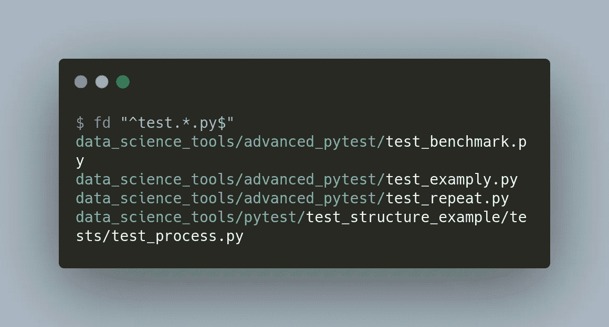

# fd:一个简单但功能强大的工具，用于在命令行中查找和执行文件

> 原文：<https://towardsdatascience.com/fd-a-simple-but-powerful-tool-to-find-and-execute-files-on-the-command-line-602f9af235ad?source=collection_archive---------28----------------------->

## 找到任何文件。很简单。快点。

# 动机

你有没有想过不用离开终端就能找到文件？`find`允许你这样做，但是它的语法很复杂。

如果您可以使用如下的简单语法来搜索文件，那不是很好吗？


作者图片

这就是 fd 派上用场的时候。在本文中，我将向您展示什么是 fd，以及如何使用它来快速查找任何文件。

# 什么是 fd？

[fd](https://github.com/sharkdp/fd) 让你快速找到任何文件。fd 相比`find`更容易上手。下面是两个命令之间的比较。


作者图片

换句话说，你只需要用`fd pattern`搜索带有`pattern`的文件。

## 装置

按照本说明书安装 fd。

# 其他有用的功能

## 查找具有特定文件扩展名的文件

如果您想查找具有某种文件扩展名的文件，如`.md`或`.py`，请使用`fd -e extension_name`。


作者图片

## 使用正则表达式

您也可以使用正则表达式来查找如下文件:



作者图片

## 在特定路径中查找文件

如果你想找到某个目录下的文件，只需使用`fd PATTERN directory_name`。


作者图片

## 命令执行

有时你可能想抓取多个文件，然后**对它们做些什么**。这也可以用 fd 来完成。要对每个搜索结果执行命令，将`-x`添加到命令中。

您可以尝试使用此功能做一些有用的事情:

*   移除以`txt`结尾的文件


作者图片

*   在您喜欢的编辑器中打开多个文件


作者图片

*   重命名多个文件


作者图片

注意`{}`是搜索结果的占位符(`text1.txt`、`text2.txt`)。

`{.}`也是搜索结果的占位符，但没有文件扩展名(`text1`、`text2`)。

# 高级功能

## 忽略大小写

默认情况下，fd 区分大小写。可以添加`-i`忽略大小写。


作者图片

## 将目录遍历限制到给定的深度

默认情况下，搜索深度没有限制。通过在命令中添加`-d`，可以将目录遍历限制在给定的深度。


作者图片

在命令中添加`-d 1`告诉 fd 只搜索当前目录中的文件。

## 查找隐藏文件

fd 的另一个强大功能是显示隐藏文件，比如`.git`。要查看隐藏文件，在命令中添加`-H`。


作者图片

## 忽略文件

您还可以通过在命令中添加`-E`来忽略特定的文件


作者图片

…或者将您想要忽略的文件添加到同一目录下的`.fdignore`文件中:


作者图片

很酷，不是吗？

要查找 fd 提供的其他功能，请键入:

```
fd --help
```

# 结论

恭喜你！您刚刚学习了如何找到具有特定模式的文件，并使用 fd 执行它们。我希望这个工具能把你从花在小任务上的时间中解放出来，这样你就可以腾出时间来做重要的任务。

我喜欢写一些基本的数据科学概念，并尝试不同的算法和数据科学工具。你可以在 [LinkedIn](https://www.linkedin.com/in/khuyen-tran-1ab926151/) 和 [Twitter](https://twitter.com/KhuyenTran16) 上联系我。

如果你想查看我写的所有文章的代码，请点击这里。在 Medium 上关注我，了解我的最新数据科学文章，例如:

</create-a-beautiful-dashboard-in-your-terminal-with-wtfutil-573424fe3684>  </how-to-create-and-view-interactive-cheatsheets-on-the-command-line-6578641039ff>  </3-tools-to-track-and-visualize-the-execution-of-your-python-code-666a153e435e> 