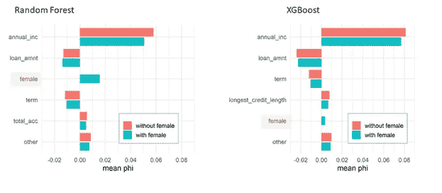

# 功能选择和公平性:少即是多

> 原文：<https://towardsdatascience.com/feature-choice-and-fairness-less-may-be-more-7809ec11772e?source=collection_archive---------36----------------------->

## [公平和偏见](https://towardsdatascience.com/tagged/fairness-and-bias)

## 深思熟虑的预测值选择对于模型的公平性至关重要

由[布雷特·乔丹](https://unsplash.com/@brett_jordan?utm_source=medium&utm_medium=referral)在 [Unsplash](https://unsplash.com?utm_source=medium&utm_medium=referral) 上拍摄的照片

我经常听到的一个常见的与人工智能有关的担忧是，机器学习模型将利用隐藏在庞大的个人信息数据库中的古怪事实来做出影响生活的决定。例如，你在简历中使用 Arial 字体的事实，加上你养猫和喜欢 pierogi，会阻止你得到一份工作。与这种担忧相关的是害怕由于这种推断而受到基于性别或种族的歧视。这种恐惧是愚蠢的还是现实的？机器学习模型是基于相关性的，任何与一个结果相关联的特征都可以作为决策依据；有理由担心。然而，这种情况发生的风险取决于模型可用的信息和所使用的特定算法。在这里，我将使用样本数据来说明随机森林与 XGBoost 模型中纳入附带信息的差异，并讨论在评估模型公平性时考虑缺失信息、适当性和因果关系的重要性。

特征选择——检查可能缺少的和包含的——对于模型的公平性非常重要。通常特征包含仅仅被认为是保留或省略了“敏感”特征，如种族或性别，或这些特征的显而易见的代理。然而，模型可以利用与结果相关联的任何特征，并且模型性能和公平性的通用度量将基本上不受影响。偶然的相关特征可能不是合适的决策基础，或者它们可能代表不公平的风险。当模型中不包括适当的预测因子时，附带特征风险最高。因此，仔细考虑可能遗漏的内容至关重要。

# 资料组

本文基于上一篇博文的结果，并使用相同的数据集和代码库来说明缺失和附带特性的影响[1，2]。简而言之，我使用一个公开可用的贷款数据集，其中的结果是贷款违约状态(二元)，预测因素包括收入、就业时间、债务负担等。我倾向于(但随机地)将低收入案例归为虚构的“女性”类别，为了简单起见，只考虑两种性别类别(“男性”和“女性”)。结果是“女性”的平均收入较低，但男性和女性的收入重叠；有些女性收入高，有些男性收入低。通过检查常见的公平性和绩效指标，我发现无论模型是依靠收入还是性别来预测违约，结果都是相似的，这说明了仅依靠指标来检测偏差的风险。

我之前的博文展示了当一个附带特性*代替了一个合适的特性*时会发生什么。在这里，我将讨论当*适当的预测因子和附带特征都包含在数据中时会发生什么。我测试了两种类型的模型，并表明，正如所料，女性身份有助于预测，尽管它不包含额外的信息。然而，偶然特征对随机森林模型的贡献比对 XGBoost 模型的贡献大得多，这表明模型选择可能有助于减少不公平风险，尽管应该考虑权衡。*

# *公平指标和全球重要性*

*在我的示例中，女性特性没有向已经包含收入的模型添加任何信息。任何对女性身份的依赖都是不必要的，并代表着“直接歧视”的风险。理想情况下，机器学习算法会忽略这样的特征，而支持更强的预测器。*

*当随机森林或 XGBoost 模型增加了女性地位这一附带特征时，我发现总体性能特征或性能指标几乎没有变化(数据未显示)。ROC 分数几乎没有变化(这是意料之中的)。假阳性率显示非常轻微的变化。*

*当纳入女性指标时，XGBoost 的人口统计均等(即女性与男性的贷款违约率差异)基本保持不变(5.2%比 5.3%)，但对于 random forest，该指标从 4.3%变为 5.0%；我将在下面详细讨论这个观察结果。*

*对于两种模型类型，全局排列重要性显示出女性特征的微弱影响。这个特性在随机森林模型中排名 12/14，在 XGBoost 中排名 22/26(当女性=1 时)。女性地位相对较低的事实似乎令人放心，但这一特征的任何影响都是公平风险。*

*当数据中包含女性地位时，全球指标中没有明确的危险信号，但这是意料之中的，因为无论决策是基于偶然因素还是因果因素，公平指标都是相似的[1]。关键问题是:纳入女性地位是否会增加结果的差异？*

# *聚合 Shapley 值*

*我们可以使用聚集的 Shapley 值来衡量某个特征对群体预测差异的贡献程度[3]。这项技术将预测结果率的差异分布在各个特征之间，这样我们就可以确定是什么导致了女性与男性之间的差异。计算包括构建由随机选择的雄性组成的参考数据集，使用该“箔”计算随机选择的雌性的 Shapley 特征重要性，然后合计雌性 Shapley 值(也称为“phi”值)。*

*下面显示了带有和不带有“女性”特征的两种模型类型的结果。不包括女性的模型的前 5 个特征与包括该特征的模型的女性状态一起绘制。其他所有特征都被总结为“其他”。*

**

*显示随机森林(左)和 XGBoost(右)模型中女性与男性预测总体差异相关特征的聚合 Shapley 图。排除(红色条)和包括(蓝色条)女性状态特征的模型的结果包括在内。图片作者。*

*首先，请注意，对于 random forest 来说，雌性的蓝色条(只存在于包含雌性状态的模型中)比 XGBoost 大得多。条形图大小表示归因于某一特征的女性与男性的概率差异量。对于 random forest，女性状态功能使女性相对于男性的违约概率增加了 1.6%，相比之下，XGBoost 的违约概率为 0.3%，相差约 5 倍。*

*对于 random forest，女性地位在决定男性与女性预测差异的三大影响特征中排名第一，尽管该特征在全球范围内排名第 12 位。全局重要性没有捕捉到该特征对公平性的影响。*

*如上一节所述，随机森林模型显示，当模型中包括女性地位时，人口统计均等性下降。这种效应在 Shapley 图中也很明显——女性柱的增加不会被其他柱的减少所补偿。对于 XGBoost 来说，女性地位的微小贡献似乎被其他特征贡献的微小减少所抵消。*

*当我们考虑算法如何工作时，与随机森林相比，XGBoost 附带特性的影响减少是有意义的。随机森林使用要素的随机子集创建树，并对其进行最佳分割检查。这些初始特征集中的一些将包括附带特征，但不包括适当的预测器，在这种情况下，可以选择附带特征用于分割。对于 XGBoost 模型，分割标准基于对以前模型的改进。偶然特征不能改善基于更强预测器的模型；因此，在几轮之后，我们期望树只包括适当的预测器。*

*考虑到模型建立机制，也可以理解随机森林的人口奇偶减少。当在随机森林中生成要考虑进行分割的要素子集时，我们基本上有两个“收入”要素，因此更有可能选择(直接或间接)收入信息。*

*随机森林模型有效地使用了比 XGBoost 更大的功能集。尽管在某种程度上这两种模型类型中都可能出现大量的特性，但是 XGBoost 解决方案将倾向于更少的更具预测性的特性。这降低了但并没有消除与 XGBoost 附带特性相关的风险。*

# *XGBoost 比随机森林公平吗？*

*在之前的博客文章[4]中，我展示了通过整合交互来减轻特性偏差对于 XGBoost 比对于 random forest 更有效(对于一个测试场景)。在这里，我观察到 XGBoost 模型也较少受到附带信息的影响。这是否意味着出于公平的原因，我们应该更喜欢 XGBoost？*

*当偶然和适当的特征都包含在数据中时，XGBoost 具有优势，但是当*仅*包含偶然特征时，XGBoost 不会降低风险。随机森林模型对大量要素的依赖可能是一种优势，尤其是当附加要素与缺失的预测因子相关时。*

*此外，XGBoost 不太依赖附带特性的事实并不意味着它完全没有贡献。可能只有少数决定是基于不适当的信息。*

*抛开公平性不谈，随机森林对你可能认为的“解决方案空间”的更大部分进行采样，并依赖更多的预测器，这一事实可能对模型的稳健性有一些好处。当模型被部署并面临数据中的意外错误时，随机森林模型可能更能弥补这一点。(另一方面，如果随机森林包含受错误影响的相关功能，它可能会受到损害，而 XGBoost 模型不会受到影响)。*

*XGBoost 可能有一些公平性优势，但是“最公平”的模型类型是依赖于上下文的，并且还必须考虑健壮性和准确性。我觉得公平性测试和可解释性，以及深思熟虑的特性选择，在促进公平性方面可能比模型类型更有价值。*

# *我错过了什么？*

*在选择可能影响生活的模型的特征时，公平性考虑是至关重要的。存在许多现有的特征选择方法，这些方法通常优化准确度或预测能力，但是不考虑公平性。这些没有解决的一个问题是“我遗漏了什么特性？”*

*一个依赖于偶然特征的模型可能看起来表现合理，尽管做出了不公平的决定[1]。因此，问自己“缺少了什么”是非常重要的建立模型时。这个问题的答案可能涉及主题专业知识或额外的研究。被认为有因果关系的缺失预测因子可能是特别重要的考虑因素[5，6]。*

*显然，对于一个缺失的预测器，最好的解决方案是合并它。有时候，这可能是不可能的。有些效果无法测量或无法获得。但是你我都知道简单的不可用性很少决定最终的特性集。相反，通常是“信息在不同的数据库中，我不知道如何访问它”，或者“该来源由不同的团队所有，他们很难合作”，或者“我们可以获得它，但需要支付许可费”。功能选择通常反映了时间和精力——这通常是好的。有可能的时候，权宜之计是伟大的。但是，当便利性损害了公平时，确实需要做出一些让步。这时，可能需要公平性测试、聚合 Shapley 图和主题专业知识来进行额外工作或延迟时间表，以确保做出适当的决策。*

# *我包括什么？*

*另一个关键问题是“我包括了什么？”，这通常可以重述为“这是什么的代理？”这个问题可以简单地应用于数据集中的每一个要素，但是对于被识别为导致组差异的要素，应该非常仔细地考虑；这些特征可以用聚集的 Shapley 图或单独的解释来识别。调查这些特征是否提供了比其他预测因素更多的信息可能是有用的*

# *我像谁，他们以前做过什么？*

*预测贷款违约、购买产品的可能性或工作成功的二元分类模型本质上是在问这样一个问题:“我像谁，他们以前做过什么？”这里的“like”一词指的是数据中包含的特征的相似值，根据它们对模型的预测贡献进行加权。然后，我们模拟(或近似)该群组在过去所做的事情，以生成一个概率分数，我们认为该分数是该群组中的人的未来结果的指示。*

*“我像谁？”这个问题触及了人们担忧的核心，即如果人们吃了太多的意大利馅饼，养了太多的猫，或者只是碰巧是某个种族、性别或民族，就会受到评判。令人担忧的是，不考虑总体人口的平均结果，只根据个人在这些群体中的成员资格来评估他们是不公平的。什么是合适的在很大程度上取决于具体情况——也许在心脏病发作模型中考虑精神病患者没什么问题，但在刑事司法环境中就令人担忧了。*

*我们的模型将人们分组——即使模型是连续的，我们也可以认为这是非常小的桶的极限——然后我们估计这些人群的风险。这与老派的精算表没有太大的不同，只是我们可能会使用非常大的功能集来确定组边界，并且我们可能不会完全意识到我们在这个过程中使用的信息的意义。*

# *最后的想法*

*功能选择不仅仅是一个数学练习，可能需要主题专家、合规分析师甚至公众的判断。数据科学家对这一过程的贡献应该包括对人群使用可解释技术，并发现驱动群体差异的特征。我们还可以识别高危人群，并询问与结果有因果关系的已知特征。*

*法律和法规遵从性部门通常关注所包含的功能，他们关注的可能主要是特定类型的敏感信息。考虑模型中缺少的东西并不常见。然而，问题是，“缺少了什么？”至少和“那里有什么”一样重要在确认模型作出公平和适当的决定。*

*数据科学家可能斗志昂扬，擅长用有限或嘈杂的数据制作模型。从不太理想的信息中得到一个“有效”的模型是令人满意的。承认有些事情做不到可能很难，但有时公平决定了我们现在所拥有的真的不够——或者还不够。*

# *参考*

*[1] V. Carey，[公平指标不会将你从刻板印象中拯救出来](/fairness-metrics-wont-save-you-from-stereotyping-27127e220cac) (2020)，走向数据科学。*

*[2]诉凯里。GitHub 资源库，[https://github.com/vla6/Stereotyping_ROCDS](https://github.com/vla6/Stereotyping_ROCDS)*

*[3] S. Lundberg，[，](/explaining-measures-of-fairness-f0e419d4e0d7) (2020)，向数据科学解释公平的措施。*

*[4] V. Carey，[如何修正特征偏差](/how-to-fix-feature-bias-9e47abccb942) (2021)，走向数据科学。*

*[5] M. Prosperi，Y. Guo，M. Sperrin，J.S. Koopman，J.S. Min，X. He，S. Rich，M. Wang，即和 J. Bian，[机器学习中的因果推理和反事实预测，用于可操作的医疗保健](https://www.nature.com/articles/s42256-020-0197-y) (2020)，自然机器智能 2:369–375。*

*[6]b . schlkopf，[机器学习的因果关系](https://arxiv.org/pdf/1911.10500.pdf%5b19.pdf) (2019)，arXiv:1911.10500v2 [cs .LG】。*