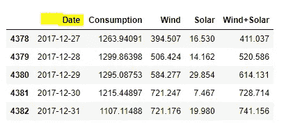
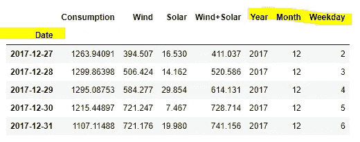
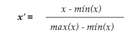
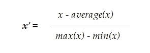
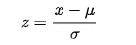
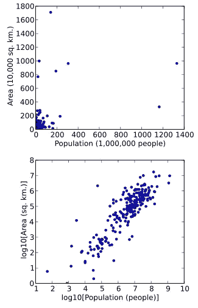
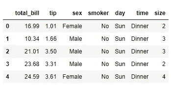
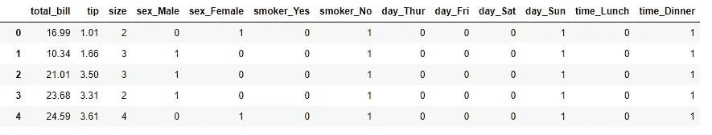

# 特征工程 A-Z

> 原文：<https://towardsdatascience.com/feature-engineering-a-z-aa8ce9639632?source=collection_archive---------25----------------------->


由 [Unsplash](https://unsplash.com?utm_source=medium&utm_medium=referral) 上的[hkon grim stad](https://unsplash.com/@grimstad?utm_source=medium&utm_medium=referral)拍摄的照片

## 转换特征以提高模型性能的清单

特征工程是转换数据以提取有价值信息的过程。事实上，如果适当转换，特征工程甚至可以在模型性能中发挥比超参数调整更大的作用。

尽管功能工程有着巨大的作用，但初学者和有经验的数据科学家通常不太理解，有时甚至会误解。最近我问了几个人，他们所说的特征工程是什么意思。有趣的是，他们无法超越缺失值、特征缩放或对数变换。但是当然，这是一个包括各种工具、技术和应用的主题。

在这篇文章中，我把通过特征转换和工程来提高模型性能的许多不同方法放在一起并加以综合。

在进入特征工程之前，我们先来区分一下数据清理。重命名列、更改数据类型(例如，从“对象”更改为“类别”)、将数据分成训练集和测试集—这些都是数据科学项目的重要组成部分，但它们不是功能工程。你可以称之为数据清理。

那特征工程到底是什么？

我将特征工程分为 6 大类:

*   特征抽出
*   特征合成
*   特征转换
*   异常值处理
*   缺失值处理
*   其他(例如多项式变换)

让我们一个一个地了解一下。

## 特征抽出

假设我们有某种关于[消费统计](https://raw.githubusercontent.com/jenfly/opsd/master/opsd_germany_daily.csv)的数据，上面有一个时间戳:



带有时间戳的数据

在本例中,“日期”列可以轻松地用于提取附加特征并生成强大的洞察力，例如工作日、周末或一年中特定时间的消费变化(参见下面的黄色突出显示)。



数据与特征工程

## 特征合成

特征合成与特征提取相反。在这种情况下，将一个或多个要素组合起来创建新要素，这些新要素比单独创建的要素信息量更大。

比方说，在一个房价数据集中，你有两列:*楼层空间*(平方英尺)和*总房价*(美元)。您可以在分析中单独使用它们，但也可以创建一个名为*price _ per _ sqft*(US $/sqft)的新计算要素。

## 特征缩放

特征缩放/变换是指在数据预处理中应用的各种方法，用于将数据重新缩放或归一化到不同的范围。缩放的目的是以这样一种方式转换数据，即[它们或者是无量纲的和/或具有相似的分布](/data-normalization-in-machine-learning-395fdec69d02)。三种流行的缩放方法是:

**a)重新调整:**也称为“最小-最大归一化”，这是所有方法中最简单的方法，计算如下:



**b)均值归一化:**该方法在转换过程中使用观察值的均值:



**c)标准化:**也称为 Z 分数标准化，这种技术使用 Z 分数或“标准分数”进行特征缩放。它广泛用于机器学习算法，如 SVM 和逻辑回归:



**d) Log 变换:**在对数变换中，一个特征的每个值都是从 *x* 变换到 *log(x)的。*对数变换的一个常见应用是构建线性回归模型，其中连续变量的分布被更改为高斯形式，以满足建模假设。

对数转换受欢迎的另一个原因是因为增加了视觉可解释性和外观，尤其是高方差数据(见下图)。



显示使用和不使用对数变换时面积和人口之间关系的散点图。[来源:维基百科](https://en.wikipedia.org/wiki/Data_transformation_(statistics))。

## 特征编码

特征编码是指将特征的分类字符串值转换为数字值。

例如，如果您的数据集中有一个“性别”列，并且值表示为*女性*和*男性*，您可以将这些字符串转换为数字表示，例如男性= 1，女性= 2。这种编码特征的方式被称为**标签编码**。

当然，进行标签编码意味着算法可能会对女性(= 2)值赋予比男性(= 1)值更高的权重。为了克服这种情况，人们转而使用 **One Hot Encoding** 来创建**虚拟变量，其中**每个类别变成一个虚拟列，值变成 1 或 0。

下面是一个示例，其中一键编码应用于具有分类要素的数据集:

```
import seaborn as sns
df = sns.load_dataset('tips')
df.head()
```



没有假人的分类特征

现在在`pandas`中创建假人:

```
import pandas
pd.get_dummies(df)
```



转换成虚拟变量的分类特征

## 异常值处理

每个数据科学家都不得不面对他们项目中的异常问题，没有多少例外。离群值是特定于领域和上下文的。如果您正在构建一个模型来预测一个平均价格为 30 万美元的社区的房价，而您的数据集却有一所售价为 1000 万美元的房子，那么这一定是一个异常值。同样，如果一栋房子卖了 3 万美元，你也不希望它出现在模型中。

那么你有什么选择来改变这些离群值呢？以下是您的选择:

*   如果它们仅仅在可接受的范围之外，您可以将它们留在数据集中
*   如果负担得起，您可以删除观察值(例如，您的数据集相当大)
*   封顶/剪裁异常值，将异常值剪裁到某个范围(例如，四分位间距、IQR)。

## 缺失值处理

缺失值在大多数数据集中很常见，它们被记录为`NA`或`NaN`。处理缺失数据没有单一的标准方法，人们根据数据集采取不同的方法。这里有 3 种最受欢迎的方法:

*   **删除:**如果数据集很大，并且缺失发生的次数相对较少，则删除带有缺失值的完整记录。
*   **替代/插补:**缺失值通常由适当的替代值替代，如列平均值、中位数、最近邻平均值、移动平均值等。
*   **统计插补:**这是一种复杂的插补方法，使用线性回归作为数据集中其他列的函数来预测缺失值。

## 其他类型的特征工程

除了我刚刚描述的，在特征工程领域还有一些其他的工作，包括:

*   **减少类别数量**:对类别特征进行重新分类，即减少类别数量。例如，如果一列中有 6 个教育水平类别，您可能希望将它们分成 3 个类别。
*   **宁滨**:为数字变量创建区间，例如，“年龄”可以分为< 20、20–30、30–40 等。而不是让它们变成 1，2，3，4 ……40 等。
*   **多项式拟合**:在回归分析中，除了采用`*y = b0+ b1x*`形式的线性模型，还可以采用`*y = b0 + b1x + b2x²*` *形式的多项式函数进行拟合，以找到更好的拟合。*

## 摘要

总之，特征工程的主要目的是提取额外的数据/信息以获得更好的模型性能。进行特征工程有许多不同的方法，但最常用的方法是特征提取、特征合成、缩放、异常值处理、缺失值处理、宁滨、多项式变换等。

在这篇文章中，我总结了它们，但是当然，每一个都有很多深入的内容。但是希望我在这里描述的内容可以作为一个有用的参考。如果我错过了什么，你觉得其他的也应该包括进来，请在评论区写下来。

感谢阅读。请随意[订阅](https://mab-datasc.medium.com/subscribe)以获得我即将发布的文章的通知，或者通过 [Twitter](https://twitter.com/DataEnthus) 或 [LinkedIn](https://www.linkedin.com/in/mab-alam/) 与我联系。