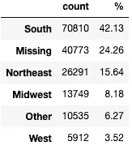

# 特征工程示例:宁滨分类特征

> 原文：<https://towardsdatascience.com/feature-engineering-examples-binning-categorical-features-9f8d582455da?source=collection_archive---------10----------------------->

## 如何使用 NumPy 或 Pandas 快速绑定分类特征

出于机器学习(ML)目的使用分类数据有时会出现棘手的问题。最终，这些特征需要以某种方式进行数字编码，以便 ML 算法可以实际处理它们。

您还需要考虑其他方法来为分类要素建模做好准备。例如，您的模型性能可能受益于**宁滨分类特征**。这实质上意味着将多个类别归入一个类别。通过应用领域知识，您可以设计新的类别和功能，更好地表示数据结构。

在这篇文章中，我们将简要介绍为什么宁滨分类特征是有益的。然后，我们将通过使用 NumPy 和 Pandas 的具体示例，介绍宁滨分类特征的三种不同方法。

由[埃菲社](https://unsplash.com/@efekurnaz?utm_source=unsplash&utm_medium=referral&utm_content=creditCopyText)在 [Unsplash](https://unsplash.com/collections/93871436/matching-and-sorting?utm_source=unsplash&utm_medium=referral&utm_content=creditCopyText) 上拍摄的照片

# 为什么要分类？

对于分类特征，您可能会遇到**稀有标签**的问题，即在您的数据集中极不常见的类别/组。这个问题通常与基数**高的特性**有关——换句话说，就是许多不同的类别。

有太多的类别，尤其是很少的类别，会导致一个嘈杂的数据集。ML 算法可能难以穿过这种噪声并从数据中更有意义的信号中学习。

如果你选择[一个热编码](/categorical-encoding-using-label-encoding-and-one-hot-encoder-911ef77fb5bd)你的分类特征，高基数也会加剧[维数灾难](/the-curse-of-dimensionality-minus-the-curse-of-jargon-520da109fc87)。如果原始变量有 50 个不同的类别，那么基本上就是向数据集添加了 49 列。

类别太多也会导致训练和测试模型时出现问题。一个类别完全有可能出现在测试集中，而不是在训练集中。您的模型将不知道如何处理该类别，因为它以前从未“见过”它。

解决这些问题的一个方法是[设计类别更少的新功能](https://maxsteele731.medium.com/what-is-feature-engineering-bfd25b2b26b2)。这可以通过将多个类别宁滨(分组)为一个类别来实现。

在下面的例子中，我们将利用关于选民人口统计和参与的信息来探索和设计来自[数据集](https://github.com/zero731/NC_Elections_Capstone/blob/main/blog_data/UC_gen_2020.gz)的特征。我选择了 3 个分类变量:

1.  `party_cd`:登记选民的政党背景
2.  `voting_method`:登记选民如何在选举中投票
3.  `birth_state`:美国注册选民出生的州或地区

数据框前 5 行的屏幕截图—作者提供的图片

如果您想开始将这些方法应用到您自己的项目中，您只需要确保您已经安装了 NumPy 和 Pandas，然后导入它们。

# 使用 np.where()绑定类别

首先，我们来看看我为什么选择`party_cd`。下图显示了每个政党有多少个人选民。

Seaborn countplot 显示了按政党划分的选民分布情况—按作者划分的图像

注册的自由主义者、立宪主义者和绿党成员如此之少，以至于我们在图表上几乎看不到他们。这些是稀有标签的好例子。出于本文的目的，我们将罕见标签定义为占观察值不到 5%的标签。这是定义稀有标签的一个常见阈值，但最终这取决于您的判断。

让我们来看看实际数字的细分:

属于每个政党的登记选民的原始计数和百分比——图片由作者提供

这三类人各占不到总人口的 5%。即使我们把他们都归为一类，这个新的类别也只能代表不到 1%的选民。

“REP”和“DEM”代表两大政党，而“UNA”代表登记为与某个政党无关的选民。因此，在这里，将我们的三个罕见标签归入无党派团体是有意义的，这样我们就有三个类别:两个主要政党各一个，第三个代表选择不与任何一个主要政党结盟的个人。

这可以用`np.where()`很容易地完成，它有 3 个参数:

1.  一种状况
2.  如果满足条件，返回什么
3.  如果不满足条件，返回什么

下面的代码使用`np.where()`从原始的`party_cd`变量创建了一个新的特性`party_grp`:

它检查的条件是原始值是否在列表`['REP', 'DEM']`中。如果是，那么`np.where()`简单地返回原始的当事人代码(尽管我已经把它作为标题案例返回了，因为我个人讨厌看到全是大写的东西)。如果原始交易方代码不在该列表中，`np.where()`返回“其他”。我们新设计的`party_grp`功能现在更加平衡，没有任何罕见的标签:

属于每个政党的登记选民的原始计数和百分比——图片由作者提供

# 使用 map()将类别映射到新组

接下来，我们来看看`voting_method`的分布:

Seaborn countplot 按投票方法显示选民分布情况-图片由作者提供

不是最漂亮的图表，但我们得到了图片。我们有 8 种不同的投票方式。我大胆猜测，其中一半符合我们对稀有标签的定义。

通过每种方法投票的注册选民的原始计数和百分比-图片由作者提供

没错。我们的类别中有四个是稀有标签。现在，我们可以将它们全部归入“其他”类别，然后就到此为止，但这可能不是最合适的方法。

根据我对这些方法如何编码的研究，我知道“缺席”意味着有人提前投票。因此，我们可以将任何“缺席”方法归入“早期”类别，将“亲自”和“路边”归入“选举日”类别，将“不投票”作为自己的类别，将“临时”和“转移”归入“其他”类别。

下面的代码通过首先使用原始的`voting_method`类别作为键定义一个字典来完成这个任务。每个键的值就是我们实际想要的新类别。

最后一行基于`voting_method`列中的原始值创建了一个新列`vote_method_cat`。它通过将 Pandas 的`map()`方法应用于原始列，并输入我们的`vote_method_map`来将键转换为相应的值。

通过每种方法投票的注册选民的原始计数和百分比-图片由作者提供

现在，我们已经摆脱了除了我们的一个罕见的标签。最终，我选择放弃那 733 张“其他”票。投票方式实际上是我试图预测的目标变量，我真正感兴趣的是人们如何选择投票。临时选票和转移选票更多地反映了投票的过程和规则，但我的问题具体涉及选民的主动选择。

因此，您不仅可以考虑**工程预测特性**来更好地表示数据的底层结构，还可以考虑**如何最好地表示与您的特定问题相关的目标变量**。

# 使用 apply()应用自定义函数

最后，我们将研究宁滨。这个变量有 57 个类别:每个州一个，缺失信息一个，每个美国领土一个，最后一个类别是在美国以外出生的个人。

所以这张图表看起来滑稽可怕:

Seaborn countplot 显示了按出生地划分的选民分布情况——图片由作者提供

如果您在探索分类特征时看到过这样的图表，这是一个很好的迹象，表明如果您打算将宁滨变量用作模型中的一个特征，您应该将其考虑在内。

以下是 15 种最常见的`birth_state`分类:

按出生地统计的原始选民数量和登记选民比例——按作者分类的图片

北卡罗来纳州是最常见的州，这是有意义的，因为该数据是针对北卡罗来纳州特定县的选民的。然后我们会看到很多缺失的值。纽约人和在美国以外出生的人也构成了相当大的一部分人口。基于我们的定义，剩余的 53 个类别是罕见的标签，并将在我们的建模工作中引入大量噪声。

让我们按照美国人口普查地区(东北部、南部、中西部、西部)对各州进行分组。我们还会将出生在美国境内或境外的人归入“其他”组，并将“失踪”作为一个单独的类别。

我们将通过定义我们自己的自定义函数来实现从州到地区的转换，然后将该函数应用于我们的原始变量以获得我们的新特性。有一种方法可以让你编写一个函数来检查每个州并返回想要的地区/类别:

现在用熊猫的`apply()`方法来创造我们的新功能:

按出生地统计的原始选民数量和登记选民比例——按作者分类的图片

好多了！我们已经从总共 57 个有 53 个稀有标签的类别减少到只有 6 个仍然有很多意义的类别，其中只有一个符合我们对稀有标签的定义。我们可以考虑额外的分组，但你明白了。

# 概括一下

我们涵盖了:

*   绑定分类特征意味着什么
*   为什么以及何时需要绑定分类特征
*   宁滨分类特征的 3 种方法(`np.where()`、熊猫`map()`、熊猫自定义函数`apply()`)

我希望你能发现这些信息，并能把你学到的东西应用到你自己的工作中。感谢阅读！

关于特征工程的更多信息:

[什么是特征工程？](/what-is-feature-engineering-bfd25b2b26b2)

[特征工程实例:宁滨数字特征](/feature-engineering-examples-binning-numerical-features-7627149093d)