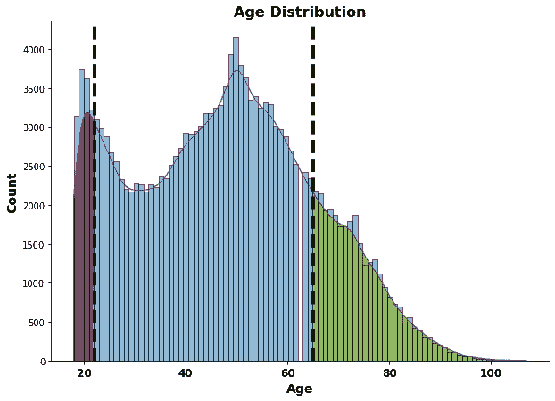
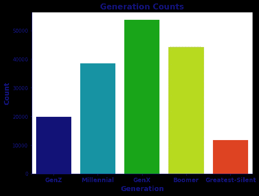
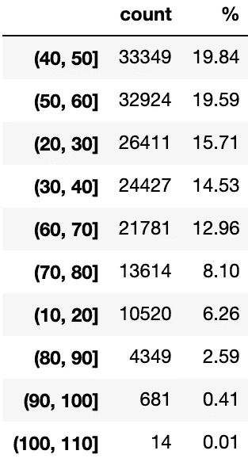
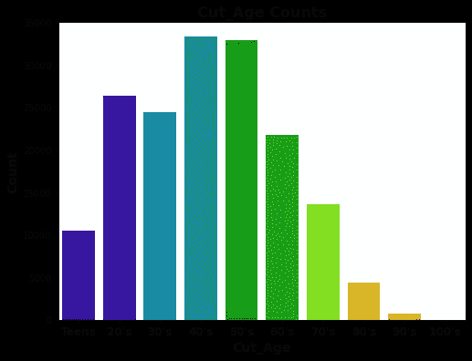

# 特征工程示例:宁滨数字特征

> 原文：<https://towardsdatascience.com/feature-engineering-examples-binning-numerical-features-7627149093d?source=collection_archive---------13----------------------->

## 如何使用 NumPy 或 Pandas 快速绑定数字特征

[特征工程](/what-is-feature-engineering-bfd25b2b26b2)专注于使用数据集中已经存在的变量来创建额外的特征，这些特征能够(*希望*)更好地表示数据的底层结构。

例如，你的模型性能可能受益于**宁滨数字特征**。这实质上意味着将连续或其他数字特征分成不同的组。通过应用领域知识，您可以设计类别和功能，更好地强调数据中的重要趋势。


照片由[纸胡子](https://unsplash.com/@paperbeard?utm_source=unsplash&utm_medium=referral&utm_content=creditCopyText)在 [Unsplash](https://unsplash.com/s/photos/tree-rings?utm_source=unsplash&utm_medium=referral&utm_content=creditCopyText)

在本帖中，我们将通过使用 NumPy 和 Pandas 的具体示例，介绍宁滨数字特征的三种不同方法。我们将从一个[数据集](https://github.com/zero731/NC_Elections_Capstone/blob/main/blog_data/UC_gen_2020.gz)中设计特征，其中包含关于选民人口统计和参与的信息。我选择了两个数值变量:

1.  选举年结束时登记选民的年龄
2.  `birth_year`:登记选民出生的年份

如果您想开始将这些方法应用到您自己的项目中，您只需要确保您已经安装了 NumPy 和 Pandas，然后导入它们。

# 使用 np.where()表示阈值

想想可能有点奇怪，但是指示每个实例(在本例中是每个注册投票者)是否达到某个阈值是一种宁滨。

例如，假设我们试图预测每个注册选民是否在选举中投票。也许我们怀疑，如果这是年轻选民第一次有资格在总统选举中投票，他们更有可能参加投票。由于法定投票年龄为 18 岁，任何在本届总统选举期间不满 22 岁的人都不能在上届总统选举中投票。

我们可以使用`np.where()`为这个阈值创建一个指示变量，它有 3 个参数:

1.  一种状况
2.  如果满足条件，返回什么
3.  如果不满足条件，返回什么

以下代码根据个人的年龄创建了一个新特性`first_pres_elec`:

```
df['first_pres_elec'] = np.where(df['age']<22, 1, 0)
```

我们检查的条件是个人是否小于 22 岁。如果他们低于这个阈值，`np.where()`返回 1，因为这是他们有资格投票的第一次总统选举。如果不是，则返回 0。从我们的连续变量`age`中，我们创建了一个新的二元分类变量。

也许我们也有理由怀疑老年人或多或少会去投票。如果是这样的话，我们可能希望通过创建另一个阈值指示器来将我们的模型的注意力吸引到这个阈值上:

```
df['senior'] = np.where(df['age']>=65, 1, 0)
```

现在我们已经创建了两个阈值指标来划分选民年龄的分布，如下所示。新近有资格在总统选举中投票的年轻人用红色突出显示，老年人用黄色突出显示。



突出显示年轻和年长阈值的登记选民年龄分布-图片由作者提供

# 使用 apply()应用自定义函数

根据出生年份将我们的注册选民分成几代可能是有意义的，因为这似乎常常与一个人的政治密切相关。一种方法是编写我们自己的自定义函数来描述每一代的临界值。

下面是我们编写这样一个自定义函数的一种方法:

然后使用 Pandas` `apply()`创建一个基于原始`birth_year`变量的新特性:

现在，我们的注册选民被分成 5 个独立而有意义的类别。我决定将最老的两代人(最伟大的一代和沉默的一代)结合起来，这样就不会产生两个罕见的类别，每个类别只占人口的很小一部分。



Seaborn countplot 按代显示选民分布-按作者显示图像

# 使用 pd.cut()定义箱

我们也可以使用`pd.cut()`来创建相同的生成库，而不是编写我们自己的函数并应用它。我们仍然需要为每个组定义适当的标签，以及 bin 边缘(截止出生年份)。

在最后一行中，我们通过向`pd.cut()`提供我们想要分类的列、我们想要的分类以及如何标记每个分类来创建我们的新特性。

我们可以快速创建一个范围，并将其作为我们的 bin 边缘，而不是按代分组。例如，如果我们认为按十年对年龄进行分组是有意义的，我们可以通过以下方法来实现:

第一行定义了一个范围，从 10 开始，一直到 110，但不包括 110，每步增加 10。第二行使用该范围作为绑定边缘，按年龄将注册选民离散化为以下组:



几十年来根据年龄划分的原始计数和注册选民百分比——图片由作者提供

第一行显示 33，349 或 19.84%的选民年龄在 40 岁左右。括号表示 40 岁包括在内，而方括号表示 50 岁不包括在内。为了更容易地跟踪每个 bin 的含义，我们可以向`pd.cut()`输入以下标签:



Seaborn countplot 显示了几十年来按年龄划分的选民分布情况-图片由作者提供

# 概括一下

我们涵盖了:

*   对数字特征进行分类意味着什么
*   1 创建阈值指示器的方法(`np.where()`)
*   将宁滨数字特征分组的 2 种方法(用熊猫`apply()`自定义函数，用`pd.cut()`定义 bin 边缘)

我希望你能发现这些信息，并能把你学到的东西应用到你自己的工作中。感谢阅读！

关于特征工程的更多信息:

[什么是特征工程？](/what-is-feature-engineering-bfd25b2b26b2)

[特征工程示例:宁滨分类特征](/feature-engineering-examples-binning-categorical-features-9f8d582455da)