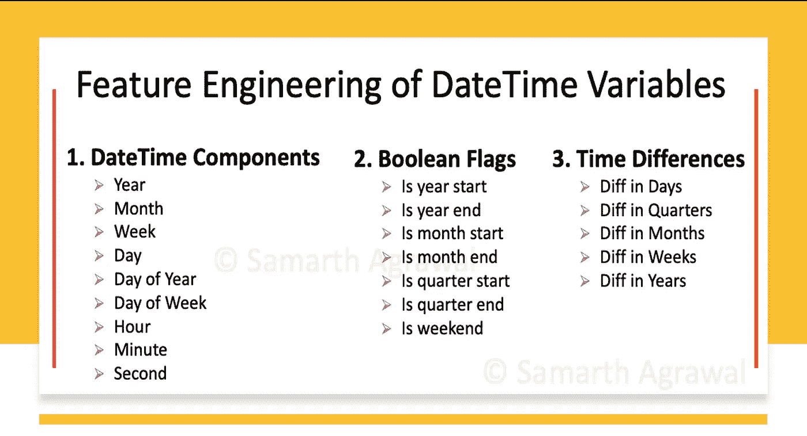

# 用于数据科学、机器学习的日期时间变量的特征工程

> 原文：<https://towardsdatascience.com/feature-engineering-of-datetime-variables-for-data-science-machine-learning-45e611c632ad?source=collection_archive---------17----------------------->

## 了解如何从日期时间类型变量中获取更有意义的特征，以供机器学习模型使用



日期时间变量的特征工程。图片作者。

# 介绍

日期时间字段需要功能工程来将它们从数据转换为可以被我们的机器学习模型使用的有见地的信息。这篇文章分为三个部分和一个额外的部分。在最后，我们将结合使用内置的熊猫和 NumPy 函数以及我们的函数来提取有用的特性。

*   第 1 部分—提取日期/时间部分
*   第 2 部分—创建布尔标志
*   第 3 部分—计算日期/时间差异
*   奖励——使用`fast_ml`在 2 行代码中实现工程功能

# 背景

每当我处理与电子商务相关的数据时，以某种方式或其他数据集包含日期时间列。

*   用户注册日期-时间
*   用户登录日期-时间
*   交易日期时间
*   有争议的交易日期时间
*   …以及更多

一开始，这个日期字段给我们的只是时间线上的一个特定点。但是这些日期时间字段是潜在的数据宝库。如果使用得当，这些领域对于揭示模式是非常强大的。

作为一名数据科学家，你的工作是将洞察力带到桌面上，为此，你需要提出正确的问题。为了前任。

*   **问题 1** —你认为大多数购物车是在什么时候创建的？
*   **问题 2** —你什么时候看到大多数手推车被遗弃？
*   **问题 3** —您认为什么时候的欺诈交易最多？
*   **问题 4** —什么时候订阅的用户最多？
*   某些商品在什么时候最常被购买？
*   **问题 6** —注册用户发出第一个订单后多少天/小时？
*   **问题 7** —多少天不活动后，客户再也不会回到您的网站？
*   …等等

现在，要回答这些问题，您需要回到数据上来设计这些日期时间字段。然后可以发现大量的模式。

**帖子的第 1 部分**将为您提供特征工程步骤，以回答类似 1、2 & 3 的问题

*   **Ans 1** —您认为大多数购物车是在什么时候创建的？ ***本月第一周***
*   **Ans 2** —你什么时候看到大多数手推车被丢弃？ ***周三下午***
*   **Ans 3** —你什么时候看到的欺诈交易最多？ ***周五晚***

本帖的第 2 部分将为你提供特征工程步骤来回答类似于第 4 部分的问题

*   **Ans 4** —什么时候订阅用户最多？ ***年初***
*   **Ans 5**——什么时候最常购买某些物品？ ***月初***

帖子的第 3 部分将为您提供特征工程步骤，以回答类似于 6 & 7 中的问题

*   **Ans 6** —注册用户发出第一个订单后多少天/小时？***2 小时内***
*   **Ans 7** —多少天不活动后，客户再也不会回到您的网站？***14 天不活动后***

我使用了一个电子商务数据的例子，在这个例子中，我个人发现了许多用例，但是提取信息的范围决不仅仅与此相关。在这篇文章中，我们将会看到如何通过问正确的问题来学习一些行为。事实证明，在多个行业中，进行正确的特征工程对于解决各种问题是有用的。

# 我们开始吧

# 加载数据集

```
import pandas as pddf = pd.read_csv('/kaggle/input/loan-data/loan.csv', 
                 parse_dates = ['date_issued', 'date_last_payment'])
```

Pandas 提供了一种非常简单但非常强大的方法来处理与日期时间相关的变量，将它们解析为日期。您可以将参数`parse_dates`中与日期时间相关的所有变量作为列表进行传递。

假设您事先不知道日期时间变量，在调查数据后，您发现一些变量是日期时间。因此，pandas 没有重新加载数据，而是提供了另一个有用的函数`to_datetime`来将数据类型转换为 DateTime。

```
df['date_issued'] = pd.to_datetime(df['date_issued'], 
                                   errors = 'coerce')
```

# 第一部分。提取日期/时间部分

如上例所示，我们可以从给定的日期-时间变量中提取日期-时间部分的组成部分(`year`、`quarter`、`month`、`day`、`day_of_week`、`day_of_year`、`week_of_year`、`time`、`hour`、`minute`、`second`、`day_part`)。下面的列表提供了几个可以使用 pandas 内置函数提取的组件。

## 语法:

我们可以使用`.dt`访问器提取所有这些组件。[在这里阅读更多关于日期访问器的信息](https://pandas.pydata.org/pandas-docs/stable/user_guide/basics.html#basics-dt-accessors)


从日期时间变量 issued_date 中提取组件。作者图片

下面是如图所示的代码。所有其他成分也可以用类似的方法提取

```
#1
df[‘date_issued:year’] = df[‘date_issued’].dt.year#2
df[‘date_issued:month’] = df[‘date_issued’].dt.month#3
df[‘date_issued:day_of_week’] = df[‘date_issued’].dt.day_of_week#4
df[‘date_issued:week_of_year’] = df[‘date_issued’].dt.week_of_year#5
df[‘date_issued:hour’] = df[‘date_issued’].dt.hour
```

**注:**

*   周一:`day_of_week = 0`，
*   周二:`day_of_week=1`，
*   …
*   周日:`day_of_week=6`

## 创建日部分:

```
#day_part function
def day_part(hour):
    if hour in [4,5]:
        return "dawn"
    elif hour in [6,7]:
        return "early morning"
    elif hour in [8,9,10]:
        return "late morning"
    elif hour in [11,12,13]:
        return "noon"
    elif hour in [14,15,16]:
        return "afternoon"
    elif hour in [17, 18,19]:
        return "evening"
    elif hour in [20, 21, 22]:
        return "night"
    elif hour in [23,24,1,2,3]:
        return "midnight"

#Run function with apply method
df['date_issued:day_part'] = df['date_issued:hour'].apply(day_part)df.head()
```


为日期时间变量 issued_date 创建日部分。作者图片

# 第二部分。创建布尔标志

如上例所示，我们可以从给定的日期-时间变量中提取许多布尔标志(`is_month_start`、`is_month_end`、`is_quarter_start`、`is_quarter_end`、`is_year_start`、`is_year_end`、`is_weekend`)。下面的列表提供了几个这样的组件，可以使用 pandas 内置的函数以及通过创建我们的一些函数来提取。

## 语法:

同样，我们可以使用`.dt`访问器来提取许多布尔标志。


从日期时间变量 issued_date 中提取布尔标志。作者图片

```
#1
df['date_issued:is_year_start'] = df['date_issued'].dt.is_year_start#2
df['date_issued:is_quarter_start'] = df['date_issued'].dt.is_quarter_start#3
df['date_issued:is_month_start'] = df['date_issued'].dt.is_month_start#4
df['date_issued:is_month_end'] = df['date_issued'].dt.is_month_end
```

## 创建周末标志:


为日期时间变量 issued_date 创建周末标志。作者图片

如果我们查看日历，我们会发现 2013 年 10 月 26 日是星期六——周末。

```
df['date_issued:is_weekend'] = np.where(df['date_issued:day_of_week'].isin([5,6]), 1,0)
```

# 第三部分。计算日期/时间差异

通常你的问题/分析会与另一个参考点相关。比如，

1.  注册后多少天/小时后，用户发出第一个订单？*注册 _ 日期&首 _ 订单 _ 日期*
2.  客户投诉在多少天/小时内得到解决？*投诉 _ 日期&解决 _ 日期*
3.  从今天开始，客户从您的网站订购了多久？*今天&最后 _ 订单 _ 日期*
4.  …等等

在我们的示例数据集中，我们有两列 date_last_payment & date_issued。让我们看看当我们取这两列的差时会发生什么。


计算熊猫的时差。图片作者。

默认情况下，熊猫提供“天”的差异。注意`dtype: timedelta64[ns]`。

来自 numpy 文档:

> 因为 NumPy 的核心没有物理量系统，所以创建了 timedelta64 数据类型来补充 datetime64

现在，如果我们只想要数字部分而不是整个字符串`947 days`，我们可以通过使用。dt 访问器。


计算熊猫的时差。dt 访问器。图片作者。

不幸的是，我们不能以类似的方式得到月份。


计算熊猫的时差。dt 访问器不可伸缩。图片作者。

这里 NumPy 的`timedelta64`变得非常有用。

## 语法:

为了得到贷款发放日期和最后一次付款日期之间的月数，我们将这样写


使用 NumPy timedelta64 计算熊猫的时差。图片作者。

```
(df['date_last_payment'] - df['date_issued'])/np.timedelta64(1, 'M')
```

timedelta64 可以采用以下参数来计算两个日期之间的差异:

*   d’→持续几天
*   w’→数周
*   ' M' →几个月
*   多年来
*   h’→数小时

# 奖金！

您可以使用 fast_ml 来创建所有这些日期时间特性

首先，安装`fast_ml`包

```
!pip install fast_ml — upgrade
```

然后，从`feature_engineering`模块导入工程日期时间特征的方法

```
from fast_ml.feature_engineering import FeatureEngineering_DateTime
```

现在，这与 sklearn 的其他变形金刚、预处理器的工作方式完全相同。

*   例示
*   合适的
*   改变

```
#Instantiate
dt_fe = FeatureEngineering_DateTime()#Fit
dt_fe.fit(df, datetime_variables=['date_issued'], 
          prefix = 'date_issued:')#Transform
df = dt_fe.transform(df)
df.head()
```


使用 Fast_ml 对日期时间变量进行特征工程。图片作者。

在屏幕截图中，所有的列都不可见。让我们只看数据集的列

```
df.columns---Output---
Index(['customer_id', 'disbursed_amount', 'interest', 'market', 'employment', 'time_employed', 'householder', 'income', 'date_issued', 'target', 'loan_purpose', 'number_open_accounts', 'date_last_payment', 'number_credit_lines_12',(Notice from here ------->)
'date_issued:year', 'date_issued:quarter', 'date_issued:month', 'date_issued:day', 'date_issued:day_of_week', 'date_issued:day_of_year', 'date_issued:weekofyear', 'date_issued:is_month_end', 'date_issued:is_month_start', 'date_issued:is_quarter_end', 'date_issued:is_quarter_start', 'date_issued:is_year_end', 'date_issued:is_year_start', 'date_issued:time', 'date_issued:hour', 'date_issued:minute', 'date_issued:second', 'date_issued:is_weekend', 'date_issued:day_part'],
dtype='object')
```

# 感谢阅读！！

*   如果你喜欢这个，[在 medium](https://samarthagrawal86.medium.com) 上跟随我了解更多。
*   有兴趣合作吗？让我们在 [Linkedin](https://www.linkedin.com/in/samarth-agrawal-2501/) 上连线。
*   请随意写下您的想法/建议/反馈。
*   [卡格尔链接](https://www.kaggle.com/nextbigwhat/feature-engineering-datetime-variables)
*   [Fast_ml 链接](https://pypi.org/project/fast-ml/)

笔记本可在以下位置获得，并附有完整的功能代码:

[](https://www.kaggle.com/nextbigwhat/feature-engineering-of-datetime-variables?scriptVersionId=61041780) [## 日期时间变量的特征工程

### 使用 Kaggle 笔记本探索和运行机器学习代码|使用来自 loan_data 的数据

www.kaggle.com](https://www.kaggle.com/nextbigwhat/feature-engineering-of-datetime-variables?scriptVersionId=61041780)