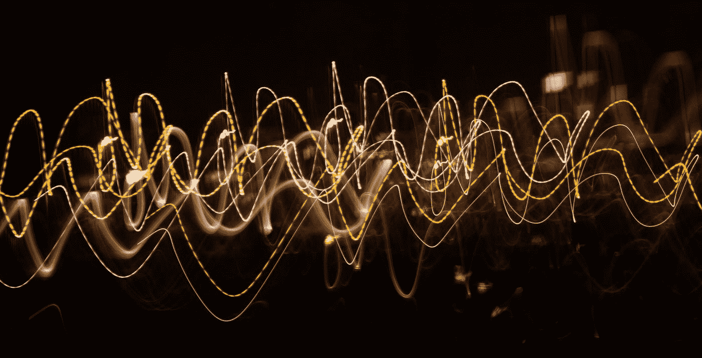
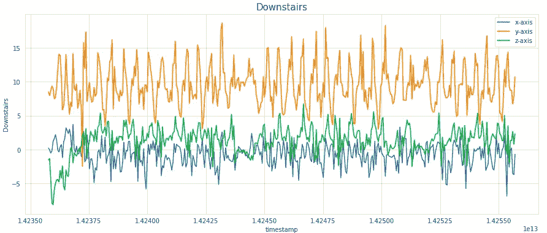

# 用于人体活动识别的时间序列数据特征工程

> 原文：<https://towardsdatascience.com/feature-engineering-on-time-series-data-transforming-signal-data-of-a-smartphone-accelerometer-for-72cbe34b8a60?source=collection_archive---------1----------------------->

## 转换智能手机加速度计的原始信号数据，并从中创建新的功能来识别六种常见的人类活动。



[简·侯伯](https://unsplash.com/@jan_huber?utm_source=medium&utm_medium=referral)在 [Unsplash](https://unsplash.com?utm_source=medium&utm_medium=referral) 上拍照

# 目标

在出于研究兴趣探索人类活动识别领域时，我看到了一些出版物、研究文章和博客。研究人员在这一领域做了非凡的工作，并通过使用一些复杂的机器学习算法实现了最先进的(SOTA)结果。但是我读过的大多数论文/博客要么使用已经设计好的特征，要么没有详细解释如何从原始时间序列数据中提取特征。

> 在本文中，我们将探索不同的技术来转换原始时间序列数据，并从中提取新的特征。

我们将在本文中看到的技术不限于人类活动预测任务，而是可以扩展到任何涉及时间序列数据的领域。

# 关于数据

Smarphones 和智能手表包含三轴加速度计，可测量所有三个空间维度的加速度。这些加速度计能够检测设备的方向，这可以为活动识别提供有用的信息。

我们将在本次演示中使用的数据集来自纽约州布朗克斯福特汉姆大学计算机与信息科学系 WISDM 实验室([链接到数据集](https://www.cis.fordham.edu/wisdm/dataset.php))。请注意，我们将使用的文件是原始数据文件— WISDM_ar_v1.1_raw.txt

这些数据是从 36 名不同的用户那里收集的，他们进行了一些常见的人类活动，如行走、慢跑、爬楼梯、下楼梯、坐着和站一段时间。在所有情况下，每 50 毫秒收集一次数据，即每秒 20 个样本。

共有 5 个特征变量——“用户”、“时间戳”、“x 轴”、“y 轴”和“z 轴”。目标变量是我们打算预测的“活动”。

“用户”表示用户 ID，“时间戳”是以纳秒为单位的 unix 时间戳，其余是在给定时间沿 x、y 和 z 轴/维度的加速度计读数。

这是原始数据集的一瞥—


如您所见，有超过 100 万行和 6 列。此外，数据需要清理和组织。

# **数据清理和预处理**

我们根据观察结果执行以下步骤—

*   删除空值。
*   将“z 轴”列的数据类型更改为浮点型。
*   删除时间戳为 0 的行。
*   按照用户和时间戳的升序对数据进行排序。

这是我们的数据经过清理和分类后的样子—


如你所见，我们剩下 1085360 行。

# 探索性数据分析

分析类别标签分布—

```
sns.set_style(“whitegrid”)
plt.figure(figsize = (10, 5))
sns.countplot(x = ‘activity’, data = df)
plt.title(‘Number of samples by activity’)
plt.show()
```


正如你所看到的，这里有一个明显的类别不平衡，大多数样本的类别标签为“散步”和“慢跑”。站立和“坐着”活动在数据集中最少出现。

现在让我们看看用户是如何对每项活动做出贡献的。这将有助于我们决定如何分割数据用于训练和测试。

```
plt.figure(figsize = (18, 6))
sns.countplot(x = ‘user’, hue = ‘activity’, data = df)
plt.title(‘Activities by Users’)
plt.show()
```


可以看出，不是所有的用户都在执行所有的活动。他们进行每项活动的时间也各不相同。无论如何，这不会影响我们后续的分析，因为我们有足够多的数据样本，并且我们假设所有的用户都是一样的。

对于一个特定的用户，让我们观察在每个 *x，y* 和 *z* 维度上的信号值如何随时间变化。

```
for i in [‘Walking’, ‘Jogging’, ‘Upstairs’, ‘Downstairs’, ‘Sitting’, ‘Standing’]:
  data_36 = df[(df[‘user’] == 36) & (df[‘activity’] == i)][:400]
  plt.figure(figsize = (15, 6))
  sns.lineplot(y = ‘x-axis’, x = ‘timestamp’, data = data_36)
  sns.lineplot(y = ‘y-axis’, x = ‘timestamp’, data = data_36)
  sns.lineplot(y = ‘z-axis’, x = ‘timestamp’, data = data_36)
  plt.legend([‘x-axis’, ‘y-axis’, ‘z-axis’])
  plt.ylabel(i)
  plt.title(i, fontsize = 15)
  plt.show()
```



我们考虑了 400 个样本的子集来可视化信号。这相当于 20 秒的活动(因为数据收集的频率是 20 Hz)。正如你所注意到的，信号显示了行走、慢跑、上楼和下楼等活动的周期性行为，而坐着和站着等静止活动的运动很少。

现在，让我们观察信号数据沿 *x、y* 和 *z* 轴的活动分布，看看是否有任何基于值的范围和分布的明显模式。

```
sns.FacetGrid(df, hue = ‘activity’, size = 6).map(sns.distplot, ‘x-axis’).add_legend()
```


```
sns.FacetGrid(df, hue = ‘activity’, size = 6).map(sns.distplot, ‘y-axis’).add_legend()
```


```
sns.FacetGrid(df, hue = ‘activity’, size = 6).map(sns.distplot, ‘z-axis’).add_legend()
```


据观察，在像上楼、下楼、散步、慢跑和站在所有轴上这样的活动中，数据有非常高的重叠。坐着似乎在 y 轴和 z 轴上有独特的值。

这就把我们带到了文章的核心，那就是数据转换和特征工程。

# 数据转换

标准分类算法不能直接应用于原始时间序列数据。相反，我们必须首先使用“窗口”技术转换原始时间序列数据。在这种技术中，我们将数据划分为 5 秒的窗口，然后通过聚合这 5 秒时间段内包含的 100 个原始样本来生成新特征。为了根据变换后的特征分配类别标签，我们采用该窗口中最频繁的活动。

例如，假设一个原始数据集有 100 行顺序数据。所以在开窗和聚合(使用窗口大小= 50)之后，它将被转换为 2 行。为这 2 个新行分配的类别标签将是相应窗口中最频繁的活动。同样，对于 100 万行，我们将在转换后的集合中获得将近总共 20k 行。

您一定想知道为什么选择 5 秒的窗口。在查阅了一些文献后，我觉得这可能是我们可以考虑的最佳窗口大小，用于捕捉六种活动中大多数活动所涉及的重复运动。太小的窗口尺寸可能不能正确地捕捉运动，而太大的窗口尺寸导致用于训练的变换数据集中的数据点更少。

这里我们还可以做一件事——我们采用 50%重叠的重叠窗口，而不是离散窗口。这确保了转换后的数据集中的每个后续行也具有来自前一个窗口中的数据的一些信息。

所有这些特征一开始可能听起来有点令人生畏，但是相信我，它并没有那么复杂。慢慢地再读一遍这一部分，因为如果你很好地理解了这一点，后面的部分将会很容易。我在这里附上这张图片，它将帮助您清楚地了解原始信号数据是如何聚合并转换为新功能的。


左:原始数据集右:转换数据集|作者的图像

# 特征工程

在我们开始设计新功能之前，我们必须首先将数据分为训练和测试。通常我们倾向于进行随机拆分，但是在这个特定的场景中，按照用户 ID 进行拆分更有意义。

因此，在总共 36 个用户中，前 27 个用户的数据将形成我们的训练数据，而其余 9 个用户将包括在我们的测试数据中。

```
# train data -> Users upto User ID = 27 (i.e. 27 users)
df_train = df[df[‘user’] <= 27]# test data -> Users from User ID = 28 to 36 (i.e. 9 users)
df_test = df[df[‘user’] > 27]
```

通过这样做，我们在训练集中获得了大约 804358 个数据样本，在测试集中获得了 281002 个样本。这就像做 75-25 分割，但方式更复杂。

## 特征工程阶段 1:统计测量

在特征工程的第 1 阶段，我们将构建总共 18 个简单的统计特征—
1。意思是
2。标准差
3。平均绝对偏差
4。最小值
5。最大值
6。最大值和最小值之差
7。中位数
8。中位数绝对偏差
9。四分位距
10。负值计数
11。正值计数
12。以上数值的数量表示
13。峰值数量
14。偏斜度
15。峰度
16。能源
17。平均合成加速度
18。信号幅度区域

这些特性中的大多数都是不言自明的。

*   *每个轴上信号的能量* 通过取该特定轴上窗口中值的平方和的平均值来计算。
*   *窗口上的平均合成加速度*通过取三个轴的平方值的平方根的平均值并相加计算得出。
*   *信号幅度面积*定义为一个窗口内三个轴的绝对值之和。

下面的 python 代码将更加清晰地给出上述每个特性的数学公式。

x_list、y_list 和 z_list 中的每一个实际上都是窗口的列表。每个窗口由 100 个观察值组成。因此总共应该有 int(804358/50) -1 = 16086 个窗口(您可以从代码中验证这一点)。 *X_train* 是我们根据转换后的特征构建的新特征数据框架。从今以后，我们将使用这个新的数据框架，并逐步增加新的特征，最终用它来训练 ML 模型。

## 特征工程阶段 2:快速傅立叶变换(FFT)

傅立叶变换是将时域信号变换到频域的函数。该函数接受时间信号作为输入，并产生信号的频率表示作为输出。现实世界中的每个信号都是时间信号，由许多不同频率的正弦波组成。

傅立叶变换不会改变信号。它只是提供了一个不同的角度来分析您的时间信号，因为信号的一些属性和特征可以在频域中充分探索。

到目前为止，我们一直在处理时间域。让我们从数据中选取任意一个随机窗口，观察它的离散傅立叶变换——

```
pd.Series(np.fft.fft(pd.Series(x_list)[42])).plot()
plt.show()
```


一些观察—

*   第一个值异常高。在电气术语中，这被称为“DC 分量”或“DC 偏移”。
*   波信号关于中心对称。

这些观察结果并不是这个特定窗口所特有的，但是如果你从我们的时域数据中选取任何一个窗口，并在其上应用 FFT，你会得到相同的观察结果。

不要太在意 DC 分量，把它想成一个我们将要丢弃的异常高的值。我们也将只考虑信号的前半部分。这将确保我们从中获得无偏的统计特征。

就像第一阶段一样，在第二阶段，我们将通过聚集傅立叶变换的数据来构建新的特征

到特征工程的前两个阶段结束时，我们现在总共有 94 个特征！这就把我们带到了特征工程的第三阶段。

## 特征工程阶段 3:捕获索引

在任何机器学习问题中，特征工程阶段的主要目标是为模型提供尽可能多的信息。你提供的信息越多，它学得越好！

那么在这种情况下，为什么不把底层数据的索引值作为潜在的特征呢？

同样，按照上述步骤转换原始测试数据帧 *df_test 和*从中提取特征，以构建转换后的测试数据集，即 *X_test* 。为了简洁起见，我在文章中跳过了这一部分。新的 X_test 数据集将具有 int(281002/50)-1 = 5619 行(您可以在自己的终端验证这一点)。

这就把我们带到了本文的最后一节。既然我们已经生成了如此多的特征，是时候看看这些新手工制作的特征能在多大程度上预测人类活动了。

# 实现用于活动预测的线性模型

对于预测任务，我们将在转换后的训练数据上训练简单的逻辑回归模型，然后评估转换后的测试数据的性能。其思想是，逻辑回归是一个线性分类器，它严重依赖于特征的质量，以便给出好的结果。功能提供的独特信息越多，性能就越好。因此，如果我们能够使用逻辑回归获得更好的性能，那么我们可以说我们已经成功地创建了正确的特征集。

## 逻辑回归模型

```
y_train = np.array(train_labels)
y_test = np.array(test_labels)
```

对于 logistic 回归，建议先将数据标准化。

```
from sklearn.preprocessing import StandardScaler
from sklearn.linear_model import LogisticRegression
from sklearn.metrics import accuracy_score
from sklearn.metrics import classification_report# standardization
scaler = StandardScaler()
scaler.fit(X_train)
X_train_data_lr = scaler.transform(X_train)
X_test_data_lr = scaler.transform(X_test)# logistic regression model
lr = LogisticRegression(random_state = 21)
lr.fit(X_train_data_lr, y_train)
y_pred = lr.predict(X_test_data_lr)
print("Accuracy:", accuracy_score(y_test, y_pred))
print("\n -------------Classification Report-------------\n")
print(classification_report(y_test, y_pred))
```

输出—


通过对工程特征使用基线逻辑回归模型，我们成功地获得了 84.53 %的测试数据的总体准确度。考虑到我们在开始时只有原始加速度计数据的 3 个特征，这是相当不错的。通过使用一些复杂的分类模型，如基于树的集成、投票或堆叠分类器，在准确性和其他性能指标方面还有改进的余地。

从分类报告中可以看出，大多数活动的总体表现相当不错。尽管在识别这两种爬楼梯活动时有些困难。这是意料之中的，因为这两个活动非常相似。让我们检查一下混淆矩阵。

```
labels = [‘Downstairs’, ‘Jogging’, ‘Sitting’, ‘Standing’, ‘Upstairs’, ‘Walking’]
confusion_matrix = confusion_matrix(y_test, y_pred)
sns.heatmap(confusion_matrix, xticklabels=labels, yticklabels=labels, annot=True,linewidths = 0.1, fmt=”d”, cmap = ‘YlGnBu’)
plt.title(“Confusion matrix”, fontsize = 15)
plt.ylabel(‘True label’)
plt.xlabel(‘Predicted label’)
plt.show()
```


从分类报告和混淆矩阵可以看出，我们的数据集中最常见的两个类别*慢跑*和*步行*被正确识别，具有良好的准确性。虽然很少有*坐*和*站*类的样本，但我们仍然可以很好地识别这些活动，因为这两种活动会导致设备改变方向，这很容易从加速度计数据中检测到。为了更准确地区分楼上的*和楼下的*活动，现有的一组特征是不够的。通过将三轴加速度计数据与三轴陀螺仪(智能设备中的另一种惯性传感器)的数据相结合，可以区分这些类别，并以更高的精度识别其他活动。**

# 结束注释

我们从 3 个特征开始——三轴加速度计信号在 *x* 、 *y* 和 *z* 轴上的读数。我们从原始数据中逐步设计特征，最终，我们成功提取了总共 112 个独特的特征！后来我们训练了一个简单的线性分类器并评估了它的性能。

正如你可能已经意识到的，为了形成这些新的特征，我们依赖于统计学和数学的基本概念。没有使用高端信号处理或先进技术。此外，我们在本文中使用的数据准备和特征工程技术是通用的，可以应用于大多数涉及时间序列数据的问题。

# 参考

*   詹妮弗·r·夸皮什、加里·m·韦斯和塞缪尔·a·摩尔(2010 年)。使用手机加速度计的活动识别，第四届传感器数据知识发现国际研讨会会议录(KDD-10)，华盛顿州 DC。
*   达维德·安吉塔、亚历山德罗·基奥、卢卡·奥内托、哈维尔·帕拉和豪尔赫·雷耶斯-奥尔蒂斯。使用智能手机进行人类活动识别的公共领域数据集。*第 21 届欧洲人工神经网络、计算智能和机器学习研讨会，ESANN 2013。*

*【免责声明:本文使用的所有图片均为作者所有，除非明确提及】*