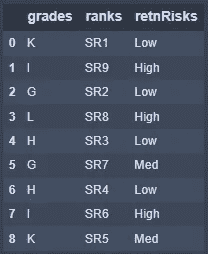
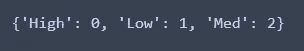
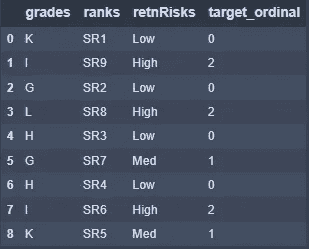
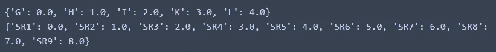
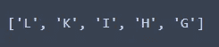
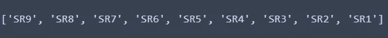
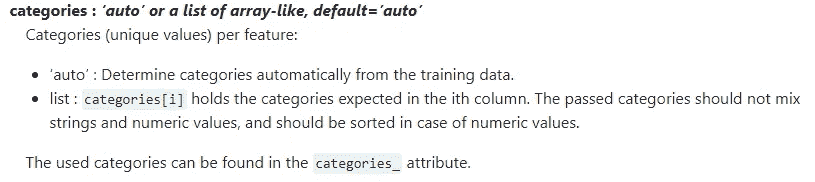
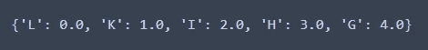
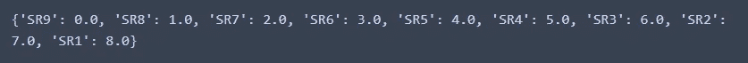

# 特征工程序数变量

> 原文：<https://towardsdatascience.com/feature-engineering-ordinal-variables-bfea697f5eee?source=collection_archive---------6----------------------->

## 深度指南

## 揭示序数特征编码中的微妙之处，以避免潜在的缺陷并提高效率


杰西·多兹在 [Unsplash](https://unsplash.com?utm_source=medium&utm_medium=referral) 上的照片

我正在和一个业务/数据分析相对较新的团队一起工作，这时关于机器学习的特征工程的小组讨论开始了。可以理解的是，对于机器学习的新手来说，这可能会令人困惑和害怕。在 Jupyter 笔记本和 Python 中工作，我们自然会参考 Pandas 和 Sklearn 等包中的内置文档，或者 2)这些包的在线、深入的技术文档。有趣的是，该文档没有详细说明解决团队面临的数据集特定问题的方法——多个序数变量的特征工程，每个变量都有唯一的排序序列。

## 分类变量介绍

🔆 ***代码实现*** *安排在本节之后。*

❓什么是分类变量？

📔分类变量按具有相应值范围的组排列(即组标签)。没有固有层次的变量为**名义**变量；组标签是任意的。具有有序序列的变量是**序数**变量；组标签按升序/降序排列。

❓:这和特征工程有什么关系？

📔对于许多算法(机器学习模型)，输入必须是数字。因此，分类变量需要转换成数值。下面的代码实现说明了一些避免潜在缺陷的特性工程技术和步骤。

## 代码实现

```
# Begin by importing the librariesimport pandas as pd
import numpy as np
from sklearn.preprocessing import OrdinalEncoder
from sklearn.preprocessing import LabelEncoder# Create a dataframe with artifical values
# Salary Grade, G to L, G ranked highest
# Sector Ranking, SR1 to SR9, SR1 ranked highest
# retentionRisks, Low, Med, High
Grades = ['K', 'I', 'G', 'L', 'H', 'G', 'H', 'I', 'K'] # mixed to see effect
SRs = ['SR1', 'SR9', 'SR2', 'SR8', 'SR3', 'SR7', 'SR4', 'SR6', 'SR5'] # mixed to see effect
retentionRisks = ['Low', 'High', 'Low', 'High', 'Low', 'Med', 'Low', 'High', 'Med']
Ex = pd.DataFrame({'grades':Grades,
                     'ranks':SRs,
                     'retnRisks':retentionRisks
                    })
Ex
```



数据集|按作者分类的图像

示例数据集包括三列(*等级、排名*和保留风险——缩写为“ *retnRisks* ”)。为了说明的目的，所有的都是故意分类的。让我们假设保留风险为目标变量(机器学习分类输出的变量)。

```
# Split the dataset
X_Ex = Ex.loc[:,:'ranks']
y_Ex = Ex['retnRisks']
```

📓有些人可能想知道这里的大写和小写的区别。通常，这是一种记录预测变量(X_Ex)和目标变量(y_Ex)之间差异的方法。目标变量是熊猫系列。让我们从目标变量开始。

```
# Let's look at the target variable first# Instantiate the label encoder
label_encoder = LabelEncoder()# Assign the encoded values to y_ExT
y_ExT = label_encoder.fit_transform(y_Ex)# Code block to review encoding
y_Exunique = np.unique(y_Ex)
y_ExTunique = np.unique(y_ExT)
y_encode = dict(zip(y_Exunique, y_ExTunique))
print(y_encode)
```



结果编码|作者图片

无论是升序还是降序，编码顺序都不符合要求。对于以上内容，排序顺序是按字母顺序的。理想情况下，我们希望每高(2)>中(1)>低(0)。我们可以通过熊猫做到这一点。

```
# Define a dictionary for encoding target variable
enc_dict = {'Low':0,
            'Med':1,
            'High':2}# Create the mapped values in a new column
Ex['target_ordinal'] = Ex['retnRisks'].map(enc_dict)# Review dataset
Ex
```



结果数据集|按作者分类的图像

接下来，预测变量。

```
# Instantiate ordinal encoder
ordinal_encoder = OrdinalEncoder()# Assign the encoded values to X_ExT
X_ExT = ordinal_encoder.fit_transform(X_Ex)# define function to return encoded values for categorical variable values
def enc(array, frame):
    for idx in range(array.shape[1]):
        X_Exunique =sorted(frame.loc[:,frame.columns[idx]].unique())
        X_ExTunique = np.unique(array[:,idx])
        encode = dict(zip(X_Exunique, X_ExTunique))
        print(encode)# Check encoding using the func
enc(X_ExT, X_Ex)
```



结果编码|作者图片

编码序列是好的，除了在数据集的上下文中，对于*等级*，‘G’的排名高于‘L’。类似的情况也适用于*军衔*。我们需要颠倒顺序。我们可以这样做:

```
# Create lists to hold the order sequence needed# for grades
g = sorted(Ex['grades'].unique(),reverse=True)# for ranks
r = sorted(Ex['ranks'].unique(),reverse=True)
```



按作者排序 g |图像的顺序



作者对 r |图像的排序顺序

Sklearn 的顺序编码器接受一个参数 categories。



来自 Sklearn 文档

*   ‘自动’—意味着按字母顺序排列
*   ‘列表’—指的是具有我们想要的序列的两个列表。它们传入编码器的顺序必须与数据集中变量的顺序一致。

```
# Pass in the correctly-ordered sequence into Ordinal Encoder
ordinal_encoder = OrdinalEncoder(categories=[g,r])
X_ExT2 = ordinal_encoder.fit_transform(X_ex)# grades
X_ExT2_grades_unique = np.unique(X_ExT2[:,0])grades_encode = dict(zip(g, X_ExT2_grades_unique))
grades_encode
```



结果编码|作者图片

```
# ranking
X_ExT2_rank_unique = np.unique(X_ExT2[:,1])rank_encode = dict(zip(r, X_ExT2_rank_unique))
print(rank_encode)
```



结果编码|作者图片

## 杂项笔记

*   数据输入。数据输入的另一种方法是获取值，然后适当地处理它们。

```
# Alternative data load approach
Ex_values = Ex.values# Predictor variables
X_ = Ex_values[:, :-1].astype(str)# target variables
y_ = Ex_values[:,-1].astype(str)
```

*   值的范围。对于编码器，当前的默认设置是，如果有编码器在拟合过程中没有看到的新值，则引发错误。这可以根据文档进行配置。另一种方法是列出要编码的预期值的完整范围，并将它们传递给编码器。

## 摘要

概括一下，

*   不管目标变量还是独立变量(即预测变量)，我们都需要理解正确的顺序，然后相应地应用编码。在对每一列进行编码后检查编码值总是一个好主意。
*   对于目标变量，我们可以选择使用标签编码器或熊猫。
*   对于独立变量，我们可以在 Pandas 上使用顺序编码器，以提高处理效率。
*   在排序序列是唯一的情况下，可以定义排序序列并将其传递给编码器。