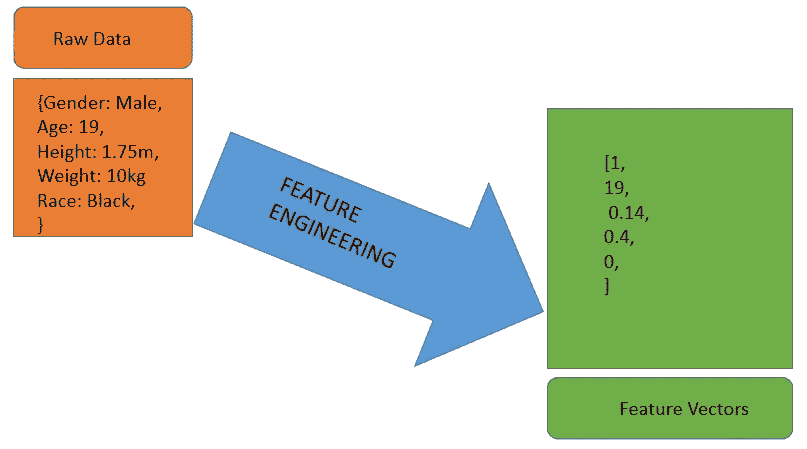
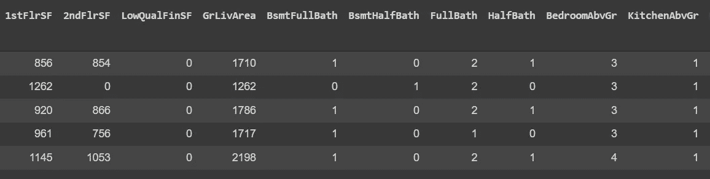
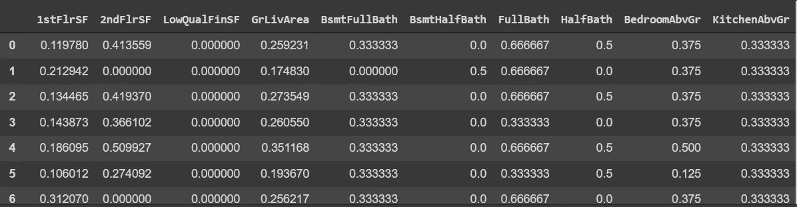
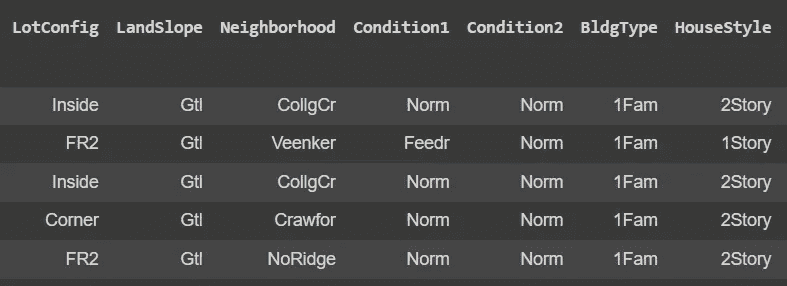
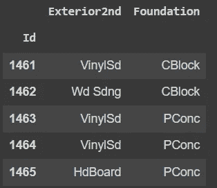
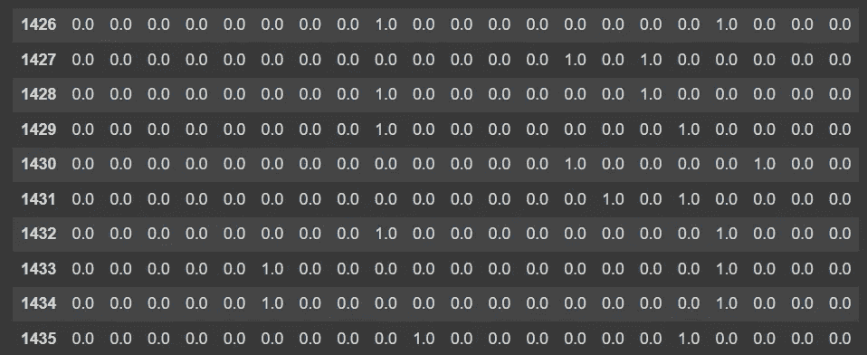
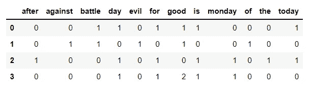
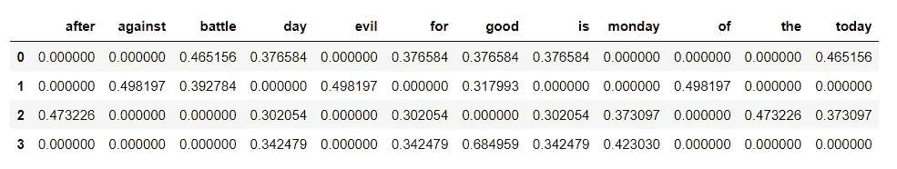

# 特征工程技术

> 原文：<https://towardsdatascience.com/feature-engineering-techniques-bab6cb39ed7e?source=collection_archive---------11----------------------->

## 将原始数据映射到机器学习特征

特征工程是开发机器学习模型的关键步骤之一。这涉及从原始数据中选择、聚集或提取特征的任何过程，目的是将原始数据映射到机器学习特征。



将原始数据映射到特征向量。(图片由作者提供)。

应用于数据的特征工程过程的类型取决于其数据类型。数字和非数字数据是原始数据中可以出现的两种基本数据类型；这些可以细分为离散、连续、分类、文本、图像和时间数据类型。

这篇文章的重点是特征工程数字，分类和文本数据。它还考虑了处理缺失数据和派生新特征以提高模型性能的方法。

已经读入 Pandas 数据帧的数据的数字和非数字列可以根据其列的数据类型来区分，因此:

获取数据帧中的数字和非数字列。(图片由作者提供)。

**数值数据**是保存可以按逻辑顺序排列的数值的特征数据的通称。在机器学习中，以数字数据格式(整数、浮点数等)处理数字特征通常更容易。)可被机器学习算法摄取。

例如，让我们看看流行的[房价数据集的一些数字数据。](https://www.kaggle.com/c/house-prices-advanced-regression-techniques/data)



[房价数据集](https://www.kaggle.com/c/house-prices-advanced-regression-techniques/data)的示例数字列。(图片由作者提供)。

原始数据的数值数据通常以不同的尺度表示。就像上面的例子一样，一些列如“全浴”和“半浴”具有较低的比例(<10) while others such as “1stFlrSF” and “2ndFlrSF” have higher scales ( > 1000)。将输入数值数据的比例标准化为具有相似的范围通常是一种好的做法，以避免算法在训练过程中为比例较大的要素分配更多权重。

数字数据可以使用 Sklearn 的 MinMaxScaler 或 StandardScaler 进行缩放。最小最大值定标器将所有数值数据的范围定标为 0 到 1，而标准定标器将数值数据的单位方差和平均值定标为 0，从而将数值输入标准化。



使用 MinMaxScaler 缩放数值数据。(图片由作者提供)。

非数字数据包括分类和文本数据，这些数据在被摄取到机器学习模型中之前通常被编码成数字。

**分类数据**有时可以表示为数字，但不要与数字数据混淆，因为它们显示了不同类别数据之间的关系。下面是[房价数据集的一些分类列的数据框架。](https://www.kaggle.com/c/house-prices-advanced-regression-techniques/data)



显示分类特征的[房价数据集](https://www.kaggle.com/c/house-prices-advanced-regression-techniques/data)的示例列。(图片由作者提供)。

为了避免在训练期间假设以数值表示的分类数据是数字特征，通常最好对分类特征进行一次性编码，而不是对它们进行标签编码，这可能会欺骗机器学习算法来假设类别之间的代数关系。

与标签编码中简单地分配数值来表示各自的类别不同，在一键编码中，每个分类值被转换成新的分类列，并被分配二进制值 1 或 0，从而将每个值表示为二进制向量。这防止了算法假设数字排序或类别之间的关系(例如假设一个男孩>一个女孩，如果他们分别用 1 和 0 进行标签编码)，从而提高了模型在学习数据内的关系时的性能。

根据前面的例子，下面是来自[房价数据集的样本分类列的子部分。](https://www.kaggle.com/c/house-prices-advanced-regression-techniques/data)



波士顿住房数据集的分类列示例。(图片由作者提供)。

与其像在模型摄取的标签编码中那样用数值(0，1，2，3，…)来表示这些列中的每个类别，不如对数据帧中的特征进行一次性编码，这样，数据点中类别的存在用一(1)来表示，而不存在用零(0)来表示。这可以通过使用 Scikit Learn 的 oneHotEncoder 轻松完成。



分类列的一个热编码特征。(图片由作者提供)。

结果显示，一次性编码的特征可以被吸收到模型中以获得高效的性能。请注意，输出数据帧现在包含更多维度(列),这些维度具有代表每个数据点中是否存在该类别的数值(1.0，0.0)。因此，对于所有分类列，每个列都根据该列中类别的数量展开为单独的列。

对于**文本数据**，有必要将它们表示为数值，机器学习算法通过称为矢量化的过程识别这些数值。一些常见的文本矢量化技术有字数统计、词频-逆文档频率(*TF-IDF*)和单词嵌入。

字数统计是一种简单的矢量化技术，它根据文本数据在数据中出现的频率将文本数据表示为数值。例如，考虑下面的文本列表:

```
text_data = ['Today is a good day for battle',
             'Battle of good against evil',
            'For the day after today is Monday',
            'Monday is a good day for good']
```

为了使用字数统计技术对上述文本数据进行矢量化，通过记录每个单词在文本数据中出现的次数来形成稀疏矩阵。这可以通过使用 Scikit Learn 的计数矢量器来实现。



示例文本数据的字数矢量化输出数据帧。(图片由作者提供)。

输出数据帧显示了输入文本数据的矢量化特征，这些特征现在可以被摄取到算法中。虽然这种技术实现了向量化的目的，但对于机器学习算法来说，它不是最佳的，因为它只关注数据中单词的频率。一个更好的替代方法是术语频率-逆文档频率(*TF–IDF*)方法，该方法关注单词的频率及其在文本数据中的重要性。

在 TF-IDF 中，文本数据中每个单词的重要性由该单词的逆文档频率(IDF)来推断。逆文档频率是一种统计度量，用于评估单词与文本集合中的文本的相关程度。每个单词的 IDF 计算如下:

```
idf = ln[1+N]/(1+df)]+1
where: 
idf = Inverse document frequency
N = Number of texts in the data, N=4 for our example.
df = the document frequency
The df is the number of texts that a particular word appears in the data; for instance, the word "good" appears four (4) times in the data but has a df of (3) as it appears in 3 texts (once for two texts and twice for another text).
```

TF-IDF 方法的一个重要方面是，它为文本数据中丰富或稀少的单词分配较低的分数，因为它假设它们在数据中寻找模式时不太重要。这通常有助于建立有效的模型，因为诸如“the”、“is”、“are”、“of”之类的常用词和罕见词在文本数据中的实时模式识别中大多很少或没有帮助。Sklearn 的 TfidfVectorizer 有助于以这种方式轻松地对文本数据进行矢量化。



显示数据中单词的逆文档频率的输出数据帧。(图片由作者提供)。

输出显示文本数据根据单词的 TF-IDF 值被矢量化，然后可以被摄取到算法中用于学习。TD-IDF 方法的缺点是，它没有考虑在单词嵌入中共享相似含义的单词；尽管如此，它仍然非常适合向量化文本数据。

通过特征工程来提高机器学习模型的性能的另一种常见技术是通过从现有特征中导出新特征。这可以通过以某种方式对输入特征进行数学组合来实现，从而在对输入特征进行训练之前对其进行转换。

例如，在[房价数据集](https://www.kaggle.com/c/house-prices-advanced-regression-techniques/data)中，诸如每间房的平方英尺或房屋中房间总数等特征通常比诸如卧室、浴室等的数量等单个特征更能反映和指示房屋的目标价格。如果数据中不存在此类有用的特征，则可以通过对输入特征进行数学组合来获得这些特征。

在机器学习中处理原始数据时，缺失数据也是另一个问题。处理缺失数据是特征工程的一个重要方面，因为原始数据通常是不完整的。处理数据中的缺失值通常包括完全删除缺失值的数据点，通过利用任何集中趋势(平均值、中值或众数)或矩阵补全来替换缺失值。

在根据数据类型执行了之前概述的大多数步骤之后，您的原始数据现在被转换为特征向量，这些向量可以被传递到机器学习算法中以用于训练阶段。

**总结:**特征工程涉及将原始数据映射到机器学习特征的过程。特征工程的过程取决于数据的类型。常见的特征工程过程包括缩放数字数据、标签或一次性编码分类数据、矢量化文本数据、导出新特征和处理缺失数据。适当的特征工程有助于使原始数据适合摄取到机器学习模型中，并提高机器学习模型的性能。