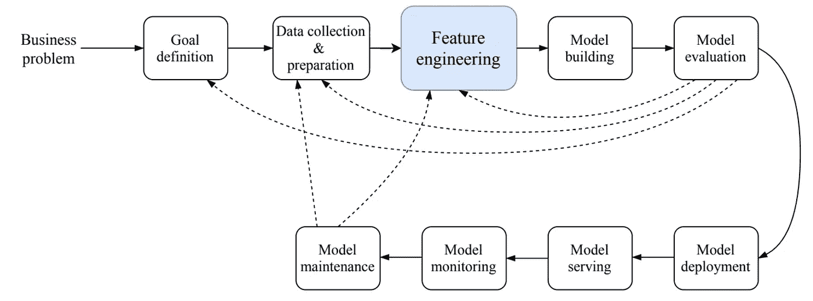
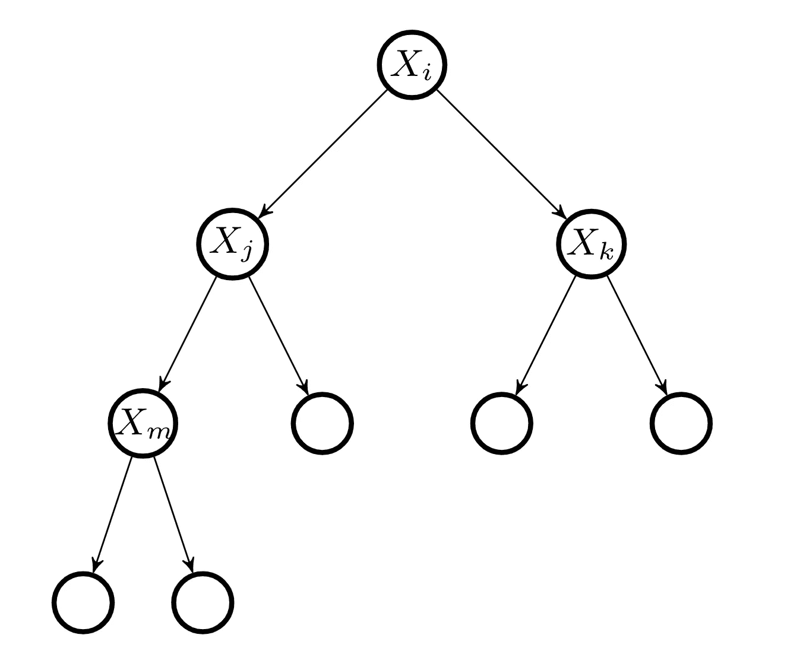
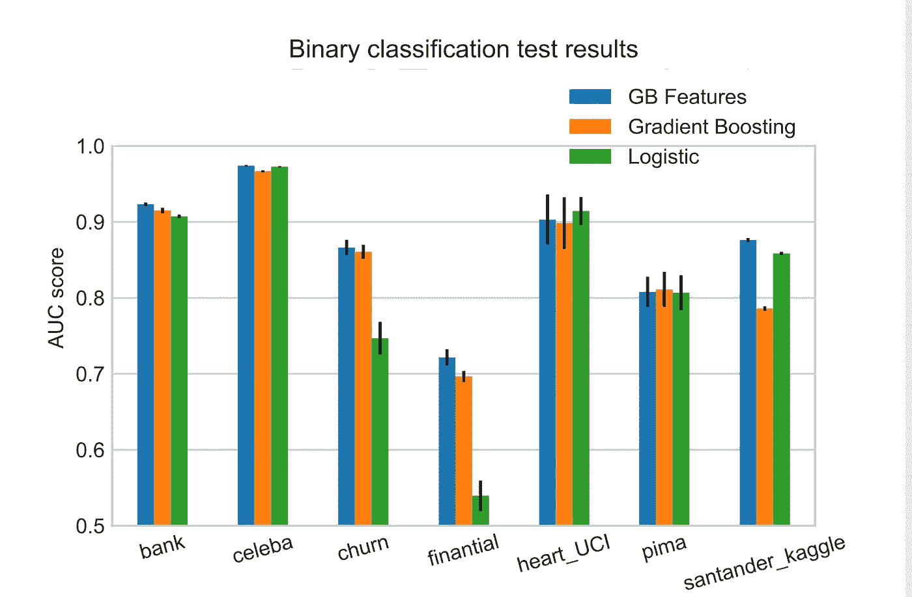

# 基于梯度增强决策树的特征生成

> 原文：<https://towardsdatascience.com/feature-generation-with-gradient-boosted-decision-trees-21d4946d6ab5?source=collection_archive---------13----------------------->

## [实践教程](https://towardsdatascience.com/tagged/hands-on-tutorials)


拉布雷尼亚，巴尔巴特，加的斯，作者[安达卢西亚军政府](http://www.juntadeandalucia.es/medioambiente/servtc5/ventana/mostrarFicha.do;jsessionid=A3F33C7EEC39616F77B2038E82E3F59F?idEspacio=7408)

# TL；速度三角形定位法(dead reckoning)

在这篇博客中，我们实现了之前在脸书人工智能研究论文中提到的一个想法: [*在脸书*](https://dl.acm.org/doi/10.1145/2648584.2648589) 预测广告点击的实际经验

其思想是使用梯度推进决策树创建特征的非线性变换，然后使用最终估计器进行预测。

该实现是托管在 [sktools 包](https://sktools.readthedocs.io/en/latest/)中的 python 管道转换器，可以通过以下方式下载:

```
pip install sktools
```

和一些代码片段来集成以再现它

# 介绍

在机器学习任务的建模过程中，需要创建新的特征来描述问题并使模型达到更好的性能，这就是所谓的“特征工程过程”。这是每个机器学习项目周期的一部分。



从[开始的 ML 项目生命周期安德烈·布尔科夫](http://www.mlebook.com/)

在创建这些新功能的整个设计过程中，我们必须了解手头的任务，寻找功能的相互作用，尝试想象这个新功能如何与其他功能一起工作，考虑宁滨连续功能，创建最佳数量的四分点，以有助于提高线性回归性能的方式处理分类功能。所有这些都是在高维空间中，我们对二维或三维空间的直觉已经产生了误导。该过程不仅需要领域知识、耗时且容易出错，而且还依赖于问题，并且必须为每个新数据集开发方法和函数。不要忘记，并不能保证创建功能在任何时候都能达到最佳性能，这取决于人类的创造力和耐心。

在可以应用于任何问题的框架中，自动生成特征允许提取数据中更有用和更有意义的信息。允许机器学习工程师在更有用的任务上花费更多时间。

# 利用梯度增强决策树生成特征

决策树基于分类和回归树(CART)方法构建二元分裂。在每次树分裂时，基于损失函数的优化来选择分离的最佳选择。在建立了几个分支之后，我们就有了一个树状结构，其中某个单独的预测最终会出现在不同的树叶中。

如果单个预测/一行/实例大于 X_i 中的某个值，则它将向右，否则它将向左。典型的二叉决策树分裂。



决策图表

对于图中的决策，每个实例有五种可能性:[0，0，0，0，1]，[0，0，0，1，0]，[0，0，1，0，0]，[0，1，0，0，0]和[1，0，0，0，0，0]。

给定任何数据集，在训练一个 GBM 之后，每个实例都可以根据它从每棵树中感受到的叶子进行编码。如果 GBM 由 N 个决策树的集合组成，那么每个实例将有 N 种编码。

编码的特征集可以水平地附加到先前的特征上，增加了问题的维度，并且增加了源自每个决策树执行的不同分裂的新的非线性信息。

# 一些实验

在本节中，我们提供了几个基准来比较算法的性能。

**逻辑** —指逻辑回归

**梯度推进** —梯度推进决策树

**GB 特性** —指的是前面提到的算法，其中特性通过梯度推进决策树进行转换，最终的估计器是逻辑回归。



用一些数据集对算法进行基准测试

上图是我们对算法进行基准测试的七个数据集的条形图。每组条形代表使用三种方法的数据集的结果。每个条形都有一个相关的标准偏差来衡量预测的稳定性。在较小的数据集中，每次分割之间的差异往往较大，而在较大的数据集中，相似性往往较大，这解释了数据集之间标准差大小的差异

# 代码片段

安装 sktools 软件包

```
pip install sktools
```

将特征工程技术集成到具有最终估计器的流水线中

## 分类

该实现处理几个超参数

```
*stack_to_X: bool, default = True*
```

如果设置为 True，则返回原始列加上由梯度提升决策树算法生成的新列。如果为 False，则仅返回新列。

```
*add_probs: bool, default = False*
```

如果设置为 True，它将返回创建的要素加上通过梯度增强估计的概率。请注意，这可以被视为一个集合。然而，默认值是 False，所以不会附加任何概率。

scikit-learn 梯度推进的所有论点也可以通过。

## 回归

为了将其构建为回归问题，需要修改超参数`regression = True`。

请注意，这种特征生成技术可以视为一个整体，因此在验证过程中必须特别小心。

# 感谢

这个项目是之前在巴塞罗纳超级计算中心与大卫·布查卡(T2)一起完成的。

sktools python 包由[大卫·马斯普主持。](http://linkedin.com/in/david-masip-bonet-935a284b/)

非常感谢 [Vincent Warmerdam](https://www.linkedin.com/in/vincentwarmerdam/) 在[https://calmcode.io/](https://calmcode.io/)发布的关于开源的酷视频