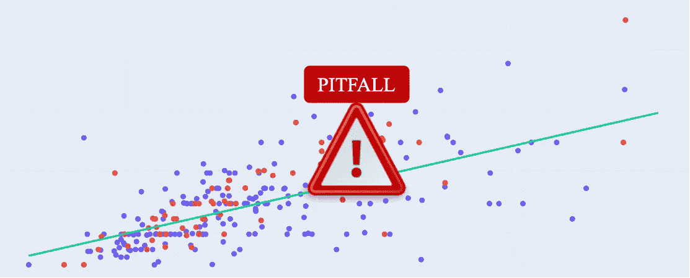
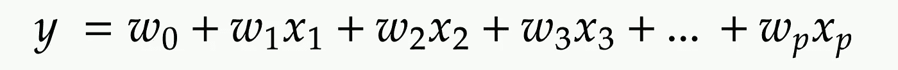
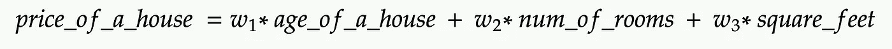
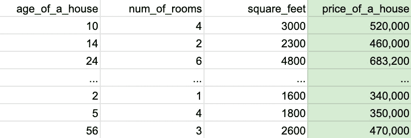
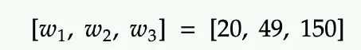

# 线性模型中的特征重要性:四个经常被忽视但却至关重要的陷阱

> 原文：<https://towardsdatascience.com/feature-importance-in-linear-models-four-often-neglected-but-crucial-pitfalls-e5c513e45b18?source=collection_archive---------14----------------------->

作者图片

线性模型家族包括普通线性回归、岭回归、套索回归、SGD 回归等等。线性模型的系数通常被解释为相关变量的**特征重要性**。一般来说，特征重要性指的是特征在预测目标变量时的有用程度。比如 ***房龄*** 在预测房价上有多有用。

本文总结并解释了使用线性模型的系数作为特征重要性时经常被忽略但却至关重要的四个陷阱:

*   **是否标准化数据集**
*   **线性模型有不同意见**
*   **高度相关特征的诅咒**
*   **交叉验证的稳定性检查**

线性回归模型采用以下形式

其中 **𝒚** 表示预测的目标值， **𝑤** 为系数， **𝑥** 为变量或特征。

为了简单起见，让我们用一个简单的例子:基于三个特征*房屋年龄*房间数量*平方英尺*来预测*房屋价格*。

数据集如下所示:

假设我们将数据集提供给一个线性模型，然后训练该模型，进行预测，此时，我们有系数值:

现在，我们回到最初的问题:**我们的特征的重要性是什么:*房子的年龄，*房间的数量，*平方英尺*？它们在预测房价方面有多大用处？是否可以说它们的重要性等于系数:[20，49，150]？**

# **数据集是否标准化**

答案是:只有数据集在训练前被标准化，系数才能作为特征重要度。

例如，如果我们将标准缩放器应用于原始数据集，然后将其拟合到模型，我们可以说 *age_of_a_house* 的特征重要性是 20 **。**

原因是变量通常处于不同的尺度。 ***房间数*** 大多在【1，10】范围内，而 ***平方英尺*** 可以在【500，4000】范围内。在这种情况下，变量需要缩放到相同的度量单位。如果数据集是标准化的，系数是线性模型的特征重要性。

# **线性模型有不同意见**

不同的线性模型可能对特征的重要性有完全不同的看法。在上面的例子中，一个普通的线性模型有系数[20，49，150]。岭回归模型可能具有与普通回归显著不同的系数[1820，23，90]。在实践中，我建议使用一个集合策略来结合来自不同模型的想法。

# **高度相关特征的诅咒**

变量 ***房间数量*** 和 ***平方英尺*** 是相关的。更大的房子里会有更多的房间。不幸的是，我们不能简单地移除其中一个。相关变量的影响，尤其是共线变量的影响，不容易区分开来。此外，当更改输入数据集时，高度相关的变量可能会导致系数值不稳定。

# **用 c 进行稳定性检查**Ross-验证

为了检查系数的稳定性，一种典型的方法是应用交叉验证，并在循环中跨折叠追踪系数的值。请注意，如果系数在折叠之间变化很大，我们应该谨慎使用它们作为特征重要性。

在本文中，我们以简化的房价预测为例，来解释线性模型中特征重要性的四个经常被忽略但却至关重要的陷阱。如果只有一样东西你会带走，我希望它是清单👍🦖🥊💎🏅：

*   标准化您的数据集
*   不同的模型对特征的重要性有不同的理解
*   小心高度相关的变量
*   应用交叉验证来检查跨折叠系数的稳定性

# 报名参加🦞:的 Udemy 课程

## [具有机器学习和统计的推荐系统](https://www.udemy.com/course/recommender-system-with-machine-learning-and-statistics/?referralCode=178D030EF728F966D62D)

[https://www . udemy . com/course/recommender-system-with-machine-learning-and-statistics/？referral code = 178d 030 ef 728 f 966 d62d](https://www.udemy.com/course/recommender-system-with-machine-learning-and-statistics/?referralCode=178D030EF728F966D62D)