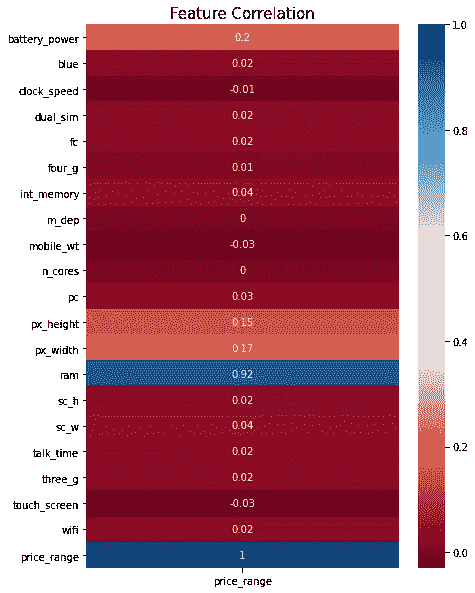
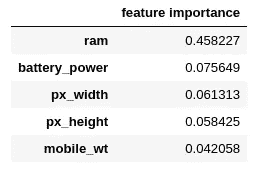
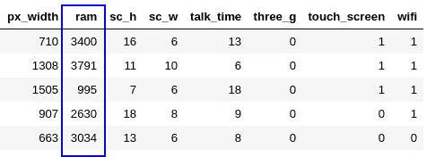
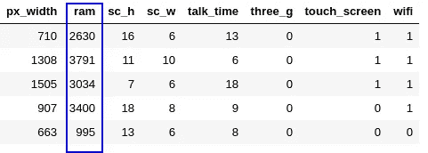
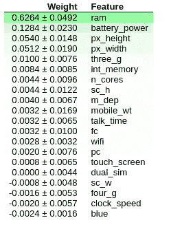

# 机器学习模型中的特征重要性

> 原文：<https://towardsdatascience.com/feature-importance-in-machine-learning-models-c4396c519eb9?source=collection_archive---------22----------------------->

## 找到那个(不那么)神奇的特征的方法

来源([去飞溅](https://unsplash.com/))

并非所有的特征都是平等的。有些会对你的模型的预测有很大的影响，而有些则不会。在之前的[文章](/explain-machine-learning-models-partial-dependence-ce6b9923034f)中，我们研究了部分依赖的使用，以了解某些特征如何影响预测。确定哪些特征产生最大的预测能力是模型建立过程中的另一个关键步骤。在本文中，我们将研究几种方法来确定哪些特性最有可能产生影响。

**特征相关性**

我们将使用来自 Kaggle 的这个[移动价格分类数据集来说明我们的示例。加载到数据集中后，我们可以做的第一件事是检查我们的特征和我们的目标变量之间的相关性。最简单的方法是使用`df.corr()`方法。然而，查看数字网格可能不是可视化数据的最佳方式。相反，我们可以创建一个彩色的**热图**来检查我们的每个特征是如何与我们的目标变量相关联的。](https://www.kaggle.com/iabhishekofficial/mobile-price-classification)

创建关联热图，同时突出显示我们的目标变量

该热图有效，但是如果我们的数据集中有大量的要素，它可能会迅速增长到难以分析我们的目标变量的大小。我们可以稍微修改一下代码，只关注我们感兴趣的行(包含目标的行)。

简化热图，仅显示我们的目标变量

我们的目标变量的特征相关性

这看起来更干净，更简洁。使用这样的彩色热图可以更容易地看出哪些功能对我们有用。我们可以不看一个充满数字的矩阵，而是看哪些颜色是红色和蓝色的淡色。我们可以立即指出，诸如`battery_power`、`px_height`、`px_width`和`ram`等特征都与我们的目标变量`price_range`相关。我们现在知道在训练模型时需要注意哪些变量。

记住这一点，让我们转到模型构建，看看这里选择的特性是否真的那么重要。为此，我们将训练一个简单的随机森林模型。训练之后，我们将使用大多数基于树的算法都有的`feature_importances_`属性。我们还会将这些值放在数据帧中，以便于分析。

分析模型认为最重要的特征

重要性排名前五的功能

当我们查看由`feature_importances_`属性返回的前 5 个特性时，我们可以看到它与我们之前的分析基本一致。返回的数字代表每个特征带来的熵的减少，由我们数据中的样本数归一化。简单地说，*返回值越高，这个特性在我们的模型中就越重要。*

**排列重要性**

使用`feature_importances_`属性的一种替代方法是所谓的排列重要性。我将使用数据集中的一个例子来解释它是如何工作的。

类似于`feature_importances_`属性，排列重要性是在模型适合数据之后计算的。为了说明发生了什么，我们将选取行的子集。

突出显示我们的特征的行的子集

我们在数据集中看到 5 行的子集。我强调了一个具体的特征`ram`。我们将随机打乱这一列中的值。这里的预期是，随机重新排列值将对我们的预测产生负面影响。我们感兴趣的是，通过这样做，我们的预测究竟会改变多少。如果我们打乱了一个模型在预测时非常依赖的列(如`ram`)，那么模型的准确性会比打乱一个不太重要的列(如`talk_time`)受到的影响更大。

我们的功能随机洗牌

在改变值之后，我们将再次尝试预测我们的目标变量。通过将这些预测与我们的真实目标值进行比较，我们可以确定我们的损失函数受到了多大程度的混排数据的影响。我们对数据集中的所有要素执行此操作，并比较结果。

谢天谢地，我们不必从头开始。有一个叫做 [eli5](https://pypi.org/project/eli5/) 的方便的库可以自动为我们完成所有这些工作。让我们看看如何只用几行代码就能使用它。

使用 eli5 库，我们能够快速得出一个排序排列重要性图，如上图所示。我们可以看到，这些数据中的大部分与我们使用相关性和`feature_importances_.`进行的初步检查一致，但是我们如何解释这些数据呢？

我们已经知道，靠近顶部的特性对我们的模型最重要，而底部的特性最不重要。显示的第一个数字代表我们的模型的性能由于随机改变特性的值而降低了多少。因为我们是随机调整我们的栏目，所以对我们预测的影响也有随机性的因素。我们可以通过多次重复洗牌过程并观察每次重复的效果如何变化来测量这种随机性。这是我们在`+-`之后看到的数字。

你可能也注意到了一件事，我们在底部看到一些特性的负值。这是什么意思？在这种情况下，混乱的数据实际上使我们的预测比真实数据更准确！这意味着该特性并不重要(重要性为 0)，但随机移动列恰好使预测更加准确。随机调整数值能给我们更好的预测，这在直觉上说不通。

**结论**

我们研究了在数据集中识别重要要素的不同方法。我们从**特征相关性**开始，这发生在我们建立任何模型之前。通过创建彩色热图，我们能够更快地识别重要特征，而无需查看大量数字。

我们看了两种在建立模型后确定特征重要性的方法。在大多数基于树的分类器中发现的 **feature_importances_** 属性向我们展示了一个特征对模型预测的影响程度。**排列重要性**是一种不同的方法，我们将一个特性的值打乱，看看它对我们模型的预测有多大影响。我们能够使用 eli5 库轻松实现这一点。

感谢您的阅读！

您可以通过以下渠道与我联系:

*   [中等](https://zito-relova.medium.com/)
*   [领英](https://www.linkedin.com/in/zrelova/)。
*   [Github](https://github.com/zitorelova)
*   [卡格尔](https://www.kaggle.com/zitorelova)