# 机器学习中的特征选择和 EDA

> 原文：<https://towardsdatascience.com/feature-selection-and-eda-in-python-c6c4eb1058a3?source=collection_archive---------5----------------------->

## ***如何利用数据可视化来指导特征选择***

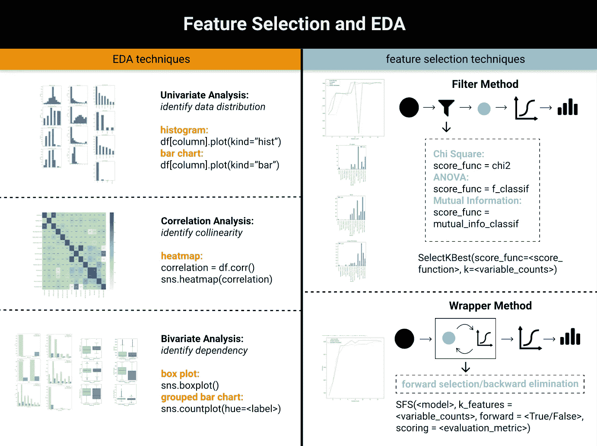

功能选择和 EDA 备忘单(图片由作者提供，来自[网站](https://www.visual-design.net/post/feature-selection-and-eda-in-machine-learning)

在机器学习生命周期中，特征选择是选择与预测相关的输入特征子集的关键过程。包含不相关的变量，尤其是那些数据质量差的变量，通常会污染模型输出。

此外，特征选择具有以下优点:

1) **避免维数灾难**，因为一些算法在高维时表现不佳，例如一般线性模型、决策树

2) **降低计算成本**以及大量数据带来的复杂性

3) **减少过拟合**，模型更有可能推广到新数据

4) **增加模型的可解释性**

在本文中，我们将讨论两种主要的特征选择技术:**过滤方法**和**包装方法**，以及如何利用数据可视化来指导决策制定。

# 数据预处理

在进入特征选择之前，我们应该加载数据集，执行数据预处理和数据转换:

**1。加载数据集和导入库**

我正在使用来自 Kaggle 的信用卡客户数据集来预测谁更有可能被炒鱿鱼。

```
import pandas as pd  
import numpy as np  
import seaborn as sns  
import matplotlib.pyplot as plt  
from pandas.api.types import is_string_dtype, is_numeric_dtype df = pd.read_csv("../input/credit-card-customers/BankChurners.csv")
```

现在让我们看一下原始数据。

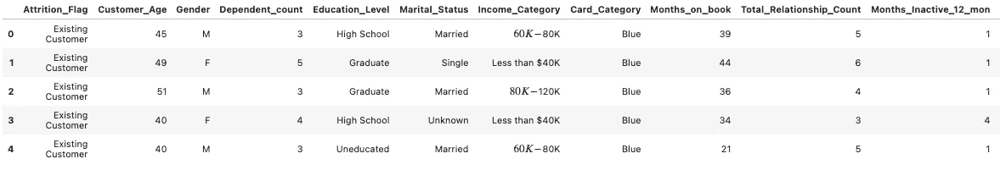

信用卡客户数据集(图片由作者提供)

**2。定义预测:**这个练习是一个分类问题，从中我们预测二元变量“Attrition _ Flag”，它可以是现有客户，也可以是流失的客户。

**3。检查缺失数据:**

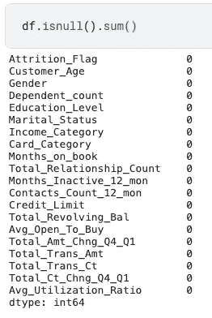

缺失数据(图片由作者提供)

幸运的是，该数据集不包含任何缺失值，但情况并非总是如此。如果您想了解更多关于如何处理丢失数据的信息，这篇文章可能会对您有所帮助。

[](https://medium.com/analytics-vidhya/how-to-address-missing-data-531ed964e68) [## 如何处理丢失的数据

### 三种缺失数据的解决方法

medium.com](https://medium.com/analytics-vidhya/how-to-address-missing-data-531ed964e68) 

**4。变量转换:**这个过程包括对分类变量进行编码，并将所有变量转换成相同的尺度。我分别选择了标签编码器和最小-最大缩放。

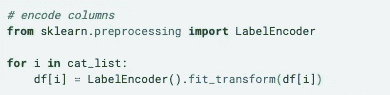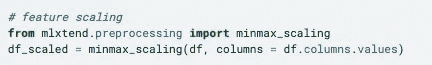

变量转换(图片由作者提供)

如果您想了解更多数据转换技术，请查阅这篇文章:

[](/data-transformation-and-feature-engineering-e5181ef274b5) [## 数据转换和特征工程

### 如何为您的数据选择合适的技术

towardsdatascience.com](/data-transformation-and-feature-engineering-e5181ef274b5) 

# 探索性数据分析

数据可视化和 EDA 是特性选择过程的重要补充工具，可以通过以下方式应用:

1.  **单变量分析:直方图**和**条形图**有助于可视化每个变量的分布和方差
2.  **相关性分析:热图**便于识别高度相关的解释变量，减少共线性
3.  **双变量分析:箱线图**和**分组条形图**有助于发现解释变量和响应变量之间的相关性和关系

*(为了更好的理解数据，可以在数据转换前进行探索性的数据分析)*

**单变量分析—直方图和条形图**

为了获得分布的概观，首先让我们将特征分类为分类变量和数值变量，然后使用条形图可视化分类特征，使用直方图可视化数值特征。可视化分布给出了关于数据点是更密集还是更分散的建议，从而给出了方差是低还是高的建议。低方差特征往往对结果变量的预测贡献较小。

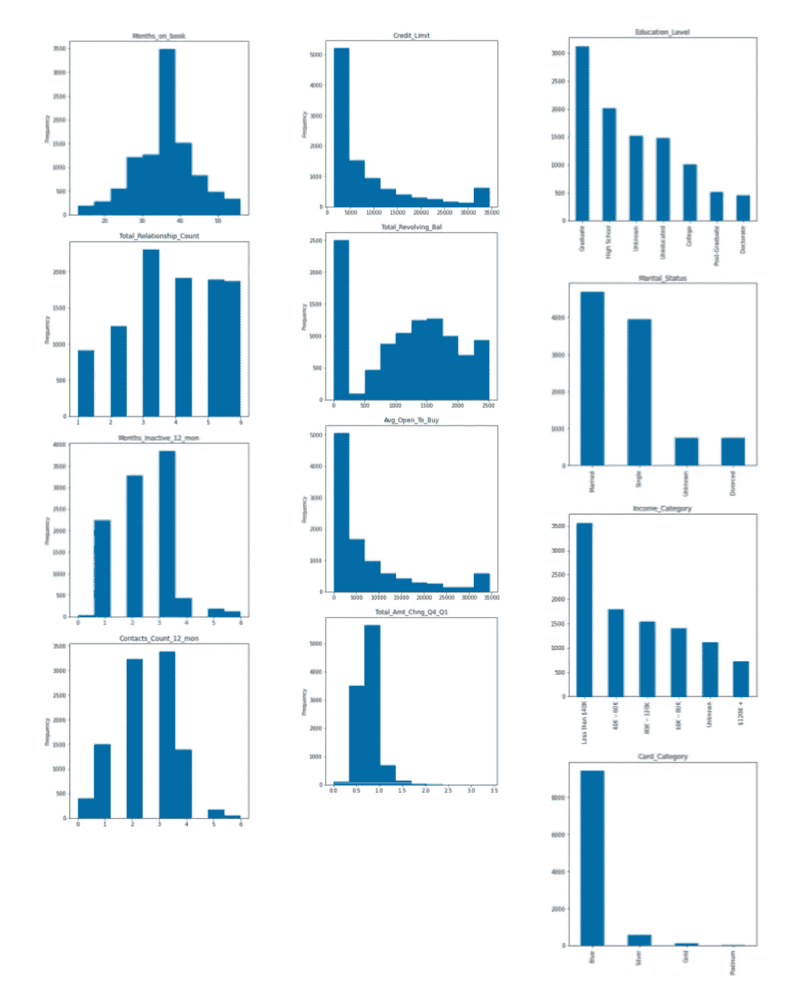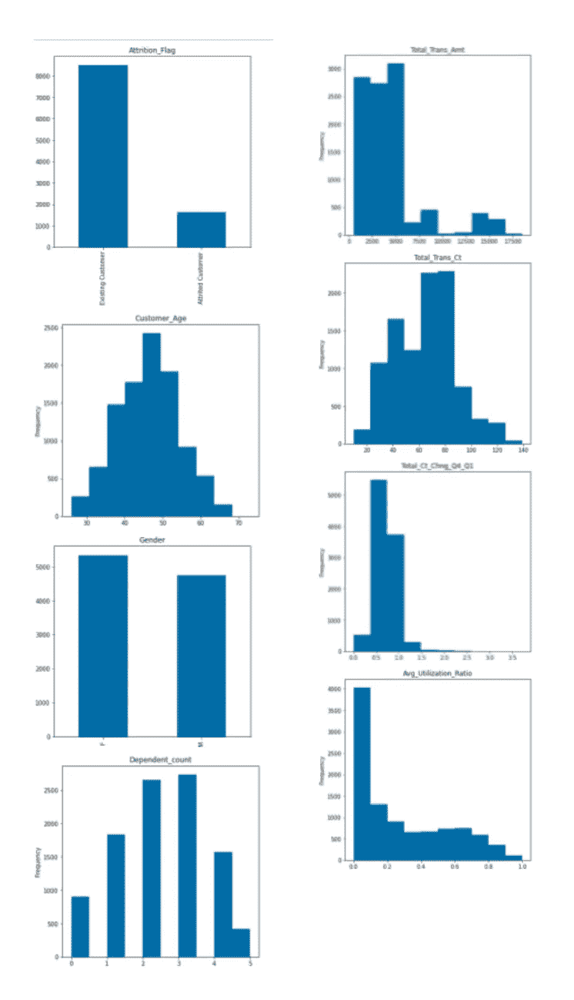

单变量分析(图片由作者提供)

**关联分析—热图**

一些算法要求解释变量中没有共线性，包括将用于本练习的逻辑回归。因此，消除高度相关的特征是避免这种潜在缺陷的必要步骤。使用热图可视化的相关性分析突出显示相关系数高的要素对。

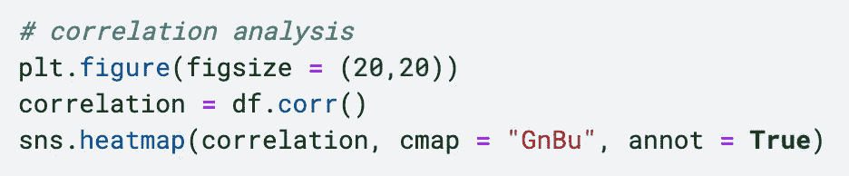

相关性分析和热图(图片由作者提供)

如图所示，不难发现以下几对高度相关的特征:

*   *Customer _ Age&Month _ on _ Book(0.79)*
*   *合计 _ 交易 _ 金额&合计 _ 交易 _ 金额(0.82)*
*   *Avg _ Open _ To _ Buy&Credit _ Limit(1)*

基于这个结果，我放弃了以下变量:

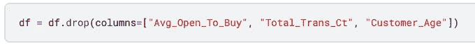

丢弃高度相关的要素

**双变量分析—箱线图和分组条形图**

双变量 EDA 研究每个解释变量和目标变量之间的关系。分类特征和数值变量分别使用**分组条形图**和**箱线图**进行处理，这种探索可以进一步促进过滤方法中使用的统计检验，例如卡方检验和 ANOVA 检验。

> G ***圆形条形图作为卡方分析*** 的直观表示

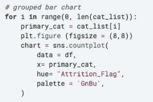

分组条形图代码

每个自变量被设置为主要类别。使用 hue = " attachment _ Flag "将目标变量设置为二级类别。结果，它描述了“损耗 _ 标志”是否会在主要类别的不同级别的分布中变化。如果两个变量是独立的，那么我们期望所有水平的分布是相同的。

这与卡方检验的逻辑相同，卡方检验基于独立性假设计算观察值和期望值之间的差异。如果不存在或存在很少的相关性，我们希望每组条形的比率与流失客户与现有客户的比率成比例。如果比率显著不同，则表明观察值和期望值之间的差异较大，这意味着卡方值较高，因此拒绝了两个变量独立的假设。

根据目标标签绘制所有类别变量后，我发现*“Card _ Category”*似乎显示了*蓝色、金色、银色和铂金*的比例变化。在接下来的部分，我们将根据基于过滤方法的定量评分来了解这是否属实。

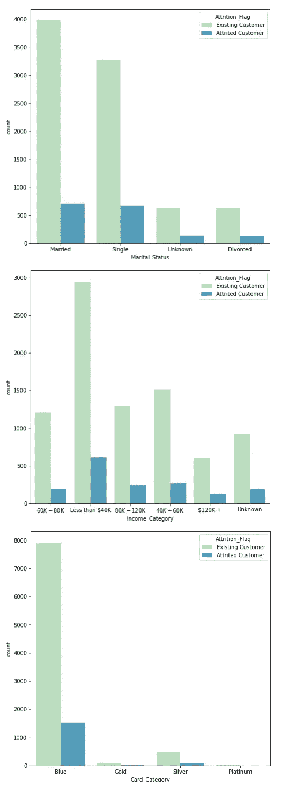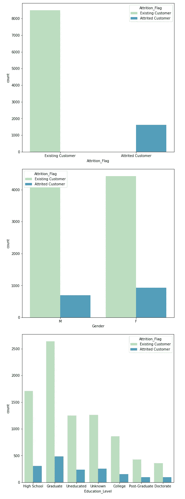

分组条形图结果(作者图片)

> ***方框图用作方差分析的直观表示***

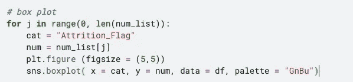

箱线图代码

箱形图显示数字数据组通过其分位数的分布。每个方框显示数据在组内的分布情况，并排放置方框表示各组之间的差异。它与 ANOVA 测试一致，ANOVA 测试也分析组间与组内相比的差异程度。如果相对可变性较大，例如下面所示的 *"Total_Revolving_Bal"* 和 *"Total_Cnt_Chng_Q4_Q1"* ，则可能表明这些特征可能有助于预测标签。让我们看看这是否可以通过过滤方法中的 ANOVA 测试来量化。

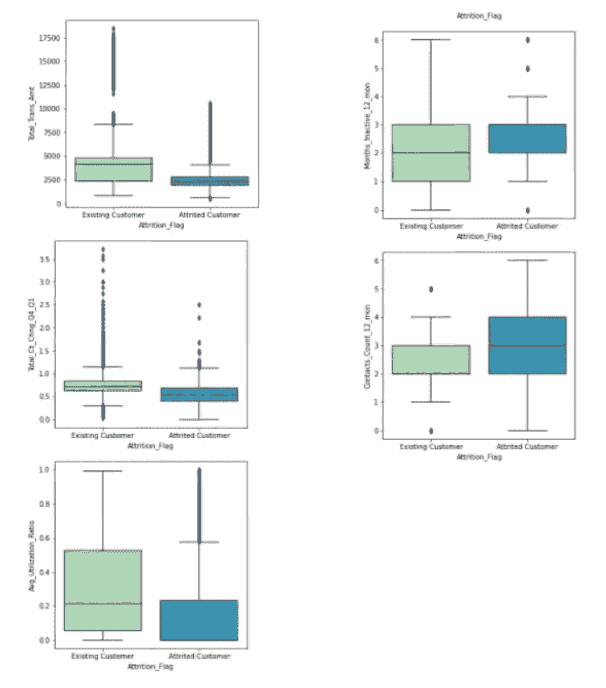

箱线图结果(图片由作者提供)

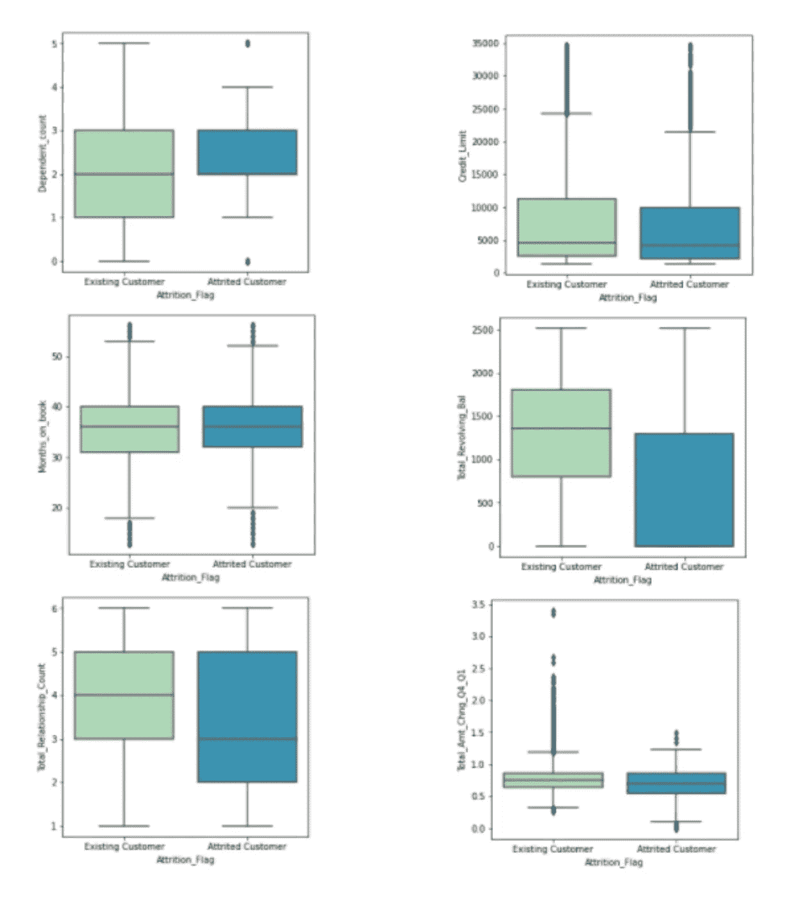

箱线图结果(图片由作者提供)

*如果你想对 EDA 有更透彻的了解，可以随意阅读我的文章《*[*Python 中的半自动探索性数据分析(EDA)*](/semi-automated-exploratory-data-analysis-eda-in-python-7f96042c9809?source=your_stories_page-------------------------------------)*》。*

# 特征选择

如果你想更深入地了解特征选择的重要性和实现特征选择的不同技术，下面来自 [*neptune.ai*](https://neptune.ai/home) 的博客提供了全面的指导。

[](https://neptune.ai/blog/feature-selection-methods) [## 特征选择方法及如何选择- neptune.ai

### 你有没有发现自己坐在屏幕前想知道什么样的功能会帮助你的机器…

海王星. ai](https://neptune.ai/blog/feature-selection-methods) 

在本文中，我们将主要介绍两类特征选择方法:**过滤方法和包装方法。**根本区别在于，过滤方法基于卡方、方差分析等统计测试评估特征重要性，而包装方法基于这些特征生成的模型的性能迭代评估特征子集的性能。

## 过滤方法

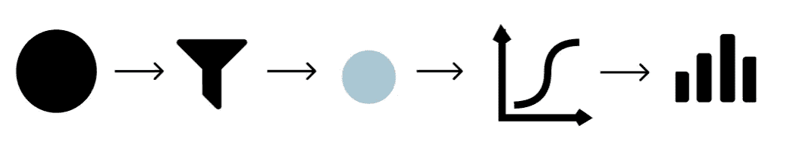

过滤方法图解(图片由作者提供)

过滤方法通过评估每个特征与因变量的关系来给每个特征打分。对于具有分类响应变量的分类问题，我使用这三个主要的评分函数:**卡方(score_func = chi2)、ANOVA (score_func = f_classif)和互信息(score_func = mutual_info_classif)。**要创建一个特征选择模型，我们需要 *SelectKBest()* 函数，然后指定要使用的评分函数以及要选择的变量数量。

```
selection_model = SelectKBest(score_func=score_function, k=variable_counts)
```

我想知道这两个参数，评分函数和变量的数量，将如何影响在所选特征上训练的模型的准确性。

首先，为了创建并执行特征选择，并检查在此基础上构建的模型的性能，我定义了一个 *feature_selection* 函数，步骤如下:

*   导入所需的库
*   基于两个参数创建特征选择模型:score_function(例如，卡方)和变量计数(例如，范围从 1 到所有特征)
*   仅基于所选特征训练逻辑回归模型
*   计算准确性分数

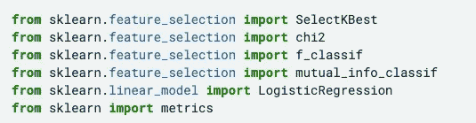

导入库

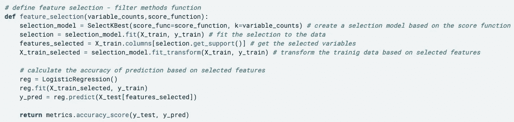

定义特征选择函数

其次，为了测试得分函数和变量计数如何影响模型性能，我使用下面的代码迭代地传递两个参数的不同组合， *"variable_counts"* 和 *"score_function "，*。

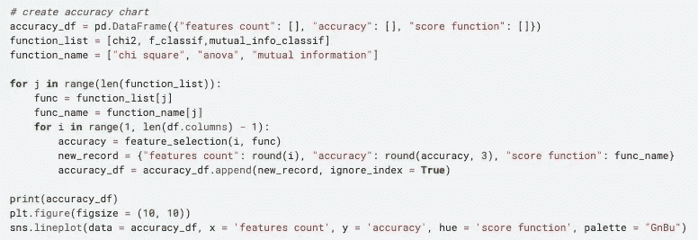

过滤方法准确度图表代码

**数据可视化过滤方法**

结果以数据框格式生成，然后使用折线图展示精度如何随着所选要素数量的增加而提高。如图所示，除了互信息方法，准确率评分在达到 8 个特征后稳定在 0.88 左右。

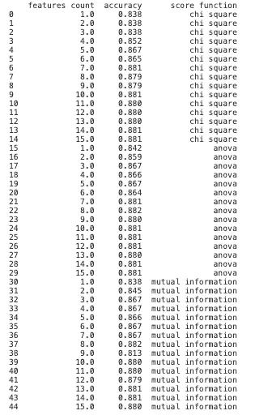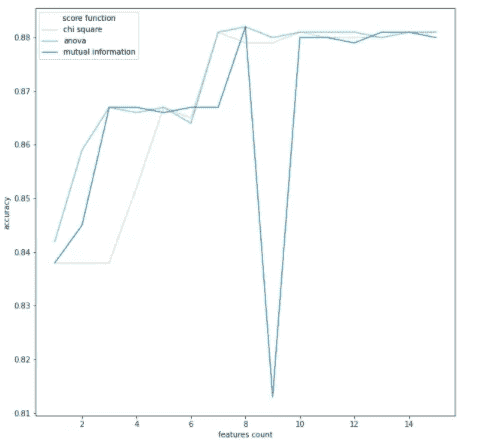

过滤方法准确性(图片由作者提供)

之后，让我们调查基于各种方法的每个特征的得分是多少。这一次，我们将使用条形图来直观显示根据卡方、方差分析或互信息分配给特征的分数。

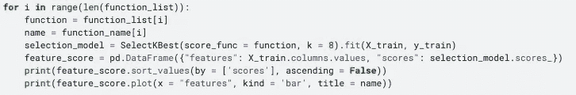

特征分数代码

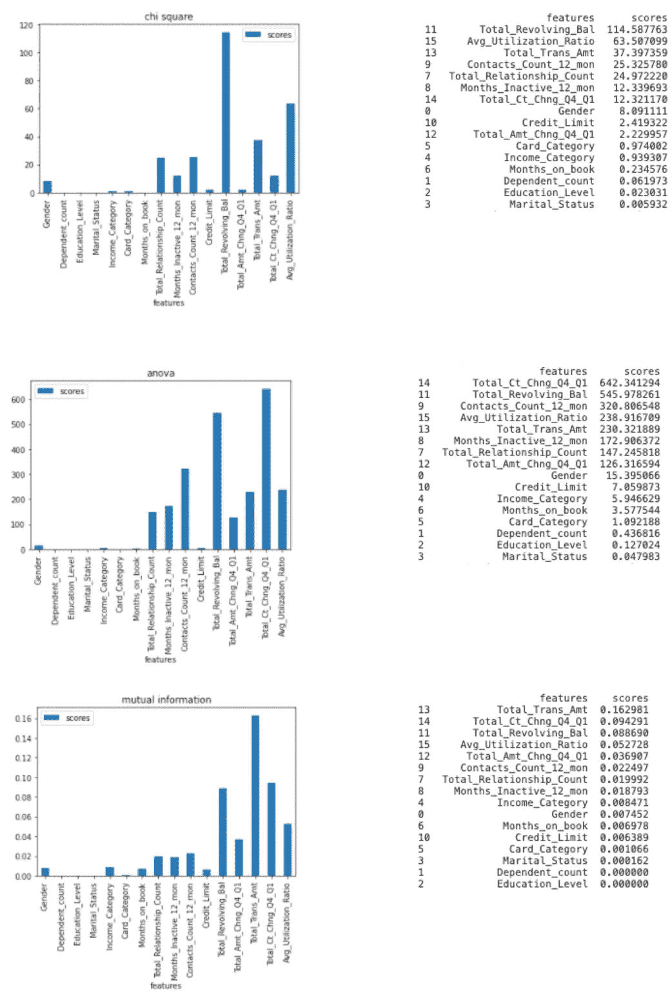

不同统计的特征分数(按作者的图像)

正如你所看到的，不同的方法对相同的特性有不同的评分，但是有些特性总是出现在列表的较高位置。例如， *"Total_Revolving_Bal"* 总是位于前 3 位，这与二元 EDA 中的箱线图的结果一致。与其他分类变量相比,“Card_Category”确实具有较高的特征重要性，这可以通过分组条形图来解释。

## 包装方法

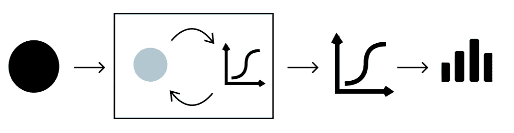

包装方法说明(图片由作者提供)

包装器方法通过评估基于这些特征训练的机器学习模型的性能来寻找最优的特征子集。因为它将模型结合到特征选择过程中，所以它需要更多的计算能力。本文介绍了两种主要的包装器方法，**向前选择和向后消除。**为了执行向前选择和向后排除，我们需要*SequentialFeatureSelector()*函数，该函数主要需要四个参数:

1.  模型:对于分类问题，我们可以使用逻辑回归、KNN 等，对于回归问题，我们可以使用线性回归等
2.  k_features:要选择的特征的数量
3.  向前:确定是向前选择还是向后排除
4.  评分:确定模型性能的评估指标，例如分类问题——准确度、精确度、召回率等；回归问题— p 值、R 平方等

**正向选择**

正向选择从模型中没有特征开始，一次向特征子集中增加一个特征。在每次迭代期间，基于由特征子集训练的模型的评估来选择新特征。

由于机器学习模型包含在特征选择算法中，我们需要指定一个模型作为输入参数之一。对于这个分类问题，我选择了逻辑回归，并以准确率作为评价指标。与筛选方法相比，包装方法在计算精确度方面略有不同。由于我们只使训练集适合包装器模型，所以包装器方法本身返回的准确度分数完全基于训练数据集。因此，有必要在所选特征上训练附加模型，并基于测试集进一步评估。

为此，我使用下面的代码来导入所需的库，并创建和评估基于包装方法构建的逻辑回归模型。

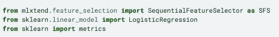

导入库

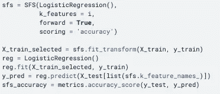

正向选择代码

**落后淘汰**

简单来说，就是和正向选择正好相反，从包含所有特征开始训练模型。然后，基于特征是否对模型性能有贡献，从特征子集中迭代地移除特征。类似地，逻辑回归和准确度被相应地用作模型和评估度量。

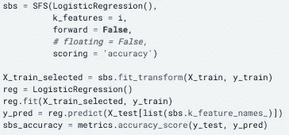

反向选择码

**包装方法和数据可视化**

与 filter 方法类似，我将向前选择和向后排除都封装到一个“for 循环”中，以便检查变量计数是否会影响准确性分数。

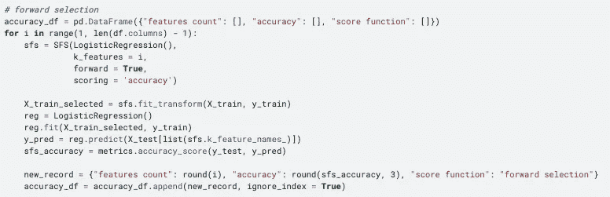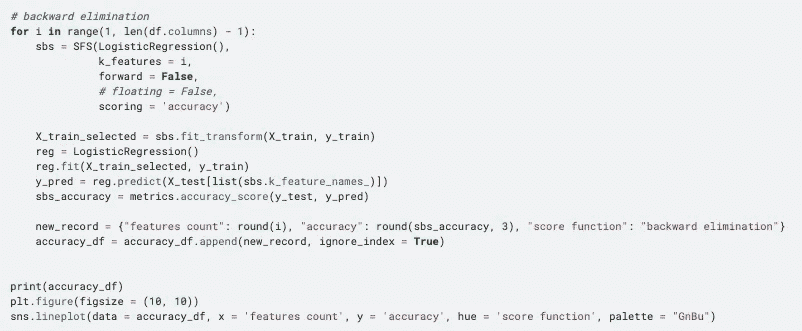

包装方法准确性代码

如折线图所示，当特征计数小于 4 时，准确度快速增长，然后在 0.88 左右保持稳定。

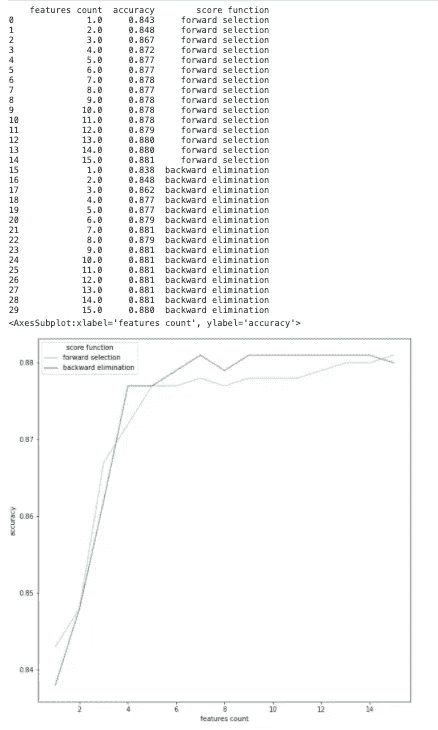

包装方法准确性图表(图片由作者提供)

在该数据集中，由于总共只有大约 20 个要素，因此要素选择可能很难对模型性能产生任何重大影响。然而，不可否认的是，数据可视化可以帮助我们决定哪些特征和多少特征适合数据集或目标。这一原则肯定可以扩展到具有更多变量的其他数据集。

# 带回家的信息

本文涵盖了两种基本的特性选择技术:

*   **过滤方法:**基于卡方、ANVOA 和互信息
*   **包装方法:**基于正向选择和反向淘汰

我们还将了解如何使用数据可视化来更好地理解要素属性，以及如何选择适当数量的要素。

# 更多这样的文章

[](/semi-automated-exploratory-data-analysis-eda-in-python-7f96042c9809) [## Python 中的半自动探索性数据分析(EDA)

### 一键式全面数据探索流程

towardsdatascience.com](/semi-automated-exploratory-data-analysis-eda-in-python-7f96042c9809) [](https://neptune.ai/blog/feature-selection-methods) [## 特征选择方法及如何选择- neptune.ai

### 你有没有发现自己坐在屏幕前想知道什么样的功能会帮助你的机器…

海王星. ai](https://neptune.ai/blog/feature-selection-methods) [](/simple-logistic-regression-using-python-scikit-learn-86bf984f61f1) [## Python 中的简单逻辑回归

### 从数据预处理到模型评估的逐步指南

towardsdatascience.com](/simple-logistic-regression-using-python-scikit-learn-86bf984f61f1) [](/level-up-7-data-science-skills-with-youtube-ef3778f34229) [## 通过 YouTube 提升 7 项数据科学技能

### 如果学习数据科学是一个游戏呢

towardsdatascience.com](/level-up-7-data-science-skills-with-youtube-ef3778f34229) 

*原载于 2021 年 5 月 24 日 https://www.visual-design.net**[*。*](https://www.visual-design.net/post/feature-selection-and-eda-in-machine-learning)*