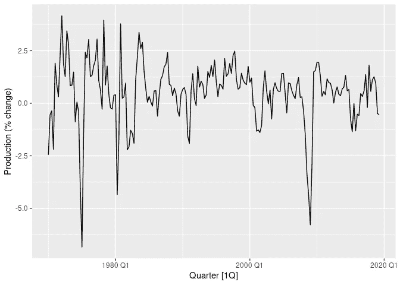
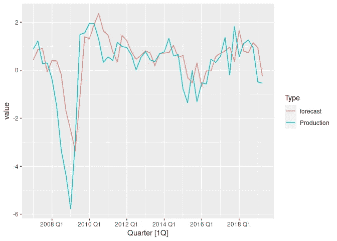
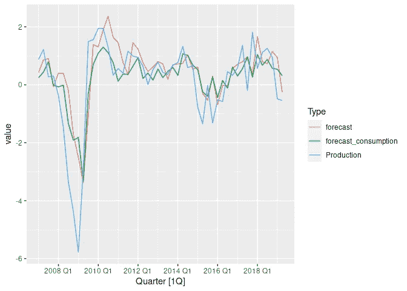

# 预测算法的特征选择

> 原文：<https://towardsdatascience.com/feature-selection-for-forecasting-algorithms-10598e50667f?source=collection_archive---------37----------------------->

## 不保证这些功能能够提高预测性能。在这篇文章中，我们解释了为什么，以及如何执行特征选择。

在本文中，我们讨论预测的特征选择。我们首先解释为什么你应该三思而后行添加功能到您的预测；然后，我们讨论一些为预测模型进行特征选择的方法。实际上，在`R`中，我们演示了一种在性能和计算成本之间取得平衡的特性选择方法。

# 为什么在预测模型中包含特性之前要三思？

对于许多数据科学模型来说，特征越多(通常指预测中的回归量)，您的模型准确性就越好。但是预测是相当有限的，而事实往往并非如此。

# 这是为什么呢？

我们将把它分成几点。

1.  假设你想预测一个硬币是正面还是反面。那是不可能的。这是因为你试图预测的变量(姑且称之为目标)是完全随机的。有些目标根本没有任何信号，或者没有提供任何信号的回归量。
2.  让我们称这个变量的观察值为实际值。这些通常已经包含了惊人的信息量。你所使用的预测算法会不顾一切地捕捉这个信号。这意味着你的特性不仅仅必须与目标相关，它还必须提供现实中没有的信息。这是非常罕见的。例如，冰淇淋销售将与天气相关，但它肯定不会包含比实际更多的信息。
3.  你要么需要提前知道你的回归变量(它需要*面向*)，要么你也需要预测那个回归变量。回到冰淇淋的例子，这个回归量不是面向前的。所以，如果你想知道一周以后的天气，你必须提前一周预测冰激凌的销量，然后把它输入到你的预测算法中。这给你的回归变量增加了很多噪音，反过来又给你的预测增加了噪音，使它变得更糟。这很少值得去做。
4.  即使是前向回归，也经常会在你的预测中加入意想不到的噪音，只是因为没有足够的信号，类似于第 1 点和第 2 点。


罗斯·斯奈登在 [Unsplash](https://unsplash.com?utm_source=medium&utm_medium=referral) 上的照片

# 为预测算法执行特征选择的一些方法

有几种方法可以检查回归变量是否为预测提供了有用的信息。其中大多数依赖于*前向回溯测试*。前向回溯测试是从一个历史日期(称为最新数据)开始，仅使用截至该日期的数据进行预测，然后移动到下一个日期并重复，直到到达现在。

然后，为了评估您的预测，您可以计算与实际值相比的预测误差。因此，这很像经典数据科学问题中的训练/测试集分裂。这个技术的教程是[这里](https://machinelearningmastery.com/backtest-machine-learning-models-time-series-forecasting/)。如果您有两个预测想要在其中做出选择，您可以对每个预测进行回溯测试。误差最小的那个将被归类为最好的。

有了这些，以下是一些执行特征选择的方法，按计算和时间成本增加的顺序排列:

# 1.查看实际值和回归量之间的相关性。

这只是使用样本内拟合来检查回归变量，并不包括上一节中的第 2 点(回归变量是否包含预测不包含的信息)。不建议使用此选项。

# 2.使用预测的赤池信息标准(AIC)。

这是一种统计近似值，试图使用样本拟合来近似预测拟合。参见[本章](https://otexts.com/fpp3/estimation-and-model-selection.html)使用 AIC 进行选型。

其工作方式是，在有和没有回归变量的情况下，您都要拟合您的预测模型，并检查每个模型的 AIC。你会选择 AIC 最低的型号。

这种方法好，快，常用。但这是一个仅使用样本拟合的近似值，因此可能无法很好地估计预测拟合。

# 3.对实际值使用线性回归，将当前预测和您的回归量作为一个特征

这个方法的关键是绕过第二点。我们想检查在考虑了预测已经了解的信息之后，回归变量给出了多少额外的预测信息。

对于这种方法，我们使用当前预测进行单次回溯测试，不使用回归变量。然后，我们通过试图了解实际情况的线性回归来输入回归变量和预测值。

为了评估回归变量有多好，我们可以用评估线性回归的标准方法检查回归变量是否显著(即检查其 p 值是否足够小)。因为我们还将预测本身包括在回归中，所以这种回归应该考虑预测算法已经学习到的内容。

这种方法直接评估预测拟合，但只需要运行一次回溯测试。当您有许多回归变量要检查时，这种方法特别有效。您仍然只需要进行一次回溯测试(没有回归变量的当前预测)，然后您可以在线性回归中使用标准的模型选择技术，例如递归特征消除(确保您没有消除您的预测)！

# 4.使用和不使用回归变量运行预测回溯测试

这种方法很简单，我们使用回归预测和不使用回归预测来进行回溯测试。然后我们比较两者的误差。如果回归变量的预测误差明显较低，我们可以继续使用该回归变量。

回溯测试是预测中模型选择的基础。所以这个方法效果很好。

但是随着回归量的增加，这种方法变得非常昂贵。我们必须在每辆列车上安装多个预测模型。

# 演示方法 3

我们选择演示方法 3，因为它在直接测量回归变量的预测质量和计算成本之间提供了良好的平衡。通常，对迄今为止最佳预测方法的回溯测试已经从其他实验中获得，这是这种方法中计算量最大的部分。

为了实际演示，我们将使用`R`。在 [my github](https://github.com/jackcbaker) 上跟随本教程的[互动 Rmarkdown](https://github.com/jackcbaker/blog-notebooks/blob/main/checking_regressors.Rmd) 。对于本教程中使用的所有包，通过运行`R` `install.packages('fpp3')`下载 [FPP3 包](https://mran.microsoft.com/snapshot/2020-10-09/web/packages/fpp3/index.html)。这个软件包是 Rob Hyndman 的介绍性预测书的伴侣。

我们将使用的数据是书中的美国消费支出数据。这是美国经济中各种措施的季度百分比变化的时间序列。我们有兴趣预测的是经济产量，这是衡量美国经济健康程度的一个指标。在`fpp3`加载后可以访问，称为`us_change`。我们要预测的栏目是`Production`。让我们画出来

```
library(fpp3)

us_change %>%
    autoplot(Production) +
    labs(y = "Production (% change)")
```



产量随时间变化的百分比图。

为了预测该数据，我们将为该数据拟合一个 [ARIMA 模型](https://otexts.com/fpp3/expsmooth.html)，这允许添加回归变量。

为了对我们需要检查的特征进行线性回归，我们需要在没有回归量的情况下对我们的预测算法进行回溯测试。让我们对最近 50 个数据点的预测模型进行回溯测试，并提前一步进行预测。`ARIMA`功能将使用 AIC 自动执行 ARIMA 模型的参数调整。

```
# Set seed for reproducibility
set.seed(13)
backtest_size <- 50
n <- nrow(us_change)
backtest_results <- us_change[(n - (backtest_size - 1)):n,]
backtest_results$forecast <- rep(NA, backtest_size)
for (backtest_num in backtest_size:1) {
    fit <- us_change[1:(n - backtest_num),] %>%
        select(Production) %>%
        model(
            forecast = ARIMA(Production)
        )
    backtest_fc <- fit %>% forecast(h = 1)
    results_index <- backtest_size - (backtest_num - 1)
    backtest_results$forecast[results_index] <- backtest_fc$.mean
}

# Let’s plot our backtest results against actuals

backtest_results %>%
    pivot_longer(c(Production, forecast), names_to = "Type") %>%
    autoplot(value)
```



无回归变量的 ARIMA 回测图。

请注意，预测在正常期间表现良好，但在大幅波动期间表现不佳。我们能使用回归变量来改善这一点吗？

我们对生产数据进行了建模，生产数据通常用 GDP 来衡量。但是衡量 GDP 需要付出巨大的努力，在许多国家，每季度才进行一次。其他数据可能更容易定期估算，也更容易获得。衡量这一点的一个标准可能是消费者支出。这是我们数据集中的`Consumption`列。

让我们用一个简单的线性回归来看看用消费作为回归变量有没有前途。

```
regress_test <- lm(Production ~ forecast + Consumption, data = backtest_results)
summary(regress_test)

## 
## Call:
## lm(formula = Production ~ forecast + Consumption, data = backtest_results)
## 
## Residuals:
##     Min      1Q  Median      3Q     Max 
## -2.4347 -0.7459  0.1566  0.5379  2.4470 
## 
## Coefficients:
##             Estimate Std. Error t value Pr(>|t|)    
## (Intercept)  -0.8588     0.1889  -4.545 3.84e-05 ***
## forecast      0.8750     0.1406   6.224 1.23e-07 ***
## Consumption   1.2630     0.3158   4.000 0.000223 ***
## ---
## Signif. codes:  0 '***' 0.001 '**' 0.01 '*' 0.05 '.' 0.1 ' ' 1
## 
## Residual standard error: 0.9268 on 47 degrees of freedom
## Multiple R-squared:  0.6461, Adjusted R-squared:  0.6311 
## F-statistic: 42.91 on 2 and 47 DF,  p-value: 2.501e-11
```

对于`Consumption`列，p 值非常低，远低于经典的 0.05 水平。这表明将其包括在预测中会提高预测性能。

消费者储蓄呢(数据集中的`Savings`列)？

```
regress_test_savings <- lm(Production ~ forecast + Savings, data = backtest_results)
summary(regress_test_savings)

## 
## Call:
## lm(formula = Production ~ forecast + Savings, data = backtest_results)
## 
## Residuals:
##     Min      1Q  Median      3Q     Max 
## -3.1353 -0.5435  0.1223  0.6092  2.7229 
## 
## Coefficients:
##             Estimate Std. Error t value Pr(>|t|)    
## (Intercept) -0.34043    0.16657  -2.044   0.0466 *  
## forecast     1.08637    0.14867   7.307  2.8e-09 ***
## Savings     -0.01165    0.01029  -1.132   0.2633    
## ---
## Signif. codes:  0 '***' 0.001 '**' 0.01 '*' 0.05 '.' 0.1 ' ' 1
## 
## Residual standard error: 1.059 on 47 degrees of freedom
## Multiple R-squared:  0.5383, Adjusted R-squared:  0.5186 
## F-statistic: 27.39 on 2 and 47 DF,  p-value: 1.299e-08
```

这种情况下的 p 值很高，因此我们不应该在模型中包括储蓄。

让我们通过将消费纳入 ARIMA 模型并运行新的回溯测试来检查我们的选择

```
backtest_regressor_results <- backtest_results
backtest_regressor_results$forecast_consumption <- rep(NA, backtest_size)
for (backtest_num in backtest_size:1) {
    fit <- us_change[1:(n - backtest_num),] %>%
        select(Quarter, Production, Consumption) %>%
        model(
            forecast = ARIMA(Production ~ Consumption)
        )
    new_regressor <- select(us_change[n - (backtest_num - 1),], Quarter, Consumption)
    backtest_fc <- fit %>% forecast(new_data = new_regressor)
    results_index <- backtest_size - (backtest_num - 1)
    backtest_regressor_results$forecast_consumption[results_index] <- backtest_fc$.mean
}

# Plot both backtests
backtest_regressor_results %>%
    pivot_longer(c(Production, forecast, forecast_consumption), names_to = "Type") %>%
    autoplot(value)
```



有和没有选定回归量的 ARIMA 回测图。

凭肉眼判断哪个预测表现更好有点困难，所以让我们检查一下 MSE 误差

```
backtest_regressor_results %>%
    as_tibble() %>%
    summarise(
        MSE_no_regressors = mean((Production - forecast)^2),
        MSE_consumption_regressor = mean((Production - forecast_consumption)^2)
    )

## # A tibble: 1 x 2
##   MSE_no_regressors MSE_consumption_regressor
##               <dbl>                     <dbl>
## 1              1.20                      1.01
```

在包括消费作为回归变量的后验测试中，MSE 较低，因此我们可能做出了正确的选择:)。

# 要点

*   在预测中，包含功能并不能保证会提高模型性能，因此在这样做之前要仔细考虑。
*   预测中的特征选择是选择性能和计算成本之间的折衷。
*   在预测中选择直接衡量预测性能的功能的一种方法是，在没有回归变量的情况下对预测进行回溯测试，然后拟合线性回归模型，以了解给定预测和回归变量的实际情况。如果 p 值较低，选择回归变量。

*原载于 2021 年 8 月 23 日 https://jackbakerds.com*[](https://jackbakerds.com/posts/forecasting-feature-selection/)**。**