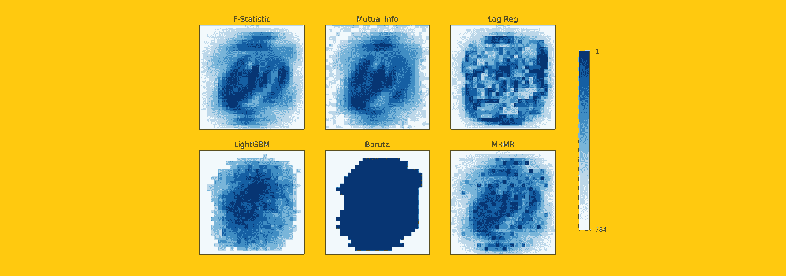
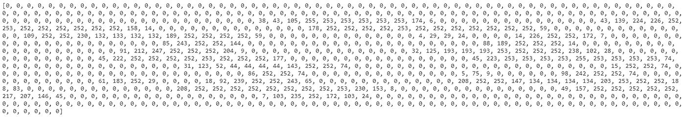
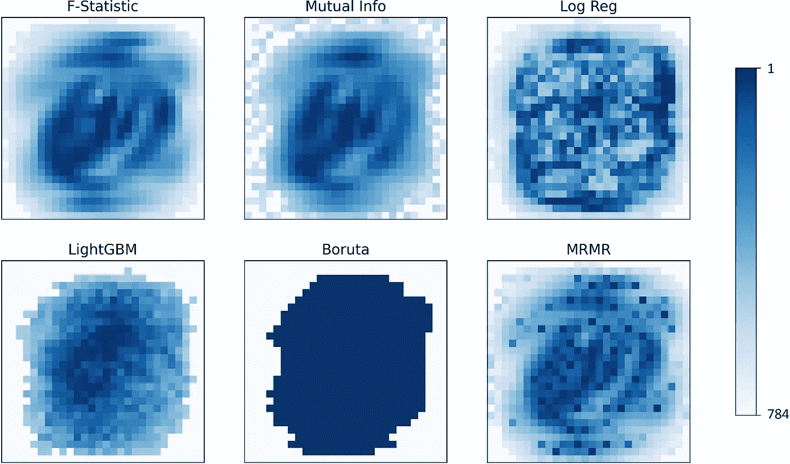
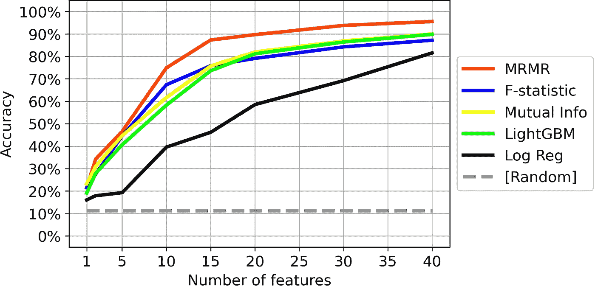

# 特征选择:如何丢弃 95%的特征并获得 95%的准确率

> 原文：<https://towardsdatascience.com/feature-selection-how-to-throw-away-95-of-your-data-and-get-95-accuracy-ad41ca016877?source=collection_archive---------5----------------------->

## 特征选择是数据管道中的一个基本步骤。一个例子？在 MNIST 数据集上，只需要 40 个像素(总共 784 个像素)就可以获得 95%以上的准确率(99% ROC)。



[作者图]

# 1.为什么选择功能？

你能认出这些手写的数字吗？


一些 MNIST 数字后，删除 75%的图像。[作者图]

你可能很容易就能分别识别 0、3 和 8。

如果是这样的话，即使只显示了原始图像的 25%,而剩余的 75%被红色像素覆盖，你也能够正确地对它们进行分类。这是一个简单的任务，因为“相关的”像素是可见的，而只有“不相关的”和“多余的”像素被隐藏。

这是“特征选择”的一个简单例子。

特征选择是在机器学习中执行的过程，在将数据馈送到预测模型之前，移除一些特征。如果数据是表格的形式，这仅仅意味着从表格中删除许多列。

> 为什么要费心选择功能呢？我就不能把所有的数据都扔进我的预测模型里，让他来干脏活吗？

实际上，有几个原因可以让您进行特征选择:

*   **记忆**。大数据占用大空间。删除要素意味着需要更少的内存来处理数据。有时还存在外部约束(例如，Google 的 AutoML 允许您使用不超过 1000 列的。因此，如果您有超过 1000 列，您将被迫只保留其中的一部分)。
*   **时间**。用更少的数据训练一个模型可以节省你很多时间。
*   **精度**。少即是多:这也适用于机器学习。包括冗余或不相关的特征意味着包括不必要的噪声。通常，根据较少数据训练的模型表现更好。
*   **可解释性**。更小的模型也意味着更易解释的模型。想象一下，如果你不得不解释一个基于成千上万不同因素的模型:这是不可行的。
*   **调试**。较小的型号更容易维护和排除故障。

# 2.从数据开始

在本文中，我们将比较一些特征选择的方法。我们的操场数据集将是世界闻名的“MNIST”。

MNIST 是由 70，000 张手写数字的黑白图像组成的数据集。每幅图像都是 28 x 28 (= 784)像素。每个像素被编码为从 1(白色)到 255(黑色)的整数:该值越高，颜色越深。按照惯例，60，000 幅图像用作训练集，10，000 幅图像用作测试集。

可以通过 Keras 命令将数据导入 Python(我们还将重塑数据集，使其成为二维表格):

```
from keras.datasets import mnist(X_train, y_train), (X_test, y_test) = mnist.load_data()X_train = X_train.reshape(60000, 28 * 28)
X_test = X_test.reshape(10000, 28 * 28)
```

例如，让我们打印出第 8 行的值:

```
print(X_train[7, :])
```

这是结果:



MNIST 训练数据集的第 8 幅图像的所有 784 个像素。[作者图]

通过 Matplotlib，我们还可以显示相应的图像:

```
import matplotlib.pyplot as pltplt.imshow(X_train[7, :].reshape(28, 28), cmap = 'binary', vmin = 0, vmax = 255)
```


MNIST 训练数据集的第 8 幅图像。

# 3.特征选择之战

我们的任务是选择少量的列(即像素)，这些列在输入预测模型时足以达到良好的精度水平。

有许多可能的策略和算法来执行特征选择。在本文中，我们将测试其中的 6 个:

**3.1 F 统计量**

f 检验是[方差分析 f 检验](https://en.wikipedia.org/wiki/F-test)的结果。该检验计算为比率:*组间变异性* / *组内变异性*，其中组为目标类。

其思想是，当组(0 类图像、1 类图像、…、9 类图像)之间的可变性高而同一组内的可变性低时，像素是相关的。

```
from sklearn.feature_selection import f_classiff = f_classif(X_train, y_train)[0]
```

**3.2 相互信息**

互信息是两个变量之间相互依赖的度量。

由于 MI 的公式需要知道每个变量的概率分布(通常我们不知道分布)，因此 [*scikit-learn* 实现](https://scikit-learn.org/stable/modules/generated/sklearn.feature_selection.mutual_info_classif.html)采用了基于 *k* 最近邻距离的非参数近似。

```
from sklearn.feature_selection import mutual_info_classifmi = mutual_info_classif(X_train, y_train)
```

**3.3 逻辑回归**

如果目标变量是分类的(如我们的情况)，可以对数据进行逻辑回归。然后，这些特征的相对重要性可以被用来从最相关到最不相关对它们进行排序。

```
from sklearn.linear_model import LogisticRegressionlogreg = LogisticRegression().fit(X_train, y_train)
```

**3.4 灯 GBM**

任何预测模型都可以做到这一点。比如 LightGBM。

```
from lightgbm import LGBMClassifierlgbm = LGBMClassifier(
    objective = 'multiclass',
    metric = 'multi_logloss',
    importance_type = 'gain'
).fit(X_train, y_train)
```

3.5 博鲁塔

Boruta 是 2010 年作为 r 的一个包设计的一个优雅的算法。Boruta 的目的是告诉每个特征是否与目标变量有某种关系。所以，**Boruta 的输出更多的是每个特性的是/否，而不是特性的排序**。

(如果你很好奇想知道更多关于 Boruta 的功能，我写了一篇关于它的帖子: [Boruta 准确地解释了你希望别人如何向你解释](/boruta-explained-the-way-i-wish-someone-explained-it-to-me-4489d70e154a))。

```
from boruta import BorutaPy
from sklearn.ensemble import RandomForestClassifierboruta = BorutaPy(
    estimator = RandomForestClassifier(max_depth = 5), 
    n_estimators = 'auto', 
    max_iter = 100
).fit(X_train, y_train)
```

**3.6 MRMR**

MRMR(代表“最大相关性最小冗余”)是在 2005 年设计的用于特征选择的算法。MRMR 背后的想法是**识别与目标变量高度相关且彼此冗余度较小的特征子集**。

(如果你很想知道更多关于 MRMR 的运作，我写了一篇关于它的帖子: [MRMR 准确地解释了你希望别人如何向你解释](/mrmr-explained-exactly-how-you-wished-someone-explained-to-you-9cf4ed27458b))。

```
from mrmr import mrmr_classifmrmr = mrmr_classif(X_train, y_train)
```

所有这些算法都提供了特征的“排序”(除了 Boruta，它有一个是/否的结果)。我们来看看根据算法的不同，排名是如何变化的。



MNIST。根据不同的算法，像素按其相关性排序。[作者图]

# 4.哪种方法效果更好？

此时，一个自然的问题是:

> 特征选择应该选择什么方法？

在数据科学中，最好的选择是测试不同的方法，看看哪种方法能更好地处理数据。因此，让我们在 MNIST 身上试试吧。

我们将采用 5 种方法提供的特征排名(因为 Boruta 不提供排名)，并查看在前 *K* 个特征上训练预测模型时可以达到什么精度(对于最高达 40 的 *K* )。

```
import pandas as pd
from catboost import CatBoostClassifier
from sklearn.metrics import accuracy_scorealgos = ['f', 'mi', 'logreg', 'lightgbm', 'mrmr']
ks = [1, 2, 5, 10, 15, 20, 30, 40]
accuracy = pd.DataFrame(index = ks, columns = algos)for algo in algos:

  for nfeats in ks: feats = ranking[algo][:n_feats]

    clf = CatBoostClassifier().fit(
      X_train[:, feats], y_train,
      eval_set = (X_test[:, feats], y_test),
      early_stopping_rounds = 20
    )

    accuracy.loc[k, algo] = accuracy_score(
      y_true = y_test, y_pred = clf.predict(X_test[:, cols])))
```

这些是结果:



在前 K 个特征上训练的预测模型的准确性，K 高达 40。[作者图]

在这种情况下， **MRMR 胜过了其他算法**。

如图所示，在 MRMR 识别的最相关的 40 个像素上训练的预测器在测试图像上达到 95.54%的准确度！

这令人印象深刻，尤其是考虑到:

*   40 像素只是整个图像(由 28 x 28 = 784 个像素组成)的 5%；
*   我们使用了一个预测模型(CatBoost ),没有进一步的调整，因此这个性能可能还可以进一步提高。

因此，在 MNIST 的情况下，**我们可以丢弃 95%的数据，但仍然可以获得 95%以上的准确性(这相当于 ROC 下的面积为 99.85%！)**。

即使 MNIST 是一个“简单”的数据集，主要的要点对于大多数真实世界的数据集都是有效的。通常，仅使用一小部分特征就可以实现高水平的准确性。有效的功能选择允许您构建在内存、时间、准确性、可解释性和调试简易性方面更高效的数据管道。

感谢您的阅读！我希望这篇文章对你有用。

本文中显示的结果完全可以通过这段代码重现:[https://github . com/smazzanti/mrmr/blob/main/notebooks/mnist . ipynb](https://github.com/smazzanti/mrmr/blob/main/notebooks/mnist.ipynb)。

我感谢反馈和建设性的批评。如果你想谈论这篇文章或其他相关话题，可以发短信到[我的 Linkedin 联系人](https://www.linkedin.com/in/samuelemazzanti/)给我。