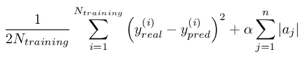
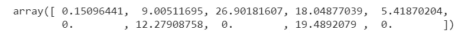

# 基于 Lasso 回归的机器学习特征选择

> 原文：<https://towardsdatascience.com/feature-selection-in-machine-learning-using-lasso-regression-7809c7c2771a?source=collection_archive---------2----------------------->

## 监督特征选择的例子


查尔斯·德鲁维奥在 [Unsplash](https://unsplash.com?utm_source=medium&utm_medium=referral) 上拍摄的照片

作为一名数据科学家，我学到的第一件事是，特征选择是机器学习管道中最重要的步骤之一。幸运的是，一些模型可以帮助我们完成这个目标，给我们他们自己对特性重要性的解释。其中一个模型是套索回归。

# 什么是套索回归？

我已经在[之前的博客文章](https://www.yourdatateacher.com/2021/03/29/an-introduction-to-linear-models/)中谈到了 Lasso 回归。让我总结一下这种模型的主要特性。这是一个使用成本函数的线性模型:



*aj* 是第 *j* 个特征的系数。最后一项称为 *l1* 罚项，而 *α* 是一个超参数，用于调整该罚项的强度。特征的系数越高，成本函数的值越高。因此，套索回归的思想是优化成本函数，减少系数的绝对值。显然，如果这些特征之前已经被缩放，例如使用标准化或其他[缩放技术](https://www.yourdatateacher.com/2021/03/22/scaling-of-the-numerical-variables/)，这是可行的。 *α* 必须使用交叉验证方法找到超参数值。

# 我们如何使用它进行特征选择？

Lasso 回归会尝试最小化成本函数，自动选择有用的要素，丢弃无用或多余的要素。在 Lasso 回归中，丢弃一个要素将使其系数等于 0。

因此，使用 Lasso 回归进行要素选择的想法非常简单:我们在数据集的缩放版本上拟合 Lasso 回归，并且我们只考虑那些系数不为 0 的要素。显然，我们首先需要调整 *α* 超参数，以便获得正确的套索回归。

这很简单，会让我们很容易发现有用的特征，并丢弃无用的特征。

我们来看看用 Python 怎么做。

# Python 中的示例

在本例中，我将向您展示如何使用糖尿病数据集在 Python 中使用 Lasso 进行要素选择。你可以在我的 [GitHub 库](https://github.com/gianlucamalato/machinelearning/blob/master/Feature_selection_using_Lasso.ipynb)中找到全部代码。

首先，让我们导入一些库:

```
import numpy as np
from sklearn.preprocessing import StandardScaler
from sklearn.pipeline import Pipeline
from sklearn.model_selection import train_test_split, GridSearchCV
from sklearn.linear_model import Lasso
```

然后，我们可以导入数据集和要素的名称。

```
from sklearn.datasets import load_diabetes
X,y = load_diabetes(return_X_y=True)features = load_diabetes()['feature_names']
```

像往常一样，我们现在可以将数据集分成训练集和测试集，并只对训练集执行所有计算。

```
X_train, X_test, y_train, y_test = train_test_split(X, y, test_size=0.33, random_state=42)
```

现在我们必须建立我们的模型，优化它的超参数，并在训练数据集上训练它。

因为我们的数据集需要预先进行缩放，所以我们可以利用 scikit-learn 中强大的 Pipeline 对象。我们的管道是由一个标准缩放器和套索对象本身组成的。

```
pipeline = Pipeline([
                     ('scaler',StandardScaler()),
                     ('model',Lasso())
])
```

现在我们要优化 Lasso 回归的 *α* 超参数。对于本例，我们将测试 0.1 到 10 之间的几个值，步长为 0.1。对于每个值，我们在 5 重交叉验证中计算均方误差的平均值，并选择使这种平均性能指标最小化的 *α* 的值。为此，我们可以使用 GridSearchCV 对象。

```
search = GridSearchCV(pipeline,
                      {'model__alpha':np.arange(0.1,10,0.1)},
                      cv = 5, scoring="neg_mean_squared_error",verbose=3
                      )
```

我们使用 *neg_mean_squared_error* ，因为网格搜索试图最大化性能指标，所以我们添加一个负号来最小化均方误差。

我们现在可以进行网格搜索了。

```
search.fit(X_train,y_train)
```

*α* 的最佳值为:

```
search.best_params_# {'model__alpha': 1.2000000000000002}
```

现在，我们必须得到套索回归系数的值。

```
coefficients = search.best_estimator_.named_steps['model'].coef_
```

一个特性的重要性是其系数的绝对值，所以:

```
importance = np.abs(coefficients)
```

让我们看看它的重要性:



正如我们所见，有 3 个特征的重要性为 0。这些特征已经被我们的模型丢弃了。

在套索回归中幸存下来的特征是:

```
np.array(features)[importance > 0]# array(['age', 'sex', 'bmi', 'bp', 's1', 's3', 's5'], dtype='<U3')
```

而 3 个被丢弃的特征是:

```
np.array(features)[importance == 0]# array(['s2', 's4', 's6'], dtype='<U3')
```

通过这种方式，我们根据给定的目标变量，使用适当优化的 Lasso 回归来获取数据集最重要特征的信息。

# 结论

Lasso 回归具有非常强大的内置要素选择功能，可用于多种情况。然而，它也有一些缺点。例如，如果特征和目标变量之间的关系不是线性的，那么使用线性模型可能不是一个好主意。通常，适当的探索性数据分析可以帮助我们更好地理解特征和目标之间最重要的关系，使我们选择最佳模型。

如果你想了解更多关于 Lasso 回归的知识，加入我的 Python 在线课程[监督机器学习。](https://www.yourdatateacher.com/supervised-machine-learning-in-python-online-course/)

*原载于 2021 年 5 月 5 日 https://www.yourdatateacher.com*[](https://www.yourdatateacher.com/2021/05/05/feature-selection-in-machine-learning-using-lasso-regression/)**。**